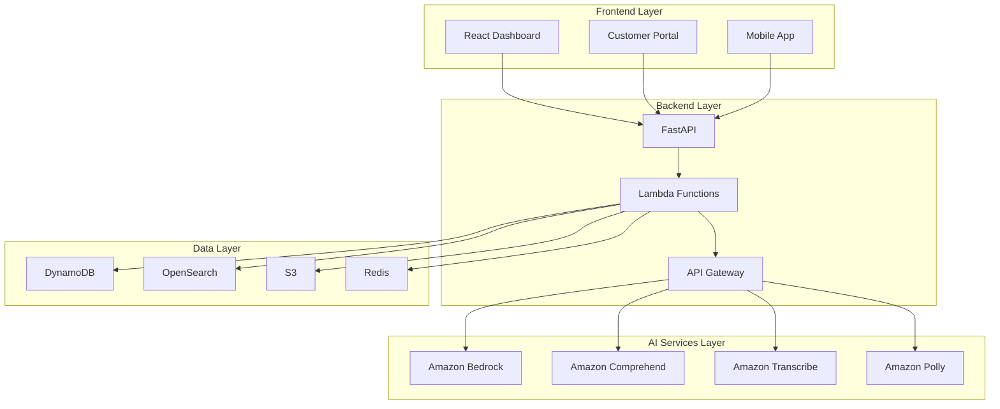
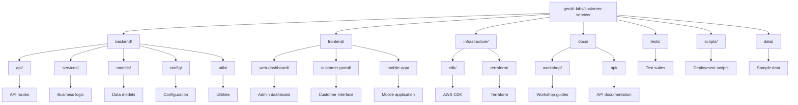

# 🎧 GenAI Customer Service Solution

> **Complete AI-powered customer service platform with AWS GenAI services**

A comprehensive, production-ready customer service solution that leverages AWS GenAI services including Amazon Bedrock, Amazon Comprehend, Amazon Transcribe, and Amazon Polly to deliver intelligent, personalized, and efficient customer support.

## 🚀 Quick Start

### Prerequisites
- AWS Account with GenAI services access
- Python 3.11+
- Node.js 18+
- AWS CLI configured

### Installation
```bash
# Clone the repository
git clone <repository-url>
cd genAI-labs/customer-service

# Run setup script
chmod +x scripts/setup.sh
./scripts/setup.sh

# Configure environment
cp config/environments/development.env .env
# Edit .env with your AWS credentials

# Start development environment
docker-compose up -d
```

### Access the Application
- **Admin Dashboard**: http://localhost:3000
- **Customer Portal**: http://localhost:3001
- **API Documentation**: http://localhost:8000/docs

## 🏗️ Architecture



## 🔧 Features

### 🤖 Conversational AI
- **Multi-Channel Support**: Chat, email, voice, social media
- **Context-Aware Conversations**: Maintains conversation history
- **Intent Recognition**: Accurate understanding of customer needs
- **Natural Language Processing**: Human-like conversation capabilities
- **Escalation Management**: Intelligent routing to human agents

### 🎤 Voice AI
- **Voice Recognition**: Accurate speech-to-text conversion
- **Natural Voice Responses**: Text-to-speech with natural intonation
- **Call Routing**: Intelligent call routing based on intent
- **Real-time Transcription**: Live call transcription and analysis
- **Emotion Detection**: Voice-based emotion and sentiment analysis

### 📚 Intelligent Knowledge Base
- **Dynamic Content Updates**: Automatic knowledge base updates
- **Semantic Search**: Natural language search across articles
- **Content Generation**: AI-generated FAQ and help articles
- **Multi-Language Support**: Automatic translation and localization
- **Usage Analytics**: Track knowledge base effectiveness

### 📊 Customer Analytics
- **Sentiment Analysis**: Real-time analysis across channels
- **Performance Metrics**: Comprehensive tracking of service KPIs
- **Predictive Analytics**: Forecast customer satisfaction and churn
- **Trend Analysis**: Identify patterns in customer interactions
- **ROI Measurement**: Track AI implementation impact

## 🛠️ Technology Stack

### Backend
- **FastAPI**: Modern Python web framework
- **AWS Lambda**: Serverless compute
- **Amazon Bedrock**: Generative AI models
- **Amazon Comprehend**: Natural language processing
- **Amazon Transcribe**: Speech-to-text
- **Amazon Polly**: Text-to-speech

### Frontend
- **React 18**: Modern UI framework
- **TypeScript**: Type-safe development
- **Material-UI**: Component library
- **React Query**: Data fetching and caching
- **WebSocket**: Real-time communication

### Infrastructure
- **AWS CDK/Terraform**: Infrastructure as code
- **Amazon DynamoDB**: NoSQL database
- **Amazon OpenSearch**: Search and analytics
- **Amazon S3**: Object storage
- **Amazon ElastiCache**: In-memory caching
- **Amazon API Gateway**: API management

### DevOps
- **Docker**: Containerization
- **GitHub Actions**: CI/CD pipeline
- **AWS CloudWatch**: Monitoring and logging
- **AWS X-Ray**: Distributed tracing

## 📁 Project Structure



## 🎓 Workshop Guide

This repository includes a comprehensive workshop guide for learning and implementing GenAI customer service solutions:

### [📚 Workshop Overview](docs/workshop/README.md)
Complete hands-on workshop with 6 modules covering:
1. **Environment Setup** (30 min)
2. **Backend Development** (90 min)
3. **AI Services Integration** (120 min)
4. **Frontend Development** (90 min)
5. **Infrastructure Deployment** (60 min)
6. **Testing and Optimization** (60 min)

### Quick Workshop Start
```bash
# Follow the workshop guide
cd docs/workshop
open README.md

# Start with Module 1
open module-1-setup.md
```

## 🚀 Deployment

### Development
```bash
# Start all services
docker-compose up -d

# View logs
docker-compose logs -f backend
```

### Production
```bash
# Deploy with CDK
cd infrastructure/cdk
cdk deploy

# Or deploy with Terraform
cd infrastructure/terraform
terraform apply
```

See [DEPLOYMENT.md](DEPLOYMENT.md) for detailed deployment instructions.

## 🧪 Testing

### Run Tests
```bash
# Backend tests
cd backend
pytest tests/

# Frontend tests
cd frontend/web-dashboard
npm test

# Integration tests
pytest tests/integration/
```

### Test Coverage
```bash
# Generate coverage report
pytest --cov=backend tests/
```

## 📊 Performance Metrics

### Key Performance Indicators
- **Response Time**: < 2 seconds for AI responses
- **Voice Processing**: < 5 seconds for voice-to-text
- **Knowledge Search**: < 1 second for queries
- **Sentiment Analysis**: < 500ms for real-time analysis

### Business Impact
- **Response Time**: 80-90% reduction
- **First Contact Resolution**: 60-80% improvement
- **Customer Satisfaction**: 40-60% improvement
- **Agent Productivity**: 50-70% increase
- **Cost Reduction**: 40-60% reduction

## 🔒 Security

### Data Protection
- **End-to-end encryption** for all communications
- **GDPR/CCPA compliance** for privacy regulations
- **Role-based access control** with AWS IAM
- **Comprehensive audit logging** for compliance

### Security Features
- **PII detection and masking** with Amazon Comprehend
- **Secure API endpoints** with authentication
- **Encrypted data storage** with AWS KMS
- **Network security** with VPC and security groups

## 📈 Monitoring

### CloudWatch Dashboards
- **API Performance**: Request rates, latency, errors
- **AI Service Metrics**: Model performance, accuracy
- **Customer Analytics**: Sentiment trends, satisfaction
- **Infrastructure Health**: Resource utilization, costs

### Alerting
- **Performance degradation** alerts
- **Error rate** monitoring
- **Cost threshold** notifications
- **Security incident** detection

## 🤝 Contributing

### Development Setup
```bash
# Fork the repository
git clone your-fork-url
cd genAI-labs/customer-service

# Create feature branch
git checkout -b feature/your-feature

# Make changes and test
./scripts/setup.sh
pytest tests/

# Submit pull request
git push origin feature/your-feature
```

### Code Standards
- **Python**: Black formatting, flake8 linting
- **TypeScript**: ESLint, Prettier
- **Testing**: pytest for backend, Jest for frontend
- **Documentation**: Comprehensive docstrings and comments

## 📞 Support

### Documentation
- [API Documentation](docs/api/)
- [Workshop Guide](docs/workshop/)
- [Deployment Guide](DEPLOYMENT.md)

### Community
- **GitHub Issues**: Bug reports and feature requests
- **Discussions**: Community support and questions
- **Wiki**: Additional documentation and guides

## 📄 License

This project is licensed under the MIT License - see the [LICENSE](LICENSE) file for details.

## 🙏 Acknowledgments

- **AWS GenAI Services** for providing powerful AI capabilities
- **FastAPI** for the excellent Python web framework
- **React** for the modern frontend framework
- **Material-UI** for the beautiful component library

---

**Ready to transform your customer service with AI? Start with the [Workshop Guide](docs/workshop/README.md)! 🚀**

## 🔗 Quick Links

- **[Workshop Guide](docs/workshop/README.md)** - Complete hands-on tutorial
- **[API Documentation](docs/api/)** - Detailed API reference
- **[Deployment Guide](DEPLOYMENT.md)** - Production deployment
- **[Architecture Overview](architecture.md)** - System design details
- **[Contributing Guide](CONTRIBUTING.md)** - How to contribute

---

**Built with ❤️ using AWS GenAI services**