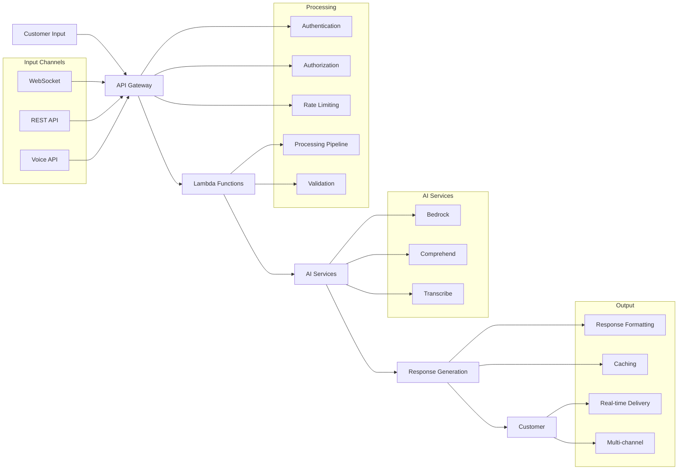

# 🏗️ GenAI Customer Service Solution Architecture

## Solution Overview

This is a comprehensive AI-powered customer service platform that leverages AWS GenAI services to deliver intelligent, personalized, and efficient customer support through multiple channels including chat, voice, email, and social media.

## Architecture Components

### 1. Frontend Layer
- **Web Dashboard**: React-based admin dashboard for agents and managers
- **Customer Portal**: Customer-facing chat interface
- **Mobile App**: React Native mobile application
- **Voice Interface**: WebRTC-based voice calling interface

### 2. API Gateway Layer
- **REST API**: FastAPI-based backend services
- **WebSocket**: Real-time communication for chat
- **GraphQL**: Flexible data querying
- **Authentication**: JWT-based authentication with AWS Cognito

### 3. AI Services Layer
- **Conversational AI**: Amazon Bedrock with Claude models
- **Voice AI**: Amazon Transcribe + Amazon Polly
- **Sentiment Analysis**: Amazon Comprehend
- **Knowledge Base**: Vector search with Amazon OpenSearch
- **ML Models**: Amazon SageMaker for custom models

### 4. Data Layer
- **Customer Data**: Amazon DynamoDB
- **Conversation History**: Amazon DocumentDB
- **Knowledge Base**: Amazon OpenSearch
- **File Storage**: Amazon S3
- **Analytics**: Amazon Redshift

### 5. Infrastructure Layer
- **Compute**: AWS Lambda + Amazon ECS
- **Message Queue**: Amazon SQS + Amazon SNS
- **Event Processing**: Amazon EventBridge
- **Monitoring**: Amazon CloudWatch + AWS X-Ray
- **Security**: AWS IAM + AWS KMS

## Data Flow

## Security Architecture

- **Data Encryption**: End-to-end encryption with AWS KMS
- **Access Control**: Role-based access with AWS IAM
- **Privacy Compliance**: GDPR/CCPA compliant data handling
- **Audit Logging**: Comprehensive activity tracking
- **Network Security**: VPC with private subnets

## Scalability Design

- **Auto Scaling**: Lambda and ECS auto-scaling
- **Load Balancing**: Application Load Balancer
- **Caching**: Amazon ElastiCache for Redis
- **CDN**: Amazon CloudFront for static content
- **Database Scaling**: DynamoDB auto-scaling

## Monitoring & Observability

- **Application Monitoring**: AWS X-Ray tracing
- **Infrastructure Monitoring**: CloudWatch metrics
- **Log Aggregation**: CloudWatch Logs
- **Alerting**: CloudWatch Alarms + SNS
- **Dashboards**: CloudWatch Dashboards
