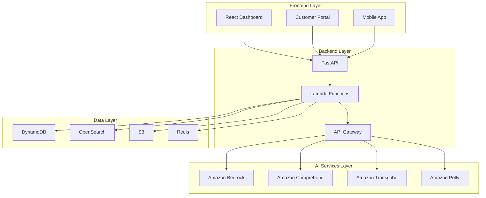

# 🎓 GenAI Customer Service Workshop

## Workshop Overview

This hands-on workshop will guide you through building a complete AI-powered customer service solution using AWS GenAI services. You'll learn how to integrate Amazon Bedrock, Amazon Comprehend, Amazon Transcribe, and Amazon Polly to create an intelligent customer support platform.

## 🎯 Learning Objectives

By the end of this workshop, you will be able to:

1. **Design AI-powered customer service architecture** using AWS GenAI services
2. **Implement conversational AI** with Amazon Bedrock and Claude models
3. **Build voice-enabled customer support** with Amazon Transcribe and Polly
4. **Create intelligent knowledge base** with semantic search capabilities
5. **Deploy production-ready infrastructure** using AWS CDK/Terraform
6. **Monitor and optimize** AI service performance

## 📋 Prerequisites

### Technical Requirements
- AWS Account with appropriate permissions
- AWS CLI configured
- Node.js 18+ and npm
- Python 3.11+
- Docker (optional)
- Git

### AWS Services Access
Ensure you have access to:
- Amazon Bedrock (with Claude model access)
- Amazon Comprehend
- Amazon Transcribe
- Amazon Polly
- Amazon DynamoDB
- Amazon S3
- Amazon OpenSearch
- AWS Lambda
- Amazon API Gateway

### Knowledge Prerequisites
- Basic understanding of AWS services
- Python programming experience
- React/TypeScript knowledge (for frontend)
- Basic understanding of AI/ML concepts

## 🏗️ Workshop Architecture



## 📚 Workshop Modules

### Module 1: Environment Setup (30 minutes)
- [ ] AWS Account Setup and Permissions
- [ ] Local Development Environment
- [ ] Project Structure Overview
- [ ] Initial Configuration

### Module 2: Backend Development (90 minutes)
- [ ] FastAPI Application Setup
- [ ] AWS GenAI Service Integration
- [ ] Database Models and Services
- [ ] API Endpoints Implementation

### Module 3: AI Services Integration (120 minutes)
- [ ] Amazon Bedrock Integration
- [ ] Conversational AI Implementation
- [ ] Voice Processing with Transcribe/Polly
- [ ] Sentiment Analysis with Comprehend

### Module 4: Frontend Development (90 minutes)
- [ ] React Dashboard Setup
- [ ] Customer Portal Implementation
- [ ] Real-time Chat Interface
- [ ] Analytics Dashboard

### Module 5: Infrastructure Deployment (60 minutes)
- [ ] AWS CDK/Terraform Setup
- [ ] Infrastructure as Code
- [ ] CI/CD Pipeline Configuration
- [ ] Production Deployment

### Module 6: Testing and Optimization (60 minutes)
- [ ] Unit and Integration Testing
- [ ] Performance Testing
- [ ] AI Model Optimization
- [ ] Monitoring and Alerting

## 🚀 Quick Start

### 1. Clone the Repository
```bash
git clone <repository-url>
cd genAI-labs/customer-service
```

### 2. Setup Backend
```bash
cd backend
python -m venv venv
source venv/bin/activate  # On Windows: venv\Scripts\activate
pip install -r requirements.txt
```

### 3. Configure Environment
```bash
cp .env.example .env
# Edit .env with your AWS credentials and configuration
```

### 4. Setup Frontend
```bash
cd frontend/web-dashboard
npm install
npm start
```

### 5. Deploy Infrastructure
```bash
cd infrastructure/cdk
pip install -r requirements.txt
cdk bootstrap
cdk deploy
```

## 📖 Detailed Workshop Guide

### [Module 1: Environment Setup](./module-1-setup.md)
Complete guide for setting up your development environment and AWS account.

### [Module 2: Backend Development](./module-2-backend.md)
Step-by-step backend implementation with AWS GenAI services.

### [Module 3: AI Services Integration](./module-3-ai-services.md)
Deep dive into AI service integration and implementation.

### [Module 4: Frontend Development](./module-4-frontend.md)
Building modern React interfaces for customer service.

### [Module 5: Infrastructure Deployment](./module-5-infrastructure.md)
Production-ready infrastructure deployment guide.

### [Module 6: Testing and Optimization](./module-6-testing.md)
Testing strategies and performance optimization.

## 🛠️ Workshop Tools

### Development Tools
- **VS Code** with Python and TypeScript extensions
- **Postman** for API testing
- **AWS CLI** for service management
- **Docker** for containerization

### Monitoring Tools
- **AWS CloudWatch** for monitoring
- **AWS X-Ray** for tracing
- **Grafana** for dashboards (optional)

## 📊 Success Metrics

### Technical Metrics
- API response time < 2 seconds
- AI response accuracy > 85%
- System availability > 99.9%
- Customer satisfaction > 4.0/5.0

### Business Metrics
- First contact resolution rate > 70%
- Escalation rate < 15%
- Cost reduction > 40%
- Agent productivity increase > 50%

## 🎯 Workshop Outcomes

After completing this workshop, you will have:

1. **A fully functional AI customer service platform**
2. **Production-ready infrastructure** deployed on AWS
3. **Comprehensive monitoring and alerting** setup
4. **Scalable architecture** that can handle enterprise workloads
5. **Best practices** for AI service integration
6. **Cost optimization** strategies

## 📞 Support and Resources

### Workshop Support
- **Slack Channel**: #genai-customer-service-workshop
- **Office Hours**: Daily 2-3 PM EST
- **Email**: workshop-support@company.com

### Additional Resources
- [AWS GenAI Documentation](https://docs.aws.amazon.com/bedrock/)
- [Amazon Bedrock Best Practices](https://docs.aws.amazon.com/bedrock/latest/userguide/)
- [FastAPI Documentation](https://fastapi.tiangolo.com/)
- [React Documentation](https://react.dev/)

## 🏆 Certification

Upon successful completion of the workshop, you will receive:
- **GenAI Customer Service Specialist** certificate
- **AWS GenAI Practitioner** badge
- **Workshop completion** certificate

## 📅 Workshop Schedule

| Module | Duration | Prerequisites |
|--------|----------|---------------|
| Module 1 | 30 min | AWS Account |
| Module 2 | 90 min | Python, FastAPI |
| Module 3 | 120 min | AWS Services |
| Module 4 | 90 min | React, TypeScript |
| Module 5 | 60 min | AWS CDK/Terraform |
| Module 6 | 60 min | Testing concepts |

**Total Workshop Time**: ~7 hours

## 🎉 Next Steps

After completing the workshop:

1. **Deploy to production** using the provided infrastructure
2. **Customize the solution** for your specific use case
3. **Scale the architecture** based on your requirements
4. **Integrate with existing systems** using the provided APIs
5. **Monitor and optimize** performance continuously

---

**Ready to start? Let's begin with [Module 1: Environment Setup](./module-1-setup.md)! 🚀**
