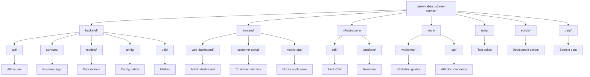

# Module 1: Environment Setup

## Overview
This module will guide you through setting up your development environment and AWS account for the GenAI Customer Service workshop.

## Learning Objectives
- Set up AWS account with proper permissions
- Configure local development environment
- Understand project structure
- Initialize project configuration

## Prerequisites
- AWS Account
- AWS CLI installed
- Python 3.11+
- Node.js 18+
- Git

## Step 1: AWS Account Setup

### 1.1 Create AWS Account
If you don't have an AWS account:
1. Go to [AWS Console](https://aws.amazon.com/console/)
2. Click "Create an AWS Account"
3. Follow the registration process
4. Complete identity verification

### 1.2 Configure AWS CLI
```bash
# Install AWS CLI (if not already installed)
curl "https://awscli.amazonaws.com/awscli-exe-linux-x86_64.zip" -o "awscliv2.zip"
unzip awscliv2.zip
sudo ./aws/install

# Configure AWS CLI
aws configure
```

Enter your credentials:
- AWS Access Key ID
- AWS Secret Access Key
- Default region (e.g., us-east-1)
- Default output format (json)

### 1.3 Verify AWS Access
```bash
# Test AWS CLI configuration
aws sts get-caller-identity

# List available regions
aws ec2 describe-regions --query 'Regions[].RegionName'
```

## Step 2: AWS Service Access

### 2.1 Enable Required Services
Navigate to AWS Console and enable these services:

#### Amazon Bedrock
1. Go to [Amazon Bedrock Console](https://console.aws.amazon.com/bedrock/)
2. Click "Get started"
3. Request access to Claude models:
   - Claude 3.5 Sonnet
   - Claude 3 Haiku
4. Wait for approval (usually instant for most regions)

#### Amazon Comprehend
1. Go to [Amazon Comprehend Console](https://console.aws.amazon.com/comprehend/)
2. No additional setup required

#### Amazon Transcribe
1. Go to [Amazon Transcribe Console](https://console.aws.amazon.com/transcribe/)
2. No additional setup required

#### Amazon Polly
1. Go to [Amazon Polly Console](https://console.aws.amazon.com/polly/)
2. No additional setup required

### 2.2 Create IAM User (Optional)
For better security, create a dedicated IAM user:

```bash
# Create IAM user
aws iam create-user --user-name genai-workshop-user

# Create access key
aws iam create-access-key --user-name genai-workshop-user

# Attach policies
aws iam attach-user-policy --user-name genai-workshop-user --policy-arn arn:aws:iam::aws:policy/AmazonBedrockFullAccess
aws iam attach-user-policy --user-name genai-workshop-user --policy-arn arn:aws:iam::aws:policy/AmazonComprehendFullAccess
aws iam attach-user-policy --user-name genai-workshop-user --policy-arn arn:aws:iam::aws:policy/AmazonTranscribeFullAccess
aws iam attach-user-policy --user-name genai-workshop-user --policy-arn arn:aws:iam::aws:policy/AmazonPollyFullAccess
```

## Step 3: Local Development Environment

### 3.1 Install Python Dependencies
```bash
# Create virtual environment
python -m venv venv

# Activate virtual environment
# On macOS/Linux:
source venv/bin/activate
# On Windows:
venv\Scripts\activate

# Install dependencies
pip install -r requirements.txt
```

### 3.2 Install Node.js Dependencies
```bash
# Install frontend dependencies
cd frontend/web-dashboard
npm install

# Install customer portal dependencies
cd ../customer-portal
npm install
```

### 3.3 Install AWS CDK
```bash
# Install AWS CDK globally
npm install -g aws-cdk

# Verify installation
cdk --version
```

## Step 4: Project Structure Overview



## Step 5: Environment Configuration

### 5.1 Create Environment File
```bash
# Copy example environment file
cp .env.example .env
```

### 5.2 Configure Environment Variables
Edit `.env` file with your configuration:

```env
# Application
DEBUG=true
ENVIRONMENT=development
SECRET_KEY=your-secret-key-here

# AWS Configuration
AWS_REGION=us-east-1
AWS_ACCESS_KEY_ID=your-access-key
AWS_SECRET_ACCESS_KEY=your-secret-key

# AI Services
BEDROCK_MODEL_ID=anthropic.claude-3-5-sonnet-20241022-v2:0
BEDROCK_REGION=us-east-1

# Database
MONGODB_URL=mongodb://localhost:27017
REDIS_URL=redis://localhost:6379

# Storage
S3_BUCKET=your-s3-bucket-name
OPENSEARCH_ENDPOINT=your-opensearch-endpoint

# AI Configuration
MAX_TOKENS=2000
TEMPERATURE=0.7
CONFIDENCE_THRESHOLD=0.8
ESCALATION_THRESHOLD=0.6
```

### 5.3 Test Configuration
```bash
# Test backend configuration
cd backend
python -c "from config.settings import settings; print('Configuration loaded successfully')"

# Test frontend configuration
cd frontend/web-dashboard
npm run type-check
```

## Step 6: Local Services Setup

### 6.1 MongoDB (Optional)
For local development, you can use MongoDB:

```bash
# Using Docker
docker run -d -p 27017:27017 --name mongodb mongo:latest

# Or install locally
# macOS: brew install mongodb-community
# Ubuntu: sudo apt-get install mongodb
```

### 6.2 Redis (Optional)
For local development, you can use Redis:

```bash
# Using Docker
docker run -d -p 6379:6379 --name redis redis:latest

# Or install locally
# macOS: brew install redis
# Ubuntu: sudo apt-get install redis-server
```

## Step 7: Verification

### 7.1 Test AWS Services
```bash
# Test Bedrock access
python -c "
import boto3
bedrock = boto3.client('bedrock-runtime', region_name='us-east-1')
print('Bedrock access verified')
"

# Test Comprehend access
python -c "
import boto3
comprehend = boto3.client('comprehend', region_name='us-east-1')
print('Comprehend access verified')
"
```

### 7.2 Test Backend
```bash
cd backend
python main.py
```

You should see:
```
INFO:     Started server process
INFO:     Waiting for application startup.
INFO:     Application startup complete.
INFO:     Uvicorn running on http://0.0.0.0:8000
```

### 7.3 Test Frontend
```bash
cd frontend/web-dashboard
npm start
```

You should see the React development server start on `http://localhost:3000`.

## Troubleshooting

### Common Issues

#### AWS Access Denied
```bash
# Check your AWS credentials
aws sts get-caller-identity

# Verify region
aws configure get region
```

#### Bedrock Model Access
- Ensure you've requested access to Claude models
- Check if your region supports Bedrock
- Verify IAM permissions

#### Python Dependencies
```bash
# Update pip
pip install --upgrade pip

# Clear pip cache
pip cache purge

# Reinstall dependencies
pip install -r requirements.txt --force-reinstall
```

#### Node.js Dependencies
```bash
# Clear npm cache
npm cache clean --force

# Delete node_modules and reinstall
rm -rf node_modules package-lock.json
npm install
```

## Next Steps

✅ **Module 1 Complete!**

You have successfully:
- Set up AWS account and services
- Configured local development environment
- Initialized project structure
- Verified all components

**Ready for [Module 2: Backend Development](./module-2-backend.md)?**

## Additional Resources

- [AWS CLI User Guide](https://docs.aws.amazon.com/cli/latest/userguide/)
- [Amazon Bedrock User Guide](https://docs.aws.amazon.com/bedrock/latest/userguide/)
- [Python Virtual Environments](https://docs.python.org/3/tutorial/venv.html)
- [Node.js Installation Guide](https://nodejs.org/en/download/)
