# Financial Services AI Solution - Architecture

## Overview

The Financial Services AI Solution is a comprehensive, enterprise-grade platform that leverages AWS GenAI services to detect fraud, assess risk, automate compliance, and enhance customer experience. The architecture is designed to meet strict regulatory requirements while delivering real-time AI capabilities at scale.

## Quick Reference: Build Process

**Want to build this step-by-step?** Follow these phases in order:

| Phase | Focus | Key Services | Time Estimate |
|-------|-------|--------------|---------------|
| **Phase 1** | Foundation | DynamoDB, S3, API Gateway, VPC | 2-3 days |
| **Phase 2** | Fraud Detection | Kinesis, Fraud Detector, SageMaker | 3-4 days |
| **Phase 3** | Risk Assessment | SageMaker, Bedrock, EventBridge | 2-3 days |
| **Phase 4** | Investment Research | Bedrock, Comprehend, Textract | 2-3 days |
| **Phase 5** | Customer Advisory | Bedrock, API Gateway WebSocket | 2-3 days |
| **Phase 6** | Compliance & Audit | CloudTrail, CloudWatch, S3 | 1-2 days |
| **Phase 7** | Analytics & Monitoring | QuickSight, Athena, CloudWatch | 2-3 days |

**Total Build Time**: ~3-4 weeks for complete system

**Quick Start**: Build Phases 1-2 for a minimal viable product (MVP) with fraud detection in 5-7 days.

👉 **Jump to**: [Step-by-Step Architecture Build](#phase-1-foundation---secure-infrastructure)

## Architecture Principles

### 1. Security First
- **Zero-Trust Architecture**: Least privilege access for all services
- **End-to-End Encryption**: All financial data encrypted at rest and in transit
- **Compliance Ready**: Built-in support for SOX, PCI DSS, GDPR, KYC/AML
- **Audit Trails**: Comprehensive logging and monitoring

### 2. Real-Time Processing
- **Sub-50ms Fraud Detection**: Real-time transaction analysis
- **Streaming Architecture**: Kinesis for high-throughput event processing
- **Low Latency**: Caching and optimization for critical paths
- **High Availability**: Multi-AZ deployment with failover

### 3. Regulatory Compliance
- **Fair Lending**: Bias detection and fairness checks
- **Data Privacy**: GDPR/CCPA compliant data handling
- **Audit Logging**: Immutable audit trails
- **Access Control**: Role-based access with MFA

### 4. Scalability
- **Serverless Components**: Auto-scaling Lambda functions
- **Horizontal Scaling**: DynamoDB on-demand and Kinesis auto-scaling
- **Elastic Compute**: SageMaker endpoints with auto-scaling
- **Global Reach**: Multi-region deployment capability

## System Architecture

### High-Level Overview

The architecture follows a secure, layered approach with clear separation of concerns:

```
┌─────────────────────────────────────────────────────────┐
│              Financial Applications & Users              │
│    (Banking Apps, Trading Platforms, Customer Portal)    │
└────────────────────┬────────────────────────────────────┘
                     │
┌────────────────────▼────────────────────────────────────┐
│         API Gateway (TLS 1.3, Authentication)             │
└────────────────────┬────────────────────────────────────┘
                     │
┌────────────────────▼────────────────────────────────────┐
│        Lambda Functions (Business Logic Layer)          │
└─────┬──────────┬──────────┬──────────┬───────────────────┘
      │          │          │          │
┌─────▼──┐  ┌───▼───┐  ┌───▼───┐  ┌───▼────┐
│Bedrock │  │SageMaker│ │FraudDet│ │Comprehend│
│ (GenAI)│  │  (ML)   │ │ (Fraud)│ │  (NLP)  │
└────────┘  └────────┘ └────────┘ └─────────┘
      │          │          │          │
┌─────▼──────────▼──────────▼──────────▼──────────┐
│         Secure Data Storage Layer                │
│  (DynamoDB, S3, ElastiCache, Kinesis)          │
│  (Encrypted, VPC-isolated, Audit-logged)        │
└──────────────────────────────────────────────────┘
```

## Step-by-Step Architecture Build

This section breaks down the architecture into manageable steps, building from foundation to complete system.

### Phase 1: Foundation - Secure Infrastructure

**Goal**: Set up secure, compliant infrastructure foundation

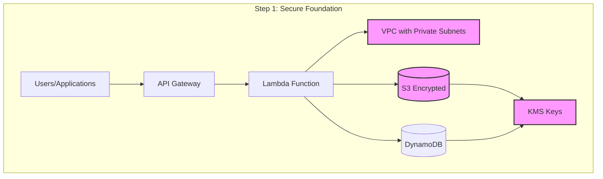

**Components to Deploy**:
1. VPC with public and private subnets
2. DynamoDB tables (transactions, customers, risk_data) with encryption
3. S3 buckets (data lake, audit logs) with encryption
4. KMS keys for encryption
5. API Gateway with authentication
6. Basic Lambda function in VPC
7. IAM roles with least privilege

**What This Enables**:
- Secure API endpoints
- Encrypted data storage
- Network isolation
- Foundation for all other features

---

### Phase 2: Fraud Detection System

**Goal**: Real-time fraud detection and prevention

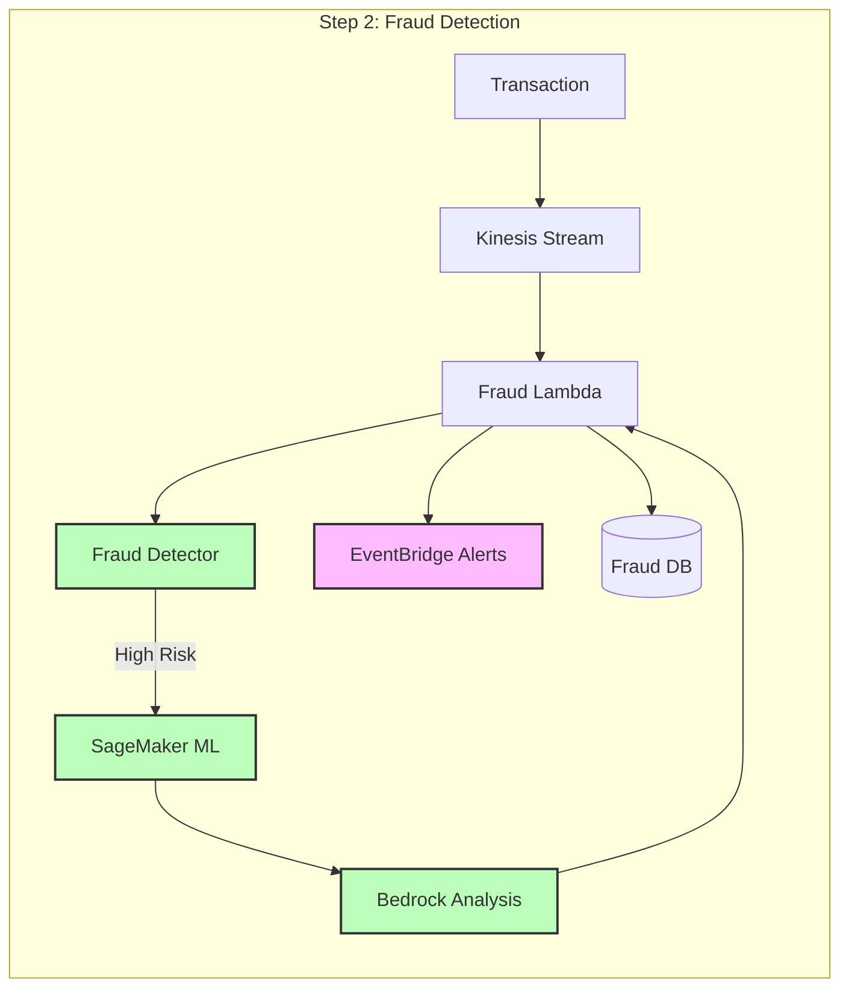

**Components to Add**:
1. Kinesis Data Stream for transactions
2. AWS Fraud Detector model
3. SageMaker fraud ML model
4. Fraud detection Lambda function
5. EventBridge for alerts
6. Fraud analysis DynamoDB table

**What This Enables**:
- Real-time fraud detection (< 50ms)
- ML-powered risk scoring
- Automated alerts
- Fraud pattern analysis

---

### Phase 3: Credit Risk Assessment

**Goal**: AI-powered credit risk modeling and assessment

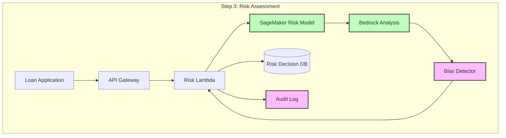

**Components to Add**:
1. SageMaker risk assessment model
2. Risk assessment Lambda function
3. Bias detection service
4. Risk decision DynamoDB table
5. CloudTrail for audit logging

**What This Enables**:
- Automated credit scoring
- Fair lending compliance
- Risk-based pricing
- Regulatory compliance

---

### Phase 4: Investment Research & Analysis

**Goal**: Automated financial analysis and investment research

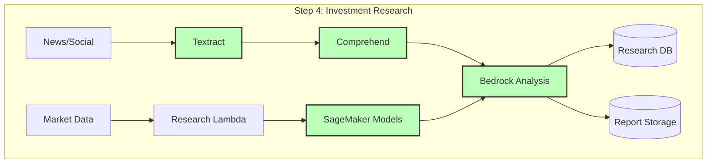

**Components to Add**:
1. Textract for document analysis
2. Comprehend for sentiment analysis
3. Research Lambda function
4. SageMaker financial models
5. Research reports DynamoDB table
6. S3 for report storage

**What This Enables**:
- Automated financial analysis
- Market sentiment analysis
- Investment recommendations
- Research report generation

---

### Phase 5: Customer Advisory Platform

**Goal**: AI-powered personalized financial advice

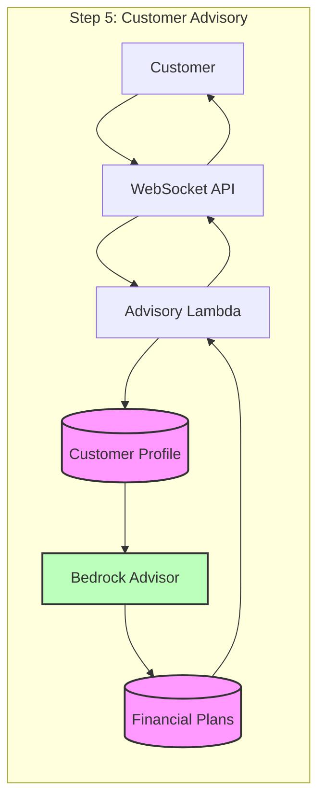

**Components to Add**:
1. API Gateway WebSocket API
2. Advisory Lambda function
3. Customer profile DynamoDB table
4. Financial plans DynamoDB table
5. Bedrock for advisory generation

**What This Enables**:
- Personalized financial planning
- Investment recommendations
- Goal-based planning
- 24/7 AI advisor

---

### Phase 6: Compliance & Audit Framework

**Goal**: Regulatory compliance and audit logging

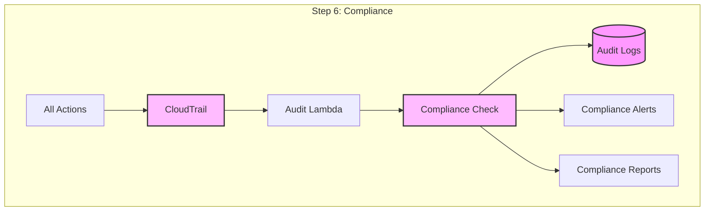

**Components to Add**:
1. CloudTrail for API logging
2. Audit Lambda function
3. Compliance checking service
4. S3 for immutable audit logs
5. EventBridge for compliance alerts
6. Compliance reporting dashboard

**What This Enables**:
- Complete audit trails
- SOX compliance
- Regulatory reporting
- Compliance monitoring

---

### Phase 7: Analytics & Monitoring

**Goal**: Business intelligence and observability

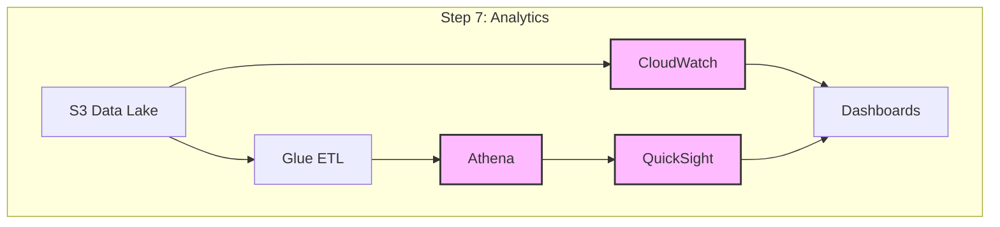

**Components to Add**:
1. Glue ETL jobs
2. Athena for querying
3. QuickSight dashboards
4. CloudWatch dashboards and alarms
5. Custom metrics and alerts

**What This Enables**:
- Business intelligence
- Performance monitoring
- Fraud analytics
- Risk analytics

---

### Complete Architecture (All Phases Combined)

**Final integrated system**:

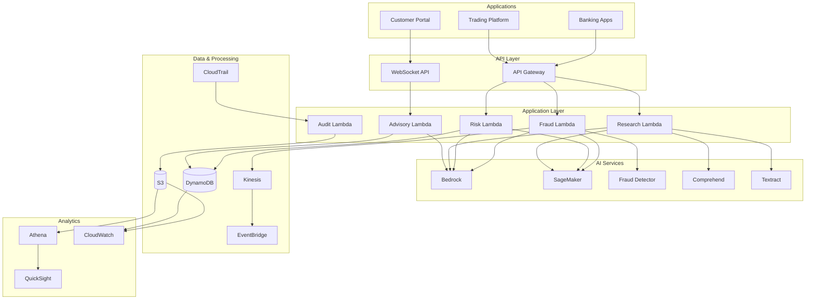

## Detailed Component Architecture

Each component is built incrementally. Here's how each one works:

### 1. Fraud Detection System

**Purpose**: Real-time fraud detection and prevention

**Step-by-Step Flow**:

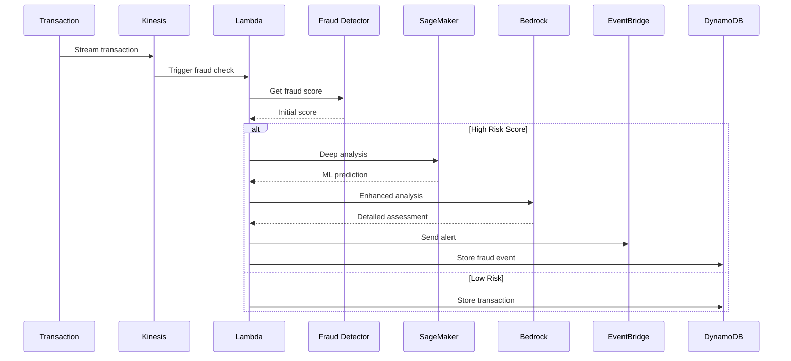

**Implementation Steps**:
1. Create Kinesis stream for transactions
2. Deploy Fraud Detector model
3. Create fraud detection Lambda function
4. Set up EventBridge for alerts
5. Integrate SageMaker for deep analysis
6. Use Bedrock for complex pattern analysis

**Key Services**:
- AWS Fraud Detector: Real-time fraud scoring
- SageMaker: Advanced ML models
- Bedrock: Complex pattern analysis
- Kinesis: Real-time streaming

---

### 2. Credit Risk Assessment Engine

**Purpose**: AI-powered credit risk modeling

**Step-by-Step Flow**:

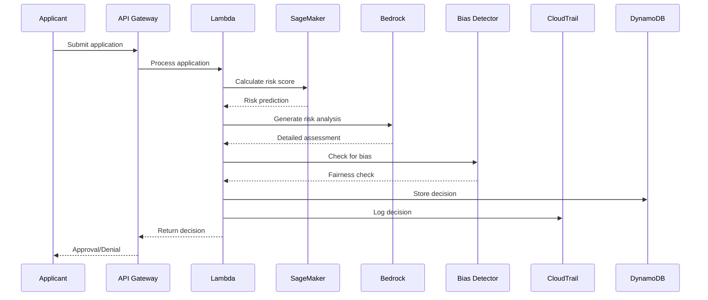

**Implementation Steps**:
1. Train SageMaker risk model
2. Create risk assessment Lambda
3. Implement bias detection
4. Set up CloudTrail logging
5. Configure fair lending checks

**Key Services**:
- SageMaker: Risk scoring models
- Bedrock: Risk analysis
- CloudTrail: Audit logging
- DynamoDB: Decision storage

---

### 3. Investment Research System

**Purpose**: Automated financial analysis

**Step-by-Step Flow**:

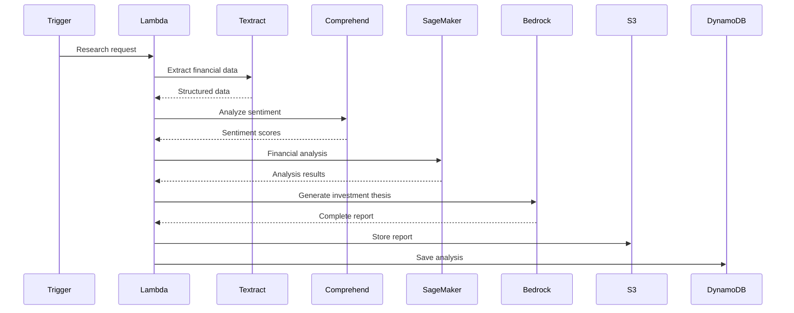

**Implementation Steps**:
1. Set up Textract for document processing
2. Configure Comprehend for sentiment
3. Deploy SageMaker financial models
4. Create research Lambda function
5. Generate reports with Bedrock

**Key Services**:
- Textract: Document extraction
- Comprehend: Sentiment analysis
- SageMaker: Financial models
- Bedrock: Report generation

---

### 4. Customer Advisory Platform

**Purpose**: Personalized financial advice

**Step-by-Step Flow**:

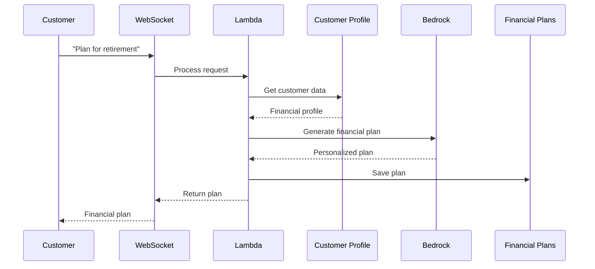

**Implementation Steps**:
1. Set up WebSocket API
2. Create customer profile database
3. Deploy advisory Lambda function
4. Integrate Bedrock for planning
5. Store financial plans

**Key Services**:
- API Gateway: WebSocket support
- Bedrock: Financial planning
- DynamoDB: Profile and plans storage

## Security Architecture

### Network Security

- **VPC**: Isolated network with public/private subnets
- **Security Groups**: Strict firewall rules
- **NACLs**: Network-level access control
- **VPC Endpoints**: Private AWS service access
- **WAF**: Web application firewall for API Gateway

### Data Security

- **Encryption at Rest**: 
  - DynamoDB: AWS KMS encryption
  - S3: Server-side encryption with KMS
  - All data encrypted by default

- **Encryption in Transit**:
  - TLS 1.3 for all API communications
  - HTTPS for all web traffic
  - VPC endpoints for AWS services

### Access Control

- **IAM Roles**: Least privilege for all services
- **MFA**: Multi-factor authentication required
- **API Authentication**: Cognito with MFA
- **Service-to-Service**: IAM roles for Lambda
- **Data Access**: Fine-grained DynamoDB policies

### Compliance

- **SOX**: Financial reporting controls
- **PCI DSS**: Payment card security
- **GDPR/CCPA**: Data privacy compliance
- **Fair Lending**: Bias detection and monitoring
- **KYC/AML**: Know Your Customer compliance

## Build Process Summary

### Recommended Build Order

1. **Phase 1: Foundation** (Week 1)
   - Set up VPC, DynamoDB, S3 with encryption
   - Deploy API Gateway with authentication
   - Configure KMS keys
   - Test secure data storage

2. **Phase 2: Fraud Detection** (Week 2)
   - Create Kinesis stream
   - Deploy Fraud Detector
   - Set up fraud Lambda
   - Test fraud detection

3. **Phase 3: Risk Assessment** (Week 3)
   - Deploy risk models
   - Implement bias detection
   - Set up audit logging
   - Test risk assessment

4. **Phase 4: Investment Research** (Week 4)
   - Set up Textract and Comprehend
   - Deploy research Lambda
   - Test report generation

5. **Phase 5: Customer Advisory** (Week 5)
   - Set up WebSocket API
   - Deploy advisory Lambda
   - Test financial planning

6. **Phase 6: Compliance** (Week 6)
   - Configure CloudTrail
   - Set up compliance checks
   - Test audit logging

7. **Phase 7: Analytics** (Week 7)
   - Set up Glue ETL
   - Create QuickSight dashboards
   - Configure CloudWatch
   - Test analytics

### Quick Start (Minimal Viable Product)

For a quick start, focus on **Phases 1-2**:
- Secure infrastructure foundation
- Basic fraud detection
- Real-time transaction monitoring

This gives you a working fraud detection system that can be expanded incrementally.

## Performance Targets

- **Fraud Detection**: < 50ms average latency
- **Risk Assessment**: < 200ms average latency
- **Investment Analysis**: < 30 seconds for reports
- **API Response**: < 200ms (p95)
- **Throughput**: 10,000+ transactions/second

## Conclusion

The Financial Services AI Solution architecture is designed to provide a secure, compliant, and scalable platform for financial institutions. The architecture leverages AWS GenAI services to deliver intelligent fraud detection, risk assessment, and customer advisory capabilities while maintaining strict regulatory compliance and security standards.

The modular design allows financial institutions to deploy components incrementally, starting with core fraud detection and expanding to include advanced capabilities like investment research and customer advisory services.

