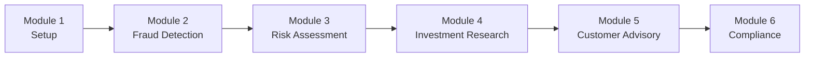

# Financial Services AI Workshop

Welcome to the Financial Services AI Workshop! This comprehensive workshop teaches you how to build secure, compliant AI-powered financial solutions using AWS GenAI services including Amazon Bedrock, Amazon SageMaker, AWS Fraud Detector, Amazon Comprehend, and Amazon Textract.

## Workshop Overview

This workshop consists of 6 comprehensive modules, each building upon the previous one:

1. **[Module 1: Environment Setup](./module-1-setup.md)** - Set up secure development environment and AWS services (45 min)
2. **[Module 2: Fraud Detection](./module-2-fraud-detection.md)** - Build real-time fraud detection system (120 min)
3. **[Module 3: Risk Assessment](./module-3-risk-assessment.md)** - Implement AI-powered credit risk evaluation (90 min)
4. **[Module 4: Investment Research](./module-4-investment-research.md)** - Create automated financial analysis (90 min)
5. **[Module 5: Customer Advisory](./module-5-customer-advisory.md)** - Build AI financial advisor (90 min)
6. **[Module 6: Compliance & Production](./module-6-compliance.md)** - Deploy with compliance and monitoring (60 min)

## Learning Path



**Total Workshop Time**: ~8.5 hours

## Prerequisites Checklist

Before starting, ensure you have:

- [ ] AWS Account created with admin access
- [ ] AWS CLI installed and configured
- [ ] Python 3.11+ installed
- [ ] Node.js 18+ installed (optional)
- [ ] Git installed
- [ ] Code editor (VS Code recommended)
- [ ] Access to Amazon Bedrock with Claude models enabled
- [ ] Access to AWS Fraud Detector
- [ ] Basic understanding of Python and AWS services
- [ ] Familiarity with REST APIs
- [ ] Understanding of financial services concepts (helpful but not required)

## Workshop Objectives

By the end of this workshop, you will be able to:

1. **Set up secure AWS infrastructure** for financial applications
2. **Build fraud detection systems** using ML and GenAI
3. **Implement credit risk assessment** with bias detection
4. **Create investment research automation** with document analysis
5. **Build customer advisory platforms** with personalized financial planning
6. **Deploy compliant production systems** with audit logging

## Workshop Structure

Each module includes:

- **Learning Objectives**: What you'll learn
- **Prerequisites**: Required knowledge and setup
- **Hands-on Exercises**: Step-by-step implementation
- **Code Examples**: Working code samples
- **Security Best Practices**: Financial services security guidelines
- **Compliance Considerations**: Regulatory compliance requirements
- **Troubleshooting**: Common issues and solutions
- **Next Steps**: What to explore next

## Getting Started

### Quick Start

```bash
# Clone the repository
git clone <repository-url>
cd genAI-labs/financial-services

# Set up environment
./scripts/setup-workshop.sh

# Start with Module 1
cd docs/workshop
open module-1-setup.md
```

### Workshop Resources

- **Code Examples**: `code/examples/`
- **Sample Data**: `data/sample/`
- **Configuration**: `config/`
- **Scripts**: `scripts/`

## Module Details

### Module 1: Environment Setup (45 min)

**Topics Covered**:
- AWS account setup and security configuration
- Bedrock model access configuration
- VPC and networking setup
- KMS encryption keys
- Development environment setup
- Sample data loading
- Basic API testing

**Key Learnings**:
- How to configure secure AWS infrastructure
- Setting up encryption for financial data
- Understanding the project structure

### Module 2: Fraud Detection (120 min)

**Topics Covered**:
- Real-time transaction processing with Kinesis
- AWS Fraud Detector integration
- ML model integration with SageMaker
- GenAI enhancement with Bedrock
- Event-driven alerts with EventBridge
- Fraud pattern analysis

**Key Learnings**:
- Building real-time fraud detection systems
- Combining ML and GenAI for fraud analysis
- Performance optimization for low latency

### Module 3: Risk Assessment (90 min)

**Topics Covered**:
- Credit risk modeling with SageMaker
- Alternative data integration
- Bias detection and fair lending
- Risk scoring algorithms
- Regulatory compliance checks
- Audit logging

**Key Learnings**:
- Implementing credit risk assessment
- Ensuring fair lending compliance
- Building audit trails

### Module 4: Investment Research (90 min)

**Topics Covered**:
- Document processing with Textract
- Sentiment analysis with Comprehend
- Financial analysis with SageMaker
- Investment thesis generation with Bedrock
- Report generation and storage
- Multi-source data integration

**Key Learnings**:
- Automating financial research
- Processing financial documents
- Generating investment recommendations

### Module 5: Customer Advisory (90 min)

**Topics Covered**:
- WebSocket API implementation
- Customer profile management
- Financial planning with Bedrock
- Goal-based planning algorithms
- Portfolio recommendations
- Real-time advisory interactions

**Key Learnings**:
- Building conversational financial advisors
- Personalized financial planning
- Real-time customer interactions

### Module 6: Compliance & Production (60 min)

**Topics Covered**:
- CloudTrail audit logging
- Compliance monitoring
- Security best practices
- Infrastructure as Code with Terraform
- CI/CD pipeline setup
- Monitoring and alerting
- Performance optimization

**Key Learnings**:
- Deploying compliant production systems
- Setting up audit trails
- Ensuring regulatory compliance

## Workshop Completion

### Final Project

After completing all modules, you'll have built:

- ✅ Real-time fraud detection system
- ✅ AI-powered credit risk assessment
- ✅ Automated investment research platform
- ✅ Customer advisory system
- ✅ Compliance and audit framework
- ✅ Production-ready deployment

### Next Steps

1. **Customize for Your Use Case**: Adapt the solution for your specific needs
2. **Explore Advanced Features**: Implement additional AI capabilities
3. **Scale the Solution**: Optimize for high-traffic scenarios
4. **Share Your Work**: Contribute back to the community

## Getting Help

### Resources

- **Documentation**: Check module-specific documentation
- **Code Examples**: Review working code samples
- **AWS Documentation**: Consult AWS service documentation
- **Community**: Join AWS community forums

### Common Issues

- **Bedrock Access**: Ensure model access is enabled in AWS Console
- **Fraud Detector**: Verify model training and deployment
- **Lambda Timeouts**: Increase timeout and check function logs
- **DynamoDB Throttling**: Enable auto-scaling or increase capacity
- **Compliance**: Review IAM permissions and audit logging

### Support Channels

- **GitHub Issues**: Report bugs and request features
- **AWS Support**: For AWS service-specific issues
- **Workshop Q&A**: Check workshop discussion forums

## Security & Compliance Notes

⚠️ **Important**: This workshop includes security and compliance best practices for financial services. Always:

- Use encryption for all sensitive data
- Enable audit logging for all actions
- Follow least privilege access principles
- Test in development environments first
- Review compliance requirements for your jurisdiction

## Workshop Completion Certificate

After completing all modules and the final project, you'll receive a completion certificate. Share your achievement on social media!

---

**Ready to start? Begin with [Module 1: Environment Setup](./module-1-setup.md)! 🚀**

