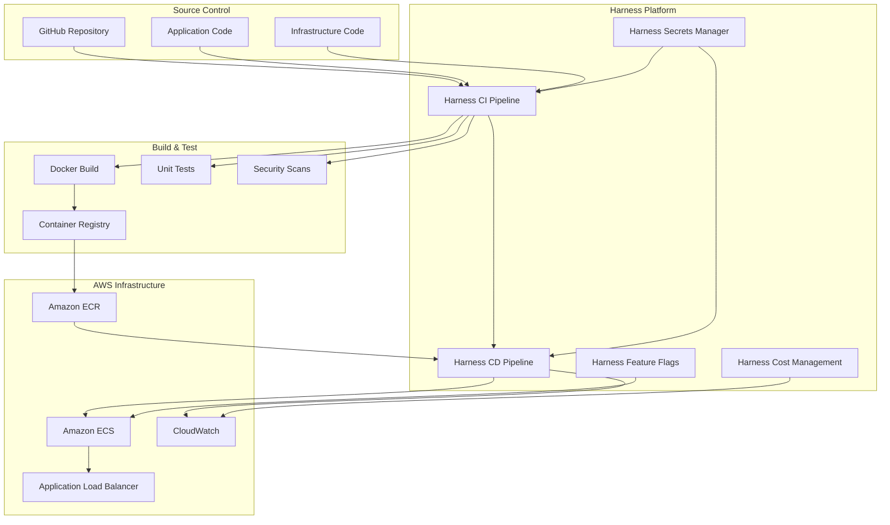

# 🚀 Harness DevOps Enterprise Workshop

## Workshop Overview

This comprehensive, enterprise-grade workshop demonstrates how to implement **Harness CI/CD** for a complete DevOps pipeline. You'll learn to build, test, secure, and deploy applications using Harness's powerful features including Continuous Integration, Continuous Delivery, Feature Flags, Cloud Cost Management, and Security Testing Orchestration.

## 🎯 Learning Objectives

By the end of this workshop, you will be able to:

1. **Understand Harness Platform** - Core concepts, architecture, and enterprise capabilities
2. **Set up Harness Account** - Configure organizations, projects, connectors, and secrets
3. **Build CI Pipelines** - Create and manage Continuous Integration pipelines with Harness
4. **Implement CD Pipelines** - Deploy applications with Continuous Delivery using Harness
5. **Manage Infrastructure** - Use Infrastructure as Code with Terraform and Harness
6. **Implement Security** - Integrate security scanning, secrets management, and compliance
7. **Monitor and Optimize** - Use Harness analytics, cost management, and observability
8. **Advanced Features** - Feature flags, GitOps, multi-cloud deployments, and rollback strategies

## 📋 Prerequisites

### Technical Requirements
- **Harness Account** - Free tier or enterprise account
- **AWS Account** with appropriate permissions (IAM, EC2, ECS, EKS, S3, ECR)
- **GitHub/GitLab Account** - For source code management
- **Docker** - For containerization
- **Terraform >= 1.5** - For infrastructure provisioning
- **AWS CLI v2** - Configured with credentials
- **kubectl** - For Kubernetes deployments (optional)
- **Python 3.11+** - For application backend
- **Node.js 18+** - For application frontend
- **Git** - Version control

### AWS Services Access
Ensure you have access to:
- Amazon ECR (Elastic Container Registry)
- Amazon ECS (Elastic Container Service)
- Amazon EKS (Elastic Kubernetes Service) - Optional
- Amazon S3
- AWS IAM
- Amazon CloudWatch
- AWS CodeCommit or GitHub integration

### Knowledge Prerequisites
- Basic understanding of CI/CD concepts
- Familiarity with Docker and containerization
- Understanding of AWS services
- Basic knowledge of YAML
- Experience with Git workflows

## 🏗️ Workshop Architecture



## 📚 Workshop Modules

### Module 1: Harness Platform Setup (60 minutes)
- [ ] Create Harness Account and Organization
- [ ] Configure Projects and Environments
- [ ] Set up AWS Connectors
- [ ] Configure Secrets Management
- [ ] Set up Git Connectors
- [ ] Configure Delegate Installation

### Module 2: Application Development (90 minutes)
- [ ] Create Sample Microservices Application
- [ ] Set up Backend API (Python/Flask)
- [ ] Set up Frontend (React/Next.js)
- [ ] Configure Dockerfiles
- [ ] Set up Local Development Environment
- [ ] Write Unit and Integration Tests

### Module 3: Infrastructure as Code (90 minutes)
- [ ] Create Terraform Modules
- [ ] Provision AWS ECS Cluster
- [ ] Set up ECR Repositories
- [ ] Configure Load Balancers
- [ ] Set up CloudWatch Logging
- [ ] Configure IAM Roles and Policies

### Module 4: Harness CI Pipeline (120 minutes)
- [ ] Create CI Pipeline in Harness
- [ ] Configure Build Steps
- [ ] Set up Test Execution
- [ ] Integrate Security Scanning (Snyk, SonarQube)
- [ ] Configure Artifact Publishing
- [ ] Set up Pipeline Triggers
- [ ] Implement Pipeline Chaining

### Module 5: Harness CD Pipeline (120 minutes)
- [ ] Create CD Pipeline in Harness
- [ ] Configure Service Definitions
- [ ] Set up Environment Configurations
- [ ] Implement Deployment Strategies (Blue/Green, Canary, Rolling)
- [ ] Configure Approval Gates
- [ ] Set up Rollback Strategies
- [ ] Implement Multi-Environment Deployments

### Module 6: Advanced Features (90 minutes)
- [ ] Implement Feature Flags
- [ ] Set up GitOps Workflows
- [ ] Configure Cost Management
- [ ] Implement Security Policies
- [ ] Set up Notifications and Alerts
- [ ] Configure Pipeline Templates

### Module 7: Monitoring and Optimization (60 minutes)
- [ ] Set up Harness Analytics
- [ ] Configure CloudWatch Dashboards
- [ ] Implement Log Aggregation
- [ ] Set up Performance Monitoring
- [ ] Cost Optimization Strategies
- [ ] Troubleshooting and Debugging

## 🚀 Quick Start

### 1. Clone the Repository
```bash
git clone <repository-url>
cd genAI-labs/harness-devops-workshop
```

### 2. Set up Harness Account
1. Sign up at [app.harness.io](https://app.harness.io)
2. Create a new organization or use default
3. Create a new project: `harness-workshop`

### 3. Install Harness Delegate
```bash
# Follow instructions in docs/setup/delegate-installation.md
# Or use the provided script
./scripts/setup-delegate.sh
```

### 4. Configure AWS Connector
1. Navigate to Connectors in Harness
2. Add AWS Connector
3. Use IAM Role or Access Keys
4. Test connection

### 5. Set up Local Environment
```bash
# Install dependencies
pip install -r requirements.txt
npm install --prefix frontend

# Configure environment variables
cp config/.env.example config/.env
# Edit config/.env with your values
```

### 6. Deploy Infrastructure
```bash
cd infrastructure/terraform
terraform init
terraform plan
terraform apply
```

### 7. Import Pipelines to Harness
```bash
# Use Harness CLI or UI to import pipelines
harness pipeline import --file harness/pipelines/ci-pipeline.yaml
harness pipeline import --file harness/pipelines/cd-pipeline.yaml
```

## 📖 Detailed Workshop Guide

### [Module 1: Harness Platform Setup](./docs/workshop/module-1-setup.md)
Complete guide for setting up your Harness account, organization, and initial configuration.

### [Module 2: Application Development](./docs/workshop/module-2-application.md)
Build a sample microservices application with backend and frontend components.

### [Module 3: Infrastructure as Code](./docs/workshop/module-3-infrastructure.md)
Provision AWS infrastructure using Terraform for containerized deployments.

### [Module 4: Harness CI Pipeline](./docs/workshop/module-4-ci-pipeline.md)
Create and configure Continuous Integration pipelines in Harness.

### [Module 5: Harness CD Pipeline](./docs/workshop/module-5-cd-pipeline.md)
Implement Continuous Delivery pipelines with advanced deployment strategies.

### [Module 6: Advanced Features](./docs/workshop/module-6-advanced.md)
Explore Harness advanced features including feature flags, GitOps, and cost management.

### [Module 7: Monitoring and Optimization](./docs/workshop/module-7-monitoring.md)
Set up monitoring, analytics, and optimization strategies.

## 🛠️ Workshop Tools

### Development Tools
- **Harness Platform** - CI/CD orchestration
- **Docker** - Containerization
- **Terraform** - Infrastructure provisioning
- **AWS CLI** - AWS service management
- **kubectl** - Kubernetes management (optional)

### Monitoring Tools
- **Harness Analytics** - Pipeline analytics
- **AWS CloudWatch** - Infrastructure monitoring
- **Harness Cost Management** - Cost optimization

## 📊 Success Metrics

### Technical Metrics
- Pipeline execution time < 15 minutes
- Deployment success rate > 99%
- Mean time to recovery (MTTR) < 5 minutes
- Security scan coverage > 95%
- Test coverage > 80%

### Learning Metrics
- Complete all 7 modules
- Successfully deploy application through Harness
- Implement at least 2 deployment strategies
- Set up monitoring and alerting
- Understand cost optimization strategies

## 🎯 Workshop Outcomes

After completing this workshop, you will have:

1. **A fully functional Harness CI/CD setup** for enterprise deployments
2. **Production-ready pipelines** with security, testing, and monitoring
3. **Comprehensive understanding** of Harness platform capabilities
4. **Best practices** for CI/CD, infrastructure, and security
5. **Infrastructure templates** for AWS deployments
6. **Monitoring and optimization** strategies implemented

## 📞 Support and Resources

### Workshop Support
- **Documentation**: [Harness Documentation](https://docs.harness.io/)
- **Community**: [Harness Community](https://community.harness.io/)
- **Support**: [Harness Support](https://harness.io/support)

### Additional Resources
- [Harness CI/CD Best Practices](https://docs.harness.io/article/ci-cd-best-practices)
- [AWS ECS Documentation](https://docs.aws.amazon.com/ecs/)
- [Terraform AWS Provider](https://registry.terraform.io/providers/hashicorp/aws/latest/docs)
- [Docker Best Practices](https://docs.docker.com/develop/dev-best-practices/)

## 🏆 Certification

Upon successful completion of the workshop, you will:
- Receive **Harness DevOps Practitioner** certificate
- Gain **Workshop completion** badge
- Access to advanced Harness modules
- Join Harness community forums

## 📅 Workshop Schedule

| Module | Duration | Prerequisites |
|--------|----------|---------------|
| Module 1 | 60 min | Harness Account |
| Module 2 | 90 min | Python, Node.js |
| Module 3 | 90 min | AWS Account, Terraform |
| Module 4 | 120 min | Harness Setup |
| Module 5 | 120 min | CI Pipeline |
| Module 6 | 90 min | CD Pipeline |
| Module 7 | 60 min | All Previous |

**Total Workshop Time**: ~8.5 hours

## 🎉 Next Steps

After completing the workshop:

1. **Explore advanced Harness features** in the advanced directory
2. **Customize pipelines** for your specific use cases
3. **Integrate with existing systems** using provided templates
4. **Share your implementations** with the community
5. **Continue learning** with Harness certification programs

## 📝 Project Structure

```
harness-devops-workshop/
├── backend/              # Python Flask backend application
├── frontend/             # React/Next.js frontend application
├── infrastructure/       # Terraform infrastructure code
├── harness/              # Harness pipeline configurations
├── scripts/              # Deployment and utility scripts
├── tests/                # Test files
├── docs/                 # Workshop documentation
├── config/               # Configuration files
└── docker/               # Dockerfiles and docker-compose
```

---

**Ready to start? Let's begin with [Module 1: Harness Platform Setup](./docs/workshop/module-1-setup.md)! 🚀**

