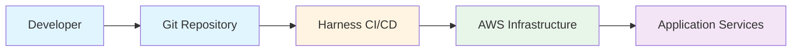
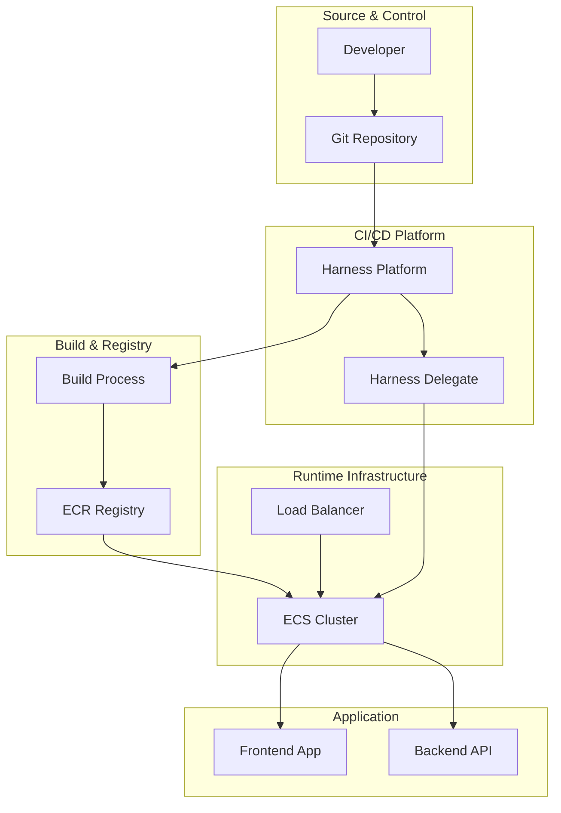
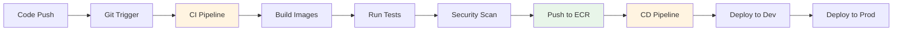
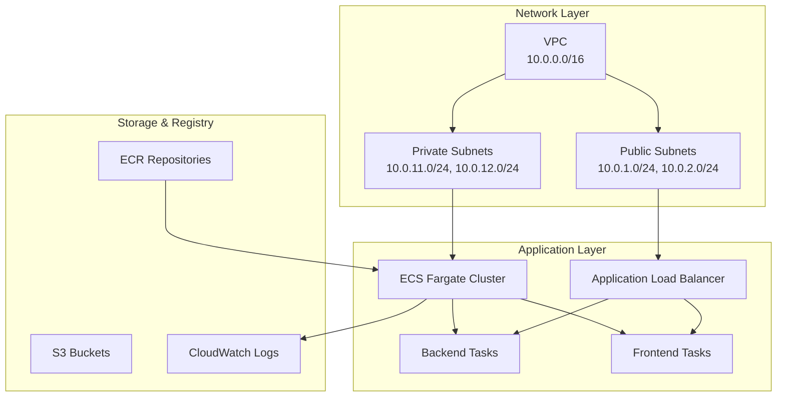
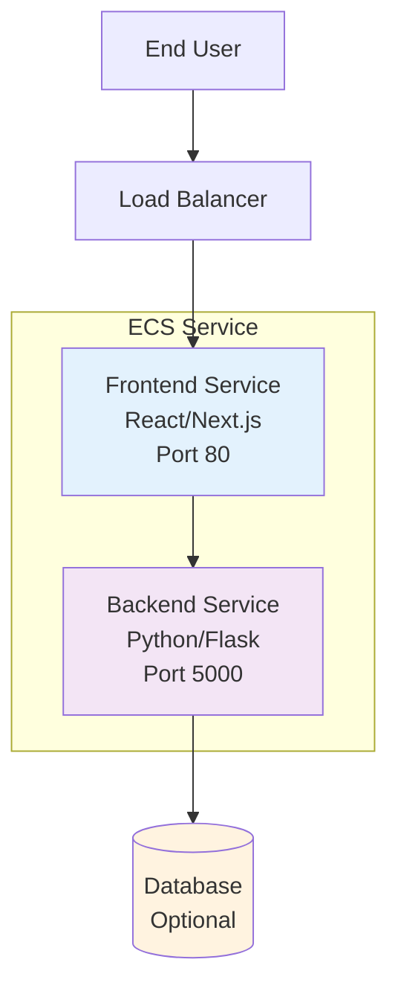
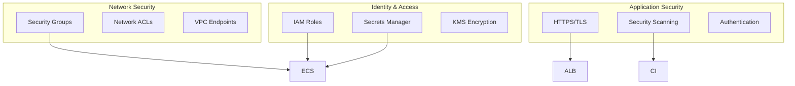
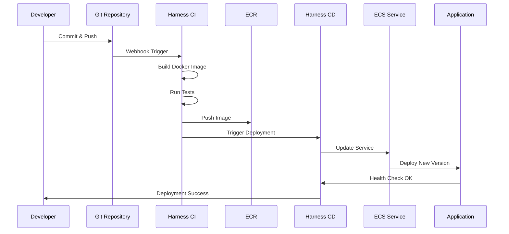
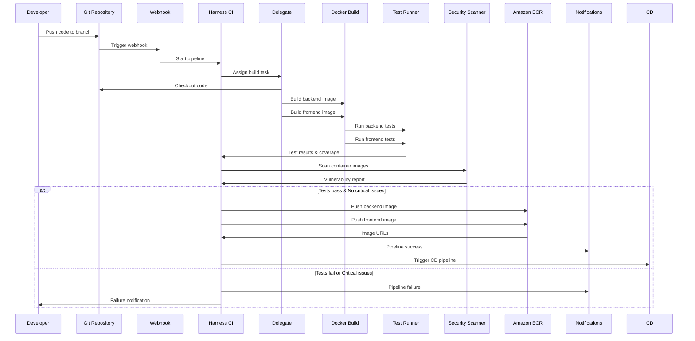
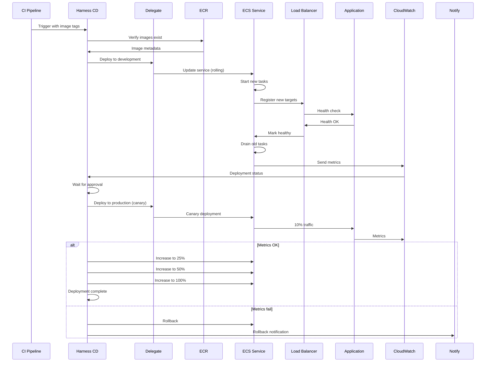

# Harness DevOps Workshop Architecture

## Overview

This document describes the complete architecture of the Harness DevOps workshop, including the application components, infrastructure, CI/CD pipelines, and integration points. The architecture is designed to be enterprise-grade, scalable, secure, and follows AWS and Harness best practices.

## High-Level Architecture



## System Architecture Overview



## Detailed Architecture Diagrams

### 1. CI/CD Pipeline Flow



### 2. Infrastructure Components



### 3. Application Architecture



### 4. Security Architecture



### 5. Deployment Flow



## Component Details

### 1. Source Control Layer

**GitHub/GitLab Repository**
- Stores application source code
- Manages infrastructure as code (Terraform)
- Contains Harness pipeline definitions
- Triggers CI/CD pipelines on commits

**Repository Structure:**
```
├── backend/          # Python Flask application
├── frontend/         # React/Next.js application
├── infrastructure/   # Terraform modules
├── harness/          # Harness pipeline YAML
└── tests/            # Test suites
```

### 2. Harness Platform Layer

**Harness CI Pipeline**
- **Trigger**: Git push/PR events
- **Steps**:
  1. Checkout code
  2. Build Docker images
  3. Run unit tests
  4. Security scanning
  5. Publish artifacts to ECR
  6. Generate reports

**Harness CD Pipeline**
- **Trigger**: CI pipeline completion
- **Steps**:
  1. Fetch artifacts from ECR
  2. Deploy to staging environment
  3. Run integration tests
  4. Approval gate
  5. Deploy to production
  6. Post-deployment verification

**Harness Delegate**
- Runs on AWS ECS or Kubernetes
- Executes pipeline steps
- Connects to AWS services
- Manages deployments

**Harness Secrets Manager**
- Stores AWS credentials
- Manages API keys
- Encrypts sensitive data
- Integrates with AWS Secrets Manager

**Harness Feature Flags**
- Controls feature rollouts
- A/B testing capabilities
- Gradual feature enablement
- Runtime configuration

### 3. Build & Test Layer

**Docker Build**
- Multi-stage builds
- Optimized image sizes
- Security best practices
- Layer caching

**Testing Framework**
- Unit tests (pytest for Python, Jest for Node.js)
- Integration tests
- End-to-end tests
- Test coverage reporting

**Security Scanning**
- Container image scanning (Snyk, Trivy)
- Code quality (SonarQube)
- Dependency scanning
- SAST/DAST tools

### 4. AWS Infrastructure Layer

**VPC Configuration**
- Public and private subnets
- NAT Gateway for outbound access
- Security groups
- Route tables

**ECS Cluster**
- Fargate launch type (serverless)
- Auto-scaling configuration
- Service discovery
- Task definitions

**Application Load Balancer**
- HTTPS termination
- Health checks
- Target groups
- SSL/TLS certificates

**Amazon ECR**
- Private container registry
- Image versioning
- Lifecycle policies
- Cross-region replication

**CloudWatch**
- Log aggregation
- Metrics collection
- Alarms and notifications
- Dashboards

**IAM Roles**
- Task execution roles
- Task roles
- Service-linked roles
- Least privilege access

### 5. Application Layer

**Backend Service (Python/Flask)**
- RESTful API
- Health check endpoints
- Database connections
- Authentication/Authorization

**Frontend Service (React/Next.js)**
- Static site generation
- API integration
- Client-side routing
- Progressive Web App features

**Database**
- Amazon RDS (PostgreSQL) or DynamoDB
- Automated backups
- Multi-AZ deployment
- Encryption at rest

## Detailed Component Specifications

### Source Control Layer

**GitHub/GitLab Repository**
- **Purpose**: Version control and collaboration
- **Structure**:
  ```
  ├── backend/          # Python Flask application
  │   ├── app/         # Application code
  │   ├── tests/       # Test suites
  │   └── Dockerfile   # Container definition
  ├── frontend/         # React/Next.js application
  │   ├── src/         # Source code
  │   ├── public/      # Static assets
  │   └── Dockerfile   # Container definition
  ├── infrastructure/  # Terraform modules
  │   └── terraform/   # Infrastructure as Code
  ├── harness/         # Harness pipeline definitions
  │   └── pipelines/   # CI/CD pipeline YAML
  └── scripts/         # Deployment utilities
  ```

**Webhook Configuration**
- Triggers CI pipeline on push to main/develop branches
- Supports pull request triggers
- Branch protection rules enabled

### Harness Platform Components

#### CI Pipeline Components

**Pipeline Stages:**
1. **Checkout Stage**
   - Clones repository
   - Checks out specified branch/commit
   - Duration: ~30 seconds

2. **Build Stage**
   - Builds backend Docker image
   - Builds frontend Docker image
   - Uses layer caching for optimization
   - Duration: ~5-10 minutes

3. **Test Stage**
   - Runs backend unit tests (pytest)
   - Runs frontend unit tests (Jest)
   - Generates coverage reports
   - Duration: ~2-5 minutes

4. **Security Scan Stage**
   - Container image vulnerability scanning
   - Code quality analysis
   - Dependency scanning
   - Duration: ~3-5 minutes

5. **Publish Stage**
   - Pushes images to ECR
   - Tags images with version
   - Duration: ~2-3 minutes

**Total CI Pipeline Duration**: ~15-25 minutes

#### CD Pipeline Components

**Pipeline Stages:**
1. **Development Deployment**
   - Deploys to development environment
   - Uses rolling deployment strategy
   - Runs smoke tests
   - Duration: ~5-10 minutes

2. **Approval Gate**
   - Manual approval for production
   - Optional automated approval rules
   - Duration: Variable (manual)

3. **Production Deployment**
   - Canary deployment (10% → 25% → 50% → 100%)
   - Health checks between phases
   - Automatic rollback on failure
   - Duration: ~15-30 minutes

**Total CD Pipeline Duration**: ~20-40 minutes (excluding approval)

#### Harness Delegate

**Configuration:**
- **Type**: Docker or Kubernetes
- **Resources**: 1 CPU, 2GB RAM (minimum)
- **Location**: AWS ECS or Kubernetes cluster
- **Connectivity**: Outbound HTTPS to app.harness.io

**Responsibilities:**
- Execute pipeline steps
- Connect to AWS services
- Run build commands
- Deploy applications
- Report status back to Harness

### Build & Test Layer

#### Docker Build Process

**Backend Image Build:**
```dockerfile
# Multi-stage build
Stage 1: Base image (python:3.11-slim)
Stage 2: Install dependencies
Stage 3: Copy application code
Stage 4: Configure runtime
Final Image Size: ~150-200MB
```

**Frontend Image Build:**
```dockerfile
# Multi-stage build
Stage 1: Build (node:18-alpine)
Stage 2: Production (nginx:alpine)
Final Image Size: ~50-100MB
```

#### Testing Framework

**Backend Tests:**
- **Framework**: pytest
- **Coverage Tool**: pytest-cov
- **Test Types**: Unit, Integration
- **Coverage Target**: >80%

**Frontend Tests:**
- **Framework**: Jest + React Testing Library
- **Coverage Tool**: Jest coverage
- **Test Types**: Unit, Component
- **Coverage Target**: >80%

#### Security Scanning

**Container Scanning:**
- **Tool**: Snyk or Trivy
- **Scans**: Base image, dependencies, runtime
- **Severity Levels**: Critical, High, Medium, Low
- **Action**: Fail on Critical/High vulnerabilities

**Code Quality:**
- **Tool**: SonarQube (optional)
- **Metrics**: Code smells, bugs, vulnerabilities
- **Quality Gate**: Pass/fail based on thresholds

### AWS Infrastructure Layer

#### VPC Architecture

**Network Design:**
```
VPC: 10.0.0.0/16
├── Public Subnets (2 AZs)
│   ├── 10.0.1.0/24 (us-east-1a)
│   └── 10.0.2.0/24 (us-east-1b)
└── Private Subnets (2 AZs)
    ├── 10.0.11.0/24 (us-east-1a)
    └── 10.0.12.0/24 (us-east-1b)
```

**Components:**
- Internet Gateway (IGW) for public subnets
- NAT Gateway for private subnet outbound access
- Route tables for traffic routing
- Security groups for access control

#### ECS Cluster Configuration

**Cluster Type**: Fargate (Serverless)

**Service Configuration:**
- **Backend Service**:
  - CPU: 256 (0.25 vCPU)
  - Memory: 512 MB
  - Desired Count: 2 (for HA)
  - Auto Scaling: 2-10 tasks based on CPU/Memory

- **Frontend Service**:
  - CPU: 256 (0.25 vCPU)
  - Memory: 256 MB
  - Desired Count: 2 (for HA)
  - Auto Scaling: 2-10 tasks based on CPU/Memory

**Task Definitions:**
- Container images from ECR
- Environment variables from Secrets Manager
- CloudWatch Logs integration
- IAM task roles for AWS service access

#### Application Load Balancer

**Configuration:**
- **Type**: Application Load Balancer (ALB)
- **Scheme**: Internet-facing
- **Listeners**: 
  - HTTP (80) → HTTPS redirect
  - HTTPS (443) → Target groups
- **SSL Certificate**: ACM certificate
- **Health Checks**: 
  - Path: `/api/health` (backend)
  - Path: `/` (frontend)
  - Interval: 30 seconds
  - Timeout: 5 seconds
  - Healthy threshold: 2
  - Unhealthy threshold: 3

**Target Groups:**
- Backend target group (port 5000)
- Frontend target group (port 80)
- Health check configuration per service

#### Amazon ECR

**Repositories:**
- `harness-workshop-dev-backend`
- `harness-workshop-dev-frontend`

**Features:**
- Image scanning on push
- Lifecycle policies (retain last 10 images)
- Cross-region replication (optional)
- Encryption at rest

#### CloudWatch Integration

**Log Groups:**
- `/ecs/harness-workshop-dev/backend`
- `/ecs/harness-workshop-dev/frontend`
- Retention: 7 days (configurable)

**Metrics:**
- ECS service metrics (CPU, Memory, Task count)
- ALB metrics (Request count, Response time, Error rate)
- Custom application metrics

**Alarms:**
- High CPU utilization (>80%)
- High memory utilization (>80%)
- High error rate (>5%)
- Service unavailable

### Application Layer

#### Backend Service (Python/Flask)

**Technology Stack:**
- **Framework**: Flask 3.0.0
- **WSGI Server**: Gunicorn
- **Python Version**: 3.11
- **Dependencies**: See requirements.txt

**API Endpoints:**
- `GET /api/health` - Health check
- `GET /api/users` - List users
- `POST /api/users` - Create user
- `GET /api/users/<id>` - Get user
- `DELETE /api/users/<id>` - Delete user

**Features:**
- CORS enabled
- JSON request/response
- Error handling
- Health check endpoint
- Logging integration

#### Frontend Service (React/Next.js)

**Technology Stack:**
- **Framework**: React 18+
- **Language**: TypeScript
- **Build Tool**: Next.js or Create React App
- **Web Server**: Nginx (production)

**Features:**
- Static site generation
- API integration
- Client-side routing
- Responsive design
- Progressive Web App (PWA) support

## Data Flow

### CI Pipeline Detailed Flow



### CD Pipeline Detailed Flow



## Security Architecture

### Security Layers

1. **Network Security**
   - VPC isolation
   - Security groups
   - Network ACLs
   - Private subnets for application

2. **Application Security**
   - HTTPS/TLS encryption
   - Secrets management
   - IAM role-based access
   - Container security scanning

3. **Pipeline Security**
   - Harness secrets encryption
   - Secure credential storage
   - Audit logging
   - Approval gates

4. **Infrastructure Security**
   - Encrypted storage
   - VPC endpoints
   - CloudTrail logging
   - Compliance checks

## Scalability Architecture

### Horizontal Scaling
- ECS Auto Scaling based on CPU/Memory
- ALB target group scaling
- Database read replicas
- CDN for static assets

### Vertical Scaling
- Task definition resource limits
- Database instance sizing
- Container resource allocation

## High Availability

### Multi-AZ Deployment
- ECS services across multiple AZs
- RDS Multi-AZ configuration
- ALB across multiple AZs
- ECR cross-region replication

### Disaster Recovery
- Automated backups
- Infrastructure as Code
- Pipeline-based recovery
- Data replication

## Cost Optimization

### Resource Optimization
- Fargate spot instances
- Reserved capacity
- Auto-scaling policies
- Lifecycle policies for ECR

### Monitoring
- Harness Cost Management
- AWS Cost Explorer
- CloudWatch billing alarms
- Resource tagging

## Deployment Strategies

### Blue/Green Deployment
- Zero-downtime deployments
- Instant rollback capability
- Traffic shifting
- Health verification

### Canary Deployment
- Gradual traffic shifting
- Risk mitigation
- Performance monitoring
- Automatic rollback

### Rolling Deployment
- Incremental updates
- Resource efficiency
- Controlled rollout
- Health checks

## Monitoring and Observability

### Metrics
- Application metrics (custom)
- Infrastructure metrics (CloudWatch)
- Pipeline metrics (Harness)
- Cost metrics

### Logging
- Application logs (CloudWatch Logs)
- Pipeline logs (Harness)
- Infrastructure logs (CloudTrail)
- Centralized log aggregation

### Tracing
- Distributed tracing
- Request correlation
- Performance analysis
- Error tracking

## Integration Points

### External Services
- GitHub/GitLab webhooks
- AWS services (ECS, ECR, S3, CloudWatch)
- Security scanners (Snyk, SonarQube)
- Notification services (Slack, Email)

### Internal Services
- Harness platform services
- Delegate communication
- Secrets management
- Feature flag service

## Best Practices

1. **Infrastructure as Code**
   - All infrastructure in Terraform
   - Version controlled
   - Modular design
   - Reusable components

2. **CI/CD Best Practices**
   - Automated testing
   - Security scanning
   - Approval gates
   - Rollback strategies

3. **Security Best Practices**
   - Least privilege access
   - Secrets encryption
   - Regular security scans
   - Compliance checks

4. **Monitoring Best Practices**
   - Comprehensive logging
   - Real-time alerts
   - Performance dashboards
   - Cost monitoring

## Performance Characteristics

### Latency

**CI Pipeline:**
- Code checkout: ~30 seconds
- Docker build: ~5-10 minutes
- Tests: ~2-5 minutes
- Security scan: ~3-5 minutes
- ECR push: ~2-3 minutes
- **Total**: ~15-25 minutes

**CD Pipeline:**
- Development deployment: ~5-10 minutes
- Production canary: ~15-30 minutes
- **Total**: ~20-40 minutes

**Application Response:**
- API response time: <200ms (p95)
- Frontend load time: <2 seconds
- Health check: <100ms

### Throughput

**CI Pipeline:**
- Concurrent builds: 2-5 (depending on delegate capacity)
- Build rate: ~2-4 builds/hour per delegate

**Application:**
- Backend: ~1000 requests/second (with auto-scaling)
- Frontend: ~5000 requests/second (static assets)

### Scalability

**Horizontal Scaling:**
- ECS tasks: 2-100 per service (auto-scaling)
- ALB: Handles millions of requests
- ECR: Unlimited image storage

**Vertical Scaling:**
- Task CPU: 256-4096 (0.25-4 vCPU)
- Task Memory: 512MB-30GB
- Database: RDS instance sizing

## Failure Modes and Recovery

### CI Pipeline Failures

**Build Failures:**
- **Cause**: Code errors, dependency issues
- **Recovery**: Fix code, retry pipeline
- **Prevention**: Local testing, pre-commit hooks

**Test Failures:**
- **Cause**: Test errors, code bugs
- **Recovery**: Fix tests/code, retry
- **Prevention**: Comprehensive test coverage

**Security Scan Failures:**
- **Cause**: Critical vulnerabilities
- **Recovery**: Fix vulnerabilities, rescan
- **Prevention**: Regular dependency updates

### CD Pipeline Failures

**Deployment Failures:**
- **Cause**: Image pull errors, task failures
- **Recovery**: Automatic rollback to previous version
- **Prevention**: Health checks, gradual rollout

**Health Check Failures:**
- **Cause**: Application errors, misconfiguration
- **Recovery**: Automatic rollback
- **Prevention**: Comprehensive health checks

**Canary Deployment Failures:**
- **Cause**: Performance degradation, errors
- **Recovery**: Automatic rollback, traffic shift back
- **Prevention**: Monitoring, gradual traffic increase

### Infrastructure Failures

**ECS Service Failures:**
- **Recovery**: Auto-scaling, task replacement
- **Monitoring**: CloudWatch alarms
- **Prevention**: Multi-AZ deployment

**ALB Failures:**
- **Recovery**: AWS managed, automatic failover
- **Monitoring**: ALB metrics
- **Prevention**: Multi-AZ deployment

**ECR Failures:**
- **Recovery**: AWS managed, automatic replication
- **Monitoring**: ECR metrics
- **Prevention**: Cross-region replication

## Capacity Planning

### Resource Requirements

**Development Environment:**
- ECS Tasks: 2-4 tasks
- CPU: 0.5-1 vCPU total
- Memory: 1-2 GB total
- Estimated Cost: ~$20-40/month

**Production Environment:**
- ECS Tasks: 4-20 tasks (auto-scaling)
- CPU: 1-5 vCPU total
- Memory: 2-10 GB total
- Estimated Cost: ~$100-300/month

### Scaling Triggers

**Auto-Scaling Policies:**
- CPU utilization >70%: Scale out
- CPU utilization <30%: Scale in
- Memory utilization >80%: Scale out
- Memory utilization <40%: Scale in
- Target tracking: Maintain 50% CPU

**Scaling Limits:**
- Minimum tasks: 2 (for HA)
- Maximum tasks: 20 (configurable)
- Scale-out cooldown: 60 seconds
- Scale-in cooldown: 300 seconds

## Technology Stack

### CI/CD Platform
- **Harness**: CI/CD orchestration
- **Docker**: Containerization
- **Terraform**: Infrastructure as Code

### Application Stack
- **Backend**: Python 3.11, Flask 3.0, Gunicorn
- **Frontend**: React 18, TypeScript, Next.js/Nginx
- **Testing**: pytest, Jest, React Testing Library

### Infrastructure Stack
- **Compute**: AWS ECS Fargate
- **Networking**: VPC, ALB, Security Groups
- **Storage**: ECR, S3, CloudWatch Logs
- **Monitoring**: CloudWatch, Harness Analytics

### Security Stack
- **Secrets**: AWS Secrets Manager, Harness Secrets
- **Encryption**: KMS, TLS/HTTPS
- **Scanning**: Snyk, Trivy, SonarQube
- **IAM**: Role-based access control

## Network Architecture Details

### Subnet Configuration

**Public Subnets:**
- Purpose: Internet-facing resources (ALB, NAT Gateway)
- Route Table: Routes to Internet Gateway
- Security: Allow inbound HTTPS (443) from internet

**Private Subnets:**
- Purpose: Application containers (ECS tasks)
- Route Table: Routes to NAT Gateway for outbound
- Security: No direct internet access

### Security Group Rules

**ALB Security Group:**
- Inbound: HTTPS (443) from 0.0.0.0/0
- Outbound: HTTP (80, 5000) to ECS security group

**ECS Security Group:**
- Inbound: HTTP (80, 5000) from ALB security group
- Outbound: HTTPS (443) to internet (via NAT)

**VPC Endpoints (Optional):**
- ECR endpoint: Private connectivity to ECR
- S3 endpoint: Private connectivity to S3
- CloudWatch Logs endpoint: Private logging

## Monitoring and Alerting

### Key Metrics

**Application Metrics:**
- Request count
- Response time (p50, p95, p99)
- Error rate (4xx, 5xx)
- Active connections

**Infrastructure Metrics:**
- CPU utilization
- Memory utilization
- Task count
- Network throughput

**Pipeline Metrics:**
- Pipeline execution time
- Success/failure rate
- Deployment frequency
- Mean time to recovery (MTTR)

### Alerting Rules

**Critical Alerts:**
- Service unavailable (>1 minute)
- Error rate >10%
- CPU >90% for >5 minutes
- Memory >90% for >5 minutes

**Warning Alerts:**
- Error rate >5%
- CPU >70% for >10 minutes
- Response time >1 second (p95)
- Deployment failure

## Cost Optimization Strategies

### Compute Optimization
- Use Fargate Spot for non-production (up to 70% savings)
- Right-size task definitions (CPU/Memory)
- Implement auto-scaling to scale down during low usage
- Use reserved capacity for predictable workloads

### Storage Optimization
- ECR lifecycle policies (delete old images)
- CloudWatch log retention (7 days default)
- S3 lifecycle policies for backups

### Network Optimization
- Use VPC endpoints to reduce NAT Gateway costs
- Optimize ALB target group health check frequency
- Use CloudFront for static assets (optional)

## Disaster Recovery

### Backup Strategy
- Infrastructure: Terraform state in S3 (versioned)
- Application: Container images in ECR
- Configuration: Git repository
- Data: Database backups (if applicable)

### Recovery Procedures
1. **Infrastructure Recovery**: Terraform apply
2. **Application Recovery**: Redeploy from ECR
3. **Data Recovery**: Restore from backups
4. **Pipeline Recovery**: Re-import pipelines from YAML

### RTO/RPO Targets
- **RTO (Recovery Time Objective)**: <1 hour
- **RPO (Recovery Point Objective)**: <15 minutes
- **Testing**: Quarterly DR drills

## Compliance and Governance

### Security Compliance
- Encryption at rest (EBS, S3, ECR)
- Encryption in transit (TLS/HTTPS)
- Secrets management (AWS Secrets Manager)
- Audit logging (CloudTrail, Harness audit logs)

### Access Control
- IAM roles with least privilege
- Harness RBAC for pipeline access
- Branch protection rules
- Approval gates for production

### Data Privacy
- No PII in logs (configurable)
- Secure secret storage
- Compliance with data retention policies

## Next Steps

1. Review the [Workshop Guide](./docs/workshop/README.md)
2. Set up your [Harness Account](./docs/workshop/module-1-setup.md)
3. Deploy [Infrastructure](./docs/workshop/module-3-infrastructure.md)
4. Create [CI Pipeline](./docs/workshop/module-4-ci-pipeline.md)
5. Implement [CD Pipeline](./docs/workshop/module-5-cd-pipeline.md)

## Additional Resources

- [Harness Documentation](https://docs.harness.io/)
- [AWS ECS Best Practices](https://docs.aws.amazon.com/AmazonECS/latest/bestpracticesguide/)
- [Terraform AWS Provider](https://registry.terraform.io/providers/hashicorp/aws/latest/docs)
- [Docker Best Practices](https://docs.docker.com/develop/dev-best-practices/)

