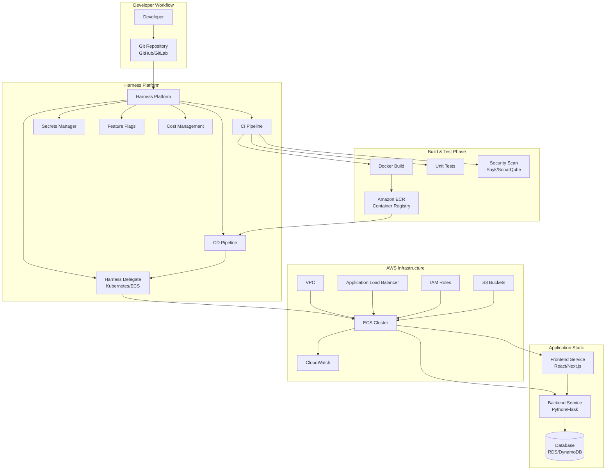
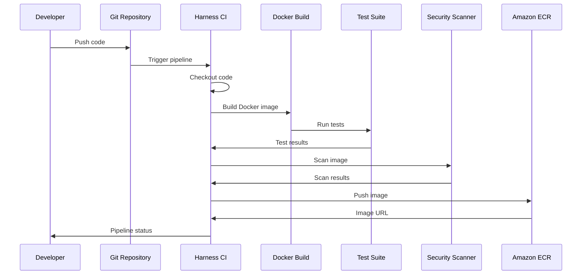
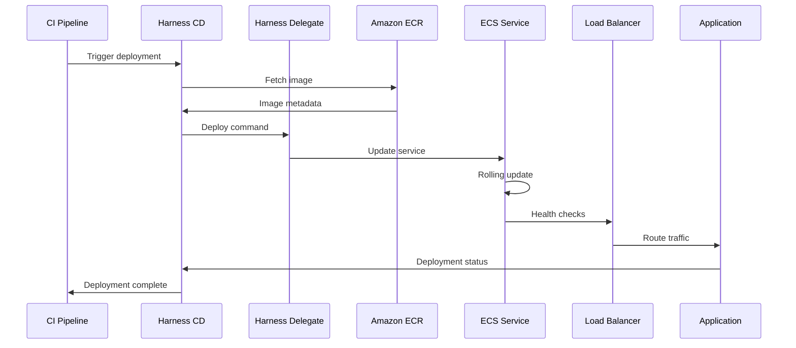

# Harness DevOps Workshop Architecture

## Overview

This document describes the complete architecture of the Harness DevOps workshop, including the application components, infrastructure, CI/CD pipelines, and integration points.

## Architecture Diagram



## Component Details

### 1. Source Control Layer

**GitHub/GitLab Repository**
- Stores application source code
- Manages infrastructure as code (Terraform)
- Contains Harness pipeline definitions
- Triggers CI/CD pipelines on commits

**Repository Structure:**
```
├── backend/          # Python Flask application
├── frontend/         # React/Next.js application
├── infrastructure/   # Terraform modules
├── harness/          # Harness pipeline YAML
└── tests/            # Test suites
```

### 2. Harness Platform Layer

**Harness CI Pipeline**
- **Trigger**: Git push/PR events
- **Steps**:
  1. Checkout code
  2. Build Docker images
  3. Run unit tests
  4. Security scanning
  5. Publish artifacts to ECR
  6. Generate reports

**Harness CD Pipeline**
- **Trigger**: CI pipeline completion
- **Steps**:
  1. Fetch artifacts from ECR
  2. Deploy to staging environment
  3. Run integration tests
  4. Approval gate
  5. Deploy to production
  6. Post-deployment verification

**Harness Delegate**
- Runs on AWS ECS or Kubernetes
- Executes pipeline steps
- Connects to AWS services
- Manages deployments

**Harness Secrets Manager**
- Stores AWS credentials
- Manages API keys
- Encrypts sensitive data
- Integrates with AWS Secrets Manager

**Harness Feature Flags**
- Controls feature rollouts
- A/B testing capabilities
- Gradual feature enablement
- Runtime configuration

### 3. Build & Test Layer

**Docker Build**
- Multi-stage builds
- Optimized image sizes
- Security best practices
- Layer caching

**Testing Framework**
- Unit tests (pytest for Python, Jest for Node.js)
- Integration tests
- End-to-end tests
- Test coverage reporting

**Security Scanning**
- Container image scanning (Snyk, Trivy)
- Code quality (SonarQube)
- Dependency scanning
- SAST/DAST tools

### 4. AWS Infrastructure Layer

**VPC Configuration**
- Public and private subnets
- NAT Gateway for outbound access
- Security groups
- Route tables

**ECS Cluster**
- Fargate launch type (serverless)
- Auto-scaling configuration
- Service discovery
- Task definitions

**Application Load Balancer**
- HTTPS termination
- Health checks
- Target groups
- SSL/TLS certificates

**Amazon ECR**
- Private container registry
- Image versioning
- Lifecycle policies
- Cross-region replication

**CloudWatch**
- Log aggregation
- Metrics collection
- Alarms and notifications
- Dashboards

**IAM Roles**
- Task execution roles
- Task roles
- Service-linked roles
- Least privilege access

### 5. Application Layer

**Backend Service (Python/Flask)**
- RESTful API
- Health check endpoints
- Database connections
- Authentication/Authorization

**Frontend Service (React/Next.js)**
- Static site generation
- API integration
- Client-side routing
- Progressive Web App features

**Database**
- Amazon RDS (PostgreSQL) or DynamoDB
- Automated backups
- Multi-AZ deployment
- Encryption at rest

## Data Flow

### CI Pipeline Flow



### CD Pipeline Flow



## Security Architecture

### Security Layers

1. **Network Security**
   - VPC isolation
   - Security groups
   - Network ACLs
   - Private subnets for application

2. **Application Security**
   - HTTPS/TLS encryption
   - Secrets management
   - IAM role-based access
   - Container security scanning

3. **Pipeline Security**
   - Harness secrets encryption
   - Secure credential storage
   - Audit logging
   - Approval gates

4. **Infrastructure Security**
   - Encrypted storage
   - VPC endpoints
   - CloudTrail logging
   - Compliance checks

## Scalability Architecture

### Horizontal Scaling
- ECS Auto Scaling based on CPU/Memory
- ALB target group scaling
- Database read replicas
- CDN for static assets

### Vertical Scaling
- Task definition resource limits
- Database instance sizing
- Container resource allocation

## High Availability

### Multi-AZ Deployment
- ECS services across multiple AZs
- RDS Multi-AZ configuration
- ALB across multiple AZs
- ECR cross-region replication

### Disaster Recovery
- Automated backups
- Infrastructure as Code
- Pipeline-based recovery
- Data replication

## Cost Optimization

### Resource Optimization
- Fargate spot instances
- Reserved capacity
- Auto-scaling policies
- Lifecycle policies for ECR

### Monitoring
- Harness Cost Management
- AWS Cost Explorer
- CloudWatch billing alarms
- Resource tagging

## Deployment Strategies

### Blue/Green Deployment
- Zero-downtime deployments
- Instant rollback capability
- Traffic shifting
- Health verification

### Canary Deployment
- Gradual traffic shifting
- Risk mitigation
- Performance monitoring
- Automatic rollback

### Rolling Deployment
- Incremental updates
- Resource efficiency
- Controlled rollout
- Health checks

## Monitoring and Observability

### Metrics
- Application metrics (custom)
- Infrastructure metrics (CloudWatch)
- Pipeline metrics (Harness)
- Cost metrics

### Logging
- Application logs (CloudWatch Logs)
- Pipeline logs (Harness)
- Infrastructure logs (CloudTrail)
- Centralized log aggregation

### Tracing
- Distributed tracing
- Request correlation
- Performance analysis
- Error tracking

## Integration Points

### External Services
- GitHub/GitLab webhooks
- AWS services (ECS, ECR, S3, CloudWatch)
- Security scanners (Snyk, SonarQube)
- Notification services (Slack, Email)

### Internal Services
- Harness platform services
- Delegate communication
- Secrets management
- Feature flag service

## Best Practices

1. **Infrastructure as Code**
   - All infrastructure in Terraform
   - Version controlled
   - Modular design
   - Reusable components

2. **CI/CD Best Practices**
   - Automated testing
   - Security scanning
   - Approval gates
   - Rollback strategies

3. **Security Best Practices**
   - Least privilege access
   - Secrets encryption
   - Regular security scans
   - Compliance checks

4. **Monitoring Best Practices**
   - Comprehensive logging
   - Real-time alerts
   - Performance dashboards
   - Cost monitoring

## Next Steps

1. Review the [Workshop Guide](./docs/workshop/README.md)
2. Set up your [Harness Account](./docs/workshop/module-1-setup.md)
3. Deploy [Infrastructure](./docs/workshop/module-3-infrastructure.md)
4. Create [CI Pipeline](./docs/workshop/module-4-ci-pipeline.md)
5. Implement [CD Pipeline](./docs/workshop/module-5-cd-pipeline.md)

