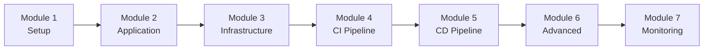

# Harness DevOps Workshop - Step by Step Guide

Welcome to the Harness DevOps Enterprise Workshop! This comprehensive guide will walk you through implementing a complete CI/CD solution using Harness.

## Workshop Structure

This workshop consists of 7 comprehensive modules, each building upon the previous one:

1. **[Module 1: Harness Platform Setup](./module-1-setup.md)** - Set up your Harness account and initial configuration
2. **[Module 2: Application Development](./module-2-application.md)** - Build a sample microservices application
3. **[Module 3: Infrastructure as Code](./module-3-infrastructure.md)** - Provision AWS infrastructure with Terraform
4. **[Module 4: Harness CI Pipeline](./module-4-ci-pipeline.md)** - Create and configure CI pipelines
5. **[Module 5: Harness CD Pipeline](./module-5-cd-pipeline.md)** - Implement CD pipelines with deployment strategies
6. **[Module 6: Advanced Features](./module-6-advanced.md)** - Explore advanced Harness capabilities
7. **[Module 7: Monitoring and Optimization](./module-7-monitoring.md)** - Set up monitoring and optimize performance

## Learning Path

## Prerequisites Checklist

Before starting, ensure you have:

- [ ] Harness Account created (free tier available)
- [ ] AWS Account with admin access
- [ ] GitHub/GitLab account
- [ ] AWS CLI installed and configured
- [ ] Terraform >= 1.5 installed
- [ ] Docker installed and running
- [ ] Python 3.11+ installed
- [ ] Node.js 18+ installed
- [ ] Git installed
- [ ] Code editor (VS Code recommended)

## Quick Links

- [Main Workshop README](../../README.md)
- [Architecture Documentation](../../architecture.md)
- [Code Examples](../../backend/README.md)
- [Infrastructure Guide](../../infrastructure/README.md)
- [Harness Pipelines](../../harness/README.md)

## Getting Help

If you encounter any issues:

1. Check the troubleshooting section in each module
2. Review the [Common Issues](#common-issues) section below
3. Consult [Harness Documentation](https://docs.harness.io/)
4. Check [AWS Documentation](https://docs.aws.amazon.com/)
5. Join [Harness Community](https://community.harness.io/)

## Common Issues

### Harness Account Setup
- Verify you have access to app.harness.io
- Check organization and project permissions
- Ensure delegate connectivity

### AWS Configuration
- Verify AWS credentials are configured correctly
- Check IAM permissions for required services
- Ensure region is set correctly

### Pipeline Execution
- Check delegate connectivity
- Verify connector configurations
- Review pipeline logs for errors

### Infrastructure Deployment
- Verify Terraform version compatibility
- Check AWS service quotas
- Review Terraform state files

## Workshop Timeline

| Module | Duration | Difficulty |
|--------|----------|------------|
| Module 1 | 60 min | Beginner |
| Module 2 | 90 min | Beginner |
| Module 3 | 90 min | Intermediate |
| Module 4 | 120 min | Intermediate |
| Module 5 | 120 min | Advanced |
| Module 6 | 90 min | Advanced |
| Module 7 | 60 min | Intermediate |

**Total Time**: ~8.5 hours

## Success Criteria

You'll know you've successfully completed the workshop when:

- ✅ All 7 modules are completed
- ✅ Application is deployed to AWS via Harness
- ✅ CI pipeline builds and tests successfully
- ✅ CD pipeline deploys to multiple environments
- ✅ Monitoring and alerting are configured
- ✅ You understand Harness core concepts

## Next Steps

Ready to begin? Start with **[Module 1: Harness Platform Setup](./module-1-setup.md)**! 🚀

