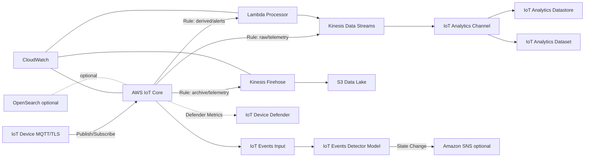
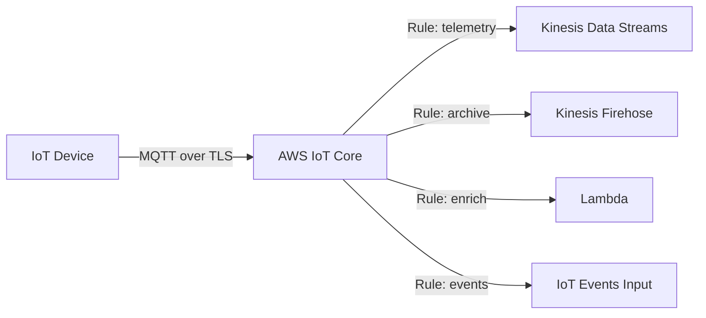
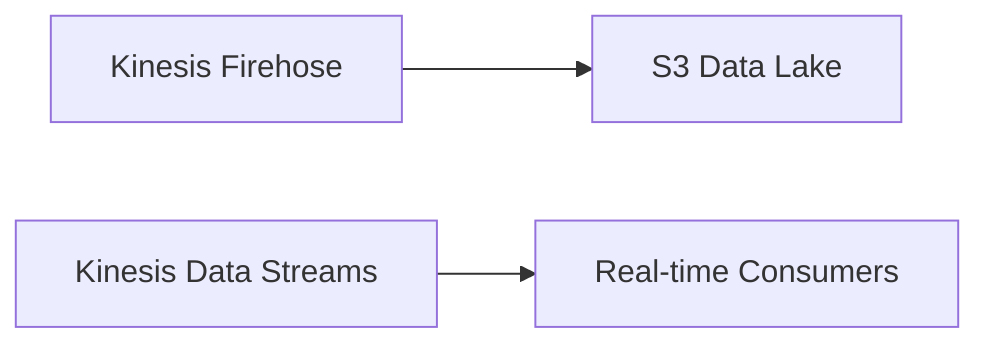
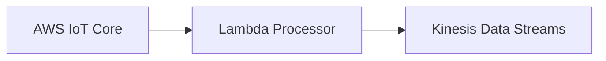
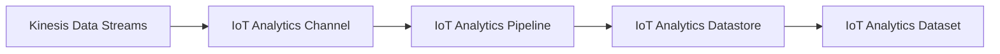
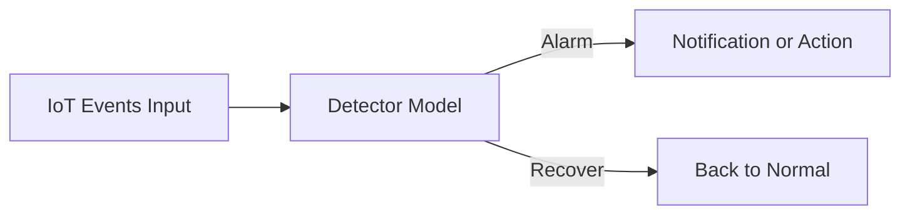
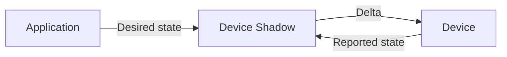
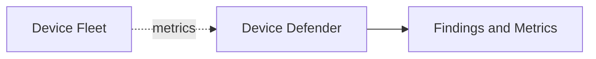
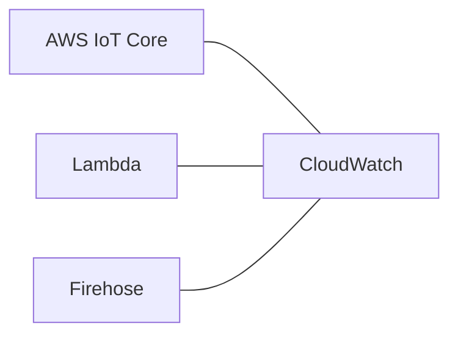

## Architecture Overview

This workshop provisions a realistic, production-lean IoT platform on AWS using Terraform. It focuses on a secure ingestion path, durable storage, streaming analytics, eventing, and fleet posture monitoring.

### High-level flow

### Key components

- IoT Core: thing types, fleet provisioning template, IoT policy, device shadows, topic rules (to Kinesis, Firehose, Lambda, IoT Events, optional OpenSearch).
- Data Lake: S3 bucket via Firehose for immutable raw telemetry.
- Streaming: Kinesis Data Streams for real-time processing and IoT Analytics ingest.
- Lambda: stateless transformation and enrichment.
- IoT Analytics: channel, pipeline, datastore, dataset for SQL-based time-series analytics.
- IoT Events: input and detector model for threshold/stateful alarms.
- Device Defender: security profiles and audit configuration for fleet posture.
- Observability: CloudWatch dashboards, logs, and metrics.

## Detailed views

### 1) Ingestion via AWS IoT Core

- Devices authenticate with X.509 certificates and publish to `devices/{thingName}/telemetry`.
- IoT Rules route the same payload to multiple downstream services.

### 2) Storage and streaming backbone

- Firehose writes compressed objects to S3 with date-based partitioning.
- Kinesis provides low-latency streaming for processors and analytics ingestion.

### 3) Processing and enrichment

- Lambda enriches or transforms telemetry and forwards to Kinesis for downstream analytics.

### 4) IoT Analytics

- Use SQL over the IoT Analytics datastore to build datasets for reporting and ML features.

### 5) IoT Events (thresholds and state machines)

- Detector models evaluate telemetry and trigger actions (e.g., SNS, Lambda) on state transitions.

### 6) Device shadows

- Shadows synchronize desired and reported state between devices and applications.

### 7) Security and fleet posture (Device Defender)

- Security profiles define expected device behaviors. Deviations produce findings for investigation.

### 8) Observability

- Dashboards track ingestion, processing errors, and delivery success.

### Security model

- Device authentication with X.509 certificates bound to IoT policy (least privilege).
- TLS 1.2 mutual auth for MQTT.
- IAM roles for service integrations (rules engine, Firehose, Kinesis, Lambda).
- Per-service logs and alarms; optional audit checks via Device Defender.

### Data model and topics

Topic hierarchy (suggested):

- `devices/{thingName}/telemetry`
- `devices/{thingName}/shadow/update`
- `alerts/{thingType}/{severity}`

Update the Terraform variables to match your topic strategy.

