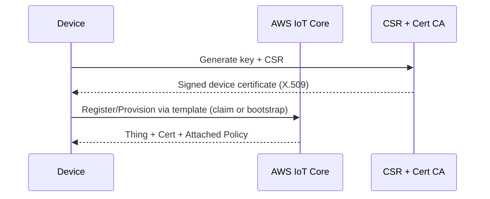

## Workshop: AWS IoT End-to-End

This workshop guides you through provisioning, connecting, ingesting, analyzing, and responding to IoT device data on AWS using Terraform. Complete the sections in order.

Prereqs:

- Terraform >= 1.5, AWS CLI v2, jq
- A dedicated AWS account with admin access

### 1) Deploy infrastructure

```bash
cd infrastructure/terraform
cp terraform.tfvars.example terraform.tfvars
# edit terraform.tfvars (project_name, region, and optional flags)
terraform init
terraform apply -auto-approve
```

Outputs include:

- IoT endpoint, IoT policy name, S3 bucket for raw data, Kinesis stream name, Lambda ARN, IoT Analytics resources, IoT Events detector name.

### 2) Provision a device (fleet provisioning template)

The stack creates a Fleet Provisioning template for Just-In-Time provisioning.

Simplified flow:



You can simulate with a bootstrap/claim cert, or skip to manual registration if preferred.

### 3) Connect and publish telemetry (simulate)

Update the variables and use the sample publish script:

```bash
aws iot describe-endpoint --endpoint-type iot:Data-ATS

# Example using mosquitto_pub (requires device certs)
mosquitto_pub -h <iot_endpoint> -p 8883 \
  --cafile AmazonRootCA1.pem \
  --cert deviceCert.pem.crt \
  --key privateKey.pem.key \
  -t "devices/myThing/telemetry" \
  -m '{"ts": 1731715200, "tempC": 28.5, "humidity": 42, "status":"ok"}'
```

### 4) Inspect data flow

- Kinesis Data Streams receives raw telemetry (Rule 1).
- Firehose archives to S3 data lake (Rule 2).
- Lambda processor can enrich or route to alerts stream (Rule 3).

Check:

- CloudWatch Logs for Lambda
- S3 bucket for objects under `/year=.../month=.../day=.../`
- Kinesis metrics for incoming records

### 5) IoT Analytics (channel, pipeline, datastore, dataset)

The Terraform stack wires `IoT Analytics` to ingest from Kinesis.

- Query datasets from the console or CLI:

```bash
aws iotanalytics list-datasets
aws iotanalytics get-dataset-content --dataset-name <name>
```

### 6) IoT Events (input + detector model)

Device messages are mirrored to IoT Events input. The detector model evaluates conditions (e.g., temperature threshold).

Try sending an over-threshold message and observe detector state transitions and the optional SNS notification.

### 7) Device Shadows

Publish to shadow update topics to observe desired/reported state sync:

```bash
mosquitto_pub -h <iot_endpoint> -p 8883 \
  --cafile AmazonRootCA1.pem \
  --cert deviceCert.pem.crt \
  --key privateKey.pem.key \
  -t "\$aws/things/myThing/shadow/update" \
  -m '{"state": {"desired": {"fan": "on"}}}'
```

### 8) Device Defender posture

The stack enables a sample security profile monitoring behaviors (e.g., message rates). Review Defender metrics and findings in the console.

### 9) Observability

CloudWatch dashboards include:

- Ingestion metrics (IoT Core, Kinesis, Firehose)
- Lambda errors and duration
- S3 delivery metrics

### 10) Cleanup

```bash
cd infrastructure/terraform
terraform destroy -auto-approve
```

### Troubleshooting

- Ensure device certs are valid and policy allows required topics.
- Verify IoT endpoint is `Data-ATS`.
- Check CloudWatch Logs for Lambda and Firehose delivery errors.


