# Legal Compliance AI Platform - Architecture

## 🏗️ System Architecture

### Overview
A comprehensive legal compliance platform providing LLM-based support for Western and European law questions with multi-LLM integration and simple UI.

### High-Level Architecture

```mermaid
graph TB
    subgraph "Frontend Layer"
        UI[🖥️ React/Next.js Frontend]
        UI --> |"Question UI"| QUI[📝 Question Interface]
        UI --> |"Results View"| RUI[📊 Response Display]
        UI --> |"History"| HUI[📚 Question History]
    end
    
    subgraph "Backend API Layer"
        API[⚡ FastAPI Backend]
        API --> |"Multi-LLM"| MLO[🤖 LLM Orchestration]
        API --> |"Legal Context"| LCT[⚖️ Legal Context Engine]
        API --> |"Caching"| CCH[💾 Response Caching]
        API --> |"Rate Limiting"| RTL[🛡️ Rate Limiting]
    end
    
    subgraph "LLM Services Layer"
        GPT[🧠 OpenAI GPT-4]
        CLA[🎭 Claude 3.5 Sonnet]
        GEM[💎 Google Gemini Pro]
    end
    
    subgraph "Data Layer"
        PG[🐘 PostgreSQL Database]
        RED[🔴 Redis Cache]
        S3[☁️ S3 Storage]
    end
    
    UI <-->|"HTTP/HTTPS"| API
    API <-->|"API Calls"| GPT
    API <-->|"API Calls"| CLA
    API <-->|"API Calls"| GEM
    API <-->|"Data Storage"| PG
    API <-->|"Cache Operations"| RED
    API <-->|"File Storage"| S3
    
    classDef frontend fill:#e1f5fe,stroke:#01579b,stroke-width:2px
    classDef backend fill:#f3e5f5,stroke:#4a148c,stroke-width:2px
    classDef llm fill:#fff3e0,stroke:#e65100,stroke-width:2px
    classDef data fill:#e8f5e8,stroke:#1b5e20,stroke-width:2px
    
    class UI,QUI,RUI,HUI frontend
    class API,MLO,LCT,CCH,RTL backend
    class GPT,CLA,GEM llm
    class PG,RED,S3 data
```

### Component Details

#### 1. Frontend (React/Next.js)
- **Simple Question Interface**: Clean, intuitive UI for legal questions
- **Multi-LLM Response Display**: Side-by-side comparison of responses
- **Question History**: Track and manage previous queries
- **Responsive Design**: Mobile-friendly interface

#### 2. Backend API (FastAPI)
- **Multi-LLM Orchestration**: Integrate top 3 LLMs (OpenAI, Claude, Gemini)
- **Legal Context Enhancement**: Add legal-specific prompts and context
- **Response Aggregation**: Combine and rank responses
- **Caching Layer**: Redis for response caching
- **Rate Limiting**: Protect against abuse

#### 3. LLM Services Integration
- **OpenAI GPT-4**: Primary legal analysis
- **Anthropic Claude 3.5**: Alternative perspective
- **Google Gemini Pro**: Third opinion and validation
- **Response Ranking**: AI-powered response quality assessment

#### 4. Data Layer
- **PostgreSQL**: Question history, user data, legal knowledge base
- **Redis**: Response caching, session management
- **S3**: Document storage, legal resources

### Legal Domain Focus

#### Western Law Coverage
- **Common Law Systems**: US, UK, Canada, Australia
- **Civil Law Systems**: France, Germany, Italy, Spain
- **Constitutional Law**: Fundamental rights and principles
- **Commercial Law**: Business regulations and compliance

#### European Law Coverage
- **EU Regulations**: GDPR, MiFID, PSD2, etc.
- **National Implementation**: Country-specific adaptations
- **Court of Justice**: ECJ precedents and rulings
- **Directive Compliance**: Implementation requirements

### Security & Compliance

#### Data Protection
- **GDPR Compliance**: EU data protection requirements
- **Attorney-Client Privilege**: Secure handling of legal queries
- **Encryption**: End-to-end data protection
- **Audit Logging**: Comprehensive activity tracking

#### Access Control
- **Authentication**: JWT-based user authentication
- **Authorization**: Role-based access control
- **Rate Limiting**: API protection
- **IP Whitelisting**: Optional enterprise features

### Deployment Architecture

```mermaid
graph TB
    subgraph "AWS Cloud Infrastructure"
        subgraph "Internet Gateway"
            CF[🌐 CloudFront CDN]
        end
        
        subgraph "Public Subnets"
            ALB[⚖️ Application Load Balancer]
            NAT[🔀 NAT Gateway]
        end
        
        subgraph "Private Subnets"
            subgraph "ECS Fargate Cluster"
                FE[🖥️ Frontend Container]
                BE[⚡ Backend Container]
            end
            
            subgraph "Database Layer"
                RDS[🐘 RDS PostgreSQL]
                REDIS[🔴 ElastiCache Redis]
            end
        end
        
        subgraph "Storage Layer"
            S3[☁️ S3 Buckets]
            ECR[📦 ECR Registry]
        end
        
        subgraph "Monitoring & Security"
            CW[📊 CloudWatch]
            XR[🔍 X-Ray Tracing]
            SNS[📢 SNS Alerts]
            SM[🔐 Secrets Manager]
        end
    end
    
    CF -->|"HTTPS"| ALB
    ALB -->|"Load Balance"| FE
    ALB -->|"Load Balance"| BE
    BE -->|"Database Queries"| RDS
    BE -->|"Cache Operations"| REDIS
    BE -->|"File Storage"| S3
    FE -->|"API Calls"| BE
    
    ECR -->|"Container Images"| FE
    ECR -->|"Container Images"| BE
    
    CW -->|"Monitor"| FE
    CW -->|"Monitor"| BE
    CW -->|"Monitor"| RDS
    CW -->|"Monitor"| REDIS
    
    XR -->|"Trace"| BE
    SNS -->|"Alerts"| CW
    SM -->|"API Keys"| BE
    
    classDef frontend fill:#e3f2fd,stroke:#0277bd,stroke-width:2px
    classDef backend fill:#f3e5f5,stroke:#7b1fa2,stroke-width:2px
    classDef database fill:#e8f5e8,stroke:#388e3c,stroke-width:2px
    classDef storage fill:#fff3e0,stroke:#f57c00,stroke-width:2px
    classDef monitoring fill:#fce4ec,stroke:#c2185b,stroke-width:2px
    classDef network fill:#f1f8e9,stroke:#689f38,stroke-width:2px
    
    class FE frontend
    class BE backend
    class RDS,REDIS database
    class S3,ECR storage
    class CW,XR,SNS,SM monitoring
    class CF,ALB,NAT network
```

#### Infrastructure (Terraform)
- **AWS ECS/Fargate**: Containerized application deployment
- **Application Load Balancer**: Traffic distribution
- **RDS PostgreSQL**: Managed database
- **ElastiCache Redis**: Managed caching
- **S3 Buckets**: Document and asset storage
- **CloudFront**: CDN for global performance

#### Monitoring & Observability
- **CloudWatch**: Application and infrastructure monitoring
- **X-Ray**: Distributed tracing
- **SNS/SQS**: Alert and notification system
- **Log Aggregation**: Centralized logging

### Performance Targets

#### Response Times
- **LLM Response**: < 10 seconds per model
- **Cached Response**: < 100ms
- **UI Load Time**: < 2 seconds
- **Database Queries**: < 50ms

#### Scalability
- **Concurrent Users**: 1000+ simultaneous users
- **Questions per Day**: 10,000+ queries
- **Response Caching**: 80% cache hit rate
- **Auto-scaling**: Based on CPU and memory usage

### Data Flow Architecture

```mermaid
sequenceDiagram
    participant U as 👤 User
    participant F as 🖥️ Frontend
    participant B as ⚡ Backend API
    participant C as 💾 Cache
    participant D as 🐘 Database
    participant O as 🧠 OpenAI
    participant A as 🎭 Anthropic
    participant G as 💎 Google
    
    U->>F: Submit Legal Question
    F->>B: POST /api/v1/ask
    B->>C: Check Cache
    alt Cache Hit
        C-->>B: Return Cached Response
    else Cache Miss
        B->>D: Store Question
        B->>O: Request Analysis
        B->>A: Request Analysis
        B->>G: Request Analysis
        O-->>B: GPT-4 Response
        A-->>B: Claude Response
        G-->>B: Gemini Response
        B->>B: Compare & Rank Responses
        B->>C: Cache Results
        B->>D: Store Responses
    end
    B-->>F: Return Analysis Results
    F-->>U: Display Multi-LLM Responses
    
    Note over U,G: Complete Legal Analysis Flow
```

### Development Workflow

```mermaid
graph LR
    subgraph "Development Environment"
        DEV[👨‍💻 Developer]
        IDE[💻 IDE/Editor]
        DC[🐳 Docker Compose]
        DB[🗄️ Local Database]
    end
    
    subgraph "CI/CD Pipeline"
        GH[📝 GitHub]
        GA[⚙️ GitHub Actions]
        TEST[🧪 Test Suite]
        BUILD[🔨 Docker Build]
        TF[🏗️ Terraform Plan]
    end
    
    subgraph "Deployment Environments"
        STAGE[🧪 Staging]
        PROD[🚀 Production]
    end
    
    DEV -->|"Code Changes"| IDE
    IDE -->|"Commit & Push"| GH
    GH -->|"Trigger"| GA
    GA -->|"Run Tests"| TEST
    GA -->|"Build Images"| BUILD
    GA -->|"Validate Infra"| TF
    GA -->|"Deploy"| STAGE
    STAGE -->|"Promote"| PROD
    
    DC -->|"Local Dev"| DB
    
    classDef dev fill:#e8f5e8,stroke:#2e7d32,stroke-width:2px
    classDef cicd fill:#fff3e0,stroke:#f57c00,stroke-width:2px
    classDef deploy fill:#e3f2fd,stroke:#1976d2,stroke-width:2px
    
    class DEV,IDE,DC,DB dev
    class GH,GA,TEST,BUILD,TF cicd
    class STAGE,PROD deploy
```

#### Local Development
- **Docker Compose**: Local environment setup
- **Hot Reloading**: Frontend and backend development
- **Database Migrations**: Version-controlled schema changes
- **Testing**: Unit, integration, and e2e tests

#### CI/CD Pipeline
- **GitHub Actions**: Automated testing and deployment
- **Docker Builds**: Container image creation
- **Terraform Plans**: Infrastructure validation
- **Staging Environment**: Pre-production testing

### Cost Optimization

#### Resource Management
- **Spot Instances**: Cost-effective compute
- **Reserved Capacity**: Database and cache optimization
- **S3 Lifecycle**: Automated storage tiering
- **CloudFront**: Reduced bandwidth costs

#### LLM Cost Management
- **Response Caching**: Reduce redundant API calls
- **Prompt Optimization**: Efficient token usage
- **Model Selection**: Cost-performance balance
- **Usage Monitoring**: Track and optimize spending
