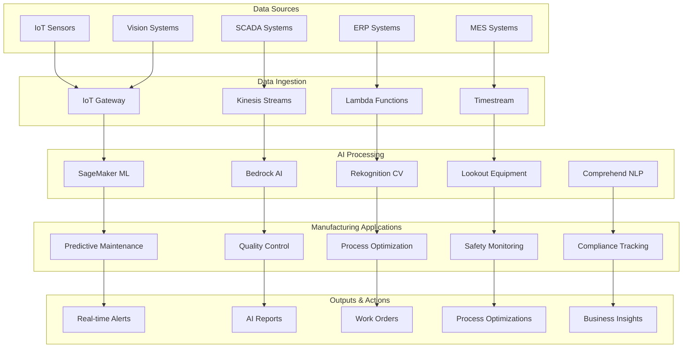
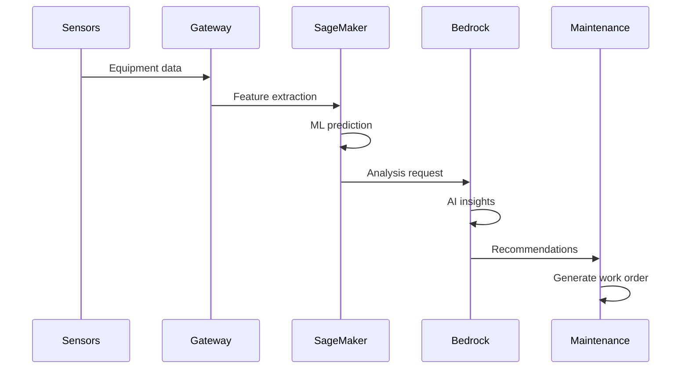

# 🏭 Manufacturing AI Solutions

> **Comprehensive AI-powered manufacturing optimization for Industry 4.0 transformation**

## 🎯 Solution Overview

Advanced AI platform for manufacturing companies leveraging AWS GenAI services to optimize production processes, predict equipment failures, ensure quality control, and drive operational excellence through intelligent automation and data-driven decision making.

## 🏗️ Architecture Overview



## 🔧 Core AI Solutions

### 1. 🔧 Predictive Maintenance AI

**Objective**: Prevent equipment failures and optimize maintenance schedules through AI-powered predictions

#### Features
- **Failure Prediction**: ML models to predict equipment failures before they occur
- **Maintenance Optimization**: Intelligent scheduling of maintenance activities
- **Root Cause Analysis**: AI-powered analysis of failure patterns and causes
- **Spare Parts Optimization**: Predictive inventory management for critical components
- **Maintenance Documentation**: Automated generation of maintenance reports and procedures

#### Architecture


#### Implementation
```python
import boto3
import json
import numpy as np
from typing import Dict, List, Any
from datetime import datetime, timedelta

class PredictiveMaintenanceAI:
    def __init__(self):
        self.sagemaker = boto3.client('sagemaker-runtime')
        self.bedrock = boto3.client('bedrock-runtime')
        self.timestream = boto3.client('timestream-write')
        self.lookout = boto3.client('lookoutforecast')
        
    def analyze_equipment_health(self, equipment_id: str, 
                               sensor_data: Dict[str, Any]) -> Dict[str, Any]:
        """Comprehensive equipment health analysis"""
        
        # Extract features from sensor data
        features = self.extract_maintenance_features(sensor_data)
        
        # Get ML model predictions
        ml_predictions = self.get_maintenance_predictions(equipment_id, features)
        
        # Generate AI insights
        ai_insights = self.generate_maintenance_insights(
            equipment_id, features, ml_predictions
        )
        
        # Create maintenance recommendations
        recommendations = self.create_maintenance_recommendations(
            equipment_id, ml_predictions, ai_insights
        )
        
        return {
            'equipment_id': equipment_id,
            'health_score': ml_predictions['health_score'],
            'failure_probability': ml_predictions['failure_probability'],
            'predicted_failure_time': ml_predictions['predicted_failure_time'],
            'critical_components': ml_predictions['critical_components'],
            'insights': ai_insights,
            'recommendations': recommendations,
            'maintenance_urgency': self.calculate_maintenance_urgency(ml_predictions)
        }
    
    def generate_maintenance_insights(self, equipment_id: str, 
                                    features: Dict[str, Any], 
                                    predictions: Dict[str, Any]) -> Dict[str, Any]:
        """Generate AI-powered maintenance insights"""
        
        prompt = f"""
        Analyze this manufacturing equipment data and provide maintenance insights:
        
        Equipment: {equipment_id}
        Health Score: {predictions['health_score']}
        Failure Probability: {predictions['failure_probability']}
        
        Sensor Data:
        - Temperature: {features.get('temperature', 'N/A')}°C
        - Vibration: {features.get('vibration', 'N/A')} mm/s
        - Pressure: {features.get('pressure', 'N/A')} bar
        - Speed: {features.get('speed', 'N/A')} RPM
        - Power Consumption: {features.get('power', 'N/A')} kW
        
        Provide:
        1. Key performance indicators and trends
        2. Potential failure modes and causes
        3. Maintenance priority recommendations
        4. Operational optimization suggestions
        5. Risk assessment and mitigation strategies
        
        Format as structured JSON.
        """
        
        response = self.bedrock.invoke_model(
            modelId='anthropic.claude-3-5-sonnet-20241022-v2:0',
            body=json.dumps({
                'anthropic_version': 'bedrock-2023-05-31',
                'max_tokens': 1500,
                'messages': [{'role': 'user', 'content': prompt}]
            })
        )
        
        result = json.loads(response['body'].read())
        return json.loads(result['content'][0]['text'])
    
    def create_maintenance_work_order(self, equipment_id: str, 
                                    maintenance_type: str, 
                                    urgency: str) -> Dict[str, Any]:
        """Generate AI-powered maintenance work orders"""
        
        # Get equipment specifications
        equipment_specs = self.get_equipment_specifications(equipment_id)
        
        # Generate maintenance procedures
        procedures = self.generate_maintenance_procedures(
            equipment_id, maintenance_type, equipment_specs
        )
        
        # Create safety guidelines
        safety_guidelines = self.generate_safety_guidelines(
            equipment_id, maintenance_type, equipment_specs
        )
        
        # Estimate time and resources
        resource_estimation = self.estimate_maintenance_resources(
            maintenance_type, equipment_specs
        )
        
        return {
            'work_order_id': f"WO_{equipment_id}_{datetime.now().strftime('%Y%m%d_%H%M%S')}",
            'equipment_id': equipment_id,
            'maintenance_type': maintenance_type,
            'urgency': urgency,
            'procedures': procedures,
            'safety_guidelines': safety_guidelines,
            'estimated_duration': resource_estimation['duration'],
            'required_tools': resource_estimation['tools'],
            'required_parts': resource_estimation['parts'],
            'assigned_technician': self.assign_technician(equipment_id, maintenance_type),
            'created_at': datetime.utcnow().isoformat()
        }
```

### 2. 🔍 AI-Powered Quality Control

**Objective**: Automated quality inspection and defect detection using computer vision and ML

#### Features
- **Visual Inspection**: Computer vision for automated quality checks
- **Defect Detection**: AI-powered identification of product defects
- **Quality Prediction**: ML models to predict quality issues
- **Process Optimization**: Real-time adjustments to improve quality
- **Quality Documentation**: Automated quality reports and certificates

#### Implementation
```python
class QualityControlAI:
    def __init__(self):
        self.rekognition = boto3.client('rekognition')
        self.sagemaker = boto3.client('sagemaker-runtime')
        self.bedrock = boto3.client('bedrock-runtime')
        self.textract = boto3.client('textract')
        
    def inspect_product_quality(self, product_image: bytes, 
                              product_specs: Dict[str, Any]) -> Dict[str, Any]:
        """Comprehensive product quality inspection"""
        
        # Visual inspection using computer vision
        visual_inspection = self.perform_visual_inspection(product_image, product_specs)
        
        # Defect detection
        defect_analysis = self.detect_defects(product_image, product_specs)
        
        # Dimensional analysis
        dimensional_analysis = self.analyze_dimensions(product_image, product_specs)
        
        # Surface quality assessment
        surface_quality = self.assess_surface_quality(product_image, product_specs)
        
        # Generate quality report
        quality_report = self.generate_quality_report(
            visual_inspection, defect_analysis, dimensional_analysis, surface_quality
        )
        
        return {
            'product_id': product_specs.get('product_id'),
            'inspection_timestamp': datetime.utcnow().isoformat(),
            'overall_quality_score': self.calculate_quality_score(
                visual_inspection, defect_analysis, dimensional_analysis, surface_quality
            ),
            'visual_inspection': visual_inspection,
            'defect_analysis': defect_analysis,
            'dimensional_analysis': dimensional_analysis,
            'surface_quality': surface_quality,
            'quality_report': quality_report,
            'pass_fail_status': self.determine_pass_fail_status(quality_report),
            'recommendations': self.generate_quality_recommendations(quality_report)
        }
    
    def detect_defects(self, product_image: bytes, 
                      product_specs: Dict[str, Any]) -> Dict[str, Any]:
        """AI-powered defect detection"""
        
        # Use Rekognition for general object detection
        rekognition_response = self.rekognition.detect_labels(
            Image={'Bytes': product_image},
            MaxLabels=20,
            MinConfidence=70
        )
        
        # Use custom SageMaker model for specific defect detection
        defect_predictions = self.get_defect_predictions(product_image, product_specs)
        
        # Analyze defect patterns
        defect_patterns = self.analyze_defect_patterns(defect_predictions)
        
        # Generate defect insights
        defect_insights = self.generate_defect_insights(
            defect_predictions, defect_patterns, product_specs
        )
        
        return {
            'defects_detected': defect_predictions['defects'],
            'defect_count': len(defect_predictions['defects']),
            'defect_severity': defect_predictions['severity'],
            'defect_locations': defect_predictions['locations'],
            'defect_patterns': defect_patterns,
            'insights': defect_insights,
            'quality_impact': self.assess_quality_impact(defect_predictions)
        }
```

### 3. 📊 Process Optimization AI

**Objective**: Optimize manufacturing processes through AI-driven analysis and recommendations

#### Features
- **Process Analysis**: Deep analysis of manufacturing processes and bottlenecks
- **Optimization Recommendations**: AI-powered suggestions for process improvements
- **Resource Allocation**: Intelligent optimization of resources and scheduling
- **Energy Efficiency**: AI-driven energy consumption optimization
- **Waste Reduction**: Minimize material waste and improve efficiency

#### Implementation
```python
class ProcessOptimizationAI:
    def __init__(self):
        self.sagemaker = boto3.client('sagemaker-runtime')
        self.bedrock = boto3.client('bedrock-runtime')
        self.lookout = boto3.client('lookoutforecast')
        
    def analyze_manufacturing_process(self, process_data: Dict[str, Any]) -> Dict[str, Any]:
        """Comprehensive manufacturing process analysis"""
        
        # Analyze process efficiency
        efficiency_analysis = self.analyze_process_efficiency(process_data)
        
        # Identify bottlenecks
        bottleneck_analysis = self.identify_bottlenecks(process_data)
        
        # Analyze resource utilization
        resource_analysis = self.analyze_resource_utilization(process_data)
        
        # Energy consumption analysis
        energy_analysis = self.analyze_energy_consumption(process_data)
        
        # Generate optimization recommendations
        optimization_recommendations = self.generate_optimization_recommendations(
            efficiency_analysis, bottleneck_analysis, resource_analysis, energy_analysis
        )
        
        return {
            'process_id': process_data.get('process_id'),
            'efficiency_score': efficiency_analysis['overall_efficiency'],
            'bottlenecks': bottleneck_analysis['identified_bottlenecks'],
            'resource_utilization': resource_analysis['utilization_rates'],
            'energy_consumption': energy_analysis['consumption_metrics'],
            'optimization_recommendations': optimization_recommendations,
            'potential_improvements': self.calculate_potential_improvements(optimization_recommendations),
            'implementation_priority': self.prioritize_implementations(optimization_recommendations)
        }
    
    def optimize_production_schedule(self, production_requirements: Dict[str, Any], 
                                   resource_constraints: Dict[str, Any]) -> Dict[str, Any]:
        """AI-powered production scheduling optimization"""
        
        # Analyze production requirements
        requirements_analysis = self.analyze_production_requirements(production_requirements)
        
        # Optimize resource allocation
        resource_optimization = self.optimize_resource_allocation(
            requirements_analysis, resource_constraints
        )
        
        # Generate optimal schedule
        optimal_schedule = self.generate_optimal_schedule(
            requirements_analysis, resource_optimization
        )
        
        # Calculate schedule efficiency
        schedule_efficiency = self.calculate_schedule_efficiency(optimal_schedule)
        
        return {
            'optimized_schedule': optimal_schedule,
            'schedule_efficiency': schedule_efficiency,
            'resource_allocation': resource_optimization,
            'production_timeline': self.calculate_production_timeline(optimal_schedule),
            'cost_optimization': self.calculate_cost_optimization(optimal_schedule),
            'risk_assessment': self.assess_schedule_risks(optimal_schedule)
        }
```

### 4. 🛡️ Safety & Compliance AI

**Objective**: Ensure workplace safety and regulatory compliance through AI monitoring

#### Features
- **Safety Monitoring**: Real-time safety hazard detection and alerting
- **Compliance Tracking**: Automated regulatory compliance monitoring
- **Incident Analysis**: AI-powered analysis of safety incidents
- **Training Recommendations**: Personalized safety training suggestions
- **Risk Assessment**: Comprehensive workplace risk evaluation

#### Implementation
```python
class SafetyComplianceAI:
    def __init__(self):
        self.rekognition = boto3.client('rekognition')
        self.comprehend = boto3.client('comprehend')
        self.bedrock = boto3.client('bedrock-runtime')
        
    def monitor_workplace_safety(self, camera_feeds: List[str], 
                               safety_rules: Dict[str, Any]) -> Dict[str, Any]:
        """Real-time workplace safety monitoring"""
        
        safety_violations = []
        safety_alerts = []
        
        for camera_feed in camera_feeds:
            # Analyze video feed for safety violations
            violations = self.detect_safety_violations(camera_feed, safety_rules)
            safety_violations.extend(violations)
            
            # Generate safety alerts
            alerts = self.generate_safety_alerts(violations, safety_rules)
            safety_alerts.extend(alerts)
        
        # Analyze safety patterns
        safety_patterns = self.analyze_safety_patterns(safety_violations)
        
        # Generate safety recommendations
        safety_recommendations = self.generate_safety_recommendations(
            safety_violations, safety_patterns
        )
        
        return {
            'monitoring_timestamp': datetime.utcnow().isoformat(),
            'safety_violations': safety_violations,
            'safety_alerts': safety_alerts,
            'safety_patterns': safety_patterns,
            'safety_score': self.calculate_safety_score(safety_violations),
            'recommendations': safety_recommendations,
            'compliance_status': self.check_compliance_status(safety_violations, safety_rules)
        }
```

### 5. 🔄 Supply Chain Optimization AI

**Objective**: Optimize supply chain operations through AI-driven demand forecasting and inventory management

#### Features
- **Demand Forecasting**: AI-powered demand prediction and planning
- **Inventory Optimization**: Intelligent inventory management and reorder points
- **Supplier Analytics**: Performance analysis and risk assessment
- **Logistics Optimization**: Route optimization and delivery scheduling
- **Risk Management**: Supply chain risk identification and mitigation

#### Implementation
```python
class SupplyChainOptimizationAI:
    def __init__(self):
        self.forecast = boto3.client('forecast')
        self.bedrock = boto3.client('bedrock-runtime')
        self.sagemaker = boto3.client('sagemaker-runtime')
        
    def forecast_demand(self, historical_data: Dict[str, Any], 
                       market_indicators: Dict[str, Any]) -> Dict[str, Any]:
        """AI-powered demand forecasting"""
        
        # Prepare forecasting dataset
        forecast_dataset = self.prepare_forecast_dataset(historical_data)
        
        # Generate demand forecast
        forecast_result = self.generate_demand_forecast(forecast_dataset, market_indicators)
        
        # Analyze forecast confidence
        confidence_analysis = self.analyze_forecast_confidence(forecast_result)
        
        # Generate demand insights
        demand_insights = self.generate_demand_insights(forecast_result, market_indicators)
        
        return {
            'forecast_period': forecast_result['period'],
            'predicted_demand': forecast_result['demand_values'],
            'confidence_interval': confidence_analysis['confidence_interval'],
            'forecast_accuracy': confidence_analysis['accuracy_score'],
            'demand_insights': demand_insights,
            'recommendations': self.generate_forecast_recommendations(forecast_result)
        }
    
    def optimize_inventory(self, current_inventory: Dict[str, Any], 
                          demand_forecast: Dict[str, Any]) -> Dict[str, Any]:
        """AI-powered inventory optimization"""
        
        # Analyze current inventory levels
        inventory_analysis = self.analyze_inventory_levels(current_inventory)
        
        # Calculate optimal reorder points
        reorder_points = self.calculate_optimal_reorder_points(
            inventory_analysis, demand_forecast
        )
        
        # Generate procurement recommendations
        procurement_recommendations = self.generate_procurement_recommendations(
            inventory_analysis, demand_forecast, reorder_points
        )
        
        return {
            'current_inventory': inventory_analysis,
            'optimal_reorder_points': reorder_points,
            'procurement_recommendations': procurement_recommendations,
            'inventory_optimization_score': self.calculate_optimization_score(
                inventory_analysis, reorder_points
            )
        }
```

## 📊 Business Impact & ROI

### Key Performance Indicators
- **Equipment Uptime**: 15-25% improvement through predictive maintenance
- **Quality Defect Rate**: 40-60% reduction in quality issues
- **Production Efficiency**: 20-35% improvement in overall equipment effectiveness
- **Energy Consumption**: 15-30% reduction in energy usage
- **Safety Incidents**: 50-70% reduction in workplace accidents
- **Supply Chain Efficiency**: 25-40% improvement in inventory turnover

### Cost Savings Analysis
```
AI-Enhanced Manufacturing Operations:

Predictive Maintenance:
- Traditional: 20-30% unplanned downtime
- AI-Powered: 5-10% unplanned downtime
- Savings: $500K-2M per year per production line

Quality Control:
- Manual Inspection: 5-10% defect rate
- AI Inspection: 1-2% defect rate
- Savings: $200K-1M per year in reduced rework

Process Optimization:
- Traditional: 70-80% efficiency
- AI-Optimized: 85-95% efficiency
- Savings: 20-30% increase in production capacity

Safety & Compliance:
- Traditional: 2-5 safety incidents per month
- AI-Monitored: 0.5-1 safety incidents per month
- Savings: $100K-500K per year in reduced incidents

Supply Chain Optimization:
- Traditional: 15-20% excess inventory
- AI-Optimized: 5-8% excess inventory
- Savings: $300K-1M per year in inventory costs
```

## 🚀 Implementation Guide

### Prerequisites
```bash
# Required AWS services
- Amazon SageMaker (ML models)
- Amazon Bedrock (AI insights)
- Amazon Rekognition (Computer vision)
- Amazon Lookout for Equipment (Anomaly detection)
- Amazon Timestream (Time series data)
- Amazon IoT Core (Device connectivity)
- Amazon Kinesis (Real-time data streaming)
- Amazon Forecast (Demand forecasting)
```

### Quick Start Deployment
```bash
# 1. Setup environment
git clone <repository-url>
cd genAI-labs/manufacturing
pip install -r requirements.txt

# 2. Configure AWS IoT
aws iot create-thing-group --thing-group-name "ManufacturingEquipment"

# 3. Deploy infrastructure
cdk deploy --all

# 4. Setup data pipeline
python scripts/setup-data-pipeline.py

# 5. Start AI monitoring
python scripts/start-ai-monitoring.py
```

### Configuration
```yaml
# config/manufacturing-config.yaml
predictive_maintenance:
  models:
    failure_prediction: "sagemaker-manufacturing-models"
    health_scoring: "custom-health-model"
  prediction_horizon: 30  # days
  confidence_threshold: 0.8

quality_control:
  inspection_models:
    defect_detection: "custom-defect-model"
    dimensional_analysis: "dimensional-model"
  quality_thresholds:
    defect_tolerance: 0.02
    dimensional_tolerance: 0.001

process_optimization:
  optimization_models:
    efficiency: "efficiency-optimization"
    scheduling: "production-scheduling"
  optimization_frequency: "hourly"

safety_monitoring:
  camera_feeds: ["production-floor", "warehouse", "loading-dock"]
  safety_rules: "osha-compliance-rules"
  alert_threshold: 0.8

supply_chain:
  forecast_models:
    demand_forecasting: "demand-forecast-model"
    inventory_optimization: "inventory-model"
  forecast_horizon: 90  # days
```

## 🔒 Security & Compliance

### Industrial Security
- **Network Segmentation**: Isolated networks for critical systems
- **Data Encryption**: End-to-end encryption for all data transmission
- **Access Control**: Role-based access with multi-factor authentication
- **Audit Logging**: Comprehensive activity tracking and compliance reporting

### Compliance Implementation
```python
class ManufacturingCompliance:
    def __init__(self):
        self.compliance_rules = {
            'ISO_9001': self.load_iso_9001_rules(),
            'ISO_14001': self.load_iso_14001_rules(),
            'OSHA': self.load_osha_rules(),
            'FDA': self.load_fda_rules(),
            'IATF_16949': self.load_iatf_16949_rules()
        }
    
    def check_compliance(self, process_data: Dict[str, Any], 
                        standard: str) -> Dict[str, Any]:
        """Check manufacturing process compliance"""
        
        rules = self.compliance_rules.get(standard, {})
        compliance_results = {}
        
        for rule_id, rule in rules.items():
            compliance_results[rule_id] = {
                'rule_name': rule['name'],
                'compliant': self.evaluate_rule(rule, process_data),
                'evidence': self.collect_evidence(rule, process_data),
                'recommendations': self.get_recommendations(rule, process_data)
            }
        
        overall_compliance = all(
            result['compliant'] for result in compliance_results.values()
        )
        
        return {
            'standard': standard,
            'overall_compliance': overall_compliance,
            'compliance_score': self.calculate_compliance_score(compliance_results),
            'rule_results': compliance_results,
            'non_compliant_rules': [
                rule_id for rule_id, result in compliance_results.items()
                if not result['compliant']
            ]
        }
```

## 📈 Performance Optimization

### Real-time Processing
```python
class ManufacturingPerformanceOptimizer:
    def __init__(self):
        self.kinesis = boto3.client('kinesis')
        self.lambda_client = boto3.client('lambda')
    
    def optimize_real_time_processing(self, data_stream: str) -> Dict[str, Any]:
        """Optimize real-time data processing for manufacturing"""
        
        # Configure Kinesis for high-throughput data
        kinesis_config = {
            'ShardCount': 10,
            'RetentionPeriodHours': 24,
            'StreamModeDetails': {
                'StreamMode': 'ON_DEMAND'
            }
        }
        
        # Optimize Lambda functions for manufacturing workloads
        lambda_optimization = {
            'MemorySize': 3008,  # Maximum memory for better performance
            'Timeout': 900,      # 15 minutes for complex processing
            'ReservedConcurrency': 100,
            'Environment': {
                'Variables': {
                    'MANUFACTURING_MODE': 'HIGH_PERFORMANCE',
                    'BATCH_SIZE': '1000',
                    'PROCESSING_TIMEOUT': '300'
                }
            }
        }
        
        return {
            'kinesis_config': kinesis_config,
            'lambda_optimization': lambda_optimization,
            'expected_throughput': '10000 records/second',
            'latency_target': '< 100ms'
        }
```

### Performance Targets
- **Data Processing**: < 100ms for real-time analysis
- **Model Inference**: < 50ms for prediction requests
- **Alert Generation**: < 5 seconds for critical alerts
- **Report Generation**: < 30 seconds for comprehensive reports
- **Quality Inspection**: < 2 seconds per product
- **Maintenance Prediction**: < 1 second per equipment

## 🧪 Testing & Validation

### Manufacturing Test Framework
```python
class ManufacturingTestFramework:
    def __init__(self):
        self.test_scenarios = self.load_test_scenarios()
    
    def test_predictive_maintenance_accuracy(self) -> Dict[str, Any]:
        """Test predictive maintenance model accuracy"""
        
        test_data = self.load_historical_maintenance_data()
        predictions = []
        actual_outcomes = []
        
        for equipment_record in test_data:
            prediction = self.predict_equipment_failure(equipment_record)
            predictions.append(prediction)
            actual_outcomes.append(equipment_record['actual_failure'])
        
        # Calculate accuracy metrics
        accuracy_metrics = self.calculate_accuracy_metrics(predictions, actual_outcomes)
        
        return {
            'test_name': 'Predictive Maintenance Accuracy',
            'total_samples': len(test_data),
            'accuracy': accuracy_metrics['accuracy'],
            'precision': accuracy_metrics['precision'],
            'recall': accuracy_metrics['recall'],
            'f1_score': accuracy_metrics['f1_score'],
            'false_positive_rate': accuracy_metrics['false_positive_rate'],
            'test_passed': accuracy_metrics['accuracy'] > 0.85
        }
    
    def test_quality_control_performance(self) -> Dict[str, Any]:
        """Test quality control system performance"""
        
        test_images = self.load_quality_test_images()
        defect_detection_results = []
        
        for image in test_images:
            result = self.inspect_product_quality(image['data'], image['specs'])
            defect_detection_results.append({
                'expected_defects': image['expected_defects'],
                'detected_defects': result['defect_analysis']['defect_count'],
                'accuracy': self.calculate_detection_accuracy(
                    image['expected_defects'], 
                    result['defect_analysis']['defect_count']
                )
            })
        
        overall_accuracy = np.mean([r['accuracy'] for r in defect_detection_results])
        
        return {
            'test_name': 'Quality Control Performance',
            'total_images': len(test_images),
            'overall_accuracy': overall_accuracy,
            'detection_results': defect_detection_results,
            'test_passed': overall_accuracy > 0.90
        }
```

## 📚 Documentation

### API Reference
- **[Maintenance API](./docs/maintenance-api.md)** - Predictive maintenance endpoints
- **[Quality API](./docs/quality-api.md)** - Quality control endpoints
- **[Process API](./docs/process-api.md)** - Process optimization endpoints
- **[Safety API](./docs/safety-api.md)** - Safety monitoring endpoints
- **[Supply Chain API](./docs/supply-chain-api.md)** - Supply chain optimization endpoints

### Implementation Guides
- **[Predictive Maintenance Setup](./docs/predictive-maintenance-setup.md)** - Complete maintenance AI implementation
- **[Quality Control Configuration](./docs/quality-control-config.md)** - AI-powered quality inspection
- **[Process Optimization](./docs/process-optimization.md)** - Manufacturing process optimization
- **[Safety Monitoring](./docs/safety-monitoring.md)** - Workplace safety AI implementation
- **[Supply Chain AI](./docs/supply-chain-ai.md)** - Supply chain optimization implementation

## 🏭 Industry Use Cases

### Automotive Manufacturing
- **Predictive Maintenance**: Prevent production line downtime
- **Quality Control**: Automated inspection of automotive parts
- **Process Optimization**: Optimize assembly line efficiency
- **Safety Monitoring**: Ensure worker safety in hazardous environments

### Pharmaceutical Manufacturing
- **Quality Assurance**: Ensure drug quality and compliance
- **Process Validation**: Validate manufacturing processes
- **Regulatory Compliance**: Maintain FDA and other regulatory compliance
- **Supply Chain**: Optimize raw material and finished goods inventory

### Food & Beverage Manufacturing
- **Quality Control**: Automated food safety inspection
- **Process Optimization**: Optimize production efficiency
- **Traceability**: Track products through the supply chain
- **Compliance**: Maintain food safety regulations

### Electronics Manufacturing
- **Defect Detection**: Identify electronic component defects
- **Process Control**: Maintain precise manufacturing tolerances
- **Quality Assurance**: Ensure product reliability
- **Supply Chain**: Optimize component inventory management

## 🔗 Quick Links

- **[Setup Guide](./docs/setup.md)** - Complete deployment instructions
- **[Maintenance AI](./docs/maintenance-ai.md)** - Predictive maintenance implementation
- **[Quality AI](./docs/quality-ai.md)** - Automated quality control
- **[Case Studies](./docs/case-studies.md)** - Real-world manufacturing AI implementations
- **[Best Practices](./docs/best-practices.md)** - Manufacturing AI best practices
- **[Troubleshooting](./docs/troubleshooting.md)** - Common issues and solutions

---

**Ready to transform your manufacturing operations with AI? Start with predictive maintenance and scale to full Industry 4.0! 🚀**

## 🎯 Next Steps

1. **Choose Your Starting Point**: Begin with predictive maintenance or quality control
2. **Deploy Infrastructure**: Set up AWS services and data pipelines
3. **Implement AI Models**: Deploy and train your first AI models
4. **Scale Across Operations**: Expand AI to all manufacturing processes
5. **Measure and Optimize**: Track ROI and continuously improve

---

**Transform your manufacturing operations with AI and achieve Industry 4.0 excellence! 💪**