# Manufacturing AI Solution - Architecture

## Overview

The Manufacturing AI Solution is a comprehensive Industry 4.0 platform that leverages AWS GenAI services to optimize production processes, predict equipment failures, ensure quality control, and drive operational excellence. The architecture is designed to handle high-volume IoT data, provide real-time insights, and integrate with existing manufacturing systems.

## Quick Reference: Build Process

**Want to build this step-by-step?** Follow these phases in order:

| Phase | Focus | Key Services | Time Estimate |
|-------|-------|--------------|---------------|
| **Phase 1** | Foundation | IoT Core, Timestream, S3, API Gateway | 2-3 days |
| **Phase 2** | Predictive Maintenance | Lookout Equipment, SageMaker, Bedrock | 3-4 days |
| **Phase 3** | Quality Control | Rekognition, SageMaker, Kinesis | 2-3 days |
| **Phase 4** | Process Optimization | SageMaker, Bedrock, EventBridge | 2-3 days |
| **Phase 5** | Safety & Compliance | Rekognition, Comprehend, CloudWatch | 2-3 days |
| **Phase 6** | Supply Chain | Forecast, SageMaker, Bedrock | 2-3 days |
| **Phase 7** | Analytics & Monitoring | QuickSight, Athena, CloudWatch | 2-3 days |

**Total Build Time**: ~3-4 weeks for complete system

**Quick Start**: Build Phases 1-2 for a minimal viable product (MVP) with IoT data ingestion and predictive maintenance in 5-7 days.

👉 **Jump to**: [Step-by-Step Architecture Build](#phase-1-foundation---iot-infrastructure)

## Architecture Principles

### 1. Industrial IoT Integration
- **Device Connectivity**: AWS IoT Core for sensor and equipment connectivity
- **Time-Series Data**: Timestream for high-volume sensor data
- **Real-Time Processing**: Kinesis for streaming data processing
- **Edge Computing**: Lambda@Edge for low-latency processing

### 2. Real-Time Processing
- **Sub-100ms Analysis**: Real-time equipment health monitoring
- **Streaming Architecture**: Kinesis for high-throughput data streams
- **Low Latency**: Optimized for critical manufacturing operations
- **High Availability**: Multi-AZ deployment with failover

### 3. AI-Powered Insights
- **Predictive Analytics**: ML models for failure prediction
- **Computer Vision**: Automated quality inspection
- **Natural Language**: Document analysis and compliance
- **Generative AI**: Automated report generation

### 4. Operational Excellence
- **Uptime Optimization**: Minimize unplanned downtime
- **Quality Assurance**: Automated quality control
- **Safety Compliance**: Real-time safety monitoring
- **Cost Optimization**: Energy and resource efficiency

## System Architecture

### High-Level Overview

The architecture follows an Industry 4.0 approach with IoT integration and real-time AI processing:

```
┌─────────────────────────────────────────────────────────┐
│         Manufacturing Equipment & Sensors                 │
│    (IoT Devices, Cameras, SCADA, MES, ERP)              │
└────────────────────┬────────────────────────────────────┘
                     │
┌────────────────────▼────────────────────────────────────┐
│         IoT Core & Data Ingestion                        │
│    (IoT Core, Kinesis, Timestream)                      │
└────────────────────┬────────────────────────────────────┘
                     │
┌────────────────────▼────────────────────────────────────┐
│         AI Processing Layer                              │
│    (SageMaker, Bedrock, Rekognition, Lookout)          │
└─────┬──────────┬──────────┬──────────┬───────────────────┘
      │          │          │          │
┌─────▼──┐  ┌───▼───┐  ┌───▼───┐  ┌───▼────┐
│Bedrock │  │SageMaker│ │Rekognition│ │Lookout│
│ (GenAI)│  │  (ML)   │ │  (CV)   │ │(Anomaly)│
└────────┘  └────────┘ └─────────┘ └─────────┘
      │          │          │          │
┌─────▼──────────▼──────────▼──────────▼──────────┐
│         Data Storage & Applications                │
│  (Timestream, S3, DynamoDB, Manufacturing Apps)  │
└──────────────────────────────────────────────────┘
```

## Step-by-Step Architecture Build

This section breaks down the architecture into manageable steps, building from foundation to complete system.

### Phase 1: Foundation - IoT Infrastructure

**Goal**: Set up IoT connectivity and data ingestion infrastructure

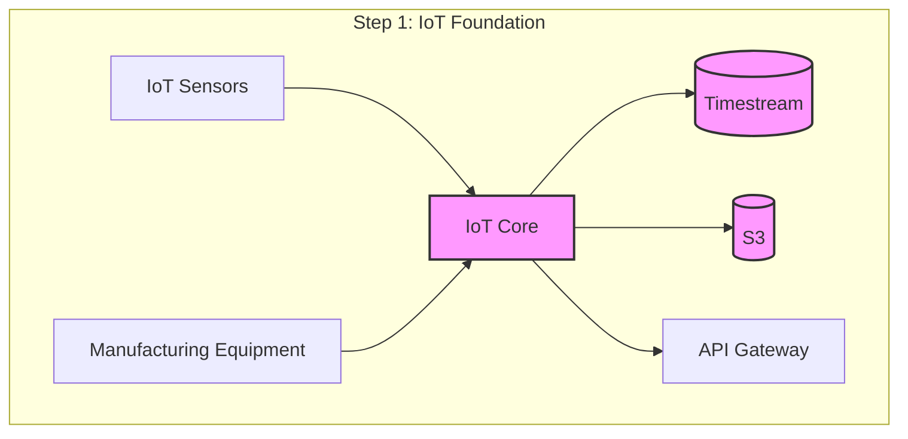

**Components to Deploy**:
1. AWS IoT Core for device connectivity
2. IoT thing groups and policies
3. Timestream database for time-series data
4. S3 buckets (data lake, images)
5. API Gateway for manufacturing APIs
6. Basic Lambda functions for data processing

**What This Enables**:
- IoT device connectivity
- Real-time sensor data ingestion
- Time-series data storage
- Foundation for all other features

---

### Phase 2: Predictive Maintenance

**Goal**: Add AI-powered equipment failure prediction

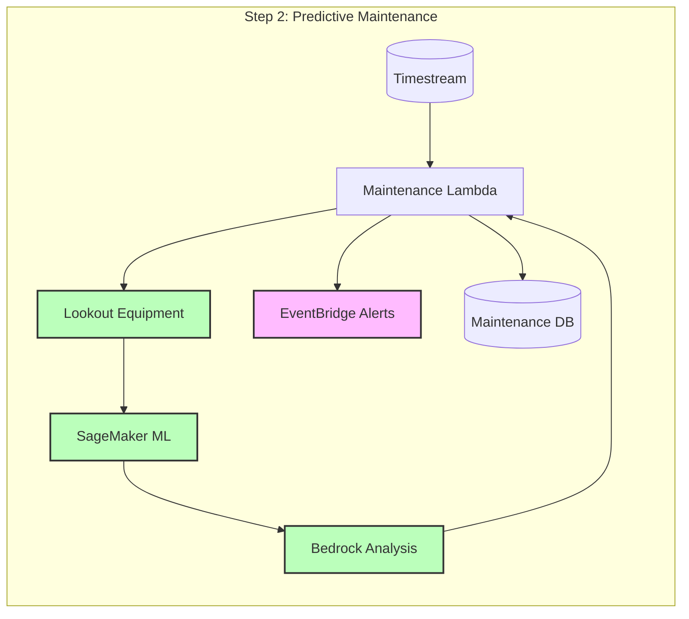

**Components to Add**:
1. Lookout for Equipment for anomaly detection
2. SageMaker endpoint for failure prediction
3. Maintenance Lambda function
4. EventBridge for maintenance alerts
5. Maintenance DynamoDB table

**What This Enables**:
- Real-time equipment health monitoring
- Failure prediction before breakdowns
- Automated maintenance scheduling
- Reduced unplanned downtime

---

### Phase 3: Quality Control

**Goal**: Add AI-powered visual inspection and defect detection

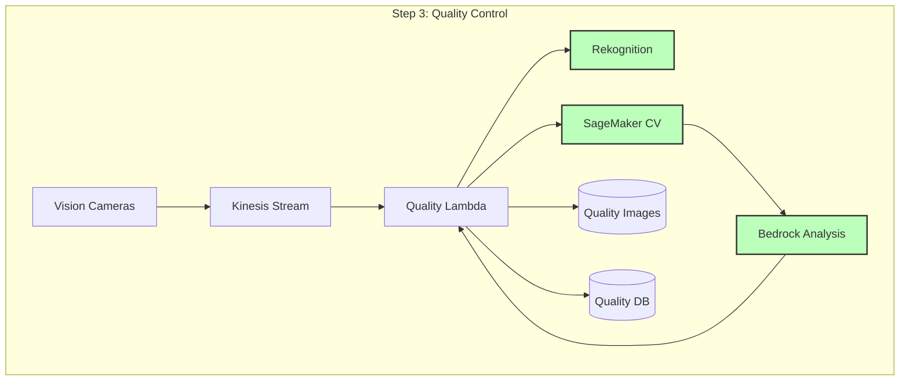

**Components to Add**:
1. Kinesis stream for image data
2. Rekognition for general object detection
3. SageMaker custom vision model
4. Quality control Lambda function
5. Quality reports DynamoDB table

**What This Enables**:
- Automated visual inspection
- Real-time defect detection
- Quality scoring and reporting
- Process optimization recommendations

---

### Phase 4: Process Optimization

**Goal**: Add AI-powered manufacturing process optimization

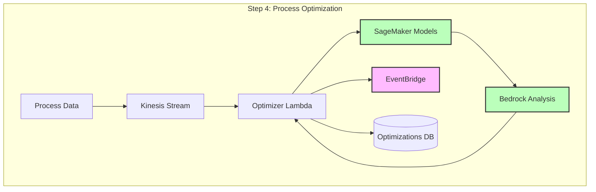

**Components to Add**:
1. Process optimization Lambda function
2. SageMaker optimization models
3. EventBridge for optimization triggers
4. Process optimization DynamoDB table

**What This Enables**:
- Real-time process analysis
- Bottleneck identification
- Optimization recommendations
- Energy efficiency improvements

---

### Phase 5: Safety & Compliance

**Goal**: Add real-time safety monitoring and compliance tracking

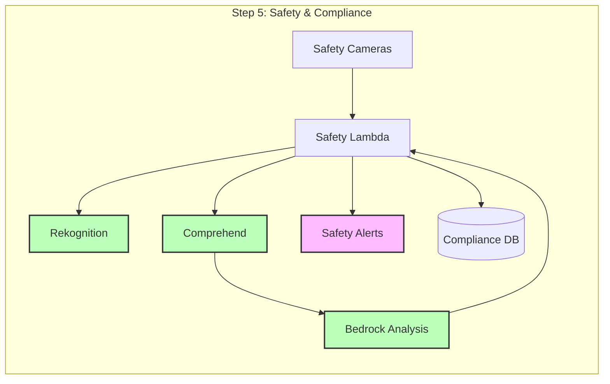

**Components to Add**:
1. Safety monitoring Lambda function
2. Rekognition for safety violation detection
3. Comprehend for document analysis
4. Compliance tracking DynamoDB table
5. EventBridge for safety alerts

**What This Enables**:
- Real-time safety monitoring
- Compliance tracking
- Automated incident reporting
- Safety recommendations

---

### Phase 6: Supply Chain Optimization

**Goal**: Add AI-powered demand forecasting and inventory optimization

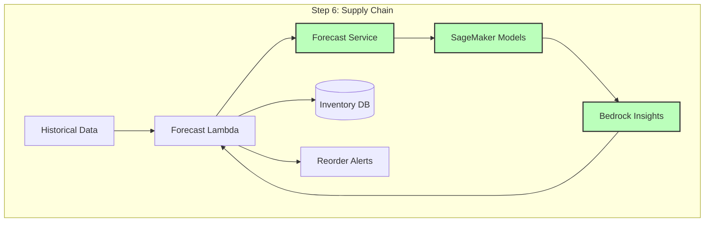

**Components to Add**:
1. Amazon Forecast service
2. Supply chain Lambda function
3. SageMaker demand models
4. Inventory DynamoDB table
5. EventBridge for reorder alerts

**What This Enables**:
- Demand forecasting
- Inventory optimization
- Automated reordering
- Supply chain risk analysis

---

### Phase 7: Analytics & Monitoring

**Goal**: Add business intelligence and observability

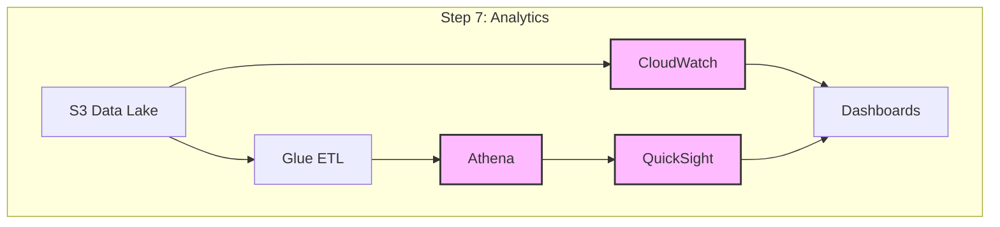

**Components to Add**:
1. Glue ETL jobs
2. Athena for querying
3. QuickSight dashboards
4. CloudWatch dashboards and alarms
5. Custom metrics and alerts

**What This Enables**:
- Business intelligence
- Performance monitoring
- OEE (Overall Equipment Effectiveness) tracking
- Cost analytics

---

### Complete Architecture (All Phases Combined)

**Final integrated system**:

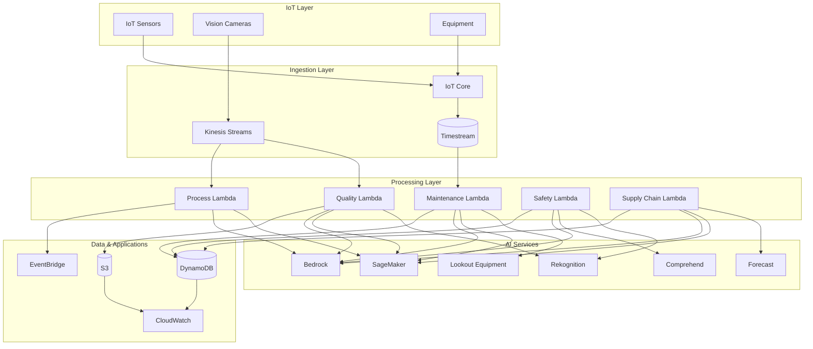

## Detailed Component Architecture

Each component is built incrementally. Here's how each one works:

### 1. Predictive Maintenance System

**Purpose**: Predict equipment failures and optimize maintenance schedules

**Step-by-Step Flow**:

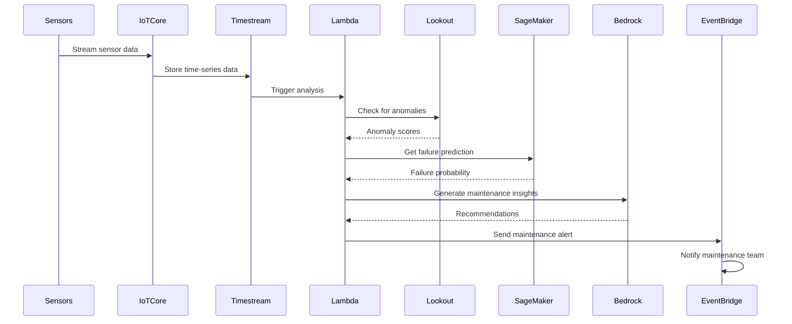

**Implementation Steps**:
1. Set up IoT Core for sensor connectivity
2. Create Timestream database
3. Configure Lookout for Equipment
4. Deploy SageMaker failure prediction model
5. Create maintenance Lambda function
6. Set up EventBridge alerts

**Key Services**:
- IoT Core: Device connectivity
- Timestream: Time-series data storage
- Lookout Equipment: Anomaly detection
- SageMaker: Failure prediction models
- Bedrock: Maintenance insights

---

### 2. Quality Control System

**Purpose**: Automated visual inspection and defect detection

**Step-by-Step Flow**:

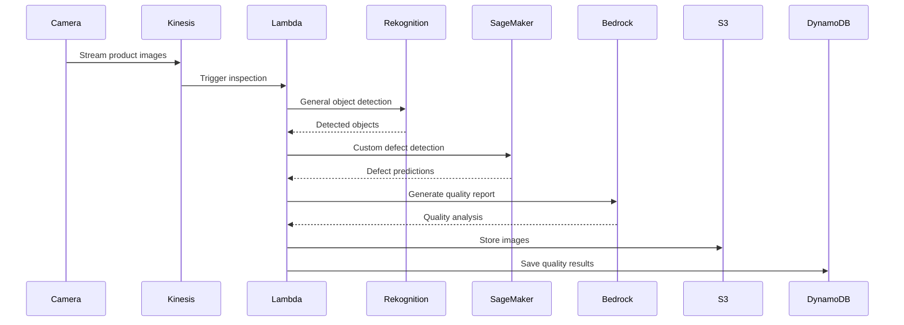

**Implementation Steps**:
1. Set up Kinesis stream for images
2. Configure Rekognition
3. Deploy custom SageMaker vision model
4. Create quality control Lambda
5. Set up S3 for image storage
6. Create quality reports database

**Key Services**:
- Kinesis: Image streaming
- Rekognition: General object detection
- SageMaker: Custom defect models
- Bedrock: Quality report generation
- S3: Image storage

---

### 3. Process Optimization System

**Purpose**: Optimize manufacturing processes and efficiency

**Step-by-Step Flow**:

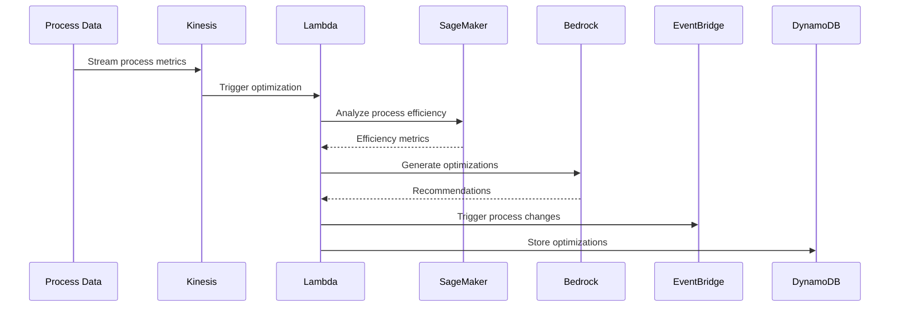

**Implementation Steps**:
1. Set up process data streaming
2. Deploy SageMaker optimization models
3. Create process optimizer Lambda
4. Configure EventBridge triggers
5. Set up optimization tracking

**Key Services**:
- Kinesis: Process data streaming
- SageMaker: Optimization models
- Bedrock: Optimization recommendations
- EventBridge: Process triggers

---

### 4. Safety & Compliance System

**Purpose**: Real-time safety monitoring and compliance tracking

**Step-by-Step Flow**:

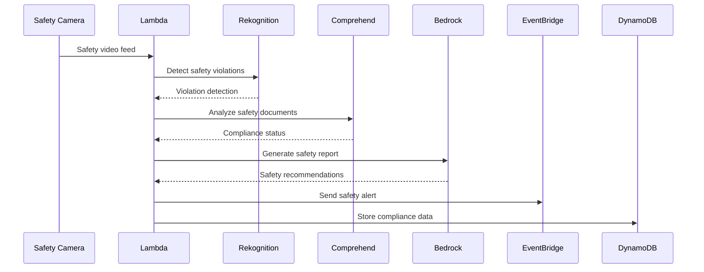

**Implementation Steps**:
1. Set up safety camera feeds
2. Configure Rekognition for safety detection
3. Set up Comprehend for document analysis
4. Create safety monitoring Lambda
5. Configure compliance tracking

**Key Services**:
- Rekognition: Safety violation detection
- Comprehend: Document analysis
- Bedrock: Safety recommendations
- EventBridge: Safety alerts

## Build Process Summary

### Recommended Build Order

1. **Phase 1: Foundation** (Week 1)
   - Set up IoT Core and device connectivity
   - Create Timestream database
   - Configure S3 data lake
   - Test data ingestion

2. **Phase 2: Predictive Maintenance** (Week 2)
   - Deploy Lookout for Equipment
   - Set up SageMaker models
   - Create maintenance Lambda
   - Test failure predictions

3. **Phase 3: Quality Control** (Week 3)
   - Set up Kinesis for images
   - Deploy Rekognition and SageMaker
   - Create quality Lambda
   - Test defect detection

4. **Phase 4: Process Optimization** (Week 4)
   - Deploy optimization models
   - Create process Lambda
   - Test optimization recommendations

5. **Phase 5: Safety & Compliance** (Week 5)
   - Set up safety monitoring
   - Configure compliance tracking
   - Test safety alerts

6. **Phase 6: Supply Chain** (Week 6)
   - Set up Forecast service
   - Deploy supply chain Lambda
   - Test demand forecasting

7. **Phase 7: Analytics** (Week 7)
   - Set up Glue ETL
   - Create QuickSight dashboards
   - Configure CloudWatch
   - Test analytics

### Quick Start (Minimal Viable Product)

For a quick start, focus on **Phases 1-2**:
- IoT data ingestion
- Basic predictive maintenance
- Equipment health monitoring

This gives you a working predictive maintenance system that can be expanded incrementally.

## Performance Targets

- **Data Ingestion**: 100,000+ sensor readings/second
- **Maintenance Prediction**: < 1 second per equipment
- **Quality Inspection**: < 2 seconds per product
- **Process Analysis**: < 5 seconds per process
- **Safety Detection**: < 1 second per camera feed
- **API Response**: < 200ms (p95)

## Conclusion

The Manufacturing AI Solution architecture is designed to provide a scalable, real-time platform for Industry 4.0 manufacturing operations. The architecture leverages AWS GenAI services to deliver intelligent maintenance, quality control, process optimization, and safety monitoring while maintaining high availability and operational excellence.

The modular design allows manufacturing companies to deploy components incrementally, starting with core IoT connectivity and predictive maintenance, and expanding to include advanced capabilities like quality control, process optimization, and supply chain intelligence.

