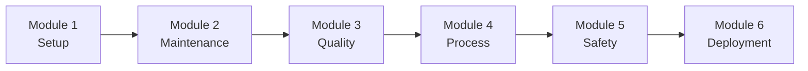

# Manufacturing AI Workshop

Welcome to the Manufacturing AI Workshop! This comprehensive workshop teaches you how to build Industry 4.0 solutions using AWS GenAI services including Amazon Bedrock, Amazon SageMaker, Amazon Rekognition, Amazon Lookout for Equipment, and AWS IoT Core.

## Workshop Overview

This workshop consists of 6 comprehensive modules, each building upon the previous one:

1. **[Module 1: Environment Setup](./module-1-setup.md)** - Set up IoT infrastructure and AWS services (60 min)
2. **[Module 2: Predictive Maintenance](./module-2-predictive-maintenance.md)** - Build equipment failure prediction system (120 min)
3. **[Module 3: Quality Control](./module-3-quality-control.md)** - Implement AI-powered visual inspection (90 min)
4. **[Module 4: Process Optimization](./module-4-process-optimization.md)** - Create manufacturing process optimization (90 min)
5. **[Module 5: Safety & Compliance](./module-5-safety-compliance.md)** - Build safety monitoring system (90 min)
6. **[Module 6: Production Deployment](./module-6-deployment.md)** - Deploy to production with monitoring (60 min)

## Learning Path



**Total Workshop Time**: ~9 hours

## Prerequisites Checklist

Before starting, ensure you have:

- [ ] AWS Account created with admin access
- [ ] AWS CLI installed and configured
- [ ] Python 3.11+ installed
- [ ] Node.js 18+ installed (optional)
- [ ] Git installed
- [ ] Code editor (VS Code recommended)
- [ ] Access to Amazon Bedrock with Claude models enabled
- [ ] Access to AWS IoT Core
- [ ] Basic understanding of Python and AWS services
- [ ] Familiarity with IoT concepts (helpful but not required)
- [ ] Understanding of manufacturing processes (helpful but not required)

## Workshop Objectives

By the end of this workshop, you will be able to:

1. **Set up IoT infrastructure** for manufacturing equipment
2. **Build predictive maintenance systems** using ML and GenAI
3. **Implement quality control** with computer vision
4. **Optimize manufacturing processes** with AI insights
5. **Monitor safety and compliance** in real-time
6. **Deploy production-ready** Industry 4.0 solutions

## Workshop Structure

Each module includes:

- **Learning Objectives**: What you'll learn
- **Prerequisites**: Required knowledge and setup
- **Hands-on Exercises**: Step-by-step implementation
- **Code Examples**: Working code samples
- **Best Practices**: Industry 4.0 best practices
- **Troubleshooting**: Common issues and solutions
- **Next Steps**: What to explore next

## Getting Started

### Quick Start

```bash
# Clone the repository
git clone <repository-url>
cd genAI-labs/manufacturing

# Set up environment
./scripts/setup-workshop.sh

# Start with Module 1
cd docs/workshop
open module-1-setup.md
```

### Workshop Resources

- **Code Examples**: `code/examples/`
- **Sample Data**: `data/sample/`
- **Configuration**: `config/`
- **Scripts**: `scripts/`

## Module Details

### Module 1: Environment Setup (60 min)

**Topics Covered**:
- AWS IoT Core setup and device registration
- Timestream database configuration
- Kinesis streams for data ingestion
- Development environment setup
- Sample sensor data loading
- Basic API testing

**Key Learnings**:
- How to configure AWS IoT for manufacturing
- Setting up time-series data storage
- Understanding the project structure

### Module 2: Predictive Maintenance (120 min)

**Topics Covered**:
- Lookout for Equipment configuration
- SageMaker model deployment
- Real-time sensor data processing
- Failure prediction algorithms
- Maintenance work order generation
- Alert system setup

**Key Learnings**:
- Building real-time maintenance systems
- Combining ML and GenAI for insights
- Performance optimization for low latency

### Module 3: Quality Control (90 min)

**Topics Covered**:
- Rekognition integration
- Custom vision model deployment
- Image streaming with Kinesis
- Defect detection algorithms
- Quality scoring and reporting
- Process feedback loops

**Key Learnings**:
- Implementing automated quality inspection
- Computer vision for manufacturing
- Real-time quality monitoring

### Module 4: Process Optimization (90 min)

**Topics Covered**:
- Process data analysis
- Bottleneck identification
- Optimization model deployment
- Energy efficiency analysis
- Resource allocation optimization
- Real-time process adjustments

**Key Learnings**:
- Optimizing manufacturing processes
- Using AI for efficiency improvements
- Real-time process monitoring

### Module 5: Safety & Compliance (90 min)

**Topics Covered**:
- Safety camera integration
- Rekognition for violation detection
- Compliance document analysis
- Real-time safety alerts
- Incident reporting automation
- Regulatory compliance tracking

**Key Learnings**:
- Building safety monitoring systems
- Ensuring regulatory compliance
- Automated incident management

### Module 6: Production Deployment (60 min)

**Topics Covered**:
- Infrastructure as Code with Terraform
- CI/CD pipeline setup
- Monitoring and alerting
- Performance optimization
- Security best practices
- Production readiness

**Key Learnings**:
- Deploying production-ready solutions
- Setting up observability
- Ensuring reliability and security

## Workshop Completion

### Final Project

After completing all modules, you'll have built:

- ✅ IoT data ingestion system
- ✅ Predictive maintenance platform
- ✅ Automated quality control system
- ✅ Process optimization engine
- ✅ Safety monitoring system
- ✅ Production-ready deployment

### Next Steps

1. **Customize for Your Use Case**: Adapt the solution for your specific manufacturing needs
2. **Explore Advanced Features**: Implement additional AI capabilities
3. **Scale the Solution**: Optimize for high-volume production
4. **Share Your Work**: Contribute back to the community

## Getting Help

### Resources

- **Documentation**: Check module-specific documentation
- **Code Examples**: Review working code samples
- **AWS Documentation**: Consult AWS service documentation
- **Community**: Join AWS community forums

### Common Issues

- **IoT Device Connection**: Ensure certificates and policies are configured correctly
- **Timestream Access**: Verify IAM permissions for Timestream
- **Lookout Training**: Ensure sufficient training data is available
- **Lambda Timeouts**: Increase timeout for complex processing
- **Image Processing**: Check Kinesis stream capacity

### Support Channels

- **GitHub Issues**: Report bugs and request features
- **AWS Support**: For AWS service-specific issues
- **Workshop Q&A**: Check workshop discussion forums

## Industry 4.0 Notes

⚠️ **Important**: This workshop focuses on Industry 4.0 transformation. Always:

- Ensure IoT device security
- Implement proper data governance
- Follow manufacturing safety standards
- Test in development environments first
- Review compliance requirements for your industry

## Workshop Completion Certificate

After completing all modules and the final project, you'll receive a completion certificate. Share your achievement on social media!

---

**Ready to start? Begin with [Module 1: Environment Setup](./module-1-setup.md)! 🚀**

