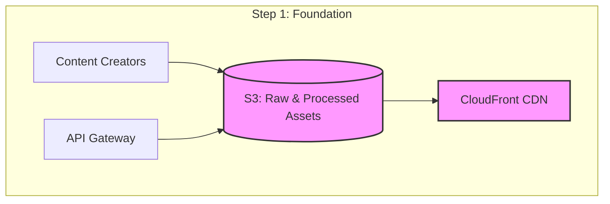
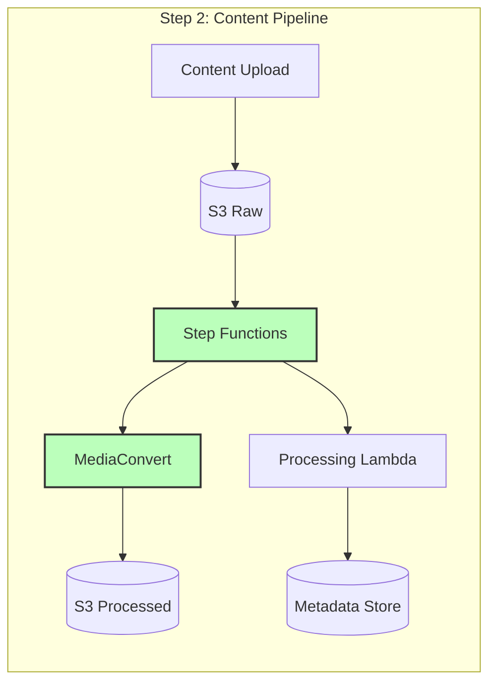
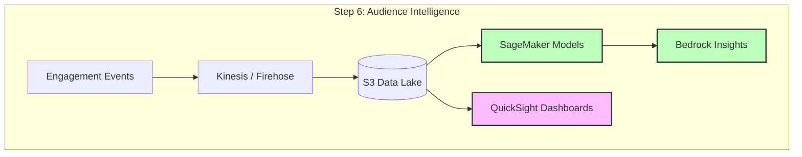
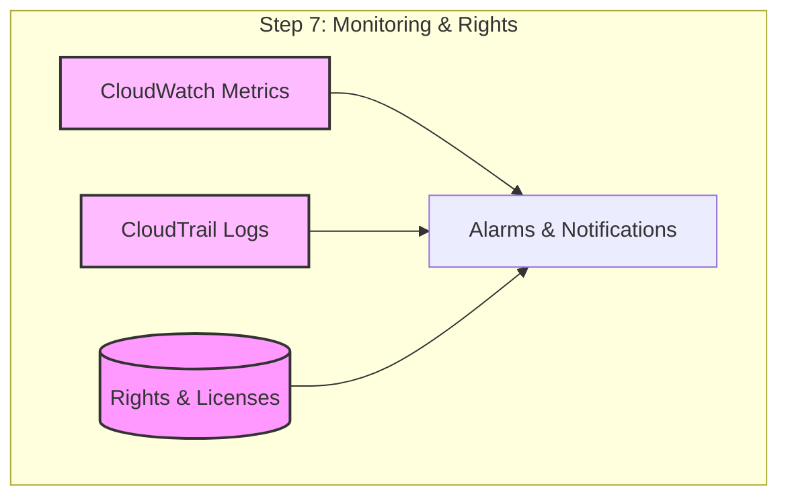
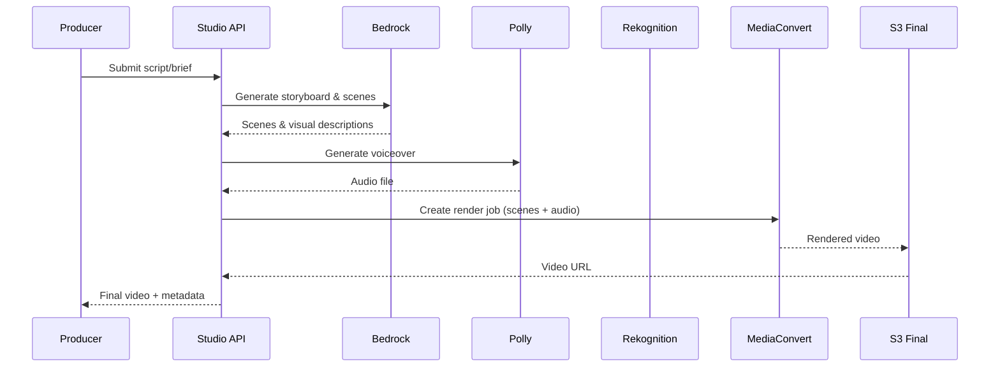
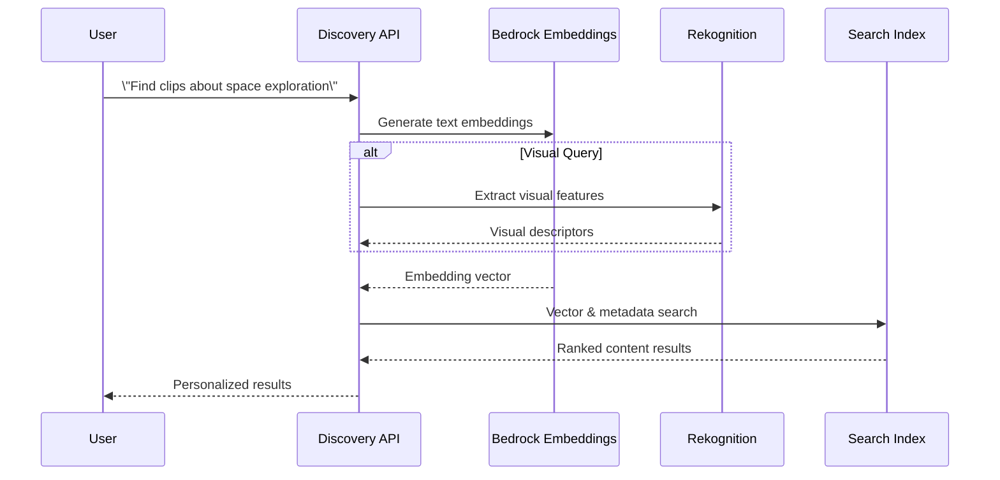
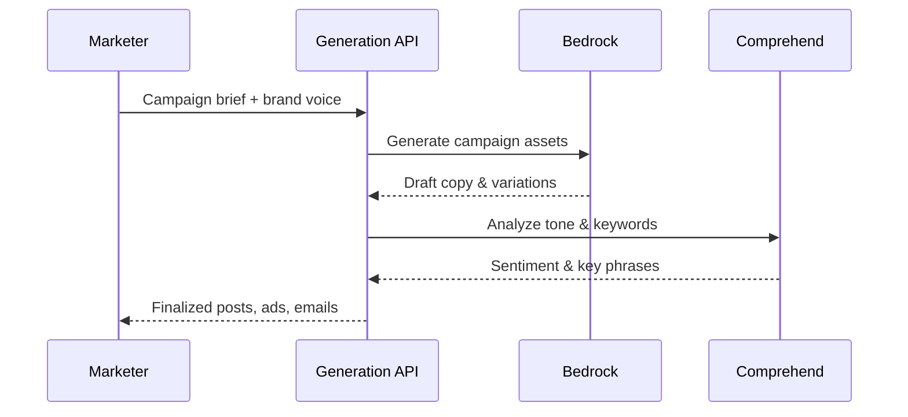
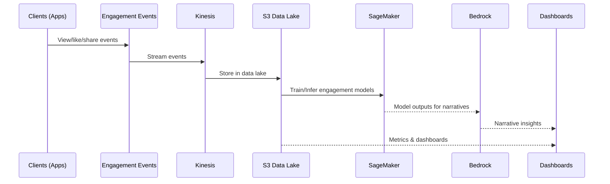

# Media & Entertainment AI Solution - Architecture

## Overview

The Media & Entertainment AI Solution is a comprehensive platform that leverages AWS GenAI services to power AI content creation, intelligent discovery, audience analytics, and personalized experiences. The architecture is designed for media-heavy workloads: high-throughput video/audio processing, low-latency search and recommendations, and multi-format content delivery at scale.

## Quick Reference: Build Process

**Want to build this step-by-step?** Follow these phases in order:

| Phase | Focus | Key Services | Time Estimate |
|-------|-------|--------------|---------------|
| **Phase 1** | Foundation | S3, CloudFront, API Gateway | 1-2 days |
| **Phase 2** | Content Ingestion & Processing | MediaConvert, Lambda, Step Functions | 2-3 days |
| **Phase 3** | AI Content Studio | Bedrock, Polly, Rekognition, Transcribe | 2-3 days |
| **Phase 4** | Content Discovery & Search | Bedrock, SageMaker, OpenSearch, Rekognition | 2-3 days |
| **Phase 5** | Automated Content Generation | Bedrock, Comprehend | 1-2 days |
| **Phase 6** | Audience Intelligence & Analytics | SageMaker, Bedrock, Comprehend, QuickSight | 2-3 days |
| **Phase 7** | Monitoring, Rights & Security | CloudWatch, CloudTrail, IAM, KMS | 1-2 days |

**Total Build Time**: ~3-4 weeks for complete system

**Quick Start**: Build Phases 1-3 for an MVP AI Content Studio in 5-7 days.

👉 **Jump to**: [Step-by-Step Architecture Build](#phase-1-foundation---content-storage--delivery)

## Architecture Principles

### 1. Media-first Design
- **Optimized for Large Files**: Efficient handling of large video/audio assets
- **Multi-Format Support**: Transcoding for web, mobile, OTT, social
- **Streaming & VOD**: Support for live and on-demand workflows
- **Edge Delivery**: Global distribution with CloudFront

### 2. Real-Time & Batch Processing
- **Real-Time**: Low-latency personalization and recommendations
- **Batch**: Overnight/batch processing for heavy analytics and re-encoding
- **Event-Driven**: Media processing triggered by uploads and workflows
- **Scalable Pipelines**: Step Functions orchestrating media jobs

### 3. AI-Driven Experiences
- **Content Understanding**: Rekognition, Transcribe, Comprehend
- **Generative AI**: Bedrock for scripts, summaries, and marketing content
- **ML Models**: SageMaker for recommendation and performance prediction
- **Feedback Loops**: Audience analytics feeding back into content strategies

### 4. Security & Rights Management
- **Content Rights**: Access control and DRM integration
- **Privacy**: PII detection and redaction in media
- **Compliance**: Support for regional content regulations
- **Auditability**: Full audit trails for content operations

## System Architecture

### High-Level Overview

The architecture follows a layered approach tailored for media workloads:

```
┌─────────────────────────────────────────────────────────┐
│                    Content Sources                        │
│   (Video, Audio, Text, Images, Feeds, Live Streams)       │
└────────────────────┬────────────────────────────────────┘
                     │
┌────────────────────▼────────────────────────────────────┐
│               Ingestion & Processing                     │
│   (S3, MediaConvert, Lambda, Step Functions, Kinesis)    │
└────────────────────┬────────────────────────────────────┘
                     │
┌────────────────────▼────────────────────────────────────┐
│                 AI Services Layer                        │
│ (Bedrock, SageMaker, Rekognition, Transcribe, Polly)     │
└──────────┬─────────┬───────────┬───────────┬────────────┘
           │         │           │           │
┌──────────▼────┐ ┌──▼────────┐ ┌▼─────────┐ ┌▼──────────┐
│ Content Studio│ │ Discovery │ │ Generation│ │ Audience │
│ (Video, Audio)│ │ & Search  │ │ & Campaign│ │ Analytics│
└───────────────┘ └───────────┘ └──────────┘ └──────────┘
           │                    │                    │
┌──────────▼────────────────────▼────────────────────▼────┐
│              Delivery & Experience Layer                 │
│  (APIs, Web/Mobile Apps, OTT, Social, CloudFront)       │
└─────────────────────────────────────────────────────────┘
```

## Step-by-Step Architecture Build

This section breaks down the architecture into manageable steps, building from foundation to complete system.

### Phase 1: Foundation - Content Storage & Delivery

**Goal**: Set up secure storage and global delivery for media assets



**Components to Deploy**:
1. S3 buckets for raw, processed, and generated content
2. CloudFront distribution for global delivery
3. API Gateway for content and AI APIs
4. Basic Lambda functions for simple content operations
5. KMS keys for content encryption

**What This Enables**:
- Centralized content storage
- Secure, global content delivery
- API access for content operations
- Foundation for AI processing

---

### Phase 2: Content Ingestion & Processing

**Goal**: Automate media ingestion and processing workflows



**Components to Add**:
1. MediaConvert job templates
2. Step Functions workflows for ingest → transcode → publish
3. Lambda processors for metadata extraction
4. Metadata store (DynamoDB / OpenSearch)

**What This Enables**:
- Automated transcoding and packaging
- Consistent media formats
- Rich metadata for search and recommendations

---

### Phase 3: AI Content Studio

**Goal**: Build AI-powered video/audio content creation and enhancement

```mermaid
graph LR
    subgraph "Step 3: AI Content Studio"
        Script[Script / Brief]
        StudioAPI[Content Studio API]
        Bedrock[Bedrock (Storyboards, Scripts)]
        Polly[Polly (Voiceover)]
        Rekognition[Rekognition (Visual Analysis)]
        MC[MediaConvert (Rendering)]
        S3Final[(S3 Final Assets)]
    end

    Script --> StudioAPI
    StudioAPI --> Bedrock
    Bedrock --> StudioAPI
    StudioAPI --> Polly
    StudioAPI --> Rekognition
    StudioAPI --> MC
    MC --> S3Final

    style Bedrock fill:#bfb,stroke:#333,stroke-width:2px
    style Polly fill:#bfb,stroke:#333,stroke-width:2px
    style Rekognition fill:#bfb,stroke:#333,stroke-width:2px
    style MC fill:#bfb,stroke:#333,stroke-width:2px
```

**Components to Add**:
1. Content Studio API (Lambda + API Gateway)
2. Bedrock prompts for storyboards, scripts, and scene descriptions
3. Polly for voiceover generation
4. Rekognition for visual analysis and quality checks
5. MediaConvert for final rendering

**What This Enables**:
- Script-to-video workflows
- Automated voiceover and basic editing
- Reusable AI templates for content teams

---

### Phase 4: Content Discovery & Search

**Goal**: Provide intelligent, multi-modal content discovery

```mermaid
graph TB
    subgraph "Step 4: Discovery"
        Query[User Query]\n(text/image)
        API[Discovery API]
        BedrockEmb[Bedrock Embeddings]
        OS[OpenSearch / Vector Index]
        Rekognition[Rekognition (Visual Features)]
        Results[Ranked Results]
    end

    Query --> API
    API --> BedrockEmb
    API --> Rekognition
    BedrockEmb --> OS
    Rekognition --> OS
    OS --> Results

    style BedrockEmb fill:#bfb,stroke:#333,stroke-width:2px
    style Rekognition fill:#bfb,stroke:#333,stroke-width:2px
    style OS fill:#f9f,stroke:#333,stroke-width:2px
```

**Components to Add**:
1. Embedding generation with Bedrock
2. Search index (OpenSearch or vector DB)
3. Discovery API for semantic and visual search
4. Ranking and personalization layer

**What This Enables**:
- Natural language and visual search
- Cross-format discovery (video, audio, text, images)
- Personalized content recommendations

---

### Phase 5: Automated Content Generation

**Goal**: Generate marketing copy, social posts, and campaign assets

```mermaid
graph LR
    subgraph "Step 5: Content Generation"
        Brief[Campaign Brief]
        GenAPI[Generation API]
        Bedrock[Bedrock (Text/Image)]
        Comprehend[Comprehend (Tone/Keywords)]
        Assets[(Generated Assets)]
    end

    Brief --> GenAPI
    GenAPI --> Bedrock
    Bedrock --> Comprehend
    Comprehend --> GenAPI
    GenAPI --> Assets

    style Bedrock fill:#bfb,stroke:#333,stroke-width:2px
    style Comprehend fill:#bfb,stroke:#333,stroke-width:2px
```

**Components to Add**:
1. Generation API for campaigns and social content
2. Bedrock prompts for platform-specific content
3. Comprehend for tone and keyword analysis
4. Asset storage (S3) and metadata

**What This Enables**:
- Rapid campaign creation
- Platform-optimized content
- Consistent brand voice

---

### Phase 6: Audience Intelligence & Analytics

**Goal**: Analyze audience behavior and optimize content strategy



**Components to Add**:
1. Event pipelines for engagement (views, likes, shares, completions)
2. Data lake for audience and content metrics
3. SageMaker models for performance prediction
4. Bedrock for narrative insights and recommendations
5. QuickSight dashboards for content teams

**What This Enables**:
- Audience segmentation
- Performance prediction and scenario planning
- Data-driven commissioning and programming decisions

---

### Phase 7: Monitoring, Rights & Security

**Goal**: Ensure secure, compliant operations with full observability



**Components to Add**:
1. CloudWatch dashboards and alarms
2. CloudTrail for audit logging
3. Rights and licenses store (DynamoDB)
4. PII and content appropriateness checks

**What This Enables**:
- Operational visibility
- Rights-aware content operations
- Regulatory compliance and governance

---

## Detailed Component Architecture

### 1. AI Content Studio

**Purpose**: Automated video/audio content creation and enhancement

**Step-by-Step Flow**:



**Key Services**:
- Bedrock: Storyboards, scripts, creative variations
- Polly: Voiceover generation
- Rekognition: Visual quality and safety checks
- MediaConvert: Final rendering and packaging

---

### 2. Content Discovery & Search

**Purpose**: Multi-modal search across video, audio, text, and images

**Step-by-Step Flow**:



**Key Services**:
- Bedrock: Text embeddings and query understanding
- Rekognition: Visual feature extraction
- OpenSearch / Vector DB: Index and retrieval

---

### 3. Automated Content Generation

**Purpose**: Generate cross-channel marketing and social content

**Step-by-Step Flow**:



**Key Services**:
- Bedrock: Copy and creative asset generation
- Comprehend: Tone, sentiment, and keyword analysis

---

### 4. Audience Intelligence

**Purpose**: Understand audience behavior and optimize content strategy

**Step-by-Step Flow**:



**Key Services**:
- Kinesis / Firehose: Event ingestion
- S3: Durable storage
- SageMaker: Predictive models (churn, engagement)
- Bedrock: Narrative insights and recommendations
- QuickSight: Dashboards for business users

---

## Build Process Summary

### Recommended Build Order

1. **Phase 1: Foundation** (Week 1)
   - Set up S3 buckets and CloudFront
   - Deploy API Gateway and basic Lambdas

2. **Phase 2: Content Pipeline** (Week 2)
   - Configure MediaConvert and Step Functions
   - Implement metadata extraction

3. **Phase 3: AI Content Studio** (Week 3)
   - Wire Bedrock, Polly, Rekognition, MediaConvert
   - Build Studio API and basic UI (optional)

4. **Phase 4: Discovery & Search** (Week 4)
   - Create embeddings and search index
   - Implement Discovery API

5. **Phase 5: Content Generation** (Week 5)
   - Implement generation flows for campaigns and social

6. **Phase 6: Audience Intelligence** (Week 6)
   - Set up event pipeline, models, and dashboards

7. **Phase 7: Monitoring & Rights** (Week 7)
   - Add monitoring, rights management, and audit trails

### Quick Start (Minimal Viable Product)

For a quick start, focus on **Phases 1-3**:
- Content storage and delivery
- Automated content ingestion
- AI Content Studio for script-to-video workflows

This gives you a working AI content pipeline that can be expanded with discovery, audience analytics, and campaign generation.

## Performance Targets

- **Studio Rendering**: < 5 minutes for a 1-minute AI-generated video
- **Discovery Search**: < 200ms response time (p95)
- **Content Generation**: < 5 seconds for social/marketing content
- **Engagement Analytics Refresh**: Near real-time (≤ 5 minutes)

## Conclusion

The Media & Entertainment AI Solution architecture is designed to provide a scalable, media-optimized platform for content creation, discovery, and engagement. By combining AWS GenAI services with media processing and analytics, the architecture enables faster content production, more relevant discovery, and deeper audience understanding.

The modular design allows media organizations to adopt AI capabilities incrementally—starting with AI Content Studio and evolving toward a fully AI-augmented media platform spanning content creation, discovery, and audience intelligence.


