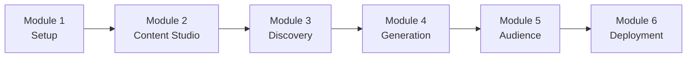

# Media & Entertainment AI Workshop

Welcome to the Media & Entertainment AI Workshop! This workshop teaches you how to build an AI-powered media platform using AWS GenAI services including Amazon Bedrock, Amazon SageMaker, Amazon Rekognition, Amazon Transcribe, Amazon Polly, and AWS Elemental MediaConvert.

## Workshop Overview

This workshop consists of 6 comprehensive modules, each building upon the previous one:

1. **[Module 1: Environment & Content Pipeline Setup](./module-1-setup.md)** – Set up media storage, delivery, and processing pipeline (60 min)
2. **[Module 2: AI Content Studio](./module-2-content-studio.md)** – Build script-to-video AI Content Studio (120 min)
3. **[Module 3: Content Discovery & Search](./module-3-discovery.md)** – Implement semantic and visual content discovery (90 min)
4. **[Module 4: Automated Content Generation](./module-4-generation.md)** – Generate marketing and social content (90 min)
5. **[Module 5: Audience Intelligence](./module-5-audience-intel.md)** – Analyze audience engagement and optimize content (90 min)
6. **[Module 6: Production Deployment](./module-6-deployment.md)** – Deploy to production with monitoring and cost controls (60 min)

## Learning Path



**Total Workshop Time**: ~9 hours

## Prerequisites Checklist

Before starting, ensure you have:

- [ ] AWS Account created with admin access
- [ ] AWS CLI installed and configured
- [ ] Python 3.11+ installed
- [ ] Node.js 18+ installed (optional, for frontend)
- [ ] Git installed
- [ ] Code editor (VS Code recommended)
- [ ] Access to Amazon Bedrock with Claude models enabled
- [ ] Access to MediaConvert, Rekognition, Transcribe, and Polly
- [ ] Basic understanding of Python and AWS services
- [ ] Familiarity with media workflows (helpful but not required)

## Workshop Objectives

By the end of this workshop, you will be able to:

1. **Set up media infrastructure** for storage, processing, and delivery
2. **Build an AI Content Studio** for script-to-video workflows
3. **Implement intelligent discovery & search** across media assets
4. **Generate marketing and social content** with GenAI
5. **Analyze audience behavior** and optimize content strategy
6. **Deploy a production-ready media AI platform**

## Workshop Structure

Each module includes:

- **Learning Objectives**: What you'll learn
- **Prerequisites**: Required knowledge and setup
- **Hands-on Exercises**: Step-by-step implementation
- **Code Examples**: Working code samples
- **Best Practices**: Media and GenAI best practices
- **Troubleshooting**: Common issues and solutions
- **Next Steps**: What to explore next

## Getting Started

### Quick Start

```bash
# Clone the repository
git clone <repository-url>
cd genAI-labs/media-entertainment

# Set up environment
./scripts/setup-workshop.sh

# Start with Module 1
cd docs/workshop
open module-1-setup.md
```

### Workshop Resources

- **Code Examples**: `code/examples/`
- **Sample Media**: `data/sample/`
- **Configuration**: `config/`
- **Scripts**: `scripts/`

## Module Summaries

### Module 1: Environment & Content Pipeline Setup (60 min)

**Topics Covered**:
- S3 buckets for raw, processed, and generated content
- CloudFront distribution for content delivery
- MediaConvert job templates
- Step Functions & Lambda for content processing
- Basic API Gateway setup

**Key Learnings**:
- How to configure core media infrastructure
- Building a simple content ingestion pipeline

### Module 2: AI Content Studio (120 min)

**Topics Covered**:
- Bedrock prompts for storyboards and scripts
- Polly for voiceover synthesis
- MediaConvert for rendering AI-generated videos
- Orchestrating workflows with Step Functions
- Managing AI templates for content teams

**Key Learnings**:
- Implementing script-to-video workflows
- Combining multiple AI services for media creation

### Module 3: Content Discovery & Search (90 min)

**Topics Covered**:
- Semantic search with Bedrock embeddings
- Visual search with Rekognition
- Search index design (OpenSearch / vector DB)
- Personalized ranking and recommendations

**Key Learnings**:
- Building multi-modal content discovery
- Designing indexes for media search

### Module 4: Automated Content Generation (90 min)

**Topics Covered**:
- Prompt patterns for social and marketing content
- Brand voice configuration
- Multi-platform optimization (Twitter, Instagram, TikTok, etc.)
- Content performance A/B testing (high-level)

**Key Learnings**:
- Scaling content creation across channels
- Maintaining consistency with brand guidelines

### Module 5: Audience Intelligence (90 min)

**Topics Covered**:
- Engagement event schema (views, likes, shares, completions)
- Data lake and feature engineering
- Engagement and churn prediction models
- Narrative insights with Bedrock
- Dashboards with QuickSight

**Key Learnings**:
- Turning engagement data into actionable insights
- Predicting content performance and audience behavior

### Module 6: Production Deployment (60 min)

**Topics Covered**:
- Terraform/CDK deployment patterns
- CI/CD pipelines for media workloads
- Monitoring and alerting (CloudWatch)
- Cost optimization for media processing
- Security and rights management basics

**Key Learnings**:
- Hardening and operating a media AI platform in production

## Workshop Completion

### Final Project

After completing all modules, you will have built:

- ✅ Media ingestion and processing pipeline
- ✅ AI Content Studio for script-to-video creation
- ✅ Intelligent content discovery and search
- ✅ Automated marketing and social content generation
- ✅ Audience intelligence and analytics layer
- ✅ Production deployment with monitoring

### Next Steps

1. **Customize** the solution for your media stack (CMS, OTT, apps)
2. **Integrate** with existing tools (editors, MAMs, analytics)
3. **Optimize** prompts, models, and workflows based on real usage
4. **Contribute** improvements back to this repository

## Getting Help

### Resources

- **Documentation**: Check module-specific docs in this folder
- **Code Examples**: Explore `code/examples/`
- **AWS Documentation**: Bedrock, MediaConvert, Rekognition, Transcribe, Polly
- **Community**: AWS community forums and user groups

### Common Issues

- **MediaConvert errors**: Check IAM roles, input/output paths
- **Bedrock access**: Ensure model access is granted in AWS console
- **High latency**: Review Lambda memory, concurrency, and VPC config
- **Search quality**: Tune embeddings, ranking, and metadata

### Support Channels

- **GitHub Issues**: Bug reports and feature requests
- **AWS Support**: For AWS service-specific issues

---

**Ready to start? Begin with [Module 1: Environment & Content Pipeline Setup](./module-1-setup.md)! 🎬🚀**


