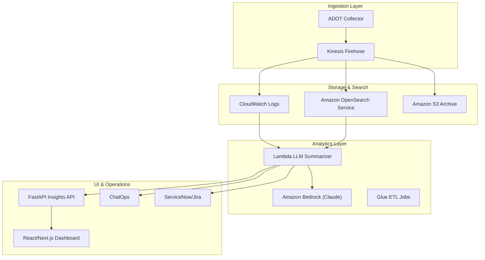

# LLM-Based Log Analytics Architecture

## High-Level Diagram

## Component Responsibilities

- **ADOT Collector**: Receives OTLP logs/metrics from applications, enriches events, and forwards to Firehose.
- **Kinesis Data Firehose**: Durable buffering, transformation, and delivery of logs to CloudWatch Logs, OpenSearch, and S3.
- **Amazon OpenSearch Service**: Primary search and analytics index for log data with fine-grained access control.
- **CloudWatch Logs & Metrics**: Drives alerting; metrics derived from logs (error rate, anomaly score, token usage).
- **Amazon S3**: Long-term compressed storage for compliance and analytics.
- **Lambda LLM Summarizer**: Event-driven function that retrieves relevant logs, constructs prompts, and calls Bedrock to generate summaries and remediation suggestions.
- **Amazon Bedrock (Claude)**: Foundation model for natural-language log analysis, auto-remediation hints, and clustering.
- **FastAPI Insights API**: Serves aggregated log analytics, exposes Bedrock-generated insights, handles authentication.
- **React Dashboard**: UI for interactive exploration, conversation with logs, SLO visualization, and runbooks.
- **ChatOps / Ticketing Integration**: Slack webhooks and REST connectors to ServiceNow or Jira for automated incident updates.

## Data Flow

1. **Log Ingestion**
   - Applications emit logs via OpenTelemetry -> Collector -> Firehose.
   - Logs classified and enriched (service, environment, tenant, sensitivity labels).

2. **Storage & Indexing**
   - Firehose delivers logs to CloudWatch (operational monitoring), OpenSearch (real-time search), and S3 (archival).
   - Glue jobs run periodic ETL to compute trend analytics stored in OpenSearch or Athena.

3. **LLM Analytics**
   - CloudWatch alarm triggers EventBridge rule.
   - Rule targets Lambda summarizer which fetches correlated logs from OpenSearch.
   - Lambda crafts prompt templates (see `docs/llm-prompts.md`) and queries Bedrock.
   - Response includes summary, probable cause, remediation suggestions, and anomaly severity.

4. **Dashboard & Smart Alerts**
   - Backend API exposes endpoints `/insights`, `/alerts`, `/query` to frontend and ChatOps integrations.
   - React dashboard allows natural-language queries and displays Claude responses alongside metrics.
   - Slack notifications and tickets embed summary, trace IDs, and deep links to dashboards.

## AWS Services & Configuration

| Service | Purpose | Notes |
|---------|---------|-------|
| Amazon VPC | Network isolation | Private subnet for OpenSearch, Lambda, Bedrock access via VPC endpoints |
| Amazon OpenSearch | Log indexing/search | Multi-AZ, fine-grained access, Cognito integration optional |
| Amazon Bedrock | LLM analytics | Claude 3.5 Sonnet for summaries; guardrails to redact PII |
| Kinesis Firehose | Delivery pipeline | Dynamic partitioning, backup to S3 |
| CloudWatch | Metrics/alarms | Log Insights queries for derived metrics |
| EventBridge | Orchestration | Rules for alarms, scheduled health checks |
| AWS Lambda | AI Ops automation | Python runtime, IAM policy for OpenSearch & Bedrock |
| Amazon S3 | Archival | Bucket with lifecycle policy to Glacier Deep Archive |
| AWS IAM | Security | Least-privilege roles, Bedrock invoke permissions |

## Security & Compliance

- **Encryption**: KMS CMKs for OpenSearch, S3, CloudWatch, Firehose.
- **Access Control**: per-tenant index permissions, Cognito or IAM Identity Center for dashboard authentication.
- **Guardrails**: Prompt filtering to remove PII, guardrail configurations in Bedrock.
- **Audit Logging**: CloudTrail logs for API calls; Config rules to detect misconfiguration.
- **Compliance**: Aligns with SOC 2, ISO 27001, NIST 800-53 logging & monitoring controls.

## Scalability & Resilience

- Firehose auto-scales throughput, cached buffering ensures durability.
- OpenSearch deployed across three AZs with dedicated master nodes.
- Lambda concurrency scales for high-volume alerting; Step Functions can orchestrate complex remediation.
- Frontend & backend containers deploy on AWS Fargate or EKS with auto scaling.

## Cost Optimization

- Adaptive sampling for low-severity logs.
- Bedrock inference budgets tracked via CloudWatch metrics.
- S3 lifecycle policies, OpenSearch UltraWarm for historical data.

## Extensibility

- Add generative runbook generation, root cause automation, or integration with incident notebooks.
- Extend to metric anomaly detection using Amazon Lookout for Metrics.
- Multi-cloud telemetry via OpenTelemetry collector exporters.
