# Retail & E-commerce AI Solution - Architecture

## Overview

The Retail & E-commerce AI Solution is a comprehensive platform that leverages AWS GenAI services to deliver intelligent, personalized shopping experiences. The architecture is designed to handle high-scale traffic, provide real-time personalization, optimize inventory management, and generate dynamic content at scale.

## Quick Reference: Build Process

**Want to build this step-by-step?** Follow these phases in order:

| Phase | Focus | Key Services | Time Estimate |
|-------|-------|--------------|---------------|
| **Phase 1** | Foundation | DynamoDB, S3, API Gateway | 1-2 days |
| **Phase 2** | Personalization | ElastiCache, SageMaker, Bedrock | 2-3 days |
| **Phase 3** | Event Processing | Kinesis, Lambda Processors | 1-2 days |
| **Phase 4** | Inventory | SageMaker Forecast, EventBridge | 2-3 days |
| **Phase 5** | Conversational | API Gateway WebSocket, Comprehend | 2-3 days |
| **Phase 6** | Content | Bedrock, Comprehend, CloudFront | 1-2 days |
| **Phase 7** | Analytics | Glue, Athena, QuickSight | 2-3 days |

**Total Build Time**: ~2-3 weeks for complete system

**Quick Start**: Build Phases 1-2 for a minimal viable product (MVP) in 3-5 days.

👉 **Jump to**: [Step-by-Step Architecture Build](#phase-1-foundation---data-storage--api-gateway)

## Architecture Principles

### 1. Scalability
- **Microservices Architecture**: Modular, independently scalable components
- **Serverless Components**: Auto-scaling Lambda functions and API Gateway
- **Horizontal Scaling**: DynamoDB on-demand and Kinesis auto-scaling
- **CDN Integration**: CloudFront for global content delivery

### 2. Performance
- **Real-time Processing**: Sub-100ms recommendation latency
- **Caching Strategy**: Multi-layer caching with ElastiCache
- **Async Processing**: Event-driven architecture for non-blocking operations
- **Database Optimization**: DynamoDB with proper indexing and partitioning

### 3. Reliability
- **High Availability**: Multi-AZ deployment across regions
- **Fault Tolerance**: Circuit breakers and retry mechanisms
- **Data Durability**: S3 versioning and DynamoDB backups
- **Monitoring**: Comprehensive CloudWatch metrics and alarms

### 4. Security
- **Data Encryption**: End-to-end encryption at rest and in transit
- **Access Control**: IAM roles with least privilege
- **Privacy Compliance**: GDPR and CCPA compliant data handling
- **Audit Logging**: Comprehensive activity tracking

## System Architecture

### High-Level Overview

The architecture follows a layered approach with clear separation of concerns:

```
┌─────────────────────────────────────────────────────────┐
│                    Users & Applications                  │
│         (Web, Mobile, API Clients)                       │
└────────────────────┬────────────────────────────────────┘
                     │
┌────────────────────▼────────────────────────────────────┐
│              API Gateway (Entry Point)                    │
└────────────────────┬────────────────────────────────────┘
                     │
┌────────────────────▼────────────────────────────────────┐
│              Lambda Functions (Business Logic)            │
└─────┬──────────┬──────────┬──────────┬───────────────────┘
      │          │          │          │
┌─────▼──┐  ┌───▼───┐  ┌───▼───┐  ┌───▼────┐
│Bedrock │  │SageMaker│ │Comprehend│ │Rekognition│
│ (GenAI)│  │  (ML)   │ │  (NLP)  │ │  (CV)   │
└────────┘  └────────┘ └─────────┘ └─────────┘
      │          │          │          │
┌─────▼──────────▼──────────▼──────────▼──────────┐
│              Data Storage Layer                    │
│  (DynamoDB, S3, ElastiCache, Kinesis)            │
└──────────────────────────────────────────────────┘
```

## Step-by-Step Architecture Build

This section breaks down the architecture into manageable steps, building from foundation to complete system.

### Phase 1: Foundation - Data Storage & API Gateway

**Goal**: Set up basic infrastructure for data storage and API access

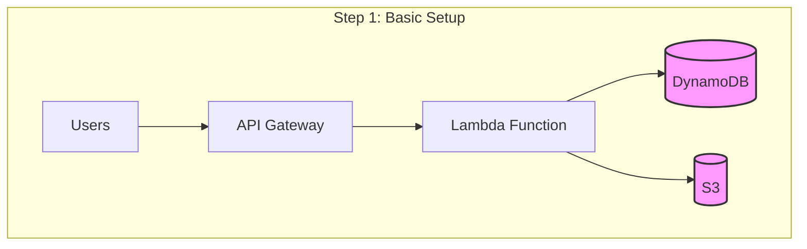

**Components to Deploy**:
1. DynamoDB tables (users, products)
2. S3 buckets (product images, data lake)
3. API Gateway REST API
4. Basic Lambda function
5. IAM roles and permissions

**What This Enables**:
- Basic API endpoints
- Data storage and retrieval
- Foundation for all other features

---

### Phase 2: Personalization Engine

**Goal**: Add real-time product recommendations

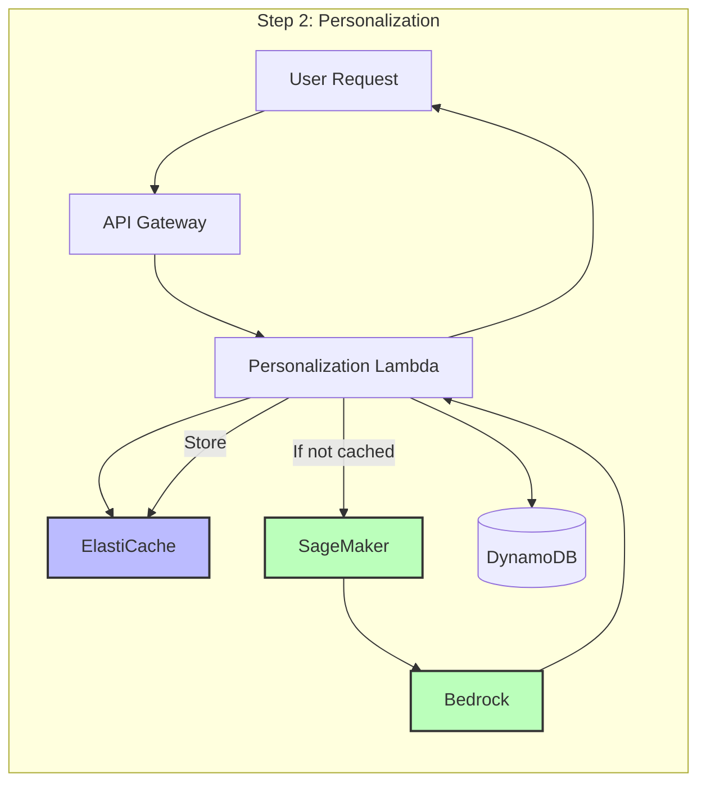

**Components to Add**:
1. ElastiCache Redis cluster
2. SageMaker endpoint (recommendation model)
3. Personalization Lambda function
4. Kinesis stream for user events

**What This Enables**:
- Real-time personalized recommendations
- Cached responses for performance
- ML-powered product suggestions

---

### Phase 3: Real-Time Event Processing

**Goal**: Process user behavior events in real-time

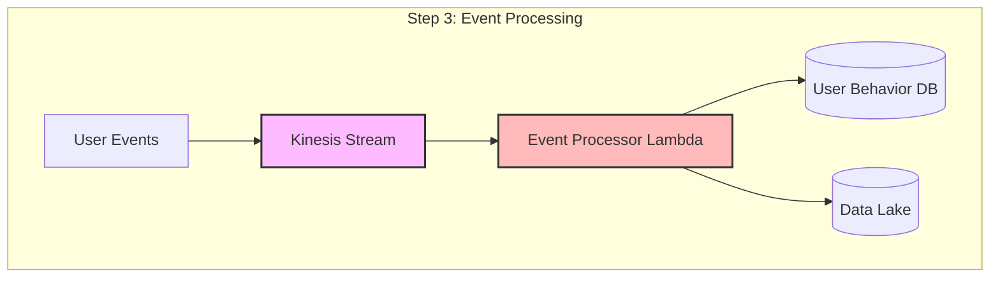

**Components to Add**:
1. Kinesis Data Stream
2. Event processor Lambda function
3. User behavior DynamoDB table
4. S3 data lake bucket

**What This Enables**:
- Real-time event capture
- User behavior tracking
- Data lake for analytics

---

### Phase 4: Inventory Management

**Goal**: Add AI-powered demand forecasting

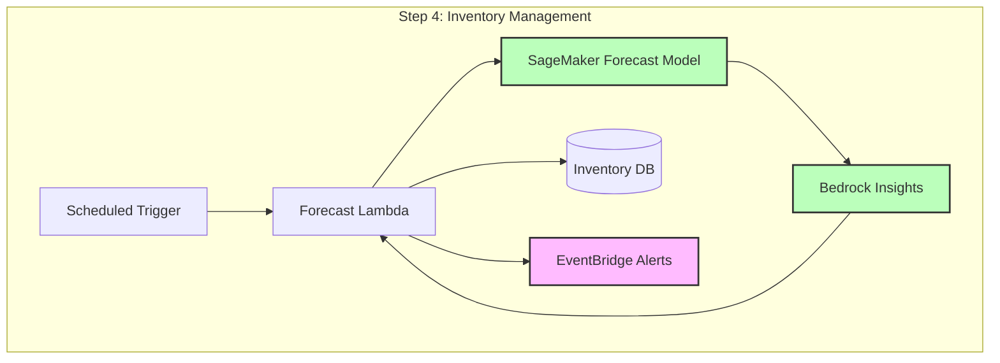

**Components to Add**:
1. SageMaker forecasting endpoint
2. Forecast Lambda function
3. Inventory DynamoDB table
4. EventBridge for alerts

**What This Enables**:
- Demand forecasting
- Automated reordering
- Inventory optimization

---

### Phase 5: Conversational Commerce

**Goal**: Add AI shopping assistant

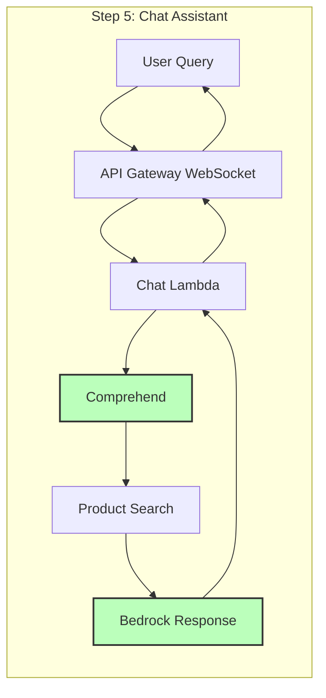

**Components to Add**:
1. API Gateway WebSocket API
2. Chat Lambda function
3. Comprehend for intent recognition
4. Product search integration

**What This Enables**:
- Natural language shopping
- Conversational product search
- AI-powered customer assistance

---

### Phase 6: Content Generation

**Goal**: Automate product descriptions and marketing content

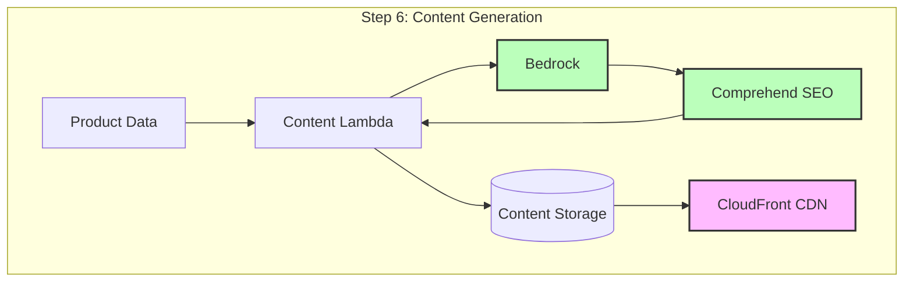

**Components to Add**:
1. Content generation Lambda
2. Comprehend for SEO analysis
3. CloudFront distribution
4. Content S3 bucket

**What This Enables**:
- Automated product descriptions
- SEO-optimized content
- Multi-language support

---

### Phase 7: Analytics & Monitoring

**Goal**: Add analytics and observability

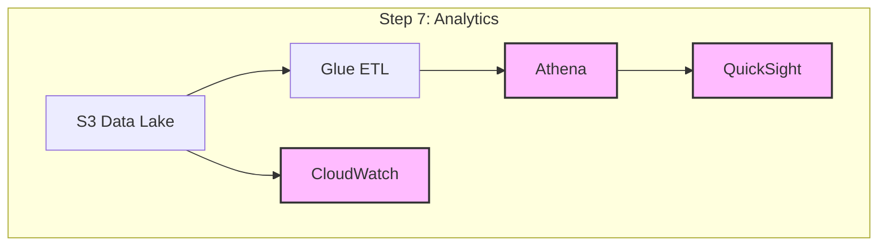

**Components to Add**:
1. Glue ETL jobs
2. Athena for querying
3. QuickSight dashboards
4. CloudWatch dashboards and alarms

**What This Enables**:
- Business intelligence
- Performance monitoring
- Cost tracking

---

### Complete Architecture (All Phases Combined)

**Final integrated system**:

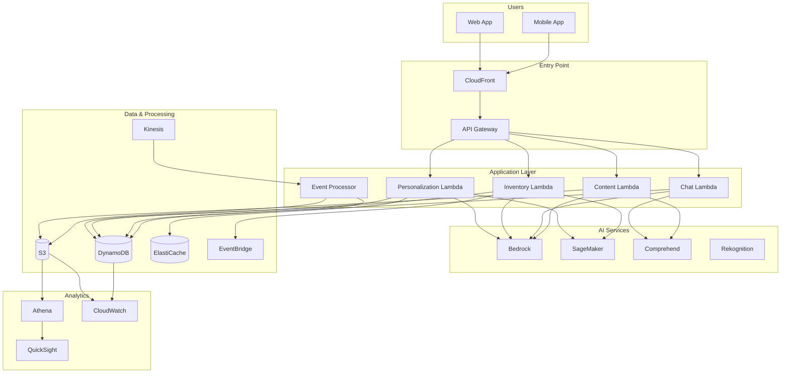

## Build Process Summary

### Recommended Build Order

1. **Phase 1: Foundation** (Week 1)
   - Set up DynamoDB, S3, API Gateway
   - Deploy basic Lambda function
   - Test data storage and retrieval

2. **Phase 2: Personalization** (Week 2)
   - Deploy ElastiCache
   - Set up SageMaker endpoint
   - Implement personalization Lambda
   - Test recommendations

3. **Phase 3: Event Processing** (Week 3)
   - Create Kinesis stream
   - Deploy event processor
   - Set up data lake
   - Test event capture

4. **Phase 4: Inventory** (Week 4)
   - Deploy forecasting model
   - Implement inventory Lambda
   - Set up EventBridge alerts
   - Test forecasting

5. **Phase 5: Conversational** (Week 5)
   - Set up WebSocket API
   - Deploy chat Lambda
   - Integrate Comprehend
   - Test chat functionality

6. **Phase 6: Content** (Week 6)
   - Deploy content Lambda
   - Set up CloudFront
   - Test content generation

7. **Phase 7: Analytics** (Week 7)
   - Set up Glue ETL
   - Create QuickSight dashboards
   - Configure CloudWatch
   - Test analytics

### Quick Start (Minimal Viable Product)

For a quick start, focus on **Phases 1-2**:
- Basic API with DynamoDB
- Simple personalization with Bedrock
- Basic caching with ElastiCache

This gives you a working system that can be expanded incrementally.

## Detailed Component Architecture

Each component is built incrementally. Here's how each one works:

### 1. Personalization Engine

**Purpose**: Deliver real-time personalized product recommendations

**Step-by-Step Flow**:

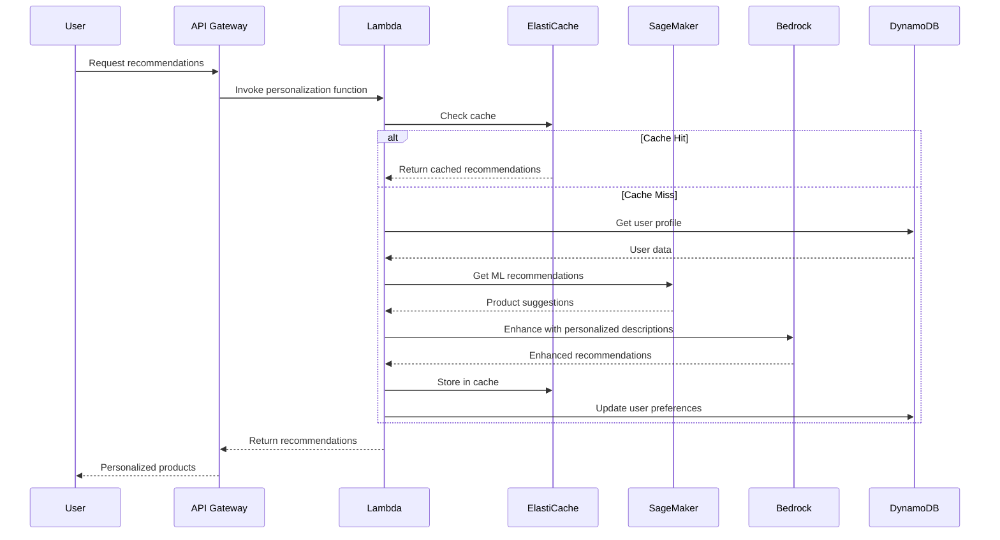

**Implementation Steps**:
1. Create ElastiCache cluster
2. Deploy SageMaker recommendation model
3. Create personalization Lambda function
4. Set up caching logic
5. Integrate Bedrock for content enhancement

**Key Services**:
- ElastiCache: Response caching (< 10ms)
- SageMaker: ML recommendations
- Bedrock: Personalized descriptions
- DynamoDB: User profiles

---

### 2. Inventory Management System

**Purpose**: AI-powered demand forecasting and automated reordering

**Step-by-Step Flow**:

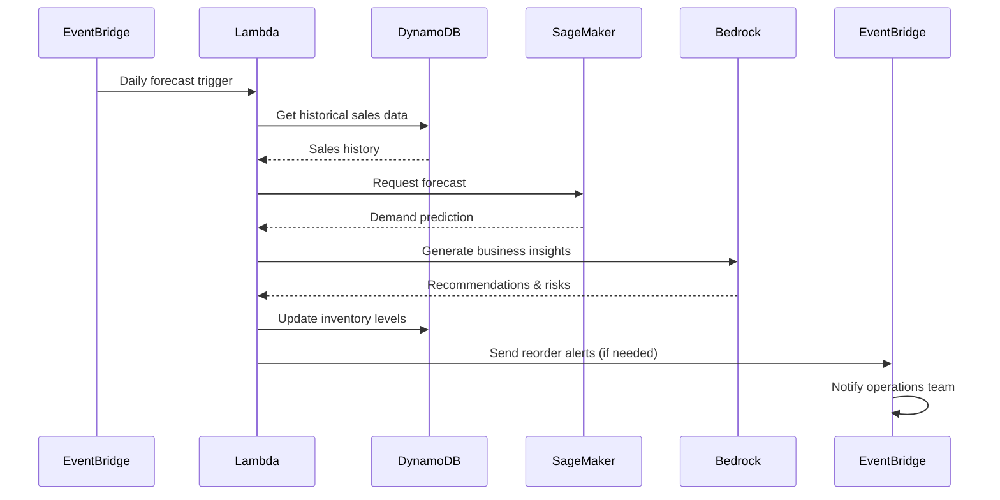

**Implementation Steps**:
1. Collect historical sales data
2. Train SageMaker forecasting model
3. Create forecast Lambda function
4. Set up EventBridge schedule
5. Configure reorder alerts

**Key Services**:
- SageMaker: Time-series forecasting
- Bedrock: Business insights
- EventBridge: Scheduled triggers & alerts
- DynamoDB: Inventory data

---

### 3. Conversational Commerce Platform

**Purpose**: Natural language shopping assistant

**Step-by-Step Flow**:

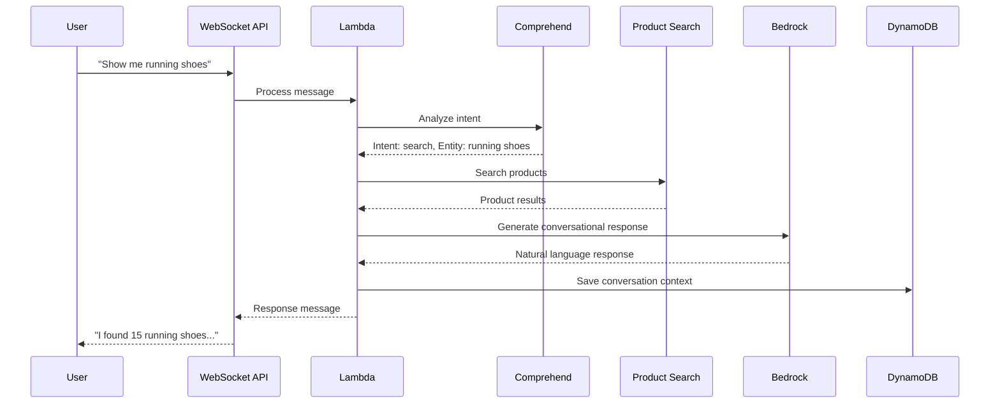

**Implementation Steps**:
1. Set up API Gateway WebSocket
2. Create chat Lambda function
3. Integrate Comprehend for intent
4. Build product search logic
5. Use Bedrock for responses

**Key Services**:
- API Gateway: WebSocket support
- Comprehend: Intent recognition
- Bedrock: Conversational responses
- DynamoDB: Conversation history

---

### 4. Content Generation System

**Purpose**: Automated product descriptions and marketing content

**Step-by-Step Flow**:

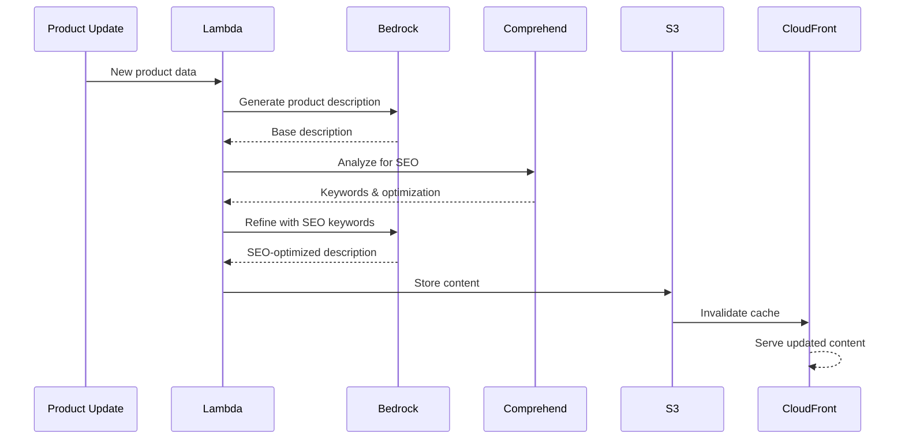

**Implementation Steps**:
1. Create content generation Lambda
2. Set up Bedrock for content creation
3. Integrate Comprehend for SEO
4. Configure S3 storage
5. Set up CloudFront distribution

**Key Services**:
- Bedrock: Content generation
- Comprehend: SEO analysis
- S3: Content storage
- CloudFront: Global delivery

## Data Architecture

### Data Sources

1. **Customer Data**
   - User profiles and preferences (DynamoDB)
   - Purchase history (DynamoDB)
   - Behavioral data (Kinesis streams)

2. **Product Data**
   - Product catalog (DynamoDB)
   - Product images (S3)
   - Product metadata (DynamoDB)

3. **Transaction Data**
   - Sales transactions (DynamoDB)
   - Inventory movements (DynamoDB)
   - Historical sales (S3 data lake)

4. **Behavioral Data**
   - Clickstream data (Kinesis)
   - Search queries (DynamoDB)
   - Session data (ElastiCache)

### Data Storage Strategy

**Hot Data** (Frequently accessed):
- User profiles → DynamoDB
- Product recommendations → ElastiCache
- Active sessions → ElastiCache

**Warm Data** (Periodically accessed):
- Product catalog → DynamoDB
- Recent transactions → DynamoDB
- Search index → OpenSearch

**Cold Data** (Archive):
- Historical sales → S3
- Archived logs → S3 Glacier
- Analytics data → S3 + Athena

### Data Processing Pipeline

**Step-by-Step Data Flow**:

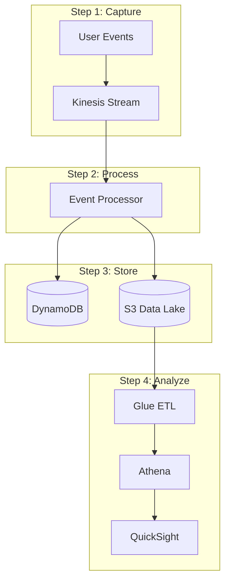

**Processing Steps**:
1. **Capture**: User events streamed to Kinesis
2. **Process**: Lambda enriches and transforms data
3. **Store**: Data saved to DynamoDB (hot) and S3 (cold)
4. **Analyze**: Glue ETL prepares data for Athena queries
5. **Visualize**: QuickSight creates dashboards

## Security Architecture

### Network Security

- **VPC**: Isolated network environment
- **Security Groups**: Firewall rules for service access
- **Private Subnets**: Internal service isolation
- **NAT Gateway**: Secure outbound internet access

### Data Security

- **Encryption at Rest**: 
  - DynamoDB: AWS KMS encryption
  - S3: Server-side encryption with KMS
  - ElastiCache: Encryption in transit and at rest

- **Encryption in Transit**:
  - TLS 1.3 for all API communications
  - HTTPS for all web traffic
  - VPC endpoints for AWS service communication

### Access Control

- **IAM Roles**: Least privilege access for all services
- **API Authentication**: Cognito for user authentication
- **Service-to-Service**: IAM roles for Lambda functions
- **Data Access**: Fine-grained DynamoDB access policies

### Privacy Compliance

- **PII Handling**: Automatic detection and masking with Comprehend
- **Consent Management**: User consent tracking in DynamoDB
- **Data Anonymization**: Lambda functions for data anonymization
- **Audit Logging**: CloudTrail for all API calls

## Scalability Architecture

### Auto-Scaling Components

1. **API Gateway**: Automatic scaling based on request volume
2. **Lambda Functions**: Concurrent execution limits and auto-scaling
3. **Kinesis Streams**: Auto-scaling shards based on throughput
4. **DynamoDB**: On-demand capacity with auto-scaling
5. **ElastiCache**: Cluster mode for horizontal scaling

### Performance Targets

- **API Response Time**: < 200ms (p95)
- **Recommendation Latency**: < 100ms (p95)
- **Search Response**: < 200ms (p95)
- **Content Generation**: < 2 seconds (p95)
- **Throughput**: 10,000+ requests/second

### Caching Strategy

**Layer 1 - Edge Caching**:
- CloudFront: Static content and API responses
- TTL: 1 hour for product data, 5 minutes for recommendations

**Layer 2 - Application Caching**:
- ElastiCache: User profiles, recommendations, product data
- TTL: 30 minutes for user data, 1 hour for product data

**Layer 3 - Database Caching**:
- DynamoDB DAX: Frequently accessed items
- TTL: 5 minutes for hot data

## Monitoring and Observability

### Application Monitoring

- **CloudWatch Metrics**: Custom metrics for business KPIs
- **CloudWatch Logs**: Centralized logging for all services
- **X-Ray Tracing**: Distributed tracing for request flows
- **Custom Dashboards**: Real-time monitoring dashboards

### Key Metrics

**Performance Metrics**:
- API latency (p50, p95, p99)
- Recommendation generation time
- Cache hit rates
- Database query performance

**Business Metrics**:
- Conversion rates
- Average order value
- Customer engagement scores
- Inventory turnover

**Operational Metrics**:
- Error rates
- Throttling events
- Service availability
- Cost per transaction

### Alerting

- **Performance Degradation**: Alerts when latency exceeds thresholds
- **Error Rates**: Alerts for elevated error rates
- **Capacity**: Alerts for approaching capacity limits
- **Cost**: Alerts for unexpected cost increases

## Disaster Recovery

### Backup Strategy

- **DynamoDB**: Point-in-time recovery with 35-day retention
- **S3**: Versioning and cross-region replication
- **RDS** (if used): Automated daily backups
- **Configuration**: Infrastructure as Code in Git

### Recovery Objectives

- **RTO (Recovery Time Objective)**: 4 hours
- **RPO (Recovery Point Objective)**: 1 hour
- **Failover**: Multi-region deployment capability
- **Testing**: Quarterly disaster recovery drills

## Cost Optimization

### Resource Optimization

- **Right-sizing**: Appropriate instance types and memory
- **Reserved Capacity**: DynamoDB reserved capacity for predictable workloads
- **Spot Instances**: For batch processing and non-critical workloads
- **Auto-shutdown**: Development environment cost controls

### Cost Monitoring

- **Cost Allocation Tags**: Track costs by service and feature
- **Cost Alerts**: Budget alerts for cost thresholds
- **Cost Reports**: Monthly cost analysis and optimization
- **Resource Cleanup**: Automated cleanup of unused resources

## Integration Points

### External Integrations

- **Payment Gateways**: Stripe, PayPal integration
- **Shipping Providers**: FedEx, UPS APIs
- **Email Services**: SES for transactional emails
- **SMS Services**: SNS for notifications

### Internal Integrations

- **Identity Provider**: Cognito for authentication
- **Analytics**: QuickSight for business intelligence
- **Monitoring**: CloudWatch for observability
- **Logging**: CloudWatch Logs for centralized logging

## Deployment Architecture

### Environment Strategy

- **Development**: Single-region, minimal resources
- **Staging**: Production-like, single-region
- **Production**: Multi-region, high availability
- **Disaster Recovery**: Secondary region backup

### CI/CD Pipeline

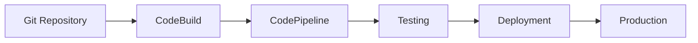

### Infrastructure as Code

- **Terraform**: Infrastructure provisioning
- **CDK**: Alternative infrastructure definition
- **Git**: Version control for infrastructure
- **Automated Testing**: Infrastructure validation

## Future Enhancements

### Planned Features

- **Multi-language Support**: International market expansion
- **Voice Commerce**: Alexa and voice shopping integration
- **AR/VR Shopping**: Immersive shopping experiences
- **Advanced Analytics**: Predictive customer behavior models

### Scalability Improvements

- **Microservices**: Further service decomposition
- **Event-driven Architecture**: Enhanced async processing
- **GraphQL API**: Flexible API querying
- **Edge Computing**: Lambda@Edge for global performance

## Conclusion

The Retail & E-commerce AI Solution architecture is designed to provide a scalable, performant, and secure platform for modern e-commerce businesses. The architecture leverages AWS GenAI services to deliver intelligent personalization, optimize operations, and enhance customer experiences while maintaining cost efficiency and operational excellence.

The modular design allows businesses to deploy components incrementally, starting with core personalization features and expanding to include advanced capabilities like conversational commerce, visual search, and automated content generation.

