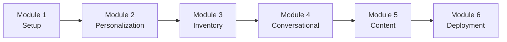

# Retail & E-commerce AI Workshop

Welcome to the Retail & E-commerce AI Workshop! This comprehensive workshop teaches you how to build AI-powered retail solutions using AWS GenAI services including Amazon Bedrock, Amazon SageMaker, Amazon Comprehend, and Amazon Rekognition.

## Workshop Overview

This workshop consists of 6 comprehensive modules, each building upon the previous one:

1. **[Module 1: Environment Setup](./module-1-setup.md)** - Set up your development environment and AWS services (30 min)
2. **[Module 2: Personalization Engine](./module-2-personalization.md)** - Build real-time product recommendation system (90 min)
3. **[Module 3: Inventory Management](./module-3-inventory.md)** - Implement AI-powered demand forecasting (90 min)
4. **[Module 4: Conversational Commerce](./module-4-conversational.md)** - Create AI shopping assistant (120 min)
5. **[Module 5: Content Generation](./module-5-content.md)** - Automate product descriptions and marketing content (60 min)
6. **[Module 6: Production Deployment](./module-6-deployment.md)** - Deploy to production with monitoring (60 min)

## Learning Path



**Total Workshop Time**: ~7.5 hours

## Prerequisites Checklist

Before starting, ensure you have:

- [ ] AWS Account created with admin access
- [ ] AWS CLI installed and configured
- [ ] Python 3.11+ installed
- [ ] Node.js 18+ installed
- [ ] Git installed
- [ ] Code editor (VS Code recommended)
- [ ] Access to Amazon Bedrock with Claude models enabled
- [ ] Basic understanding of Python and AWS services
- [ ] Familiarity with REST APIs

## Workshop Objectives

By the end of this workshop, you will be able to:

1. **Set up AWS GenAI services** for retail applications
2. **Build personalization engines** using ML and GenAI
3. **Implement demand forecasting** with time-series models
4. **Create conversational commerce** experiences
5. **Generate dynamic content** at scale
6. **Deploy production-ready** retail AI solutions

## Workshop Structure

Each module includes:

- **Learning Objectives**: What you'll learn
- **Prerequisites**: Required knowledge and setup
- **Hands-on Exercises**: Step-by-step implementation
- **Code Examples**: Working code samples
- **Best Practices**: Industry best practices
- **Troubleshooting**: Common issues and solutions
- **Next Steps**: What to explore next

## Getting Started

### Quick Start

```bash
# Clone the repository
git clone <repository-url>
cd genAI-labs/retail-ecommerce

# Set up environment
./scripts/setup-workshop.sh

# Start with Module 1
cd docs/workshop
open module-1-setup.md
```

### Workshop Resources

- **Code Examples**: `code/examples/`
- **Sample Data**: `data/sample/`
- **Configuration**: `config/`
- **Scripts**: `scripts/`

## Module Details

### Module 1: Environment Setup (30 min)

**Topics Covered**:
- AWS account setup and configuration
- Bedrock model access configuration
- Development environment setup
- Sample data loading
- Basic API testing

**Key Learnings**:
- How to configure AWS services for GenAI
- Setting up local development environment
- Understanding the project structure

### Module 2: Personalization Engine (90 min)

**Topics Covered**:
- Real-time event processing with Kinesis
- ML model integration with SageMaker
- GenAI enhancement with Bedrock
- Caching strategies with ElastiCache
- A/B testing framework

**Key Learnings**:
- Building real-time recommendation systems
- Combining ML and GenAI for personalization
- Performance optimization techniques

### Module 3: Inventory Management (90 min)

**Topics Covered**:
- Time-series forecasting with SageMaker
- Demand prediction models
- GenAI-powered business insights
- Automated reordering systems
- Inventory optimization

**Key Learnings**:
- Implementing demand forecasting
- Using GenAI for business intelligence
- Building automated inventory systems

### Module 4: Conversational Commerce (120 min)

**Topics Covered**:
- Natural language understanding with Comprehend
- Conversational AI with Bedrock
- Visual search with Rekognition
- WebSocket API implementation
- Multi-turn conversation handling

**Key Learnings**:
- Building conversational interfaces
- Integrating multiple AI services
- Handling complex user queries

### Module 5: Content Generation (60 min)

**Topics Covered**:
- Automated product descriptions
- SEO-optimized content generation
- Multi-language content creation
- Brand voice consistency
- Content quality validation

**Key Learnings**:
- Scaling content creation with AI
- Maintaining brand consistency
- SEO optimization with AI

### Module 6: Production Deployment (60 min)

**Topics Covered**:
- Infrastructure as Code with Terraform
- CI/CD pipeline setup
- Monitoring and alerting
- Performance optimization
- Security best practices

**Key Learnings**:
- Deploying production-ready solutions
- Setting up observability
- Ensuring security and compliance

## Workshop Completion

### Final Project

After completing all modules, you'll have built:

- ✅ Real-time personalization engine
- ✅ AI-powered inventory management
- ✅ Conversational shopping assistant
- ✅ Automated content generation system
- ✅ Production-ready deployment

### Next Steps

1. **Customize for Your Use Case**: Adapt the solution for your specific needs
2. **Explore Advanced Features**: Implement additional AI capabilities
3. **Scale the Solution**: Optimize for high-traffic scenarios
4. **Share Your Work**: Contribute back to the community

## Getting Help

### Resources

- **Documentation**: Check module-specific documentation
- **Code Examples**: Review working code samples
- **AWS Documentation**: Consult AWS service documentation
- **Community**: Join AWS community forums

### Common Issues

- **Bedrock Access**: Ensure model access is enabled in AWS Console
- **Lambda Timeouts**: Increase timeout and check function logs
- **DynamoDB Throttling**: Enable auto-scaling or increase capacity
- **API Gateway Limits**: Request limit increases if needed

### Support Channels

- **GitHub Issues**: Report bugs and request features
- **AWS Support**: For AWS service-specific issues
- **Workshop Q&A**: Check workshop discussion forums

## Workshop Completion Certificate

After completing all modules and the final project, you'll receive a completion certificate. Share your achievement on social media!

---

**Ready to start? Begin with [Module 1: Environment Setup](./module-1-setup.md)! 🚀**

