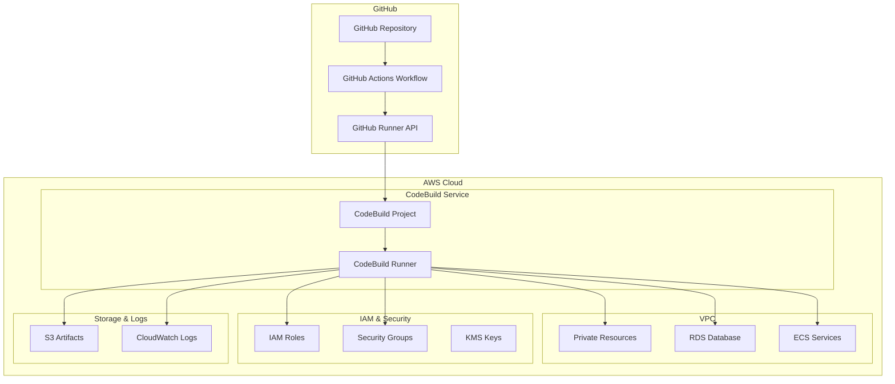
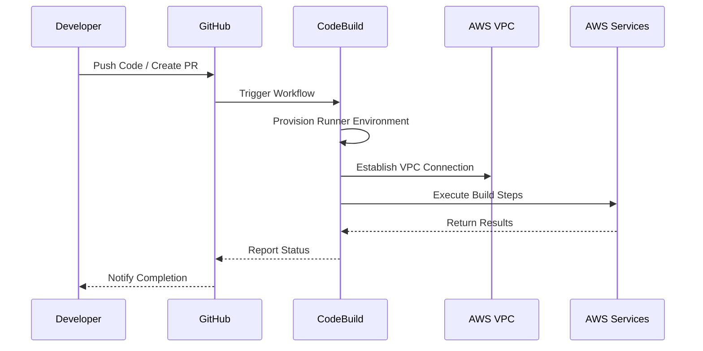

# 🚀 Serverless GitHub Actions Runners on AWS CodeBuild: The Game-Changing Integration

## 📖 Executive Summary

AWS CodeBuild now supports hosting GitHub Action Runners in a completely serverless environment, revolutionizing how development teams handle CI/CD workflows. This integration combines the workflow simplicity of GitHub Actions with the powerful infrastructure capabilities of AWS, including VPC connectivity, IAM integration, and seamless access to AWS services.

## 🎯 Key Benefits

- **🔧 Zero Infrastructure Management**: No need to manage self-hosted runners
- **🌐 VPC Integration**: Secure access to private resources within your AWS VPC
- **🔐 IAM Integration**: Fine-grained access control using AWS IAM policies
- **💰 Cost Optimization**: Pay only for build time, not idle runners
- **⚡ Scalability**: Automatic scaling based on demand
- **🔒 Enhanced Security**: Isolated execution environments for each job

## 🏗️ Architecture Overview

### High-Level Architecture



### Detailed Workflow Architecture



## 🛠️ Step-by-Step Implementation

### Prerequisites

1. **AWS Account** with appropriate permissions
2. **GitHub Repository** with Actions enabled
3. **AWS CLI** configured with CodeBuild permissions
4. **Node.js 18+** for CDK deployment

### Step 1: AWS Infrastructure Setup

#### Create IAM Role for CodeBuild

```json
{
  "Version": "2012-10-17",
  "Statement": [
    {
      "Effect": "Allow",
      "Principal": {
        "Service": "codebuild.amazonaws.com"
      },
      "Action": "sts:AssumeRole"
    }
  ]
}
```

#### Create CodeBuild Project

```yaml
# infrastructure/codebuild-project.yml
version: 0.2
phases:
  pre_build:
    commands:
      - echo Logging in to Amazon ECR...
      - aws ecr get-login-password --region $AWS_DEFAULT_REGION | docker login --username AWS --password-stdin $AWS_ACCOUNT_ID.dkr.ecr.$AWS_DEFAULT_REGION.amazonaws.com
  build:
    commands:
      - echo Build started on `date`
      - echo Building the Docker image...
      - docker build -t $IMAGE_REPO_NAME:$IMAGE_TAG .
      - docker tag $IMAGE_REPO_NAME:$IMAGE_TAG $AWS_ACCOUNT_ID.dkr.ecr.$AWS_DEFAULT_REGION.amazonaws.com/$IMAGE_REPO_NAME:$IMAGE_TAG
  post_build:
    commands:
      - echo Build completed on `date`
      - echo Pushing the Docker image...
      - docker push $AWS_ACCOUNT_ID.dkr.ecr.$AWS_DEFAULT_REGION.amazonaws.com/$IMAGE_REPO_NAME:$IMAGE_TAG
```

### Step 2: GitHub Actions Workflow Configuration

#### Basic Workflow Setup

```yaml
# .github/workflows/aws-codebuild.yml
name: AWS CodeBuild Integration

on:
  push:
    branches: [ main, develop ]
  pull_request:
    branches: [ main ]

env:
  AWS_REGION: us-east-1
  CODEBUILD_PROJECT_NAME: github-actions-runner

jobs:
  build:
    runs-on: ubuntu-latest
    
    steps:
    - name: Checkout code
      uses: actions/checkout@v4
      
    - name: Configure AWS credentials
      uses: aws-actions/configure-aws-credentials@v4
      with:
        aws-access-key-id: ${{ secrets.AWS_ACCESS_KEY_ID }}
        aws-secret-access-key: ${{ secrets.AWS_SECRET_ACCESS_KEY }}
        aws-region: ${{ env.AWS_REGION }}
        
    - name: Start CodeBuild job
      run: |
        BUILD_ID=$(aws codebuild start-build \
          --project-name ${{ env.CODEBUILD_PROJECT_NAME }} \
          --source-version ${{ github.sha }} \
          --environment-variables-override \
            name=GITHUB_TOKEN,value=${{ secrets.GITHUB_TOKEN }} \
            name=GITHUB_REPOSITORY,value=${{ github.repository }} \
            name=GITHUB_REF,value=${{ github.ref }} \
          --query 'build.id' --output text)
        
        echo "BUILD_ID=$BUILD_ID" >> $GITHUB_ENV
        
    - name: Wait for CodeBuild completion
      run: |
        aws codebuild wait build-completed \
          --ids ${{ env.BUILD_ID }}
          
    - name: Get build results
      run: |
        BUILD_STATUS=$(aws codebuild batch-get-builds \
          --ids ${{ env.BUILD_ID }} \
          --query 'builds[0].buildStatus' --output text)
        
        if [ "$BUILD_STATUS" != "SUCCEEDED" ]; then
          echo "Build failed with status: $BUILD_STATUS"
          exit 1
        fi
        
        echo "Build completed successfully!"
```

### Step 3: Advanced VPC Integration

#### VPC-Enabled CodeBuild Project

```typescript
// infrastructure/cdk/lib/codebuild-stack.ts
import * as cdk from 'aws-cdk-lib';
import * as codebuild from 'aws-cdk-lib/aws-codebuild';
import * as ec2 from 'aws-cdk-lib/aws-ec2';
import * as iam from 'aws-cdk-lib/aws-iam';

export class CodeBuildStack extends cdk.Stack {
  constructor(scope: Construct, id: string, props?: cdk.StackProps) {
    super(scope, id, props);

    // Create VPC for CodeBuild
    const vpc = new ec2.Vpc(this, 'CodeBuildVPC', {
      maxAzs: 2,
      natGateways: 1,
      enableDnsHostnames: true,
      enableDnsSupport: true,
    });

    // Create security group for CodeBuild
    const securityGroup = new ec2.SecurityGroup(this, 'CodeBuildSG', {
      vpc,
      description: 'Security group for CodeBuild project',
      allowAllOutbound: true,
    });

    // Add specific ingress rules if needed
    securityGroup.addIngressRule(
      ec2.Peer.anyIpv4(),
      ec2.Port.tcp(443),
      'HTTPS access'
    );

    // Create IAM role for CodeBuild
    const codeBuildRole = new iam.Role(this, 'CodeBuildRole', {
      assumedBy: new iam.ServicePrincipal('codebuild.amazonaws.com'),
      managedPolicies: [
        iam.ManagedPolicy.fromAwsManagedPolicyName('CloudWatchLogsFullAccess'),
        iam.ManagedPolicy.fromAwsManagedPolicyName('AmazonS3FullAccess'),
        iam.ManagedPolicy.fromAwsManagedPolicyName('AmazonEC2ContainerRegistryPowerUser'),
      ],
    });

    // Add custom policies for VPC access
    codeBuildRole.addToPolicy(new iam.PolicyStatement({
      effect: iam.Effect.ALLOW,
      actions: [
        'ec2:CreateNetworkInterface',
        'ec2:DescribeNetworkInterfaces',
        'ec2:DeleteNetworkInterface',
        'ec2:AttachNetworkInterface',
        'ec2:DetachNetworkInterface',
      ],
      resources: ['*'],
    }));

    // Create CodeBuild project with VPC configuration
    const project = new codebuild.Project(this, 'GitHubActionsRunner', {
      projectName: 'github-actions-runner',
      role: codeBuildRole,
      vpc,
      securityGroups: [securityGroup],
      environment: {
        buildImage: codebuild.LinuxBuildImage.STANDARD_7_0,
        computeType: codebuild.ComputeType.LARGE,
        privileged: true,
        environmentVariables: {
          GITHUB_TOKEN: {
            type: codebuild.BuildEnvironmentVariableType.SECRETS_MANAGER,
            value: 'github-token-secret',
          },
        },
      },
      source: codebuild.Source.gitHub({
        owner: 'your-github-username',
        repo: 'your-repository',
        webhook: true,
        webhookFilters: [
          codebuild.FilterGroup.inEventOf(
            codebuild.EventAction.PUSH,
            codebuild.EventAction.PULL_REQUEST_MERGED
          ).andBranchIs('main'),
        ],
      }),
      buildSpec: codebuild.BuildSpec.fromObject({
        version: '0.2',
        phases: {
          pre_build: {
            commands: [
              'echo Logging in to Amazon ECR...',
              'aws ecr get-login-password --region $AWS_DEFAULT_REGION | docker login --username AWS --password-stdin $AWS_ACCOUNT_ID.dkr.ecr.$AWS_DEFAULT_REGION.amazonaws.com',
              'echo Build started on `date`',
            ],
          },
          build: {
            commands: [
              'echo Build started on `date`',
              'docker build -t $IMAGE_REPO_NAME:$IMAGE_TAG .',
              'docker tag $IMAGE_REPO_NAME:$IMAGE_TAG $AWS_ACCOUNT_ID.dkr.ecr.$AWS_DEFAULT_REGION.amazonaws.com/$IMAGE_REPO_NAME:$IMAGE_TAG',
            ],
          },
          post_build: {
            commands: [
              'echo Build completed on `date`',
              'docker push $AWS_ACCOUNT_ID.dkr.ecr.$AWS_DEFAULT_REGION.amazonaws.com/$IMAGE_REPO_NAME:$IMAGE_TAG',
              'echo Build completed successfully!',
            ],
          },
        },
      }),
    });

    // Output important values
    new cdk.CfnOutput(this, 'CodeBuildProjectName', {
      value: project.projectName,
      description: 'CodeBuild Project Name',
    });

    new cdk.CfnOutput(this, 'VPCId', {
      value: vpc.vpcId,
      description: 'VPC ID for CodeBuild',
    });
  }
}
```

## 🔐 Security Configuration

### IAM Policies for Secure Access

```json
{
  "Version": "2012-10-17",
  "Statement": [
    {
      "Effect": "Allow",
      "Action": [
        "codebuild:StartBuild",
        "codebuild:StopBuild",
        "codebuild:BatchGetBuilds",
        "codebuild:BatchGetReports",
        "codebuild:ListBuilds",
        "codebuild:ListBuildsForProject"
      ],
      "Resource": "arn:aws:codebuild:*:*:project/github-actions-runner"
    },
    {
      "Effect": "Allow",
      "Action": [
        "logs:CreateLogGroup",
        "logs:CreateLogStream",
        "logs:PutLogEvents",
        "logs:DescribeLogStreams"
      ],
      "Resource": "arn:aws:logs:*:*:log-group:/aws/codebuild/*"
    },
    {
      "Effect": "Allow",
      "Action": [
        "s3:GetObject",
        "s3:GetObjectVersion",
        "s3:PutObject",
        "s3:ListBucket"
      ],
      "Resource": [
        "arn:aws:s3:::your-codebuild-artifacts-bucket",
        "arn:aws:s3:::your-codebuild-artifacts-bucket/*"
      ]
    },
    {
      "Effect": "Allow",
      "Action": [
        "ecr:GetAuthorizationToken",
        "ecr:BatchCheckLayerAvailability",
        "ecr:GetDownloadUrlForLayer",
        "ecr:BatchGetImage"
      ],
      "Resource": "*"
    },
    {
      "Effect": "Allow",
      "Action": [
        "ec2:CreateNetworkInterface",
        "ec2:DescribeNetworkInterfaces",
        "ec2:DeleteNetworkInterface",
        "ec2:AttachNetworkInterface",
        "ec2:DetachNetworkInterface"
      ],
      "Resource": "*"
    }
  ]
}
```

### VPC Security Groups

```yaml
# security-groups.yml
SecurityGroups:
  CodeBuildSecurityGroup:
    Type: AWS::EC2::SecurityGroup
    Properties:
      GroupDescription: Security group for CodeBuild project
      VpcId: !Ref VPC
      SecurityGroupEgress:
        - IpProtocol: -1
          CidrIp: 0.0.0.0/0
      SecurityGroupIngress:
        - IpProtocol: tcp
          FromPort: 443
          ToPort: 443
          CidrIp: 0.0.0.0/0
          Description: HTTPS access
        - IpProtocol: tcp
          FromPort: 80
          ToPort: 80
          CidrIp: 0.0.0.0/0
          Description: HTTP access
```

## 📊 Monitoring and Logging

### CloudWatch Dashboard Configuration

```json
{
  "widgets": [
    {
      "type": "metric",
      "properties": {
        "metrics": [
          ["AWS/CodeBuild", "BuildDuration", "ProjectName", "github-actions-runner"],
          ["AWS/CodeBuild", "Builds", "ProjectName", "github-actions-runner"],
          ["AWS/CodeBuild", "FailedBuilds", "ProjectName", "github-actions-runner"]
        ],
        "period": 300,
        "stat": "Average",
        "region": "us-east-1",
        "title": "CodeBuild Metrics"
      }
    }
  ]
}
```

### CloudWatch Alarms

```yaml
# monitoring/alarms.yml
Alarms:
  CodeBuildFailureRate:
    Type: AWS::CloudWatch::Alarm
    Properties:
      AlarmName: CodeBuild-HighFailureRate
      AlarmDescription: Alert when CodeBuild failure rate exceeds threshold
      MetricName: FailedBuilds
      Namespace: AWS/CodeBuild
      Statistic: Sum
      Period: 300
      EvaluationPeriods: 2
      Threshold: 3
      ComparisonOperator: GreaterThanThreshold
      Dimensions:
        - Name: ProjectName
          Value: github-actions-runner

  CodeBuildDuration:
    Type: AWS::CloudWatch::Alarm
    Properties:
      AlarmName: CodeBuild-HighDuration
      AlarmDescription: Alert when CodeBuild duration exceeds threshold
      MetricName: BuildDuration
      Namespace: AWS/CodeBuild
      Statistic: Average
      Period: 300
      EvaluationPeriods: 2
      Threshold: 1800  # 30 minutes
      ComparisonOperator: GreaterThanThreshold
      Dimensions:
        - Name: ProjectName
          Value: github-actions-runner
```

## 🧪 Complete Example Project Structure

```
github-actions-codebuild-example/
├── README.md
├── .github/
│   └── workflows/
│       ├── aws-codebuild.yml
│       ├── deploy.yml
│       └── security-scan.yml
├── infrastructure/
│   ├── cdk/
│   │   ├── app.ts
│   │   ├── lib/
│   │   │   ├── codebuild-stack.ts
│   │   │   ├── vpc-stack.ts
│   │   │   └── monitoring-stack.ts
│   │   ├── bin/
│   │   │   └── app.ts
│   │   ├── cdk.json
│   │   └── package.json
│   ├── cloudformation/
│   │   ├── codebuild-project.yml
│   │   ├── security-groups.yml
│   │   └── monitoring.yml
│   └── terraform/
│       ├── main.tf
│       ├── variables.tf
│       ├── outputs.tf
│       └── codebuild.tf
├── src/
│   ├── app/
│   │   ├── main.py
│   │   ├── requirements.txt
│   │   └── Dockerfile
│   ├── tests/
│   │   ├── test_main.py
│   │   └── requirements.txt
│   └── scripts/
│       ├── build.sh
│       ├── test.sh
│       └── deploy.sh
├── config/
│   ├── development.json
│   ├── staging.json
│   └── production.json
├── docs/
│   ├── setup.md
│   ├── architecture.md
│   └── troubleshooting.md
├── scripts/
│   ├── setup-aws.sh
│   ├── deploy-infrastructure.sh
│   └── cleanup.sh
└── tests/
    ├── integration/
    │   └── test_codebuild_integration.py
    ├── e2e/
    │   └── test_full_workflow.py
    └── unit/
        └── test_application.py
```

### Example Application Code

#### Python Application (main.py)

```python
import os
import json
import boto3
from flask import Flask, request, jsonify
from datetime import datetime

app = Flask(__name__)

# Initialize AWS clients
dynamodb = boto3.resource('dynamodb', region_name=os.getenv('AWS_REGION', 'us-east-1'))
s3 = boto3.client('s3', region_name=os.getenv('AWS_REGION', 'us-east-1'))

# Environment variables
TABLE_NAME = os.getenv('DYNAMODB_TABLE', 'github-actions-logs')
S3_BUCKET = os.getenv('S3_BUCKET', 'github-actions-artifacts')

@app.route('/health')
def health_check():
    """Health check endpoint"""
    return jsonify({
        'status': 'healthy',
        'timestamp': datetime.utcnow().isoformat(),
        'environment': os.getenv('ENVIRONMENT', 'development')
    })

@app.route('/webhook', methods=['POST'])
def webhook_handler():
    """Handle GitHub webhook events"""
    try:
        payload = request.get_json()
        
        # Log the webhook event
        log_webhook_event(payload)
        
        # Process the event based on type
        event_type = request.headers.get('X-GitHub-Event')
        
        if event_type == 'push':
            return handle_push_event(payload)
        elif event_type == 'pull_request':
            return handle_pull_request_event(payload)
        else:
            return jsonify({'message': 'Event type not supported'}), 200
            
    except Exception as e:
        app.logger.error(f"Error processing webhook: {str(e)}")
        return jsonify({'error': 'Internal server error'}), 500

def log_webhook_event(payload):
    """Log webhook event to DynamoDB"""
    try:
        table = dynamodb.Table(TABLE_NAME)
        
        item = {
            'event_id': payload.get('repository', {}).get('id', 'unknown'),
            'timestamp': datetime.utcnow().isoformat(),
            'event_type': request.headers.get('X-GitHub-Event', 'unknown'),
            'payload': json.dumps(payload),
            'ttl': int(datetime.utcnow().timestamp()) + 86400  # 24 hours TTL
        }
        
        table.put_item(Item=item)
        
    except Exception as e:
        app.logger.error(f"Error logging webhook event: {str(e)}")

def handle_push_event(payload):
    """Handle push events"""
    repository = payload.get('repository', {})
    commits = payload.get('commits', [])
    
    # Store artifacts in S3
    store_artifacts(repository, commits)
    
    return jsonify({
        'message': 'Push event processed successfully',
        'repository': repository.get('name'),
        'commits_count': len(commits)
    })

def handle_pull_request_event(payload):
    """Handle pull request events"""
    pr = payload.get('pull_request', {})
    
    return jsonify({
        'message': 'Pull request event processed successfully',
        'pr_number': pr.get('number'),
        'action': payload.get('action')
    })

def store_artifacts(repository, commits):
    """Store commit artifacts in S3"""
    try:
        for commit in commits:
            artifact_key = f"{repository.get('name')}/{commit.get('id')}/metadata.json"
            
            artifact_data = {
                'repository': repository.get('name'),
                'commit_id': commit.get('id'),
                'message': commit.get('message'),
                'author': commit.get('author', {}).get('name'),
                'timestamp': commit.get('timestamp')
            }
            
            s3.put_object(
                Bucket=S3_BUCKET,
                Key=artifact_key,
                Body=json.dumps(artifact_data, indent=2),
                ContentType='application/json'
            )
            
    except Exception as e:
        app.logger.error(f"Error storing artifacts: {str(e)}")

if __name__ == '__main__':
    app.run(host='0.0.0.0', port=5000, debug=os.getenv('DEBUG', 'False').lower() == 'true')
```

#### Dockerfile

```dockerfile
FROM python:3.11-slim

# Set working directory
WORKDIR /app

# Install system dependencies
RUN apt-get update && apt-get install -y \
    curl \
    jq \
    && rm -rf /var/lib/apt/lists/*

# Copy requirements and install Python dependencies
COPY src/app/requirements.txt .
RUN pip install --no-cache-dir -r requirements.txt

# Copy application code
COPY src/app/ .

# Create non-root user
RUN useradd -m -u 1000 appuser && chown -R appuser:appuser /app
USER appuser

# Health check
HEALTHCHECK --interval=30s --timeout=3s --start-period=5s --retries=3 \
    CMD curl -f http://localhost:5000/health || exit 1

# Expose port
EXPOSE 5000

# Run the application
CMD ["python", "main.py"]
```

#### Requirements.txt

```txt
Flask==3.0.0
boto3==1.34.0
botocore==1.34.0
requests==2.31.0
python-dotenv==1.0.0
pytest==7.4.3
pytest-cov==4.1.0
moto==4.2.14
```

### GitHub Actions Workflows

#### Main CI/CD Workflow

```yaml
# .github/workflows/ci-cd.yml
name: CI/CD Pipeline

on:
  push:
    branches: [ main, develop ]
  pull_request:
    branches: [ main ]

env:
  AWS_REGION: us-east-1
  ECR_REPOSITORY: github-actions-app
  CODEBUILD_PROJECT: github-actions-runner

jobs:
  test:
    runs-on: ubuntu-latest
    steps:
    - name: Checkout code
      uses: actions/checkout@v4
      
    - name: Set up Python
      uses: actions/setup-python@v4
      with:
        python-version: '3.11'
        
    - name: Install dependencies
      run: |
        python -m pip install --upgrade pip
        pip install -r src/app/requirements.txt
        pip install -r src/tests/requirements.txt
        
    - name: Run tests
      run: |
        cd src
        python -m pytest tests/ -v --cov=app --cov-report=xml
        
    - name: Upload coverage to Codecov
      uses: codecov/codecov-action@v3
      with:
        file: ./src/coverage.xml
        flags: unittests
        name: codecov-umbrella

  security-scan:
    runs-on: ubuntu-latest
    steps:
    - name: Checkout code
      uses: actions/checkout@v4
      
    - name: Run Trivy vulnerability scanner
      uses: aquasecurity/trivy-action@master
      with:
        scan-type: 'fs'
        scan-ref: '.'
        format: 'sarif'
        output: 'trivy-results.sarif'
        
    - name: Upload Trivy scan results to GitHub Security tab
      uses: github/codeql-action/upload-sarif@v2
      with:
        sarif_file: 'trivy-results.sarif'

  build-and-deploy:
    needs: [test, security-scan]
    runs-on: ubuntu-latest
    if: github.ref == 'refs/heads/main'
    
    steps:
    - name: Checkout code
      uses: actions/checkout@v4
      
    - name: Configure AWS credentials
      uses: aws-actions/configure-aws-credentials@v4
      with:
        aws-access-key-id: ${{ secrets.AWS_ACCESS_KEY_ID }}
        aws-secret-access-key: ${{ secrets.AWS_SECRET_ACCESS_KEY }}
        aws-region: ${{ env.AWS_REGION }}
        
    - name: Login to Amazon ECR
      id: login-ecr
      uses: aws-actions/amazon-ecr-login@v2
      
    - name: Build and push Docker image
      env:
        ECR_REGISTRY: ${{ steps.login-ecr.outputs.registry }}
        IMAGE_TAG: ${{ github.sha }}
      run: |
        docker build -t $ECR_REGISTRY/$ECR_REPOSITORY:$IMAGE_TAG .
        docker push $ECR_REGISTRY/$ECR_REPOSITORY:$IMAGE_TAG
        docker tag $ECR_REGISTRY/$ECR_REPOSITORY:$IMAGE_TAG $ECR_REGISTRY/$ECR_REPOSITORY:latest
        docker push $ECR_REGISTRY/$ECR_REPOSITORY:latest
        
    - name: Deploy to AWS using CodeBuild
      run: |
        BUILD_ID=$(aws codebuild start-build \
          --project-name ${{ env.CODEBUILD_PROJECT }} \
          --source-version ${{ github.sha }} \
          --environment-variables-override \
            name=ECR_REGISTRY,value=${{ steps.login-ecr.outputs.registry }} \
            name=ECR_REPOSITORY,value=${{ env.ECR_REPOSITORY }} \
            name=IMAGE_TAG,value=${{ github.sha }} \
            name=GITHUB_TOKEN,value=${{ secrets.GITHUB_TOKEN }} \
            name=GITHUB_REPOSITORY,value=${{ github.repository }} \
            name=GITHUB_REF,value=${{ github.ref }} \
          --query 'build.id' --output text)
        
        echo "BUILD_ID=$BUILD_ID" >> $GITHUB_ENV
        
    - name: Wait for deployment completion
      run: |
        aws codebuild wait build-completed --ids ${{ env.BUILD_ID }}
        
        BUILD_STATUS=$(aws codebuild batch-get-builds \
          --ids ${{ env.BUILD_ID }} \
          --query 'builds[0].buildStatus' --output text)
        
        if [ "$BUILD_STATUS" != "SUCCEEDED" ]; then
          echo "Deployment failed with status: $BUILD_STATUS"
          exit 1
        fi
        
        echo "Deployment completed successfully!"
```

#### Infrastructure Deployment Workflow

```yaml
# .github/workflows/infrastructure.yml
name: Infrastructure Deployment

on:
  push:
    paths:
      - 'infrastructure/**'
    branches: [ main ]
  workflow_dispatch:
    inputs:
      environment:
        description: 'Environment to deploy to'
        required: true
        default: 'staging'
        type: choice
        options:
          - staging
          - production

env:
  AWS_REGION: us-east-1

jobs:
  deploy-infrastructure:
    runs-on: ubuntu-latest
    environment: ${{ github.event.inputs.environment || 'staging' }}
    
    steps:
    - name: Checkout code
      uses: actions/checkout@v4
      
    - name: Set up Node.js
      uses: actions/setup-node@v4
      with:
        node-version: '18'
        cache: 'npm'
        cache-dependency-path: infrastructure/cdk/package-lock.json
        
    - name: Configure AWS credentials
      uses: aws-actions/configure-aws-credentials@v4
      with:
        aws-access-key-id: ${{ secrets.AWS_ACCESS_KEY_ID }}
        aws-secret-access-key: ${{ secrets.AWS_SECRET_ACCESS_KEY }}
        aws-region: ${{ env.AWS_REGION }}
        
    - name: Install CDK dependencies
      run: |
        cd infrastructure/cdk
        npm ci
        
    - name: Bootstrap CDK (if needed)
      run: |
        cd infrastructure/cdk
        npx cdk bootstrap aws://${{ secrets.AWS_ACCOUNT_ID }}/${{ env.AWS_REGION }}
        
    - name: Deploy infrastructure
      run: |
        cd infrastructure/cdk
        npx cdk deploy --all --require-approval never
        
    - name: Output deployment results
      run: |
        cd infrastructure/cdk
        npx cdk list
```

## 🔍 Advanced Configuration

### Custom Build Environments

```yaml
# Custom buildspec.yml for specialized environments
version: 0.2

phases:
  install:
    runtime-versions:
      python: 3.11
      nodejs: 18
    commands:
      - echo Installing additional dependencies...
      - pip install awscli boto3
      - npm install -g @aws-cli/cdk

  pre_build:
    commands:
      - echo Pre-build phase started on `date`
      - echo Logging in to Amazon ECR...
      - aws ecr get-login-password --region $AWS_DEFAULT_REGION | docker login --username AWS --password-stdin $AWS_ACCOUNT_ID.dkr.ecr.$AWS_DEFAULT_REGION.amazonaws.com
      - REPOSITORY_URI=$AWS_ACCOUNT_ID.dkr.ecr.$AWS_DEFAULT_REGION.amazonaws.com/$IMAGE_REPO_NAME
      - COMMIT_HASH=$(echo $CODEBUILD_RESOLVED_SOURCE_VERSION | cut -c 1-7)
      - IMAGE_TAG=${COMMIT_HASH:=latest}

  build:
    commands:
      - echo Build started on `date`
      - echo Building the Docker image...
      - docker build -t $IMAGE_REPO_NAME:$IMAGE_TAG .
      - docker tag $IMAGE_REPO_NAME:$IMAGE_TAG $REPOSITORY_URI:$IMAGE_TAG
      - docker tag $IMAGE_REPO_NAME:$IMAGE_TAG $REPOSITORY_URI:latest

  post_build:
    commands:
      - echo Build completed on `date`
      - echo Pushing the Docker images...
      - docker push $REPOSITORY_URI:$IMAGE_TAG
      - docker push $REPOSITORY_URI:latest
      - echo Writing image definitions file...
      - printf '[{"name":"%s","imageUri":"%s"}]' $CONTAINER_NAME $REPOSITORY_URI:$IMAGE_TAG > imagedefinitions.json
      - cat imagedefinitions.json

artifacts:
  files:
    - imagedefinitions.json
    - '**/*'
  name: $(date +%Y-%m-%d)/$(date +%H-%M-%S)-$(echo $CODEBUILD_RESOLVED_SOURCE_VERSION | cut -c 1-7)
```

### Multi-Environment Configuration

```typescript
// infrastructure/cdk/lib/multi-environment.ts
export interface EnvironmentConfig {
  readonly environment: string;
  readonly region: string;
  readonly vpcCidr: string;
  readonly instanceType: string;
  readonly minCapacity: number;
  readonly maxCapacity: number;
}

export const environmentConfigs: { [key: string]: EnvironmentConfig } = {
  development: {
    environment: 'development',
    region: 'us-east-1',
    vpcCidr: '10.0.0.0/16',
    instanceType: 't3.micro',
    minCapacity: 1,
    maxCapacity: 3,
  },
  staging: {
    environment: 'staging',
    region: 'us-east-1',
    vpcCidr: '10.1.0.0/16',
    instanceType: 't3.small',
    minCapacity: 2,
    maxCapacity: 5,
  },
  production: {
    environment: 'production',
    region: 'us-east-1',
    vpcCidr: '10.2.0.0/16',
    instanceType: 't3.medium',
    minCapacity: 3,
    maxCapacity: 10,
  },
};
```

## 🚨 Troubleshooting Guide

### Common Issues and Solutions

#### 1. VPC Connectivity Issues

**Problem**: CodeBuild cannot access resources in VPC

**Solution**:
```bash
# Check VPC configuration
aws ec2 describe-vpcs --vpc-ids vpc-xxxxxxxxx

# Verify security groups
aws ec2 describe-security-groups --group-ids sg-xxxxxxxxx

# Check route tables
aws ec2 describe-route-tables --filters "Name=vpc-id,Values=vpc-xxxxxxxxx"
```

#### 2. IAM Permission Errors

**Problem**: Access denied errors during build

**Solution**:
```json
{
  "Version": "2012-10-17",
  "Statement": [
    {
      "Effect": "Allow",
      "Action": [
        "ecr:GetAuthorizationToken",
        "ecr:BatchCheckLayerAvailability",
        "ecr:GetDownloadUrlForLayer",
        "ecr:BatchGetImage",
        "ecr:PutImage",
        "ecr:InitiateLayerUpload",
        "ecr:UploadLayerPart",
        "ecr:CompleteLayerUpload"
      ],
      "Resource": "*"
    }
  ]
}
```

#### 3. Build Timeout Issues

**Problem**: Builds timing out before completion

**Solution**:
```yaml
# Increase build timeout
environment:
  computeType: BUILD_GENERAL1_LARGE
  image: aws/codebuild/standard:7.0
  type: LINUX_CONTAINER
  privilegedMode: true
```

## 📚 Official References

### AWS Documentation
- [AWS CodeBuild User Guide](https://docs.aws.amazon.com/codebuild/)
- [CodeBuild with GitHub](https://docs.aws.amazon.com/codebuild/latest/userguide/sample-github.html)
- [VPC Support in CodeBuild](https://docs.aws.amazon.com/codebuild/latest/userguide/vpc-support.html)
- [CodeBuild IAM Permissions](https://docs.aws.amazon.com/codebuild/latest/userguide/auth-and-access-control.html)

### GitHub Documentation
- [GitHub Actions Documentation](https://docs.github.com/en/actions)
- [GitHub Actions Runner](https://docs.github.com/en/actions/hosting-your-own-runners)
- [GitHub Webhooks](https://docs.github.com/en/developers/webhooks-and-events/webhooks)

### AWS CDK Documentation
- [AWS CDK Developer Guide](https://docs.aws.amazon.com/cdk/v2/guide/)
- [CodeBuild Constructs](https://docs.aws.amazon.com/cdk/api/v2/docs/aws-cdk-lib.aws_codebuild-readme.html)

### Best Practices
- [AWS Well-Architected Framework](https://aws.amazon.com/architecture/well-architected/)
- [CI/CD Best Practices](https://aws.amazon.com/devops/what-is-devops/)
- [Security Best Practices](https://aws.amazon.com/security/security-resources/)

## 🎯 Conclusion

The integration of GitHub Actions with AWS CodeBuild represents a significant advancement in CI/CD capabilities, offering the best of both worlds:

- **GitHub's intuitive workflow system** with extensive marketplace actions
- **AWS's robust infrastructure** with VPC integration, IAM security, and scalable compute

This combination enables development teams to build, test, and deploy applications with enterprise-grade security and scalability while maintaining the simplicity and community-driven ecosystem of GitHub Actions.

### Key Takeaways

1. **Zero Infrastructure Management**: No need to maintain self-hosted runners
2. **Enhanced Security**: VPC isolation and IAM-based access control
3. **Cost Efficiency**: Pay only for actual build time
4. **Scalability**: Automatic scaling based on demand
5. **Integration**: Seamless access to AWS services and resources

### Next Steps

1. **Start Small**: Begin with a simple project to understand the integration
2. **Implement Security**: Configure VPC and IAM policies according to your requirements
3. **Monitor and Optimize**: Set up monitoring and cost optimization strategies
4. **Scale Gradually**: Expand usage across your organization as you gain experience

The future of CI/CD is here, and it's more powerful, secure, and cost-effective than ever before! 🚀
