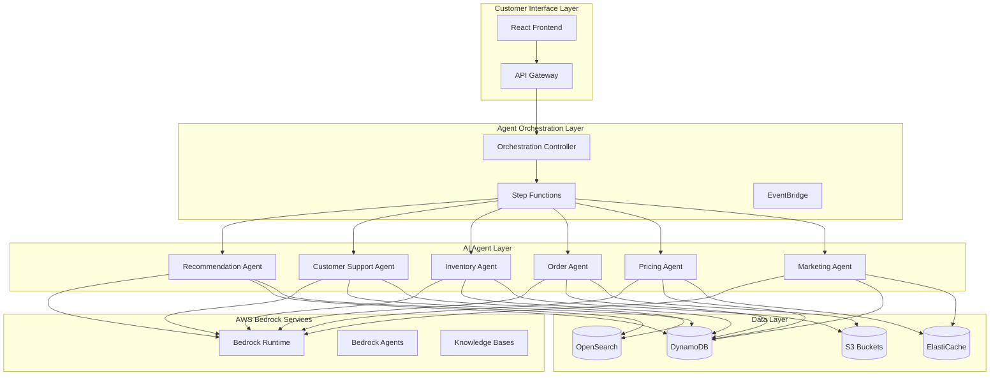
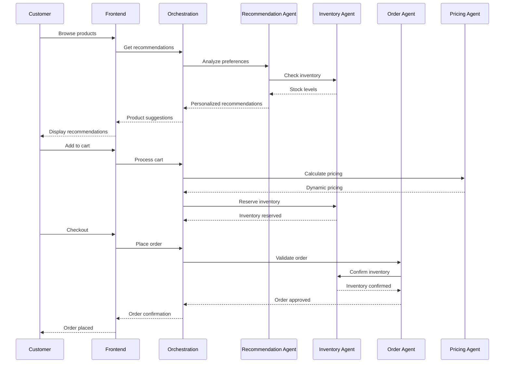

# 🛒 Multi-Agentic E-Commerce Solution

> **Intelligent E-Commerce Platform with Coordinated AI Agents**

## 🎯 Overview

This template provides a complete multi-agentic e-commerce solution powered by AWS Bedrock Agents and other AWS services. The system uses multiple specialized AI agents working together to provide intelligent product recommendations, customer support, inventory management, and order processing.

## 🏗️ Architecture

### **Multi-Agent System Design**

The solution implements a sophisticated multi-agent architecture where each agent has specialized responsibilities:



## 🤖 Agent Specifications

### **1. Recommendation Agent (RA)**
- **Purpose**: Personalized product recommendations
- **Capabilities**: 
  - Analyze user behavior and preferences
  - Generate contextual product suggestions
  - Handle cross-selling and upselling
  - Real-time recommendation updates
- **AWS Services**: Bedrock, DynamoDB, OpenSearch, Personalize
- **Knowledge Base**: Product catalog, user profiles, purchase history

### **2. Customer Support Agent (CSA)**
- **Purpose**: Intelligent customer service and support
- **Capabilities**:
  - Natural language query understanding
  - Order status inquiries
  - Product information requests
  - Escalation to human agents
- **AWS Services**: Bedrock, Lex, Connect
- **Knowledge Base**: FAQ, product documentation, support tickets

### **3. Inventory Agent (IA)**
- **Purpose**: Smart inventory management and forecasting
- **Capabilities**:
  - Stock level monitoring
  - Demand forecasting
  - Automated reorder suggestions
  - Supplier communication
- **AWS Services**: Bedrock, DynamoDB, S3, Forecast
- **Knowledge Base**: Inventory data, supplier information, demand patterns

### **4. Order Agent (OA)**
- **Purpose**: Intelligent order processing and management
- **Capabilities**:
  - Order validation and processing
  - Shipping optimization
  - Fraud detection
  - Order tracking and updates
- **AWS Services**: Bedrock, DynamoDB, Step Functions, Fraud Detector
- **Knowledge Base**: Order policies, shipping rules, fraud patterns

### **5. Pricing Agent (PA)**
- **Purpose**: Dynamic pricing and promotions
- **Capabilities**:
  - Real-time price optimization
  - Competitive pricing analysis
  - Promotional campaign management
  - Revenue optimization
- **AWS Services**: Bedrock, DynamoDB, CloudWatch, Forecast
- **Knowledge Base**: Pricing rules, competitor data, market trends

### **6. Marketing Agent (MA)**
- **Purpose**: Personalized marketing and customer engagement
- **Capabilities**:
  - Email campaign generation
  - Social media content creation
  - Customer segmentation
  - A/B testing management
- **AWS Services**: Bedrock, SES, Pinpoint, Personalize
- **Knowledge Base**: Customer segments, marketing templates, campaign data

## 🔄 Agent Workflow

### **Customer Journey Workflow**



## 🛠️ Technology Stack

### **Backend Services**
- **AWS Bedrock**: Core AI/ML platform
- **AWS Bedrock Agents**: Agent orchestration
- **AWS Step Functions**: Workflow management
- **AWS EventBridge**: Event-driven architecture
- **AWS Lambda**: Serverless compute
- **AWS API Gateway**: API management

### **Data Services**
- **Amazon DynamoDB**: Primary database
- **Amazon OpenSearch**: Search and analytics
- **Amazon S3**: Object storage
- **Amazon ElastiCache**: Caching layer
- **Amazon Personalize**: Recommendation engine

### **Frontend**
- **React 18**: Modern UI framework
- **TypeScript**: Type-safe development
- **Tailwind CSS**: Utility-first styling
- **AWS Amplify**: Frontend deployment
- **Socket.io**: Real-time communication

### **DevOps & Infrastructure**
- **AWS CDK**: Infrastructure as Code
- **Docker**: Containerization
- **GitHub Actions**: CI/CD pipeline
- **AWS CloudFormation**: Resource management
- **Terraform**: Alternative IaC option

## 📊 Key Features

### **🎯 Intelligent Product Recommendations**
- **Real-time Personalization**: Dynamic recommendations based on user behavior
- **Cross-selling & Up-selling**: Intelligent product suggestions
- **Seasonal Recommendations**: Time-based and event-driven suggestions
- **A/B Testing**: Continuous optimization of recommendation algorithms

### **💬 Advanced Customer Support**
- **Natural Language Processing**: Understand complex customer queries
- **Multi-channel Support**: Chat, email, and voice support
- **Contextual Responses**: Maintain conversation context
- **Human Handoff**: Seamless escalation to human agents

### **📈 Smart Inventory Management**
- **Demand Forecasting**: ML-powered inventory predictions
- **Automated Reordering**: Intelligent stock replenishment
- **Supplier Integration**: Automated supplier communication
- **Real-time Stock Updates**: Live inventory tracking

### **🛍️ Intelligent Order Processing**
- **Fraud Detection**: Real-time fraud analysis
- **Shipping Optimization**: Best route and carrier selection
- **Order Validation**: Automated order verification
- **Status Tracking**: Real-time order updates

### **💰 Dynamic Pricing Engine**
- **Competitive Analysis**: Real-time competitor price monitoring
- **Revenue Optimization**: ML-driven pricing strategies
- **Promotional Management**: Automated discount and promotion handling
- **Price Elasticity Analysis**: Understanding price sensitivity

### **📧 Personalized Marketing**
- **Customer Segmentation**: AI-powered customer grouping
- **Campaign Generation**: Automated marketing content creation
- **Email Personalization**: Dynamic email content
- **Social Media Integration**: Automated social media management

## 🚀 Quick Start

### **Prerequisites**
```bash
# Required tools
AWS CLI v2.x
Node.js 18+
Python 3.9+
Docker
AWS CDK v2.x
```

### **Installation & Setup**
```bash
# 1. Clone the template
git clone <repository-url>
cd multi-agent-ecommerce

# 2. Install dependencies
npm install
cd src/frontend && npm install && cd ../..
pip install -r requirements.txt

# 3. Configure AWS credentials
aws configure

# 4. Set up environment variables
cp config/dev.json.example config/dev.json
# Edit config/dev.json with your settings

# 5. Deploy infrastructure
cd infrastructure/cdk
npm install
cdk bootstrap
cdk deploy --all

# 6. Deploy application
cd ../..
./scripts/deploy.sh

# 7. Start development server
./scripts/start-dev.sh
```

## 📁 Project Structure

```
multi-agent-ecommerce/
├── README.md                     # This file
├── architecture/                 # Architecture documentation
│   ├── solution-overview.md     # High-level architecture
│   ├── agent-workflows.md       # Detailed agent workflows
│   ├── data-flow.md            # Data flow diagrams
│   ├── security-model.md       # Security architecture
│   └── performance-specs.md    # Performance requirements
├── infrastructure/              # Infrastructure as Code
│   ├── cdk/                    # AWS CDK constructs
│   │   ├── lib/
│   │   │   ├── ecommerce-stack.ts
│   │   │   ├── agents-stack.ts
│   │   │   ├── data-stack.ts
│   │   │   └── frontend-stack.ts
│   │   ├── bin/
│   │   │   └── app.ts
│   │   ├── cdk.json
│   │   └── package.json
│   ├── terraform/              # Terraform configurations
│   │   ├── main.tf
│   │   ├── variables.tf
│   │   ├── outputs.tf
│   │   └── modules/
│   └── cloudformation/         # CloudFormation templates
│       ├── agents.yaml
│       ├── data-layer.yaml
│       └── frontend.yaml
├── src/                        # Application source code
│   ├── agents/                 # Bedrock agent implementations
│   │   ├── recommendation/
│   │   ├── customer-support/
│   │   ├── inventory/
│   │   ├── order/
│   │   ├── pricing/
│   │   └── marketing/
│   ├── api/                    # API implementations
│   │   ├── gateway/
│   │   ├── orchestration/
│   │   └── webhooks/
│   ├── frontend/               # React frontend
│   │   ├── src/
│   │   │   ├── components/
│   │   │   ├── pages/
│   │   │   ├── hooks/
│   │   │   ├── services/
│   │   │   └── utils/
│   │   ├── package.json
│   │   └── tailwind.config.js
│   ├── shared/                 # Shared utilities
│   │   ├── models/
│   │   ├── utils/
│   │   └── constants/
│   └── lambda/                 # Lambda functions
│       ├── orchestration/
│       ├── webhooks/
│       └── utilities/
├── tests/                      # Test suites
│   ├── unit/                   # Unit tests
│   │   ├── agents/
│   │   ├── api/
│   │   └── shared/
│   ├── integration/            # Integration tests
│   │   ├── agent-workflows/
│   │   └── api-endpoints/
│   └── e2e/                    # End-to-end tests
│       ├── user-journeys/
│       └── performance/
├── docs/                       # Additional documentation
│   ├── deployment.md           # Deployment guide
│   ├── configuration.md        # Configuration options
│   ├── api-reference.md        # API documentation
│   ├── troubleshooting.md      # Common issues
│   └── customization.md        # Customization guide
├── scripts/                    # Utility scripts
│   ├── setup.sh               # Initial setup
│   ├── deploy.sh              # Deployment automation
│   ├── test.sh                # Test execution
│   ├── start-dev.sh           # Development server
│   └── cleanup.sh             # Resource cleanup
├── config/                     # Configuration files
│   ├── dev.json               # Development settings
│   ├── staging.json           # Staging settings
│   ├── prod.json              # Production settings
│   └── agents.json            # Agent configurations
├── requirements.txt            # Python dependencies
└── package.json               # Node.js dependencies
```

## 🔧 Configuration

### **Environment Configuration**
```json
{
  "environment": "development",
  "region": "us-east-1",
  "bedrock": {
    "models": {
      "chat": "anthropic.claude-3-5-sonnet-20241022-v2:0",
      "embeddings": "amazon.titan-embed-text-v1",
      "recommendations": "anthropic.claude-3-haiku-20240307-v1:0"
    },
    "max_tokens": 4000,
    "temperature": 0.7
  },
  "agents": {
    "recommendation": {
      "knowledge_base_id": "kb-recommendation-001",
      "agent_id": "agent-recommendation-001",
      "max_iterations": 10
    },
    "customer_support": {
      "knowledge_base_id": "kb-support-001", 
      "agent_id": "agent-support-001",
      "max_iterations": 15
    },
    "inventory": {
      "knowledge_base_id": "kb-inventory-001",
      "agent_id": "agent-inventory-001",
      "max_iterations": 8
    }
  },
  "database": {
    "dynamodb": {
      "table_prefix": "ecommerce-",
      "billing_mode": "PAY_PER_REQUEST"
    },
    "opensearch": {
      "domain_name": "ecommerce-search",
      "instance_type": "t3.small.search"
    }
  },
  "security": {
    "encryption": true,
    "vpc_enabled": true,
    "multi_az": true
  }
}
```

### **Agent Configuration**
```json
{
  "recommendation_agent": {
    "name": "E-Commerce Recommendation Agent",
    "description": "Provides personalized product recommendations",
    "instructions": "You are an expert e-commerce recommendation agent...",
    "knowledge_base": {
      "name": "Product Catalog Knowledge Base",
      "description": "Contains product information, user preferences, and purchase history",
      "data_sources": [
        {
          "type": "S3",
          "bucket": "ecommerce-product-catalog",
          "path": "products/"
        },
        {
          "type": "DynamoDB",
          "table": "user-preferences"
        }
      ]
    },
    "action_groups": [
      {
        "name": "GetRecommendations",
        "description": "Retrieves personalized product recommendations",
        "lambda_function": "recommendation-handler"
      }
    ]
  }
}
```

## 🧪 Testing

### **Test Categories**
- **Unit Tests**: Individual component testing
- **Integration Tests**: Agent interaction testing
- **End-to-End Tests**: Complete user journey testing
- **Performance Tests**: Load and stress testing
- **Security Tests**: Vulnerability and penetration testing

### **Running Tests**
```bash
# Run all tests
./scripts/test.sh

# Run specific test suites
npm test -- --grep "Recommendation Agent"
python -m pytest tests/integration/agent-workflows/
npm run test:e2e

# Performance testing
./scripts/performance-test.sh
```

## 📊 Performance & Monitoring

### **Performance Targets**
- **Response Time**: < 500ms for API endpoints
- **Agent Processing**: < 2 seconds for agent responses
- **Throughput**: 1000+ concurrent users
- **Availability**: 99.9% uptime SLA
- **Recommendation Accuracy**: > 85% click-through rate

### **Monitoring Stack**
- **AWS CloudWatch**: Metrics and logging
- **AWS X-Ray**: Distributed tracing
- **Custom Dashboards**: Real-time monitoring
- **Alerting**: Automated incident response
- **Performance Analytics**: Continuous optimization

## 🔒 Security

### **Security Features**
- **IAM Roles**: Least privilege access
- **VPC Security**: Network isolation
- **Encryption**: End-to-end encryption
- **Secrets Management**: Secure credential handling
- **Audit Logging**: Comprehensive activity tracking
- **Compliance**: GDPR, CCPA, PCI DSS ready

### **Data Protection**
- **PII Handling**: Secure personal data processing
- **Data Retention**: Configurable retention policies
- **Access Controls**: Role-based access management
- **Backup & Recovery**: Automated data protection

## 💰 Cost Optimization

### **Cost Management**
- **Auto-scaling**: Dynamic resource allocation
- **Reserved Capacity**: Cost-effective resource planning
- **Spot Instances**: Reduced compute costs
- **Storage Optimization**: Intelligent data lifecycle management
- **Cost Monitoring**: Real-time cost tracking and alerts

### **Expected Costs (Monthly)**
- **Development**: $200-500
- **Staging**: $500-1000
- **Production**: $1000-5000 (depending on scale)

## 🚀 Deployment Options

### **Deployment Environments**
1. **Development**: Local development with AWS services
2. **Staging**: Production-like environment for testing
3. **Production**: Full-scale production deployment

### **Deployment Methods**
- **One-click Deploy**: Automated deployment script
- **CI/CD Pipeline**: GitHub Actions integration
- **Manual Deploy**: Step-by-step deployment guide
- **Blue/Green Deploy**: Zero-downtime deployments

## 📈 Scaling & Extensibility

### **Horizontal Scaling**
- **Auto-scaling Groups**: Dynamic capacity management
- **Load Balancing**: Traffic distribution
- **Database Sharding**: Data distribution strategies
- **Caching Layers**: Performance optimization

### **Extensibility**
- **Plugin Architecture**: Easy feature additions
- **API Extensions**: Custom API development
- **Custom Agents**: Additional agent development
- **Integration Hooks**: Third-party service integration

## 🎓 Learning Resources

### **Documentation**
- [Architecture Overview](./architecture/solution-overview.md)
- [Agent Workflows](./architecture/agent-workflows.md)
- [API Reference](./docs/api-reference.md)
- [Deployment Guide](./docs/deployment.md)

### **Tutorials**
- [Getting Started Guide](./docs/getting-started.md)
- [Agent Development](./docs/agent-development.md)
- [Customization Guide](./docs/customization.md)
- [Best Practices](./docs/best-practices.md)

## 🤝 Contributing

We welcome contributions! Please see our [Contributing Guidelines](../CONTRIBUTING.md) for details on how to:
- Report issues
- Suggest enhancements
- Submit pull requests
- Join our community

## 📄 License

This project is licensed under the MIT License - see the [LICENSE](../LICENSE) file for details.

## 🆘 Support

- **Documentation**: [docs/](./docs/)
- **Issues**: [GitHub Issues](https://github.com/your-org/aws-genai-labs-builder/issues)
- **Discussions**: [GitHub Discussions](https://github.com/your-org/aws-genai-labs-builder/discussions)
- **Community**: [Discord Server](https://discord.gg/your-invite)

---

**Ready to build the future of e-commerce with AI? Get started with this template today! 🚀**

## 🔗 Quick Links

- [🏗️ Architecture Documentation](./architecture/)
- [🚀 Deployment Guide](./docs/deployment.md)
- [🧪 Testing Guide](./tests/)
- [📊 Monitoring Setup](./docs/monitoring.md)
- [🔧 Configuration Options](./config/)
