# 🤖 Multi-Agent Workflows

## 📋 Table of Contents
- [Agent Overview](#agent-overview)
- [Workflow Patterns](#workflow-patterns)
- [Individual Agent Workflows](#individual-agent-workflows)
- [Cross-Agent Interactions](#cross-agent-interactions)
- [Error Handling](#error-handling)
- [Performance Optimization](#performance-optimization)

## 🎯 Agent Overview

The multi-agent system consists of six specialized agents, each designed to handle specific aspects of the e-commerce platform. These agents work together through well-defined interfaces and event-driven communication patterns to provide seamless customer experiences.

### **Agent Responsibilities Matrix**

| Agent | Primary Responsibility | Key Capabilities | Knowledge Base |
|-------|----------------------|------------------|----------------|
| **Recommendation Agent** | Product recommendations | Personalization, cross-selling, upselling | Product catalog, user preferences |
| **Customer Support Agent** | Customer service | Query resolution, order support, escalation | FAQ, product docs, support history |
| **Inventory Agent** | Stock management | Demand forecasting, reorder automation | Inventory data, supplier info |
| **Order Agent** | Order processing | Validation, payment, shipping | Order policies, payment rules |
| **Pricing Agent** | Dynamic pricing | Price optimization, promotions | Pricing rules, competitor data |
| **Marketing Agent** | Customer engagement | Campaigns, segmentation, content | Customer segments, marketing data |

## 🔄 Workflow Patterns

### **1. Sequential Workflow Pattern**

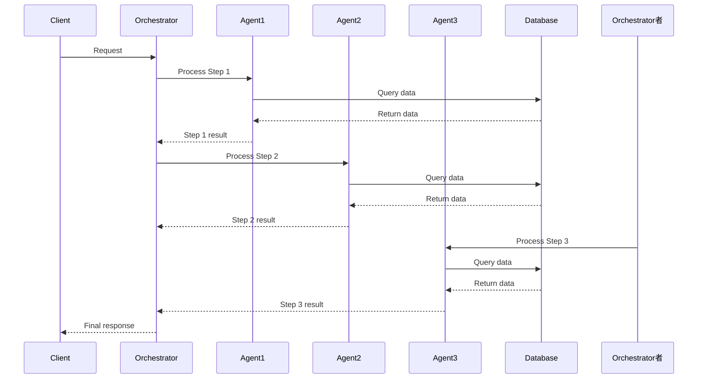

### **2. Parallel Workflow Pattern**

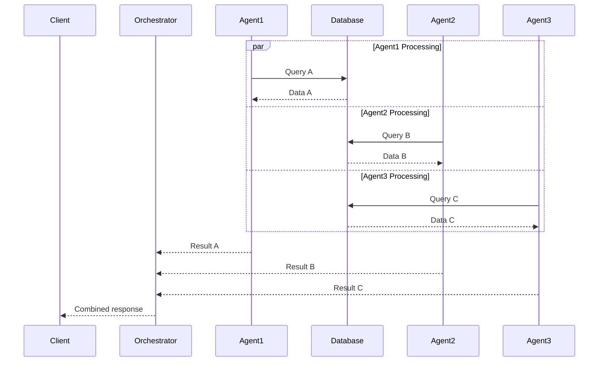

### **3. Event-Driven Workflow Pattern**

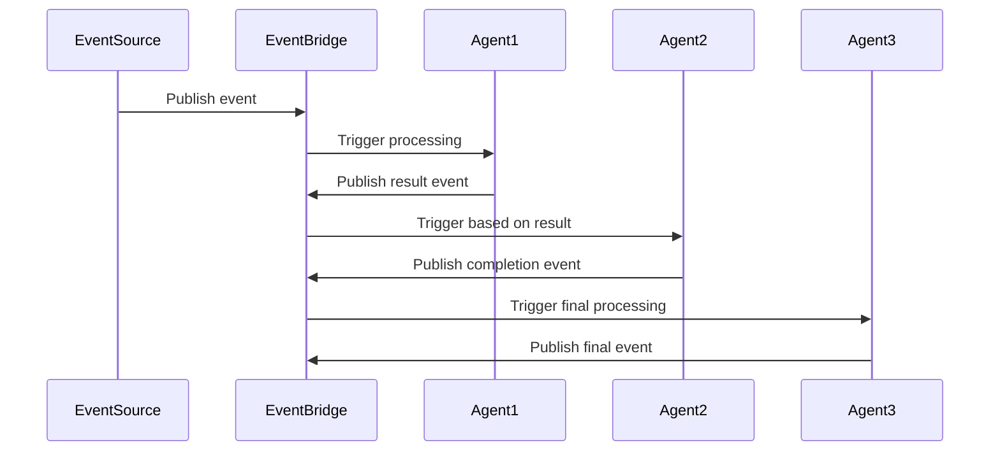

## 🤖 Individual Agent Workflows

### **Recommendation Agent Workflow**

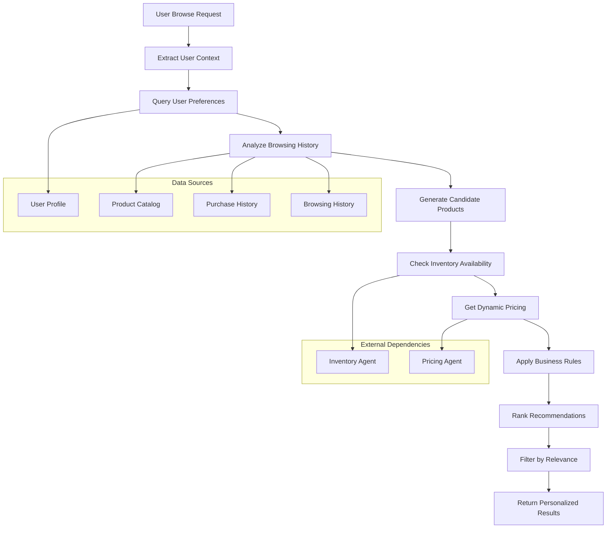

**Recommendation Agent Process Flow:**

1. **Context Extraction**: Analyze user session, device, location, time
2. **Preference Analysis**: Query user preferences and past behavior
3. **Candidate Generation**: Generate initial product candidates
4. **Availability Check**: Verify product availability with Inventory Agent
5. **Price Integration**: Get current pricing from Pricing Agent
6. **Business Rules**: Apply business logic and constraints
7. **Ranking**: Use ML algorithms to rank recommendations
8. **Filtering**: Filter results based on relevance and quality
9. **Response**: Return personalized recommendations

### **Customer Support Agent Workflow**

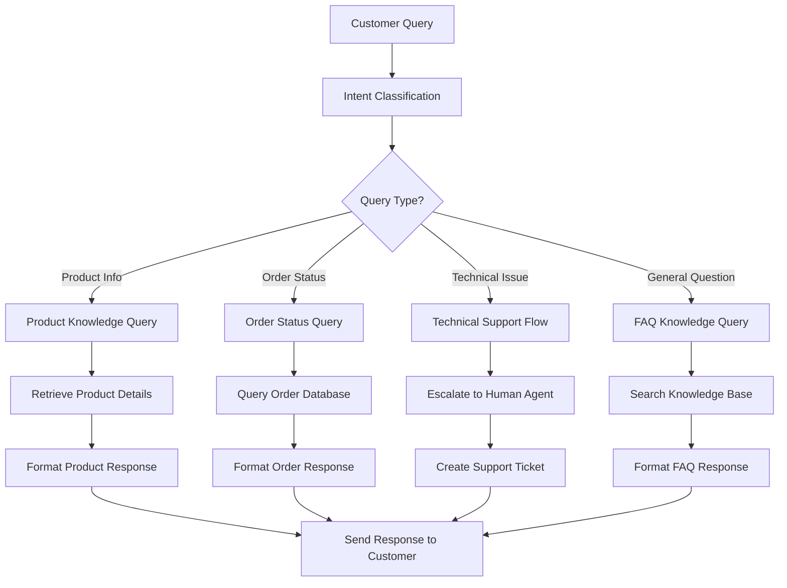

**Customer Support Agent Process Flow:**

1. **Query Analysis**: Parse and classify customer intent
2. **Knowledge Retrieval**: Query relevant knowledge bases
3. **Context Building**: Gather order history and customer context
4. **Response Generation**: Generate contextual responses
5. **Escalation Check**: Determine if human intervention needed
6. **Response Delivery**: Send response through appropriate channel

### **Inventory Agent Workflow**

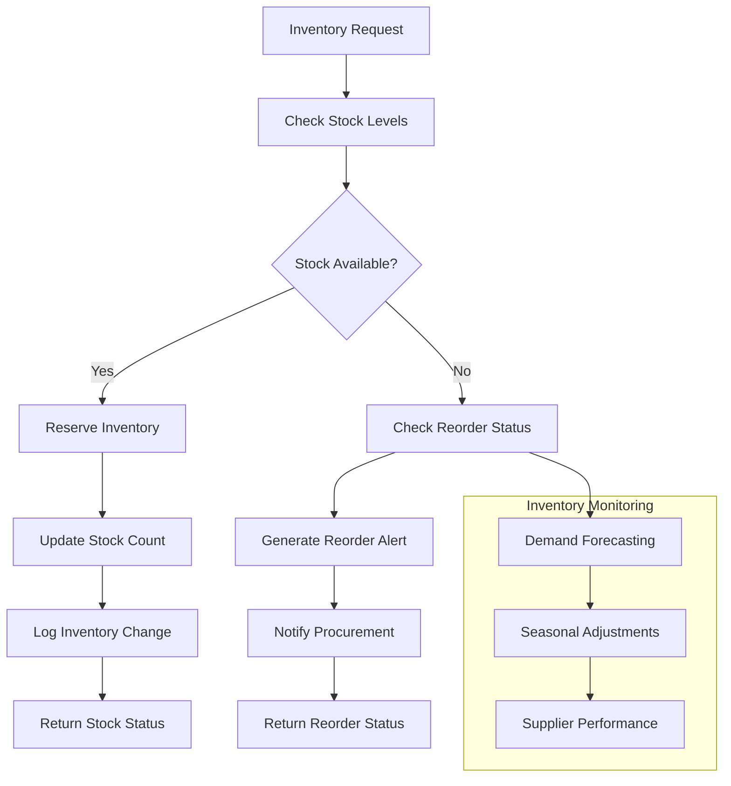

**Inventory Agent Process Flow:**

1. **Stock Check**: Query current inventory levels
2. **Availability Assessment**: Determine if items are available
3. **Reservation Management**: Reserve inventory for orders
4. **Reorder Logic**: Trigger reorder processes when needed
5. **Demand Forecasting**: Predict future inventory needs
6. **Supplier Coordination**: Manage supplier relationships
7. **Reporting**: Generate inventory reports and alerts

### **Order Agent Workflow**

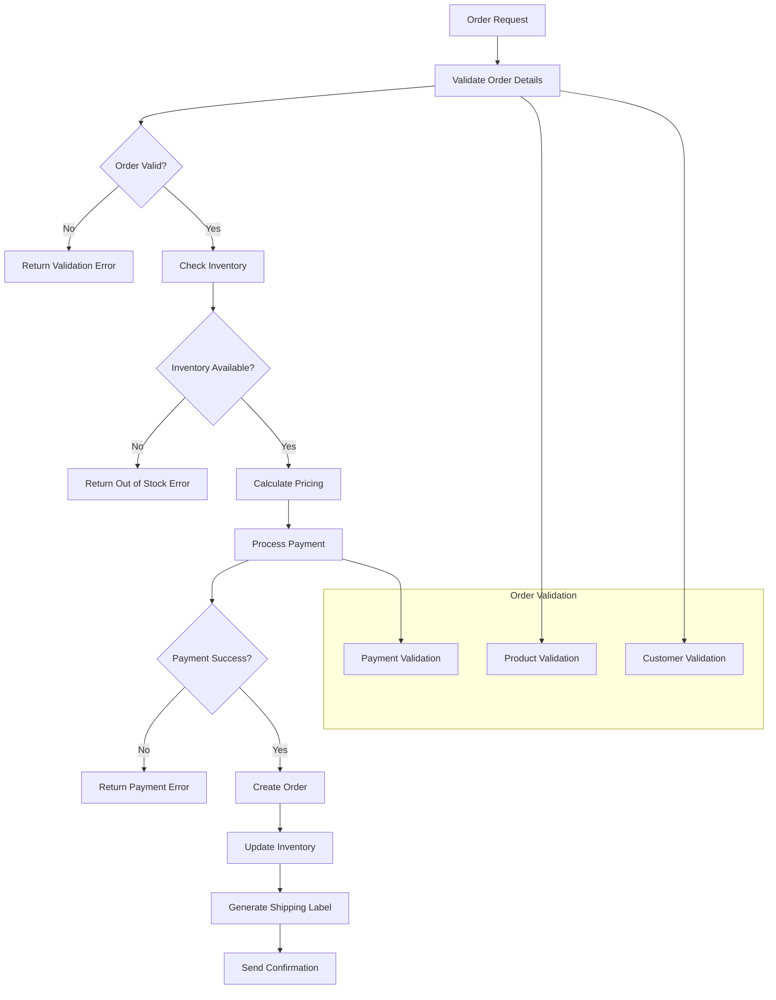

**Order Agent Process Flow:**

1. **Order Validation**: Validate order details and customer info
2. **Inventory Verification**: Confirm product availability
3. **Pricing Calculation**: Calculate final pricing including taxes/shipping
4. **Payment Processing**: Process payment through gateway
5. **Order Creation**: Create order record in database
6. **Inventory Update**: Update stock levels
7. **Shipping Coordination**: Generate shipping labels and tracking
8. **Confirmation**: Send order confirmation to customer

### **Pricing Agent Workflow**

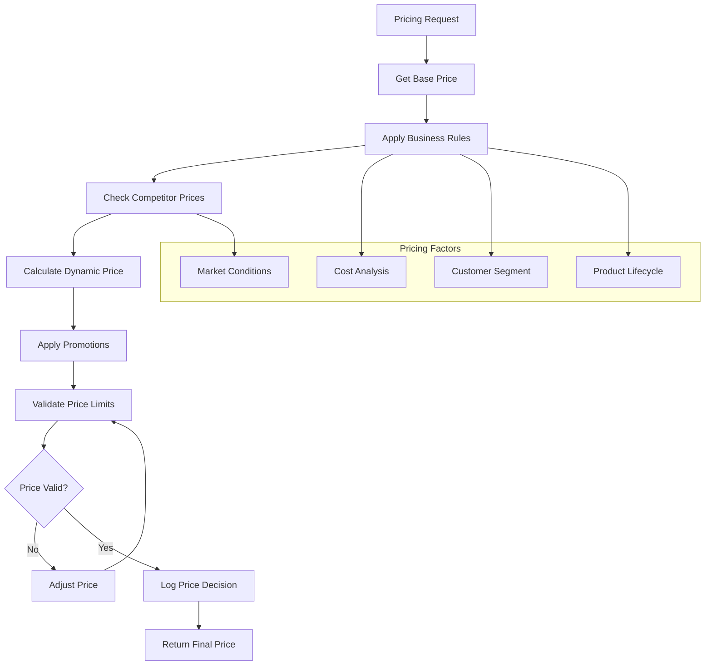

**Pricing Agent Process Flow:**

1. **Base Price Retrieval**: Get product base price
2. **Business Rule Application**: Apply company pricing rules
3. **Competitor Analysis**: Check competitor pricing
4. **Dynamic Calculation**: Calculate optimal price
5. **Promotion Application**: Apply relevant promotions
6. **Price Validation**: Ensure price within acceptable limits
7. **Decision Logging**: Log pricing decisions for analysis
8. **Price Return**: Return final calculated price

### **Marketing Agent Workflow**

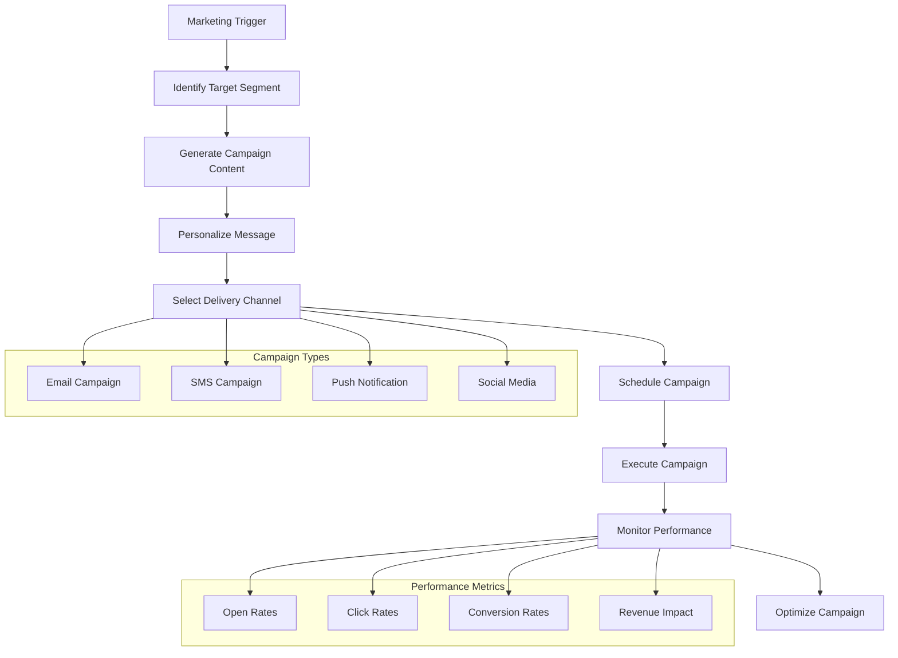

**Marketing Agent Process Flow:**

1. **Trigger Analysis**: Analyze marketing triggers and events
2. **Segmentation**: Identify target customer segments
3. **Content Generation**: Create personalized marketing content
4. **Channel Selection**: Choose appropriate delivery channels
5. **Campaign Scheduling**: Schedule campaigns for optimal timing
6. **Execution**: Execute campaigns across selected channels
7. **Performance Monitoring**: Track campaign performance metrics
8. **Optimization**: Optimize campaigns based on performance data

## 🔄 Cross-Agent Interactions

### **Customer Journey: Product Discovery to Purchase**

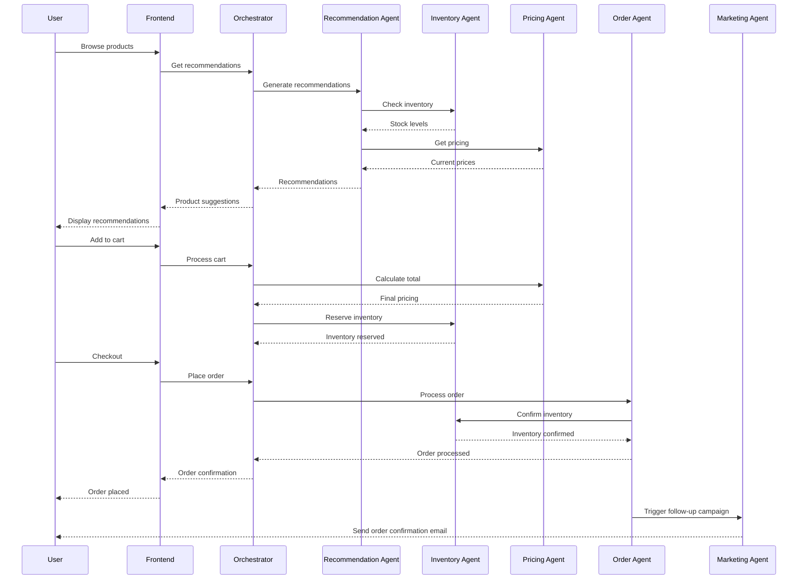

### **Customer Support: Order Inquiry**

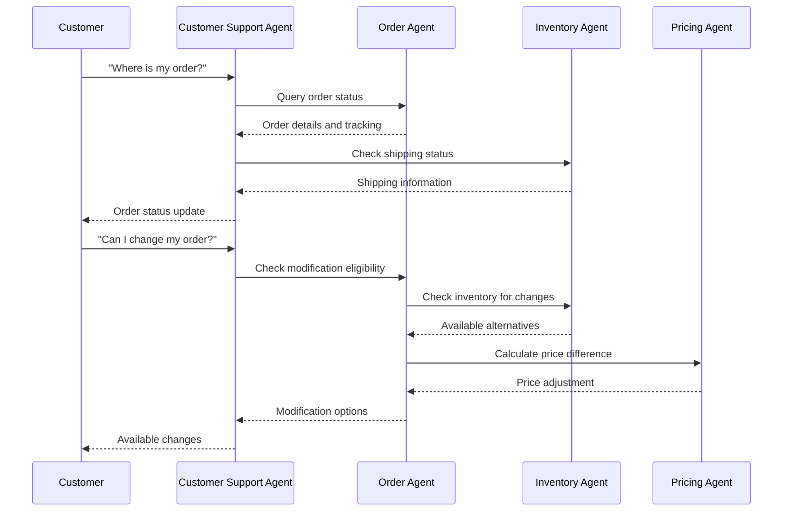

### **Inventory Management: Low Stock Alert**

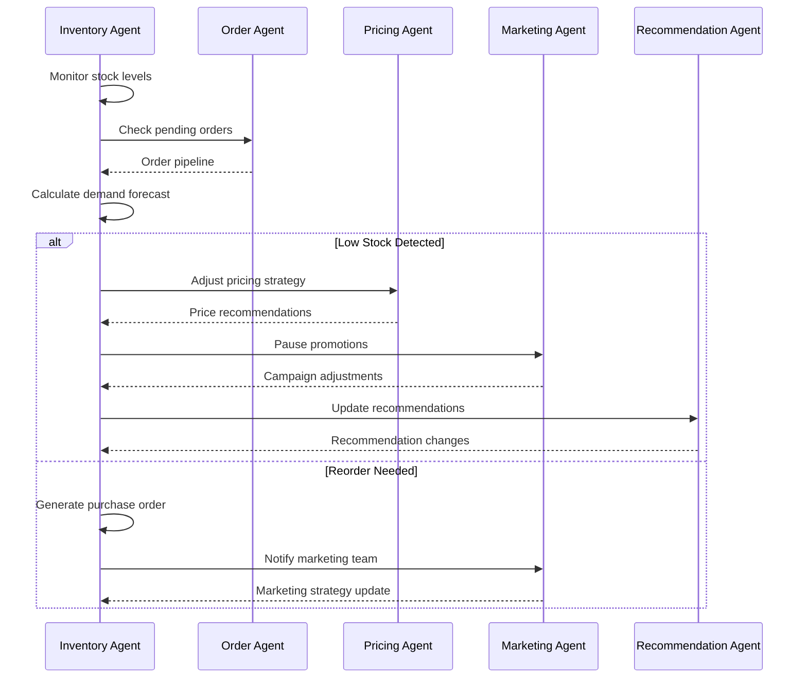

## ⚠️ Error Handling

### **Error Handling Patterns**

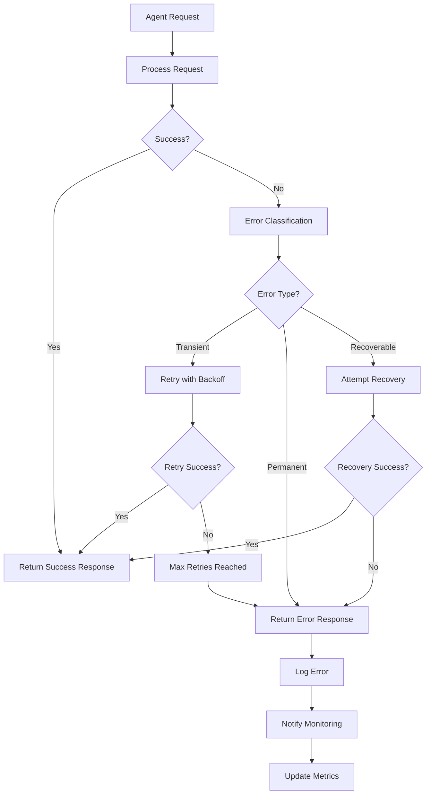

### **Error Recovery Strategies**

| Error Type | Recovery Strategy | Retry Logic | Fallback |
|------------|------------------|-------------|----------|
| **Network Timeout** | Exponential backoff | 3 attempts | Cached response |
| **Service Unavailable** | Circuit breaker | 5 attempts | Alternative service |
| **Invalid Input** | Input validation | No retry | Error message |
| **Rate Limiting** | Wait and retry | 3 attempts | Queue request |
| **Authentication** | Token refresh | 1 attempt | Re-authenticate |

## 🚀 Performance Optimization

### **Agent Performance Optimization**

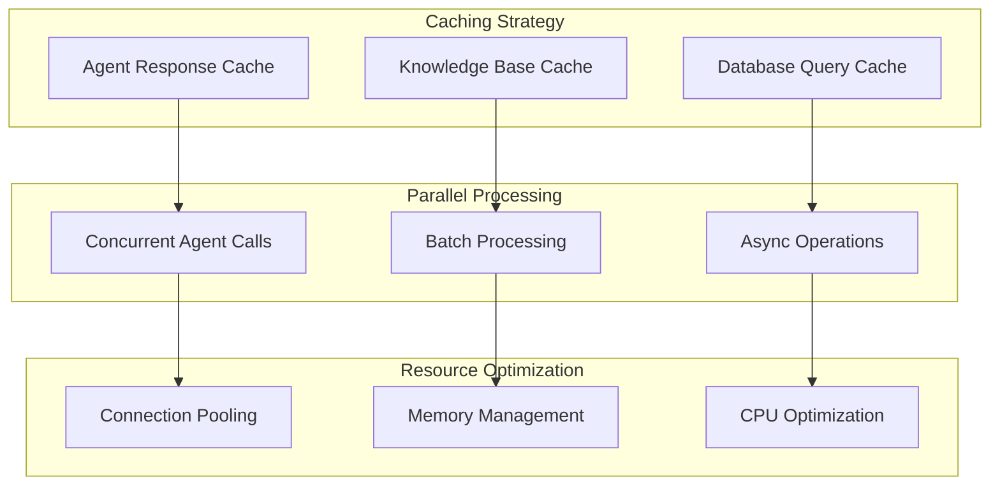

### **Performance Metrics**

| Metric | Target | Monitoring Method |
|--------|--------|------------------|
| **Agent Response Time** | < 1 second | CloudWatch custom metrics |
| **Knowledge Base Query Time** | < 500ms | Bedrock metrics |
| **Database Query Time** | < 100ms | DynamoDB metrics |
| **Cache Hit Ratio** | > 90% | ElastiCache metrics |
| **Error Rate** | < 1% | CloudWatch alarms |

---

## 🎯 Next Steps

1. **[Data Flow](./data-flow.md)** - Detailed data flow patterns
2. **[Security Model](./security-model.md)** - Agent security implementation
3. **[Performance Specs](./performance-specs.md)** - Performance requirements

---

**These workflows provide a comprehensive framework for implementing and managing multi-agent interactions in the e-commerce platform. Each workflow is designed to be resilient, performant, and maintainable.**
