# 📊 Data Flow Architecture

## 📋 Table of Contents
- [Data Flow Overview](#data-flow-overview)
- [Data Ingestion Patterns](#data-ingestion-patterns)
- [Data Processing Pipelines](#data-processing-pipelines)
- [Data Storage Architecture](#data-storage-architecture)
- [Data Consumption Patterns](#data-consumption-patterns)
- [Real-time Data Flow](#real-time-data-flow)
- [Batch Processing Flow](#batch-processing-flow)
- [Data Governance](#data-governance)

## 🎯 Data Flow Overview

The multi-agentic e-commerce platform processes various types of data through sophisticated pipelines to support real-time decision making, personalization, and analytics. The data flow architecture ensures high availability, scalability, and consistency across all agents and services.

### **Data Flow Architecture Diagram**

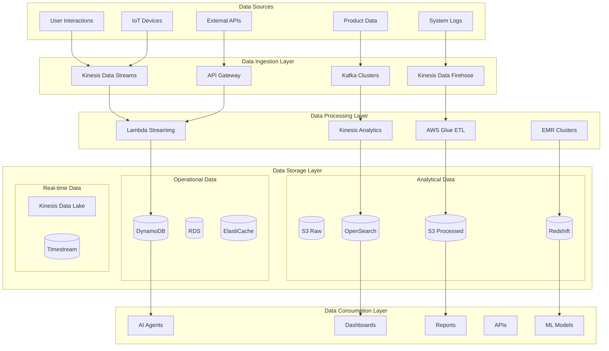

## 📥 Data Ingestion Patterns

### **Real-time Data Ingestion**

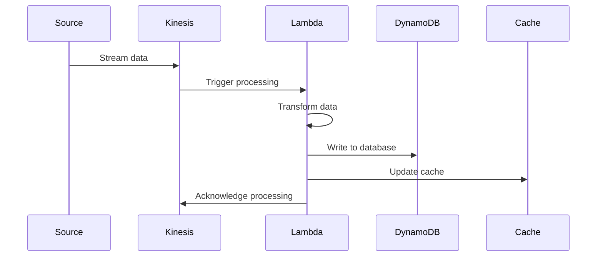

### **Batch Data Ingestion**

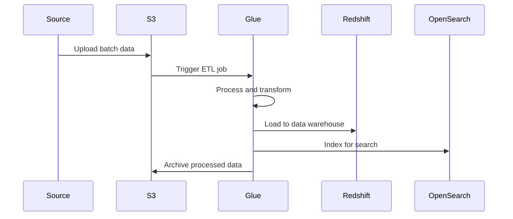

### **API Data Ingestion**

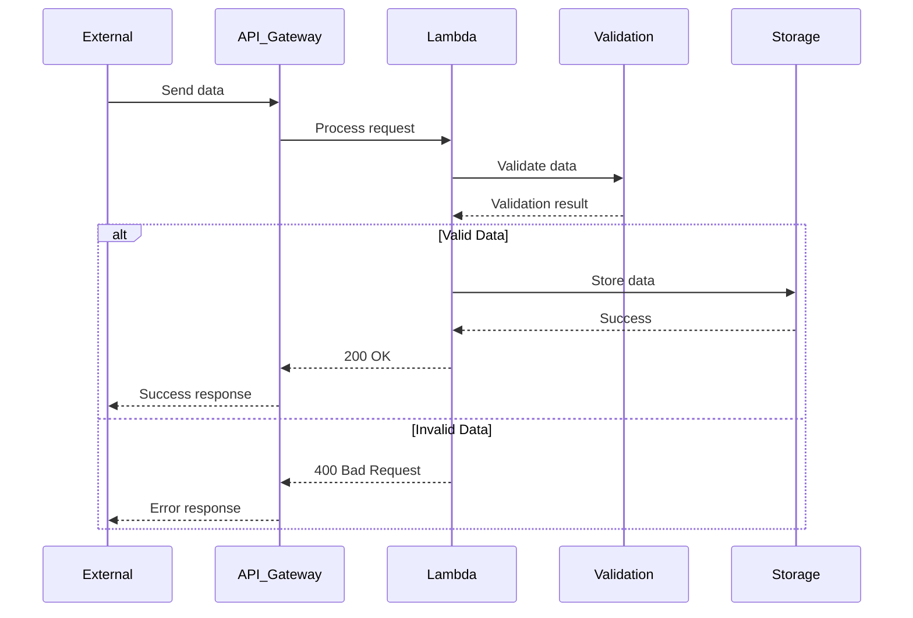

## 🔄 Data Processing Pipelines

### **User Behavior Processing Pipeline**

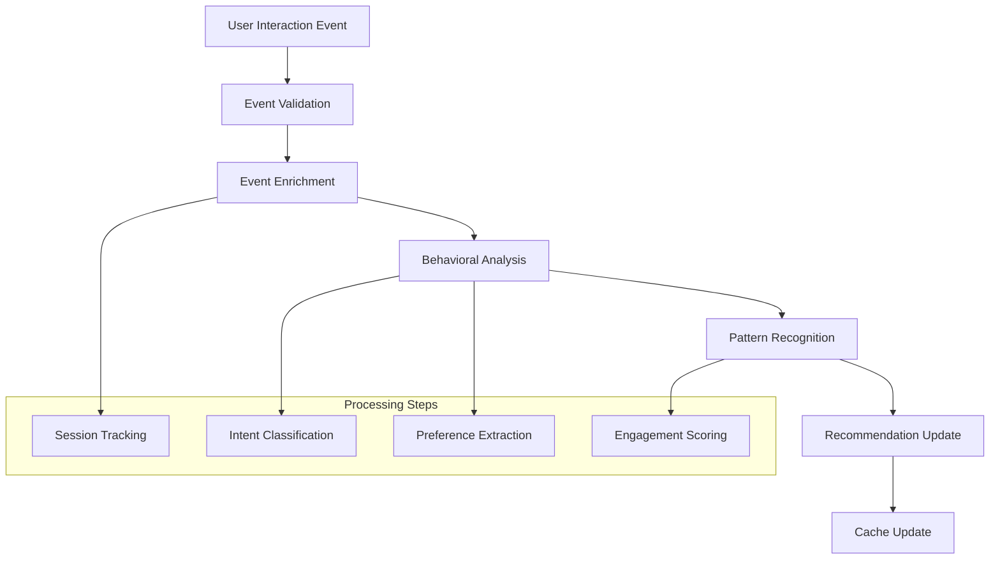

### **Product Data Processing Pipeline**

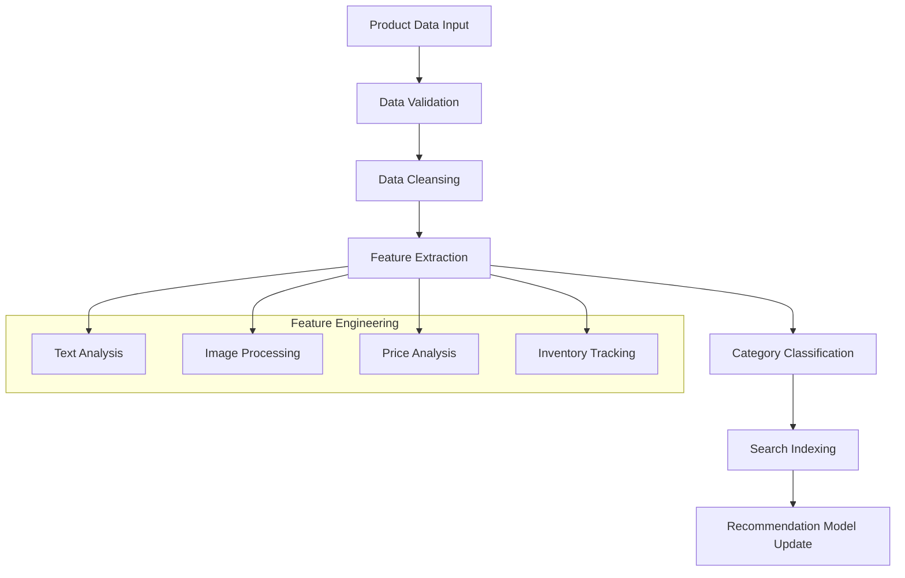

### **Order Processing Pipeline**

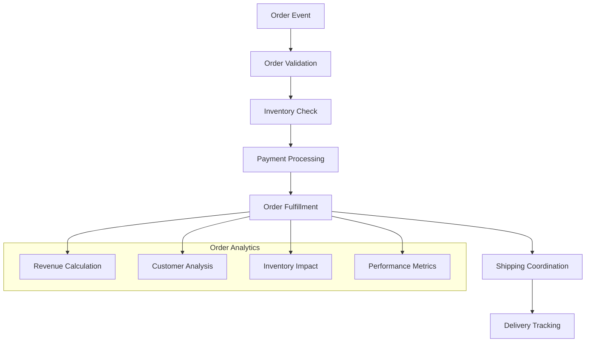

## 💾 Data Storage Architecture

### **Data Storage Strategy**

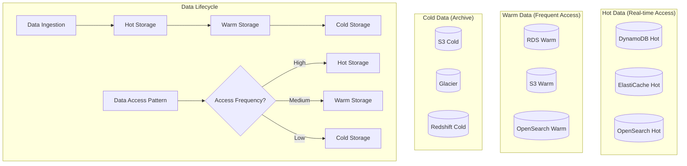

### **Data Partitioning Strategy**

| Data Type | Partitioning Strategy | Storage | Access Pattern |
|-----------|----------------------|---------|----------------|
| **User Data** | User ID hash | DynamoDB | Random access |
| **Product Data** | Category + SKU | DynamoDB | Range queries |
| **Order Data** | Date + Order ID | RDS | Time-series |
| **Analytics Data** | Date + Metric | S3 | Batch processing |
| **Search Data** | Document type | OpenSearch | Full-text search |

## 📊 Data Consumption Patterns

### **Agent Data Consumption**

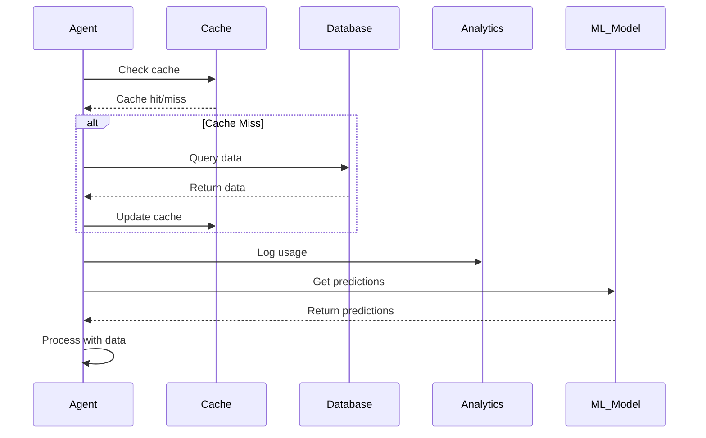

### **Dashboard Data Consumption**

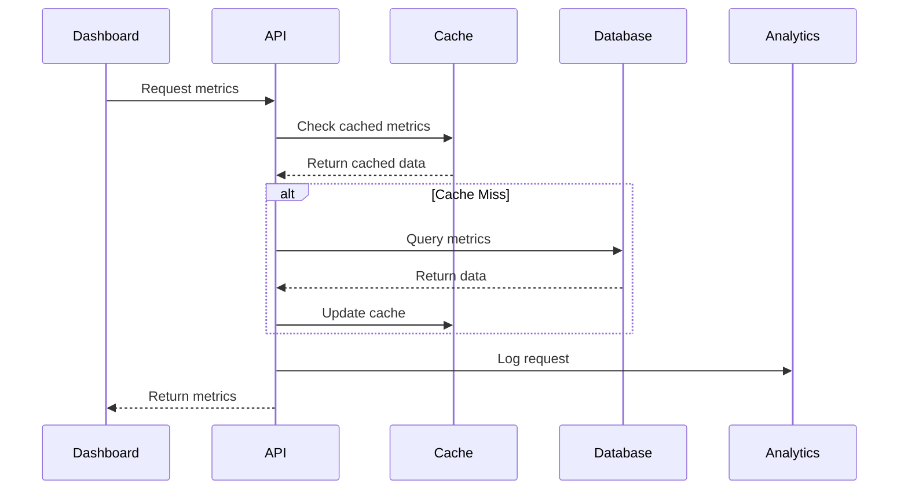

## ⚡ Real-time Data Flow

### **Real-time User Interaction Flow**

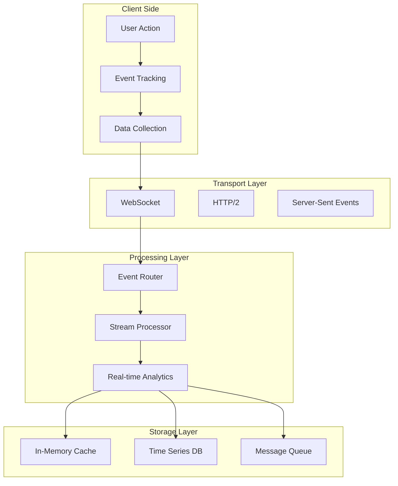

### **Real-time Recommendation Updates**

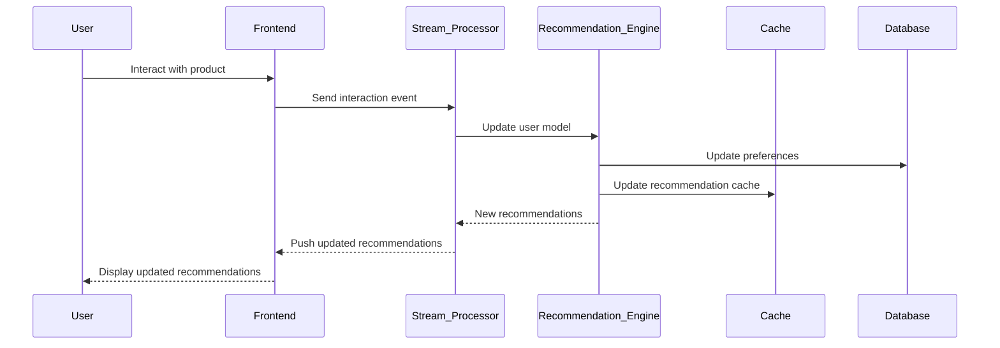

## 📦 Batch Processing Flow

### **Daily Analytics Processing**

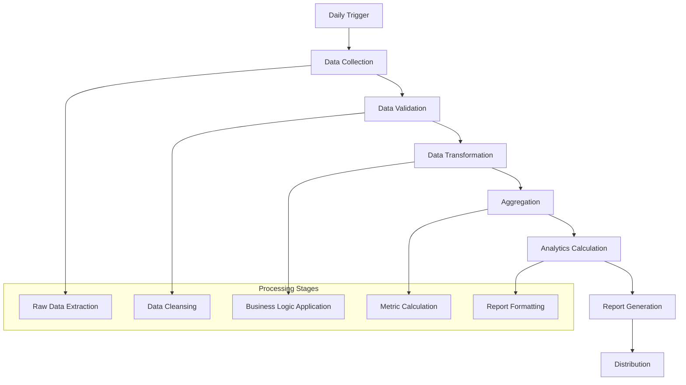

### **Weekly Model Retraining**

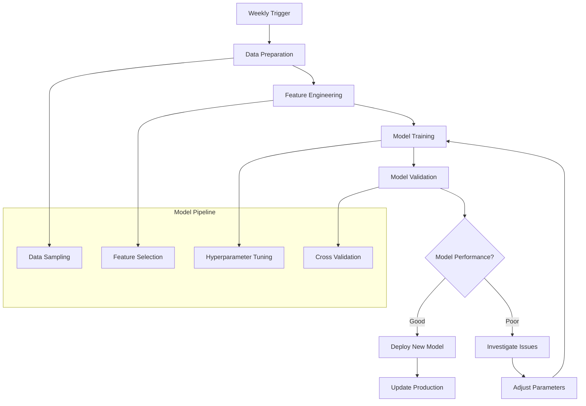

## 🛡️ Data Governance

### **Data Quality Framework**

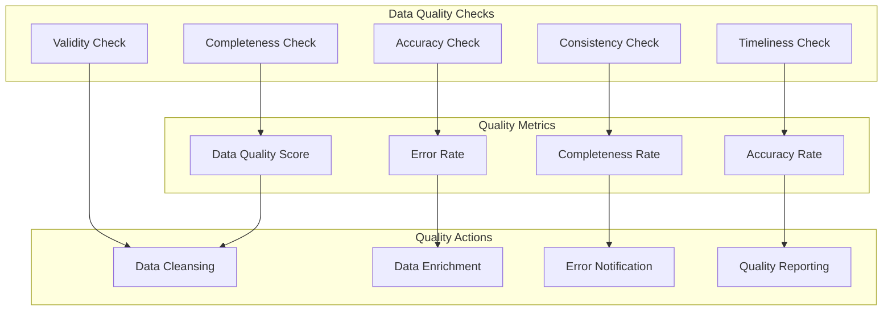

### **Data Privacy and Security**

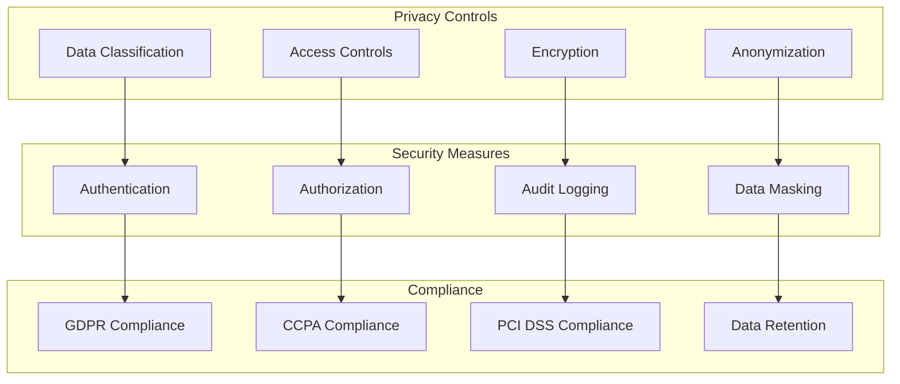

### **Data Lineage Tracking**

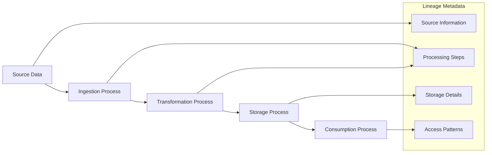

## 📈 Data Monitoring and Observability

### **Data Pipeline Monitoring**

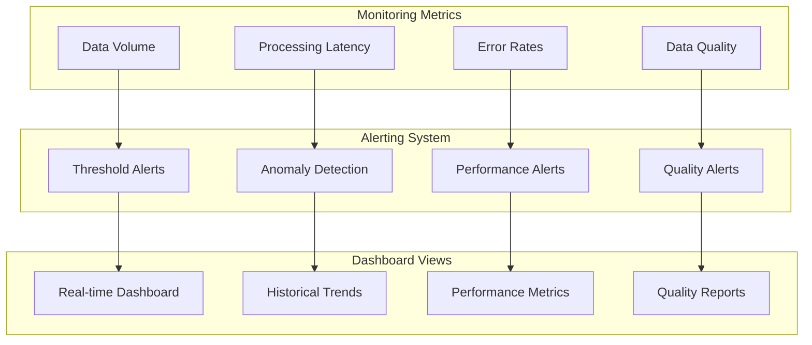

### **Data Quality Monitoring**

| Metric | Threshold | Alert Level | Action |
|--------|-----------|-------------|--------|
| **Data Completeness** | > 95% | Warning | Investigate source |
| **Processing Latency** | < 5 minutes | Critical | Scale resources |
| **Error Rate** | < 1% | Warning | Review logs |
| **Data Freshness** | < 1 hour | Critical | Check pipeline |

---

## 🎯 Next Steps

1. **[Security Model](./security-model.md)** - Data security implementation
2. **[Performance Specs](./performance-specs.md)** - Data performance requirements
3. **[Implementation Guide](../docs/implementation.md)** - Practical implementation steps

---

**This data flow architecture ensures efficient, scalable, and reliable data processing across the multi-agent e-commerce platform, supporting both real-time and batch processing requirements.**
