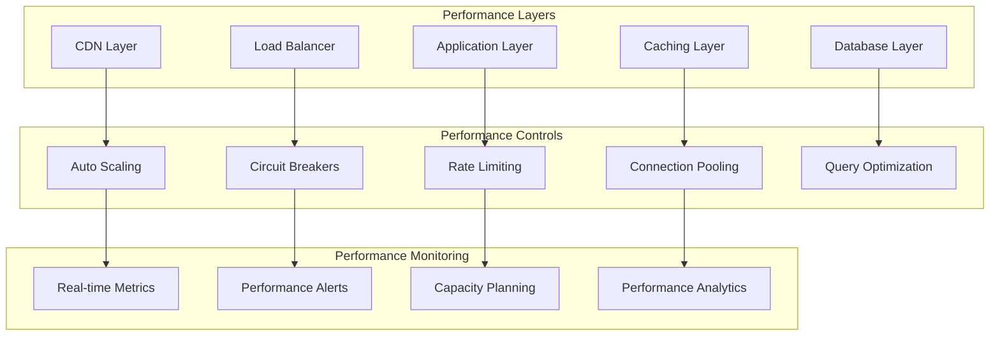
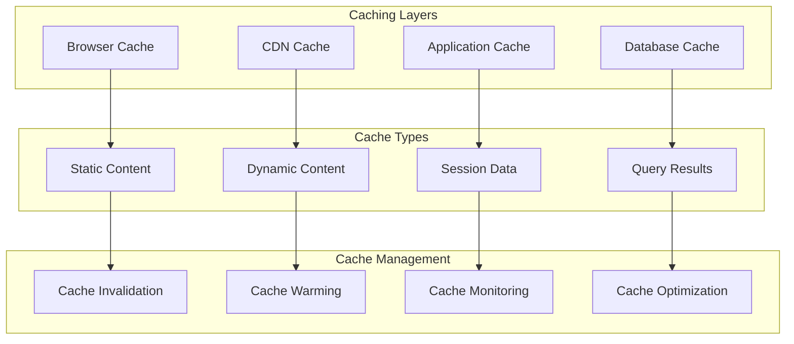
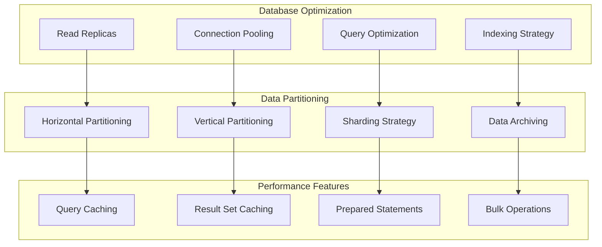
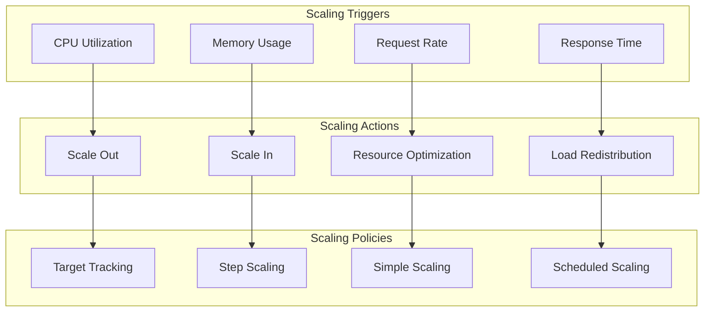
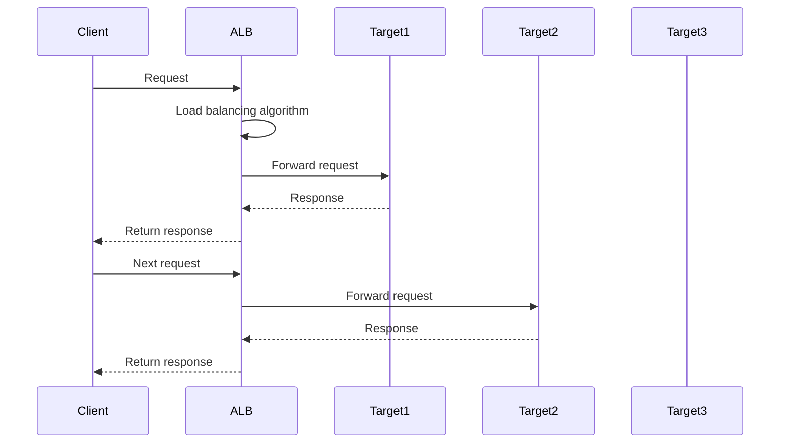
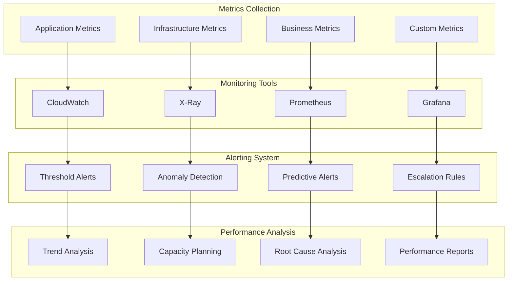
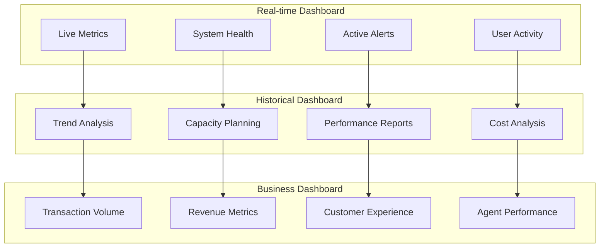
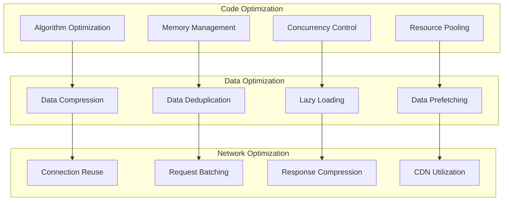
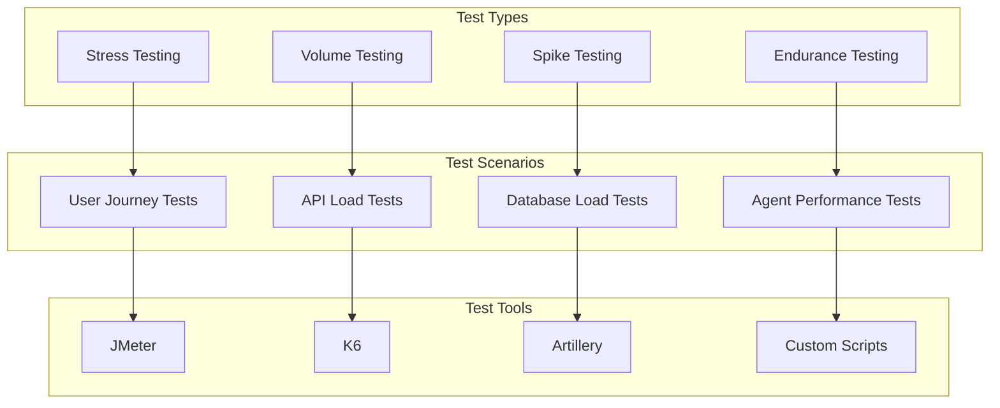
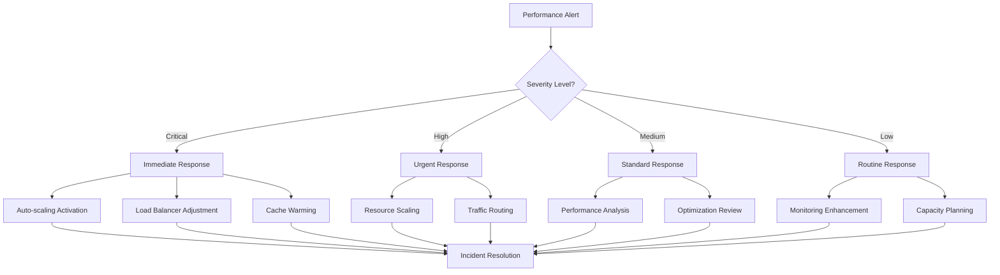

# ⚡ Performance Architecture

## 📋 Table of Contents
- [Performance Overview](#performance-overview)
- [Performance Requirements](#performance-requirements)
- [Performance Architecture](#performance-architecture)
- [Scaling Strategies](#scaling-strategies)
- [Performance Monitoring](#performance-monitoring)
- [Optimization Techniques](#optimization-techniques)
- [Load Testing](#load-testing)
- [Performance SLA](#performance-sla)

## 🎯 Performance Overview

The multi-agentic e-commerce platform is designed to handle high-volume transactions with low latency and high availability. The performance architecture ensures optimal user experience while maintaining cost efficiency and scalability.

### **Performance Principles**
- **Low Latency**: Sub-second response times for critical operations
- **High Throughput**: Support for concurrent users and transactions
- **Scalability**: Auto-scaling based on demand patterns
- **Availability**: 99.9% uptime with fault tolerance
- **Cost Efficiency**: Optimal resource utilization
- **Predictable Performance**: Consistent performance under varying loads

### **Performance Architecture Diagram**



## 📊 Performance Requirements

### **Response Time Requirements**

| Operation Type | Target Response Time | 95th Percentile | 99th Percentile |
|----------------|---------------------|-----------------|-----------------|
| **Product Search** | < 200ms | < 500ms | < 1000ms |
| **Recommendations** | < 300ms | < 800ms | < 1500ms |
| **Order Processing** | < 500ms | < 1000ms | < 2000ms |
| **Payment Processing** | < 1000ms | < 2000ms | < 5000ms |
| **Customer Support** | < 1000ms | < 2000ms | < 3000ms |
| **Inventory Check** | < 100ms | < 200ms | < 500ms |

### **Throughput Requirements**

| Component | Target RPS | Peak RPS | Burst Capacity |
|-----------|------------|----------|----------------|
| **API Gateway** | 10,000 | 50,000 | 100,000 |
| **Recommendation Agent** | 5,000 | 25,000 | 50,000 |
| **Customer Support Agent** | 2,000 | 10,000 | 20,000 |
| **Inventory Agent** | 8,000 | 40,000 | 80,000 |
| **Order Agent** | 3,000 | 15,000 | 30,000 |
| **Pricing Agent** | 6,000 | 30,000 | 60,000 |

### **Availability Requirements**

| Service Tier | Availability Target | RTO | RPO |
|--------------|-------------------|-----|-----|
| **Critical Services** | 99.95% | 15 minutes | 5 minutes |
| **Important Services** | 99.9% | 30 minutes | 15 minutes |
| **Standard Services** | 99.5% | 1 hour | 30 minutes |

## 🏗️ Performance Architecture

### **Caching Strategy**



### **Caching Configuration**

| Cache Type | TTL | Storage | Eviction Policy | Use Case |
|------------|-----|---------|----------------|----------|
| **Product Data** | 1 hour | ElastiCache | LRU | Product information |
| **User Preferences** | 24 hours | ElastiCache | LRU | Personalization |
| **Search Results** | 30 minutes | ElastiCache | LRU | Search queries |
| **Recommendations** | 15 minutes | ElastiCache | LRU | Product suggestions |
| **Pricing Data** | 5 minutes | ElastiCache | LRU | Dynamic pricing |

### **Database Performance**



## 📈 Scaling Strategies

### **Auto Scaling Configuration**



### **Scaling Parameters**

| Component | Min Instances | Max Instances | Target CPU | Target Memory | Scale Out Cooldown |
|-----------|---------------|---------------|------------|---------------|-------------------|
| **API Gateway** | 2 | 50 | 70% | 80% | 300s |
| **Lambda Functions** | 10 | 1000 | 60% | 70% | 60s |
| **ECS Tasks** | 3 | 100 | 70% | 75% | 300s |
| **RDS Instances** | 1 | 5 | 80% | 85% | 900s |
| **ElastiCache** | 2 | 20 | 70% | 80% | 300s |

### **Load Balancing Strategy**



## 📊 Performance Monitoring

### **Monitoring Architecture**



### **Key Performance Indicators (KPIs)**

| KPI | Target | Measurement | Alert Threshold |
|-----|--------|-------------|-----------------|
| **Response Time** | < 500ms | 95th percentile | > 1000ms |
| **Throughput** | 10,000 RPS | Requests per second | < 5,000 RPS |
| **Error Rate** | < 0.1% | Failed requests | > 1% |
| **Availability** | 99.9% | Uptime percentage | < 99.5% |
| **CPU Utilization** | < 70% | Average CPU usage | > 85% |
| **Memory Usage** | < 80% | Average memory usage | > 90% |

### **Performance Dashboards**



## 🔧 Optimization Techniques

### **Application Optimization**



### **Database Optimization**

```sql
-- Example optimized queries
-- 1. Optimized product search with proper indexing
SELECT p.*, 
       CASE 
           WHEN p.stock > 0 THEN 'in_stock'
           ELSE 'out_of_stock'
       END as availability_status
FROM products p
WHERE p.category_id = ? 
  AND p.price BETWEEN ? AND ?
  AND p.status = 'active'
ORDER BY p.popularity_score DESC, p.price ASC
LIMIT 20;

-- 2. Optimized recommendation query with caching
SELECT p.product_id, p.name, p.price, p.image_url,
       SUM(oi.quantity) as total_purchased
FROM products p
JOIN order_items oi ON p.product_id = oi.product_id
JOIN orders o ON oi.order_id = o.order_id
WHERE o.user_id = ?
  AND o.created_at >= DATE_SUB(NOW(), INTERVAL 30 DAY)
GROUP BY p.product_id, p.name, p.price, p.image_url
HAVING total_purchased > 0
ORDER BY total_purchased DESC
LIMIT 10;
```

### **Caching Optimization**

```python
import redis
import json
import hashlib
from typing import Any, Optional, Dict
from functools import wraps
import time

class CacheOptimizer:
    def __init__(self, redis_client: redis.Redis):
        self.redis = redis_client
        self.default_ttl = 3600  # 1 hour
    
    def cache_result(self, ttl: int = None):
        """Decorator for caching function results"""
        def decorator(func):
            @wraps(func)
            def wrapper(*args, **kwargs):
                # Generate cache key
                cache_key = self._generate_cache_key(func.__name__, args, kwargs)
                
                # Try to get from cache
                cached_result = self.redis.get(cache_key)
                if cached_result:
                    return json.loads(cached_result)
                
                # Execute function and cache result
                result = func(*args, **kwargs)
                self.redis.setex(
                    cache_key, 
                    ttl or self.default_ttl, 
                    json.dumps(result, default=str)
                )
                
                return result
            return wrapper
        return decorator
    
    def _generate_cache_key(self, func_name: str, args: tuple, kwargs: dict) -> str:
        """Generate unique cache key"""
        key_data = f"{func_name}:{args}:{sorted(kwargs.items())}"
        return f"cache:{hashlib.md5(key_data.encode()).hexdigest()}"
    
    def warm_cache(self, warmup_functions: list):
        """Warm up cache with frequently accessed data"""
        for func in warmup_functions:
            try:
                func()
            except Exception as e:
                print(f"Cache warming failed for {func.__name__}: {e}")
    
    def invalidate_pattern(self, pattern: str):
        """Invalidate cache entries matching pattern"""
        keys = self.redis.keys(pattern)
        if keys:
            self.redis.delete(*keys)
```

## 🧪 Load Testing

### **Load Testing Strategy**



### **Load Testing Scenarios**

#### **Scenario 1: Normal Load**
- **Users**: 1,000 concurrent users
- **Duration**: 30 minutes
- **Actions**: Browse, search, add to cart, checkout
- **Expected**: All operations complete within SLA

#### **Scenario 2: Peak Load**
- **Users**: 5,000 concurrent users
- **Duration**: 15 minutes
- **Actions**: High-volume transactions
- **Expected**: System maintains performance with auto-scaling

#### **Scenario 3: Spike Load**
- **Users**: 0 → 10,000 → 0 users
- **Duration**: 5 minutes
- **Actions**: Sudden traffic spike
- **Expected**: System scales up and down gracefully

### **Load Testing Scripts**

```javascript
// K6 Load Testing Script
import http from 'k6/http';
import { check, sleep } from 'k6';

export let options = {
  stages: [
    { duration: '2m', target: 1000 }, // Ramp up
    { duration: '5m', target: 1000 }, // Stay at 1000 users
    { duration: '2m', target: 5000 }, // Ramp up to 5000
    { duration: '10m', target: 5000 }, // Stay at 5000 users
    { duration: '2m', target: 0 }, // Ramp down
  ],
  thresholds: {
    http_req_duration: ['p(95)<1000'], // 95% of requests under 1s
    http_req_failed: ['rate<0.01'], // Error rate under 1%
  },
};

export default function() {
  // Test product search
  let searchResponse = http.get('https://api.example.com/products/search?q=laptop');
  check(searchResponse, {
    'search status is 200': (r) => r.status === 200,
    'search response time < 500ms': (r) => r.timings.duration < 500,
  });
  
  sleep(1);
  
  // Test recommendations
  let recResponse = http.get('https://api.example.com/recommendations/user/123');
  check(recResponse, {
    'recommendations status is 200': (r) => r.status === 200,
    'recommendations response time < 800ms': (r) => r.timings.duration < 800,
  });
  
  sleep(2);
}
```

## 📋 Performance SLA

### **Service Level Agreements**

| Service | Availability | Response Time | Throughput | Error Rate |
|---------|-------------|---------------|------------|------------|
| **Product Search** | 99.9% | < 200ms | 10,000 RPS | < 0.1% |
| **Recommendations** | 99.9% | < 300ms | 5,000 RPS | < 0.1% |
| **Order Processing** | 99.95% | < 500ms | 3,000 RPS | < 0.05% |
| **Payment Processing** | 99.95% | < 1000ms | 2,000 RPS | < 0.05% |
| **Customer Support** | 99.5% | < 1000ms | 2,000 RPS | < 0.5% |
| **Inventory Management** | 99.9% | < 100ms | 8,000 RPS | < 0.1% |

### **Performance Monitoring SLA**

| Metric | Monitoring Frequency | Alert Response Time | Escalation Time |
|--------|---------------------|-------------------|-----------------|
| **Response Time** | Every 1 minute | 2 minutes | 5 minutes |
| **Availability** | Every 1 minute | 1 minute | 3 minutes |
| **Error Rate** | Every 1 minute | 2 minutes | 5 minutes |
| **Throughput** | Every 5 minutes | 5 minutes | 10 minutes |
| **Resource Usage** | Every 1 minute | 5 minutes | 15 minutes |

### **Performance Incident Response**



---

## 🎯 Next Steps

1. **[Implementation Guide](../docs/implementation.md)** - Performance implementation steps
2. **[Monitoring Setup](../docs/monitoring.md)** - Performance monitoring configuration
3. **[Load Testing Guide](../docs/load-testing.md)** - Detailed load testing procedures

---

**This performance architecture ensures the multi-agentic e-commerce platform delivers optimal user experience while maintaining cost efficiency and scalability under varying load conditions.**
