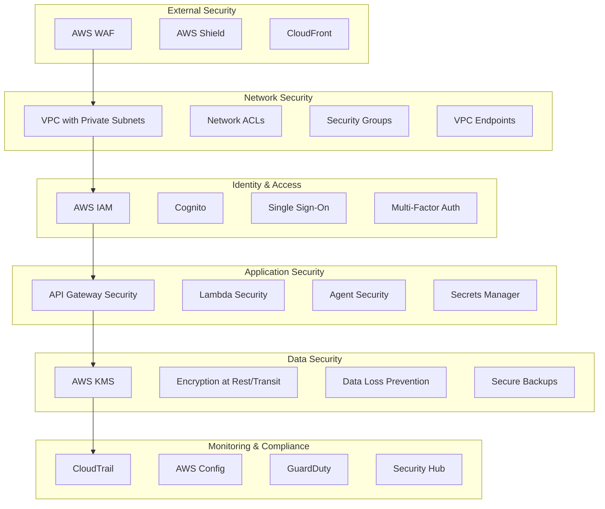
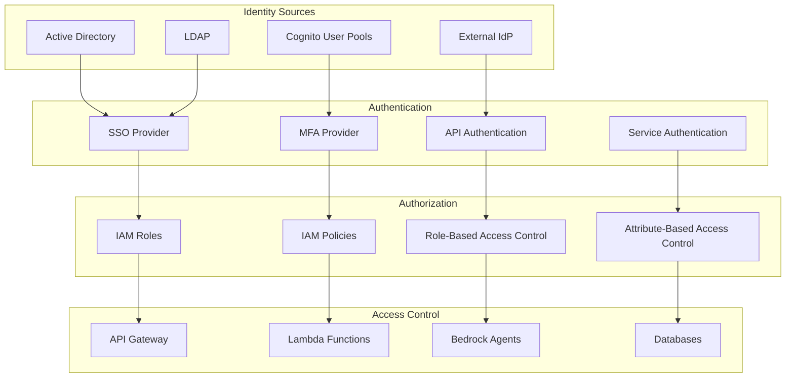
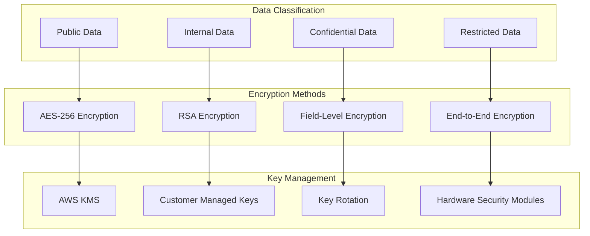
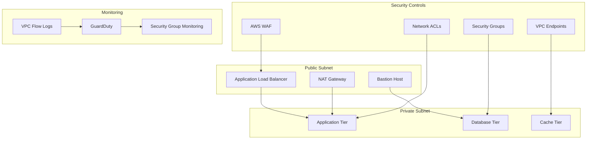
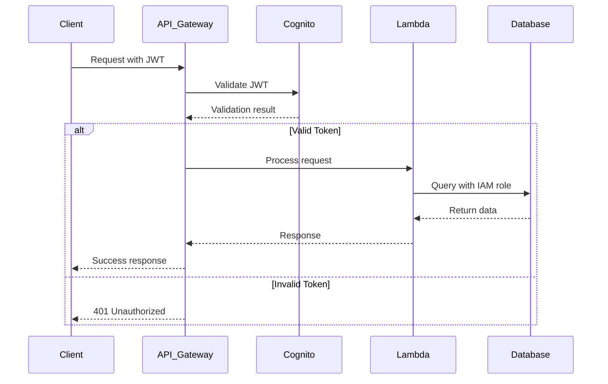
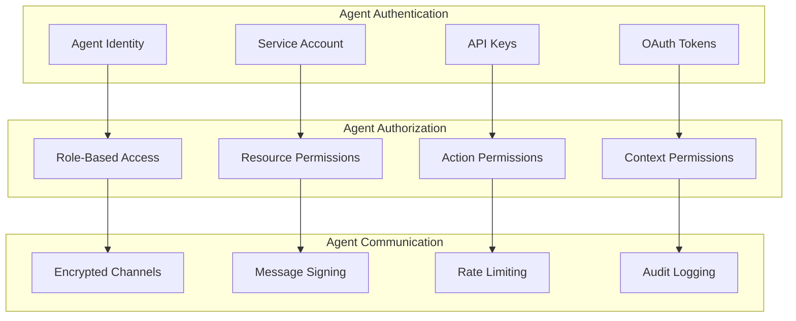
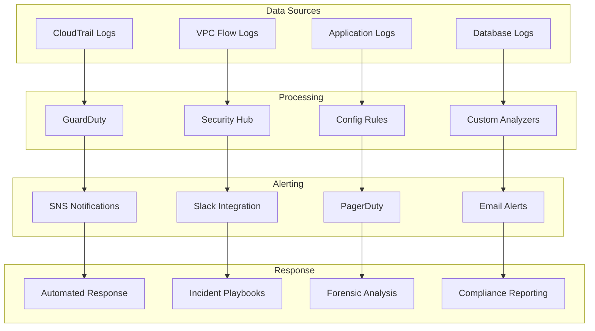
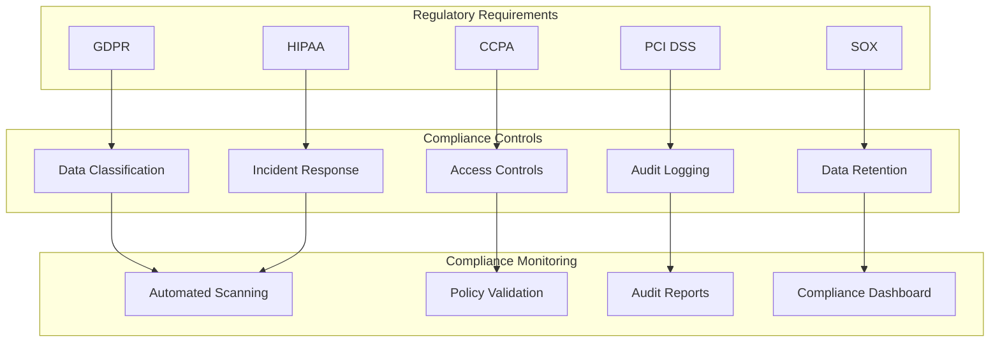
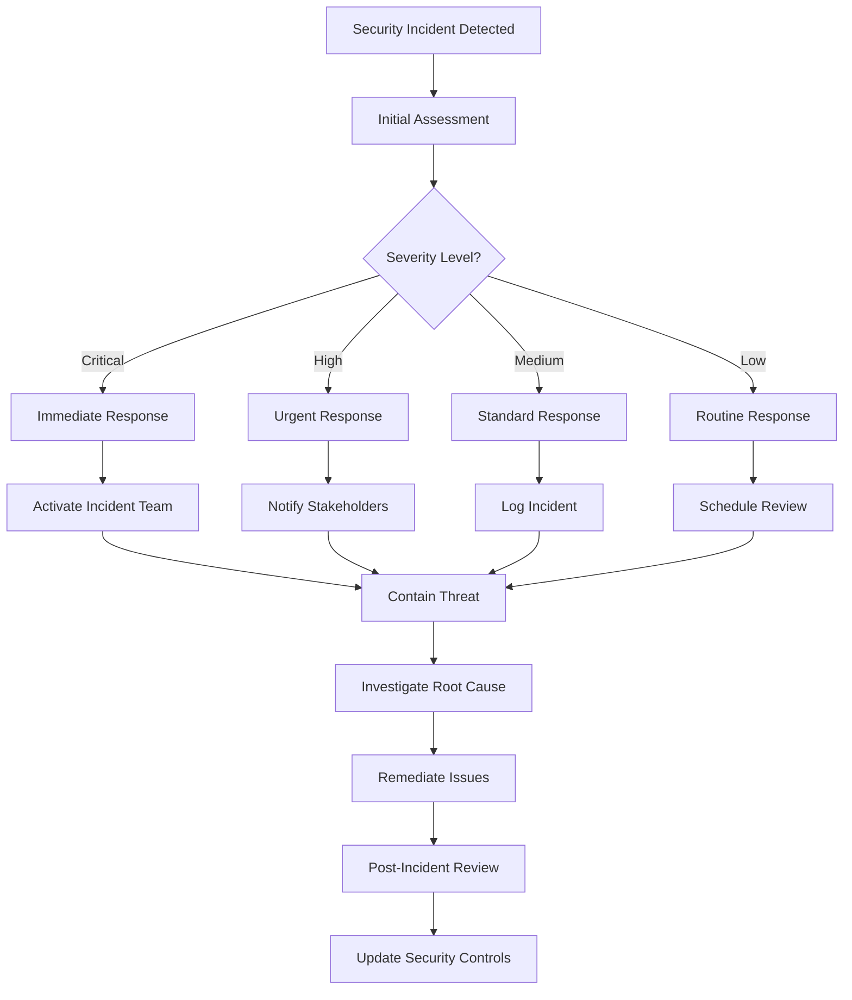
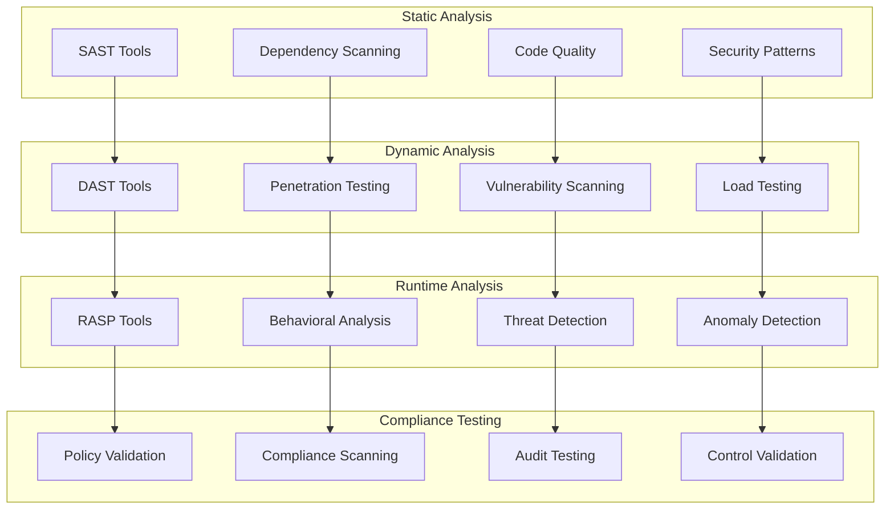

# 🔒 Security Architecture

## 📋 Table of Contents
- [Security Overview](#security-overview)
- [Security Architecture](#security-architecture)
- [Identity and Access Management](#identity-and-access-management)
- [Data Protection](#data-protection)
- [Network Security](#network-security)
- [Application Security](#application-security)
- [Monitoring and Compliance](#monitoring-and-compliance)
- [Incident Response](#incident-response)

## 🎯 Security Overview

The multi-agentic e-commerce platform implements a comprehensive security model based on the principle of defense in depth. The security architecture ensures protection at multiple layers while maintaining performance and usability.

### **Security Principles**
- **Zero Trust Architecture**: Never trust, always verify
- **Least Privilege Access**: Minimum necessary permissions
- **Defense in Depth**: Multiple security layers
- **Security by Design**: Built-in security from the ground up
- **Continuous Monitoring**: Real-time threat detection
- **Compliance by Default**: Built-in regulatory compliance

### **Security Architecture Diagram**



## 🔐 Identity and Access Management

### **IAM Architecture**



### **Role-Based Access Control (RBAC)**

| Role | Permissions | Scope | Use Case |
|------|-------------|-------|----------|
| **Admin** | Full system access | All resources | System administration |
| **Developer** | Development resources | Dev/Staging | Application development |
| **Analyst** | Read-only analytics | Analytics data | Business intelligence |
| **Customer** | Limited customer data | Own data only | Customer interactions |
| **Agent** | Agent-specific resources | Assigned agents | AI agent operations |

### **Access Control Policies**

```json
{
  "Version": "2012-10-17",
  "Statement": [
    {
      "Sid": "RecommendationAgentAccess",
      "Effect": "Allow",
      "Action": [
        "bedrock:InvokeModel",
        "bedrock:Retrieve",
        "dynamodb:GetItem",
        "dynamodb:Query",
        "opensearch:Search"
      ],
      "Resource": [
        "arn:aws:bedrock:*:*:agent/recommendation-agent",
        "arn:aws:bedrock:*:*:knowledge-base/recommendation-kb",
        "arn:aws:dynamodb:*:*:table/user-preferences",
        "arn:aws:opensearch:*:*:domain/product-search"
      ],
      "Condition": {
        "StringEquals": {
          "aws:RequestedRegion": "us-east-1"
        }
      }
    }
  ]
}
```

## 🛡️ Data Protection

### **Data Classification and Encryption**



### **Data Protection Levels**

| Data Type | Classification | Encryption | Access Control | Retention |
|-----------|---------------|------------|----------------|-----------|
| **Customer PII** | Restricted | AES-256 + KMS | RBAC + MFA | 7 years |
| **Payment Data** | Restricted | PCI DSS + HSM | Tokenization | 3 years |
| **Product Data** | Internal | AES-256 | RBAC | Indefinite |
| **Analytics Data** | Confidential | AES-256 | Role-based | 5 years |
| **System Logs** | Internal | AES-256 | Admin only | 1 year |

### **Encryption Implementation**

```python
# Data encryption example
import boto3
from cryptography.fernet import Fernet
import json

class DataEncryption:
    def __init__(self):
        self.kms_client = boto3.client('kms')
        self.key_id = 'arn:aws:kms:us-east-1:123456789012:key/12345678-1234-1234-1234-123456789012'
    
    def encrypt_sensitive_data(self, data, context=None):
        """Encrypt sensitive data using AWS KMS"""
        try:
            response = self.kms_client.encrypt(
                KeyId=self.key_id,
                Plaintext=json.dumps(data),
                EncryptionContext=context or {}
            )
            return response['CiphertextBlob']
        except Exception as e:
            raise EncryptionError(f"Failed to encrypt data: {str(e)}")
    
    def decrypt_sensitive_data(self, encrypted_data, context=None):
        """Decrypt sensitive data using AWS KMS"""
        try:
            response = self.kms_client.decrypt(
                CiphertextBlob=encrypted_data,
                EncryptionContext=context or {}
            )
            return json.loads(response['Plaintext'])
        except Exception as e:
            raise DecryptionError(f"Failed to decrypt data: {str(e)}")
```

## 🌐 Network Security

### **Network Architecture**



### **Network Security Rules**

#### **Security Group Rules**

| Security Group | Inbound Rules | Outbound Rules | Purpose |
|----------------|---------------|----------------|---------|
| **Web Tier** | HTTP/HTTPS from ALB | HTTPS to App Tier | Web traffic |
| **App Tier** | HTTPS from Web Tier | HTTPS to DB Tier | Application logic |
| **DB Tier** | MySQL from App Tier | None | Database access |
| **Cache Tier** | Redis from App Tier | None | Cache access |

#### **Network ACL Rules**

```json
{
  "NetworkAcls": [
    {
      "NetworkAclId": "acl-12345678",
      "Rules": [
        {
          "RuleNumber": 100,
          "Protocol": "6",
          "RuleAction": "allow",
          "CidrBlock": "10.0.1.0/24",
          "PortRange": {
            "From": 80,
            "To": 80
          }
        },
        {
          "RuleNumber": 200,
          "Protocol": "6",
          "RuleAction": "allow",
          "CidrBlock": "10.0.1.0/24",
          "PortRange": {
            "From": 443,
            "To": 443
          }
        }
      ]
    }
  ]
}
```

## 🔧 Application Security

### **API Security**



### **Agent Security**



### **Input Validation and Sanitization**

```python
import re
import html
from typing import Any, Dict, List

class InputValidator:
    def __init__(self):
        self.sql_pattern = re.compile(r'(\b(SELECT|INSERT|UPDATE|DELETE|DROP|CREATE|ALTER)\b)', re.IGNORECASE)
        self.xss_pattern = re.compile(r'<script.*?>.*?</script>', re.IGNORECASE)
    
    def validate_user_input(self, input_data: Any) -> Dict[str, Any]:
        """Validate and sanitize user input"""
        if isinstance(input_data, str):
            # SQL Injection prevention
            if self.sql_pattern.search(input_data):
                raise ValidationError("SQL injection attempt detected")
            
            # XSS prevention
            if self.xss_pattern.search(input_data):
                raise ValidationError("XSS attempt detected")
            
            # HTML encoding
            sanitized = html.escape(input_data)
            
            return {
                "original": input_data,
                "sanitized": sanitized,
                "valid": True
            }
        
        return {"valid": True, "data": input_data}
    
    def validate_agent_request(self, request: Dict) -> bool:
        """Validate agent request structure and content"""
        required_fields = ['agent_id', 'action', 'parameters', 'timestamp']
        
        for field in required_fields:
            if field not in request:
                raise ValidationError(f"Missing required field: {field}")
        
        # Validate agent_id format
        if not re.match(r'^agent-[a-z0-9-]+$', request['agent_id']):
            raise ValidationError("Invalid agent_id format")
        
        # Validate timestamp
        import datetime
        try:
            datetime.datetime.fromisoformat(request['timestamp'])
        except ValueError:
            raise ValidationError("Invalid timestamp format")
        
        return True
```

## 📊 Monitoring and Compliance

### **Security Monitoring Architecture**



### **Security Metrics and KPIs**

| Metric | Target | Monitoring Method | Alert Threshold |
|--------|--------|------------------|-----------------|
| **Failed Login Attempts** | < 5 per user/hour | CloudWatch | > 10 per user/hour |
| **API Error Rate** | < 1% | CloudWatch | > 5% |
| **Unusual API Activity** | Baseline ± 20% | GuardDuty | > 50% deviation |
| **Data Access Anomalies** | Zero unauthorized | CloudTrail | Any unauthorized |
| **Vulnerability Count** | < 10 critical | Security Hub | > 5 critical |

### **Compliance Framework**



## 🚨 Incident Response

### **Incident Response Process**



### **Incident Response Playbooks**

#### **Data Breach Response**

1. **Detection and Assessment** (0-1 hour)
   - Identify breach scope and impact
   - Activate incident response team
   - Preserve evidence

2. **Containment** (1-4 hours)
   - Isolate affected systems
   - Prevent further data loss
   - Notify legal and compliance teams

3. **Investigation** (4-24 hours)
   - Forensic analysis
   - Root cause identification
   - Impact assessment

4. **Recovery** (24-72 hours)
   - System restoration
   - Security improvements
   - Monitoring enhancement

5. **Notification** (72+ hours)
   - Customer notification
   - Regulatory reporting
   - Public communication

### **Automated Response Actions**

```python
import boto3
import json
from typing import Dict, List

class AutomatedIncidentResponse:
    def __init__(self):
        self.ec2_client = boto3.client('ec2')
        self.iam_client = boto3.client('iam')
        self.lambda_client = boto3.client('lambda')
    
    def respond_to_suspicious_activity(self, event: Dict) -> Dict:
        """Automated response to suspicious activity"""
        response_actions = []
        
        # Block suspicious IP
        if event.get('type') == 'suspicious_ip':
            response_actions.append(self.block_ip(event['source_ip']))
        
        # Disable compromised user
        if event.get('type') == 'compromised_user':
            response_actions.append(self.disable_user(event['user_id']))
        
        # Quarantine affected resources
        if event.get('type') == 'malware_detection':
            response_actions.append(self.quarantine_resource(event['resource_id']))
        
        return {
            "incident_id": event['incident_id'],
            "actions_taken": response_actions,
            "status": "automated_response_complete"
        }
    
    def block_ip(self, ip_address: str) -> Dict:
        """Block suspicious IP address"""
        try:
            # Update WAF rules
            response = self.waf_client.update_ip_set(
                IPSetId='suspicious-ips',
                Updates=[{
                    'Action': 'INSERT',
                    'IPSetDescriptor': {
                        'Type': 'IPV4',
                        'Value': ip_address
                    }
                }]
            )
            return {"action": "block_ip", "status": "success", "ip": ip_address}
        except Exception as e:
            return {"action": "block_ip", "status": "failed", "error": str(e)}
```

## 🔍 Security Testing

### **Security Testing Framework**



### **Security Testing Schedule**

| Test Type | Frequency | Scope | Tools |
|-----------|-----------|-------|-------|
| **SAST** | Every commit | All code | SonarQube, Checkmarx |
| **DAST** | Daily | Web applications | OWASP ZAP, Burp Suite |
| **Penetration Testing** | Quarterly | Full system | Manual + automated |
| **Vulnerability Scanning** | Weekly | Infrastructure | Nessus, Qualys |
| **Compliance Testing** | Monthly | All controls | AWS Config, custom |

---

## 🎯 Next Steps

1. **[Performance Specs](./performance-specs.md)** - Security performance requirements
2. **[Implementation Guide](../docs/implementation.md)** - Security implementation steps
3. **[Compliance Guide](../docs/compliance.md)** - Detailed compliance procedures

---

**This security architecture provides comprehensive protection for the multi-agentic e-commerce platform, ensuring data protection, access control, and regulatory compliance while maintaining high performance and usability.**
