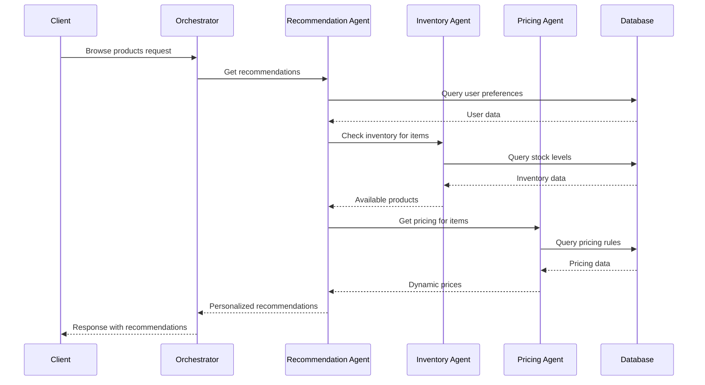
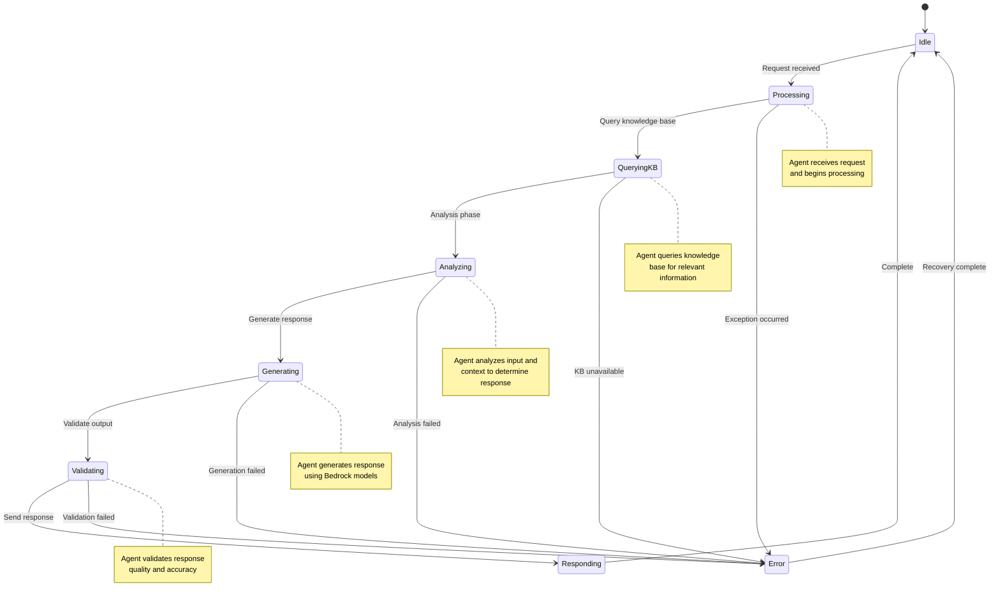
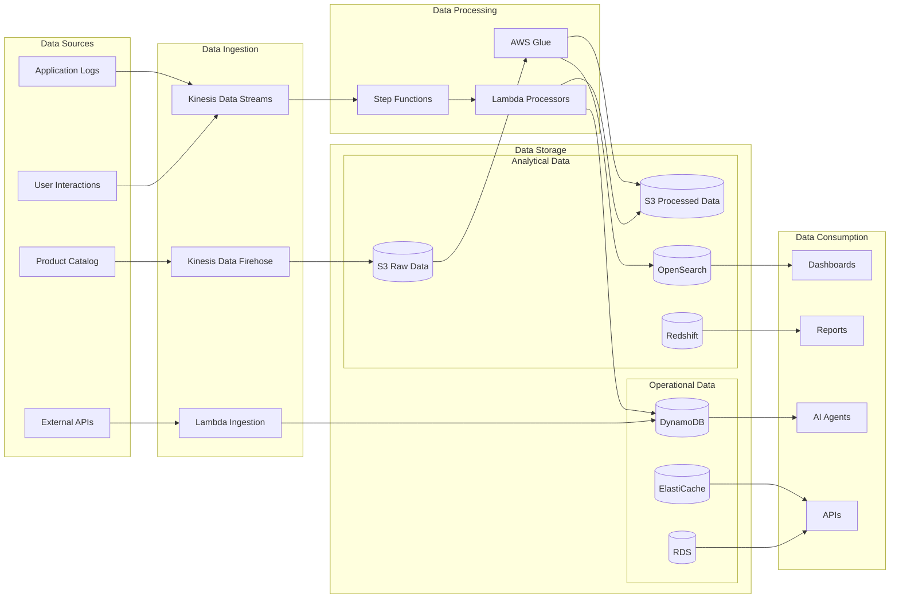
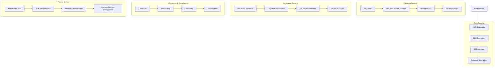
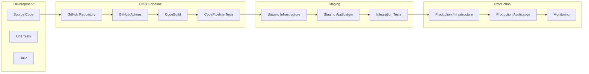
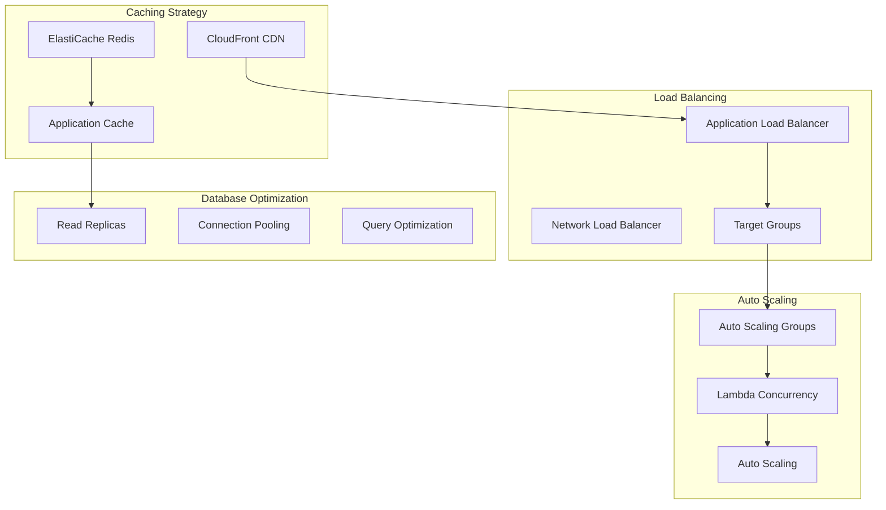
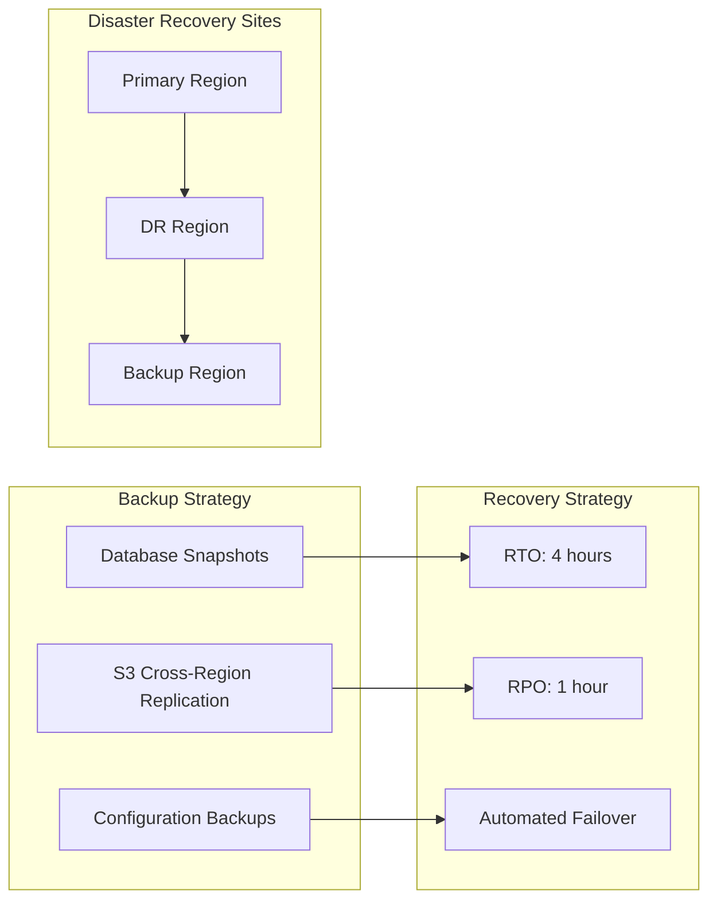

# 🏗️ Multi-Agentic E-Commerce Solution Architecture

## 📋 Table of Contents
- [Overview](#overview)
- [System Architecture](#system-architecture)
- [Agent Architecture](#agent-architecture)
- [Data Architecture](#data-architecture)
- [Security Architecture](#security-architecture)
- [Deployment Architecture](#deployment-architecture)
- [Performance Architecture](#performance-architecture)

## 🎯 Overview

The Multi-Agentic E-Commerce Solution is a sophisticated AI-powered platform that leverages multiple specialized agents working in coordination to provide intelligent e-commerce services. Each agent has specific responsibilities and capabilities, working together through a centralized orchestration layer to deliver seamless customer experiences.

### **Key Design Principles**
- **Agent Specialization**: Each agent focuses on specific domain expertise
- **Loose Coupling**: Agents communicate through well-defined interfaces
- **Event-Driven**: Asynchronous communication using events
- **Scalability**: Horizontal scaling of individual components
- **Fault Tolerance**: Resilient to individual agent failures
- **Observability**: Comprehensive monitoring and logging

## 🏗️ System Architecture

### **High-Level Architecture**

```mermaid
graph TB
    subgraph "Client Layer"
        WEB[Web Browser]
        MOB[Mobile App]
        API_CLIENT[API Clients]
    end
    
    subgraph "Edge Layer"
        CF[CloudFront CDN]
        WAF[AWS WAF]
    end
    
    subgraph "Presentation Layer"
        ALB[Application Load Balancer]
        APIGW[API Gateway]
        WS[WebSocket API]
    end
    
    subgraph "Application Layer"
        subgraph "Frontend Services"
            REACT[React App]
            AMPLIFY[AWS Amplify]
        end
        
        subgraph "Backend Services"
            ORCHESTRATOR[Orchestration Service]
            AUTH[Authentication Service]
            NOTIFICATION[Notification Service]
        end
    end
    
    subgraph "Agent Orchestration Layer"
        STEP[Step Functions]
        EVENTBRIDGE[EventBridge]
        SQS[SQS Queues]
        SNS[SNS Topics]
    end
    
    subgraph "AI Agent Layer"
        subgraph "Customer-Facing Agents"
            RA[Recommendation Agent]
            CSA[Customer Support Agent]
        end
        
        subgraph "Business Logic Agents"
            IA[Inventory Agent]
            OA[Order Agent]
            PA[Pricing Agent]
            MA[Marketing Agent]
        end
        
        subgraph "Analytics Agents"
            AA[Analytics Agent]
            FA[Forecasting Agent]
        end
    end
    
    subgraph "AWS Bedrock Services"
        BEDROCK_RUNTIME[Bedrock Runtime]
        BEDROCK_AGENTS[Bedrock Agents]
        KNOWLEDGE_BASES[Knowledge Bases]
        EMBEDDINGS[Embeddings Service]
    end
    
    subgraph "Data Layer"
        subgraph "Primary Storage"
            DYNAMODB[DynamoDB]
            RDS[RDS PostgreSQL]
        end
        
        subgraph "Analytics Storage"
            OPENSEARCH[OpenSearch]
            S3[S3 Data Lake]
            REDSHIFT[Redshift]
        end
        
        subgraph "Caching Layer"
            ELASTICACHE[ElastiCache Redis]
            CLOUDFRONT[CloudFront]
        end
    end
    
    subgraph "External Services"
        PAYMENT[Payment Gateway]
        SHIPPING[Shipping APIs]
        EMAIL[Email Service]
        SMS[SMS Service]
    end
    
    %% Client to Edge
    WEB --> CF
    MOB --> CF
    API_CLIENT --> CF
    
    %% Edge to Presentation
    CF --> WAF
    WAF --> ALB
    ALB --> APIGW
    
    %% Presentation to Application
    APIGW --> ORCHESTRATOR
    APIGW --> AUTH
    APIGW --> NOTIFICATION
    WS --> REACT
    
    %% Application to Orchestration
    ORCHESTRATOR --> STEP
    ORCHESTRATOR --> EVENTBRIDGE
    
    %% Orchestration to Agents
    STEP --> RA
    STEP --> CSA
    STEP --> IA
    STEP --> OA
    STEP --> PA
    STEP --> MA
    STEP --> AA
    STEP --> FA
    
    EVENTBRIDGE --> SQS
    SQS --> SNS
    
    %% Agents to Bedrock
    RA --> BEDROCK_AGENTS
    CSA --> BEDROCK_AGENTS
    IA --> BEDROCK_AGENTS
    OA --> BEDROCK_AGENTS
    PA --> BEDROCK_AGENTS
    MA --> BEDROCK_AGENTS
    AA --> BEDROCK_RUNTIME
    FA --> BEDROCK_RUNTIME
    
    %% Agents to Data
    RA --> DYNAMODB
    CSA --> DYNAMODB
    IA --> DYNAMODB
    OA --> RDS
    PA --> OPENSEARCH
    MA --> ELASTICACHE
    
    %% External Integrations
    OA --> PAYMENT
    OA --> SHIPPING
    MA --> EMAIL
    NOTIFICATION --> SMS
```



### **Component Responsibilities**

| Component | Responsibility | Technology |
|-----------|---------------|------------|
| **Frontend** | User interface and experience | React, TypeScript, Tailwind |
| **API Gateway** | API management and routing | AWS API Gateway |
| **Orchestrator** | Agent coordination and workflow | AWS Step Functions |
| **Agents** | Specialized AI processing | AWS Bedrock Agents |
| **Data Layer** | Data persistence and retrieval | DynamoDB, RDS, OpenSearch |
| **Caching** | Performance optimization | ElastiCache, CloudFront |

## 🤖 Agent Architecture

### **Agent Communication Pattern**



### **Agent State Management**



### **Agent Coordination Matrix**

| Agent | Communicates With | Communication Type | Data Exchanged |
|-------|------------------|-------------------|----------------|
| **Recommendation Agent** | Inventory Agent | Request-Response | Product availability |
| **Recommendation Agent** | Pricing Agent | Request-Response | Current pricing |
| **Customer Support Agent** | Order Agent | Request-Response | Order status |
| **Inventory Agent** | Order Agent | Event | Stock updates |
| **Order Agent** | Payment Gateway | Request-Response | Payment processing |
| **Marketing Agent** | Analytics Agent | Event | Campaign metrics |
| **Pricing Agent** | Analytics Agent | Request-Response | Price performance |

## 📊 Data Architecture

### **Data Flow Architecture**



### **Data Models**

#### **User Profile Data Model**
```json
{
  "userId": "user_12345",
  "profile": {
    "demographics": {
      "age": 28,
      "gender": "female",
      "location": "San Francisco, CA"
    },
    "preferences": {
      "categories": ["electronics", "books", "home"],
      "priceRange": {"min": 10, "max": 500},
      "brands": ["Apple", "Samsung", "Nike"]
    },
    "behavior": {
      "purchaseHistory": [...],
      "browsingHistory": [...],
      "searchHistory": [...]
    }
  },
  "timestamp": "2024-01-15T10:30:00Z"
}
```

#### **Product Data Model**
```json
{
  "productId": "prod_67890",
  "details": {
    "name": "iPhone 15 Pro",
    "description": "Latest iPhone with advanced camera system",
    "category": "electronics",
    "subcategory": "smartphones",
    "brand": "Apple",
    "price": 999.99,
    "currency": "USD"
  },
  "inventory": {
    "stock": 150,
    "reserved": 25,
    "available": 125,
    "location": "warehouse_001"
  },
  "metadata": {
    "tags": ["smartphone", "apple", "camera", "5g"],
    "specifications": {...},
    "images": [...],
    "reviews": {...}
  }
}
```

## 🔒 Security Architecture

### **Security Layers**



### **Security Controls**

| Security Domain | Controls | Implementation |
|----------------|----------|----------------|
| **Authentication** | Multi-factor authentication, SSO | AWS Cognito, SAML |
| **Authorization** | Role-based access control | AWS IAM, ABAC |
| **Data Protection** | Encryption at rest and in transit | AWS KMS, TLS 1.3 |
| **Network Security** | VPC isolation, WAF protection | VPC, AWS WAF |
| **Monitoring** | Security event logging | CloudTrail, GuardDuty |
| **Compliance** | Audit trails, data governance | AWS Config, Data Classification |

## 🚀 Deployment Architecture

### **Deployment Pipeline**



### **Environment Strategy**

| Environment | Purpose | Infrastructure | Data |
|-------------|---------|---------------|------|
| **Development** | Local development and testing | Local Docker containers | Mock data |
| **Staging** | Pre-production testing | AWS resources (small scale) | Production-like data |
| **Production** | Live customer-facing system | Full AWS infrastructure | Real customer data |

## ⚡ Performance Architecture

### **Performance Optimization Strategy**



### **Performance Targets**

| Metric | Target | Monitoring |
|--------|--------|------------|
| **API Response Time** | < 200ms (95th percentile) | CloudWatch |
| **Agent Processing Time** | < 1 second | Custom metrics |
| **Database Query Time** | < 50ms | DynamoDB metrics |
| **Cache Hit Ratio** | > 90% | ElastiCache metrics |
| **Throughput** | 10,000 requests/minute | Load balancer metrics |

## 📈 Scalability Architecture

### **Scaling Strategies**

```mermaid
graph TB
    subgraph "Horizontal Scaling"
        MULTI_AZ[Multi-AZ Deployment]
        AUTO_SCALING[Auto Scaling]
        LOAD_DISTRIBUTION[Load Distribution]
    end
    
    subgraph "Vertical Scaling"
        INSTANCE_SIZING[Instance Sizing]
        MEMORY_OPTIMIZATION[Memory Optimization]
        CPU_OPTIMIZATION[CPU Optimization]
    end
    
    subgraph "Database Scaling"
        SHARDING[Database Sharding]
        READ_REPLICAS[Read Replicas]
        PARTITIONING[Data Partitioning]
    end
    
    subgraph "Caching Scaling"
        CACHE_CLUSTERS[Cache Clusters]
        CACHE_DISTRIBUTION[Cache Distribution]
        CACHE_WARMING[Cache Warming]
    end
    
    MULTI_AZ --> AUTO_SCALING
    AUTO_SCALING --> LOAD_DISTRIBUTION
    
    INSTANCE_SIZING --> MEMORY_OPTIMIZATION
    MEMORY_OPTIMIZATION --> CPU_OPTIMIZATION
    
    SHARDING --> READ_REPLICAS
    READ_REPLICAS --> PARTITIONING
    
    CACHE_CLUSTERS --> CACHE_DISTRIBUTION
    CACHE_DISTRIBUTION --> CACHE_WARMING
```



## 🔄 Disaster Recovery Architecture

### **Backup and Recovery Strategy**



## 📊 Monitoring and Observability

### **Observability Stack**

```mermaid
graph TB
    subgraph "Metrics Collection"
        CLOUDWATCH[CloudWatch]
        CUSTOM_METRICS[Custom Metrics]
        BUSINESS_METRICS[Business Metrics]
    end
    
    subgraph "Logging"
        CLOUDWATCH_LOGS[CloudWatch Logs]
        STRUCTURED_LOGS[Structured Logging]
        LOG_AGGREGATION[Log Aggregation]
    end
    
    subgraph "Tracing"
        XRAY[X-Ray Tracing]
        DISTRIBUTED_TRACING[Distributed Tracing]
        PERFORMANCE_TRACING[Performance Tracing]
    end
    
    subgraph "Alerting"
        SNS_ALERTS[SNS Alerts]
        PAGERDUTY[PagerDuty Integration]
        SLACK_ALERTS[Slack Notifications]
    end
    
    CLOUDWATCH --> CUSTOM_METRICS
    CUSTOM_METRICS --> BUSINESS_METRICS
    
    CLOUDWATCH_LOGS --> STRUCTURED_LOGS
    STRUCTURED_LOGS --> LOG_AGGREGATION
    
    XRAY --> DISTRIBUTED_TRACING
    DISTRIBUTED_TRACING --> PERFORMANCE_TRACING
    
    SNS_ALERTS --> PAGERDUTY
    PAGERDUTY --> SLACK_ALERTS
```



---

## 🎯 Next Steps

1. **[Agent Workflows](./agent-workflows.md)** - Detailed agent interaction patterns
2. **[Data Flow](./data-flow.md)** - Comprehensive data flow documentation
3. **[Security Model](./security-model.md)** - Detailed security implementation
4. **[Performance Specs](./performance-specs.md)** - Performance requirements and optimization

---

**This architecture provides a robust, scalable, and secure foundation for the multi-agentic e-commerce solution. Each component is designed to work independently while contributing to the overall system goals.**
