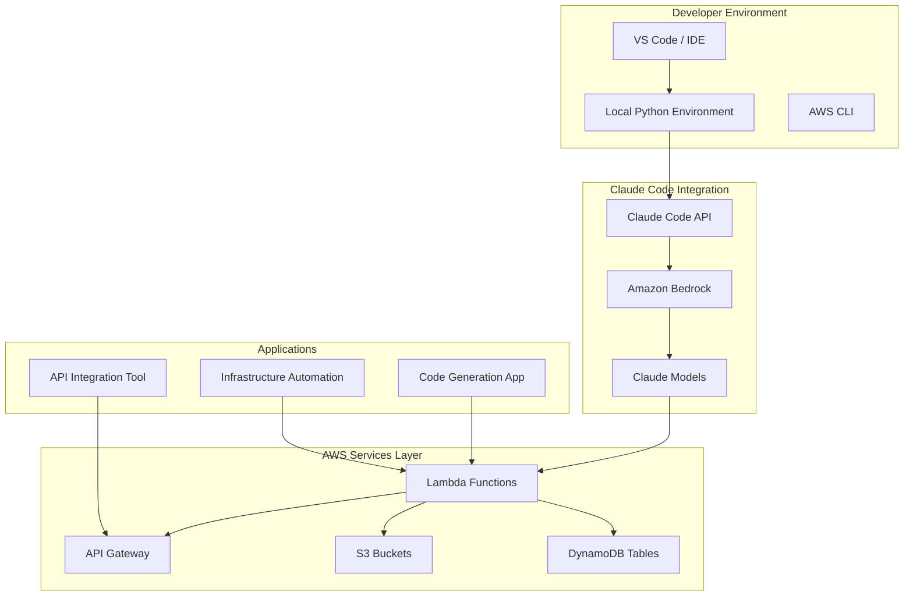

# 🎓 Claude Code on AWS Workshop

## Workshop Overview

This hands-on workshop will guide you through learning and implementing Claude Code with AWS services. You'll learn how to leverage Claude Code's capabilities through Amazon Bedrock to build AI-powered applications, automate code generation, and integrate with AWS services for real-world use cases.

## 🎯 Learning Objectives

By the end of this workshop, you will be able to:

1. **Understand Claude Code capabilities** and how it integrates with AWS Bedrock
2. **Set up Claude Code development environment** with AWS credentials and permissions
3. **Implement code generation workflows** using Claude Code for common development tasks
4. **Build real-world applications** leveraging Claude Code for AWS services integration
5. **Deploy production-ready infrastructure** using AWS CDK/Terraform with Claude Code
6. **Optimize and monitor** Claude Code applications for performance and cost

## 📋 Prerequisites

### Technical Requirements
- AWS Account with appropriate permissions
- AWS CLI configured
- Python 3.11+
- Node.js 18+ and npm (optional, for frontend examples)
- Docker (optional)
- Git
- Code editor (VS Code recommended)

### AWS Services Access
Ensure you have access to:
- Amazon Bedrock (with Claude model access)
- AWS Lambda
- Amazon API Gateway
- Amazon S3
- Amazon DynamoDB
- AWS IAM

### Knowledge Prerequisites
- Basic understanding of AWS services
- Python programming experience
- Basic understanding of AI/ML concepts
- Familiarity with REST APIs

## 🏗️ Workshop Architecture



## 📚 Workshop Modules

### Module 1: Environment Setup (30 minutes)
- [ ] AWS Account Setup and Permissions
- [ ] Amazon Bedrock Model Access Configuration
- [ ] Local Development Environment
- [ ] Claude Code SDK Installation
- [ ] Initial Project Configuration

### Module 2: Claude Code Basics (90 minutes)
- [ ] Introduction to Claude Code Capabilities
- [ ] Understanding Claude Code API
- [ ] Basic Code Generation Examples
- [ ] Code Review and Refactoring
- [ ] Best Practices for Prompt Engineering

### Module 3: Real-World Use Cases (120 minutes)
- [ ] Automated AWS Infrastructure Code Generation
- [ ] API Integration Code Generation
- [ ] Database Schema and Migration Scripts
- [ ] Test Case Generation
- [ ] Documentation Generation

### Module 4: AWS Services Integration (90 minutes)
- [ ] Claude Code with Lambda Functions
- [ ] API Gateway Integration
- [ ] S3 Integration for Code Storage
- [ ] DynamoDB Schema Design
- [ ] Error Handling and Monitoring

### Module 5: Infrastructure Deployment (60 minutes)
- [ ] AWS CDK Setup with Claude Code
- [ ] Infrastructure as Code Generation
- [ ] CI/CD Pipeline Configuration
- [ ] Production Deployment

### Module 6: Testing and Optimization (60 minutes)
- [ ] Unit and Integration Testing
- [ ] Performance Testing
- [ ] Cost Optimization Strategies
- [ ] Monitoring and Alerting

## 🚀 Quick Start

### 1. Clone the Repository
```bash
git clone <repository-url>
cd genAI-labs/workshop
```

### 2. Setup Python Environment
```bash
# Create virtual environment
python -m venv venv
source venv/bin/activate  # On Windows: venv\Scripts\activate

# Install dependencies
pip install -r requirements.txt
```

### 3. Configure AWS Credentials
```bash
# Configure AWS CLI
aws configure

# Verify Bedrock access
aws bedrock list-foundation-models --region us-east-1
```

### 4. Setup Environment Variables
```bash
# Copy example environment file
cp resources/configs/.env.example .env

# Edit .env with your AWS credentials and configuration
```

### 5. Run First Example
```bash
# Run basic Claude Code example
python code/examples/basic_claude_code.py
```

## 📖 Detailed Workshop Guide

### [Module 1: Environment Setup](./docs/workshop/module-1-setup.md)
Complete guide for setting up your development environment and AWS account for Claude Code.

### [Module 2: Claude Code Basics](./docs/workshop/module-2-claude-code-basics.md)
Introduction to Claude Code capabilities and basic code generation examples.

### [Module 3: Real-World Use Cases](./docs/workshop/module-3-use-cases.md)
Practical applications and real-world use cases with Claude Code.

### [Module 4: AWS Services Integration](./docs/workshop/module-4-aws-integration.md)
Deep dive into integrating Claude Code with AWS services.

### [Module 5: Infrastructure Deployment](./docs/workshop/module-5-infrastructure.md)
Production-ready infrastructure deployment guide.

### [Module 6: Testing and Optimization](./docs/workshop/module-6-testing.md)
Testing strategies and performance optimization.

## 🛠️ Workshop Tools

### Development Tools
- **VS Code** with Python and AWS extensions
- **AWS CLI** for service management
- **Docker** for containerization (optional)
- **Postman** for API testing (optional)

### Monitoring Tools
- **AWS CloudWatch** for monitoring
- **AWS X-Ray** for tracing
- **AWS Cost Explorer** for cost monitoring

## 📊 Success Metrics

### Technical Metrics
- Code generation accuracy > 90%
- API response time < 3 seconds
- System availability > 99.9%
- Cost per generation < $0.01

### Learning Metrics
- Complete all 6 modules
- Successfully generate functional code
- Deploy at least one application
- Understand cost optimization strategies

## 🎯 Workshop Outcomes

After completing this workshop, you will have:

1. **A fully functional Claude Code development environment** on AWS
2. **Production-ready code samples** for common use cases
3. **Comprehensive understanding** of Claude Code capabilities
4. **Best practices** for prompt engineering and code generation
5. **Infrastructure templates** for deploying Claude Code applications
6. **Cost optimization** strategies and monitoring setup

## 📞 Support and Resources

### Workshop Support
- **Documentation**: [AWS Bedrock Documentation](https://docs.aws.amazon.com/bedrock/)
- **Claude Code Guide**: [Anthropic Claude Code Documentation](https://docs.anthropic.com/claude/docs/claude-code)
- **Community**: AWS re:Post - Amazon Bedrock Community

### Additional Resources
- [Amazon Bedrock User Guide](https://docs.aws.amazon.com/bedrock/latest/userguide/)
- [Claude Code Best Practices](https://docs.anthropic.com/claude/docs/claude-code-best-practices)
- [AWS CDK Documentation](https://docs.aws.amazon.com/cdk/)
- [Python Boto3 Documentation](https://boto3.amazonaws.com/v1/documentation/api/latest/index.html)

## 🏆 Certification

Upon successful completion of the workshop, you will receive:
- **Claude Code on AWS Practitioner** certificate
- **Workshop completion** badge
- Access to advanced modules

## 📅 Workshop Schedule

| Module | Duration | Prerequisites |
|--------|----------|---------------|
| Module 1 | 30 min | AWS Account |
| Module 2 | 90 min | Python Basics |
| Module 3 | 120 min | AWS Services |
| Module 4 | 90 min | API Development |
| Module 5 | 60 min | AWS CDK/Terraform |
| Module 6 | 60 min | Testing Concepts |

**Total Workshop Time**: ~7.5 hours

## 🎉 Next Steps

After completing the workshop:

1. **Explore advanced use cases** in the code/examples directory
2. **Customize code generation** for your specific needs
3. **Integrate with existing systems** using provided templates
4. **Share your implementations** with the community
5. **Continue learning** with advanced modules

## 📝 Code Examples

The workshop includes practical code examples:

- **Basic Code Generation**: Simple Python scripts
- **AWS Infrastructure**: CDK/Terraform code generation
- **API Integration**: REST API client generation
- **Database Operations**: Schema and query generation
- **Testing**: Unit test generation
- **Documentation**: README and docstring generation

All examples are located in `code/examples/` and `code/exercises/` directories.

---

**Ready to start? Let's begin with [Module 1: Environment Setup](./docs/workshop/module-1-setup.md)! 🚀**

