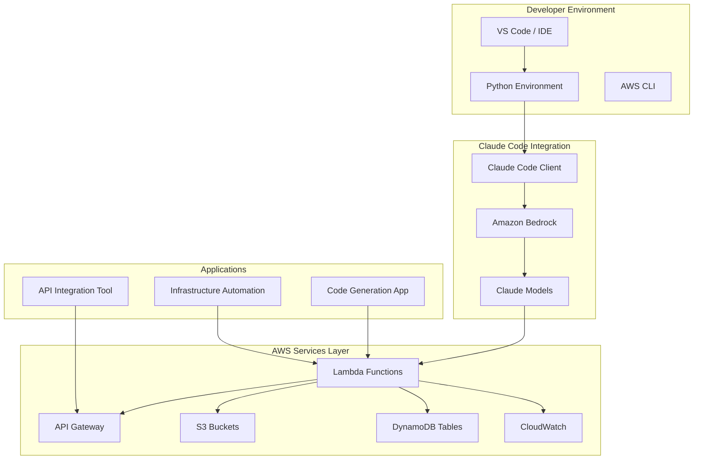

# Claude Code on AWS Workshop Architecture

## Overview

This document describes the architecture of the Claude Code on AWS Workshop, including the components, services, and interactions between them.

## Architecture Diagram

## Components

### 1. Claude Code Client

**Location**: `code/examples/basic_claude_code.py`

The Claude Code Client is a Python class that provides a simple interface for interacting with Claude models via Amazon Bedrock. It handles:

- Code generation from natural language prompts
- Code refactoring
- Error handling
- Response parsing

**Key Features**:
- Support for multiple programming languages
- Configurable temperature and token limits
- Error handling and retry logic

### 2. Amazon Bedrock

Amazon Bedrock is the AWS managed service that provides access to Claude models. It handles:

- Model invocation
- Request authentication
- Response streaming
- Rate limiting

**Configuration**:
- Model ID: `anthropic.claude-3-5-sonnet-20241022-v2:0` (default)
- Region: `us-east-1` (configurable)
- Authentication: IAM roles and policies

### 3. AWS Lambda Functions

**Location**: `code/examples/aws/lambda_claude_code.py`

Lambda functions provide serverless execution for Claude Code operations. They handle:

- Code generation requests
- API Gateway integration
- DynamoDB storage
- S3 integration

**Configuration**:
- Runtime: Python 3.11
- Timeout: 300 seconds
- Memory: 512 MB
- Environment variables: Model ID, table name, bucket name

### 4. API Gateway

API Gateway provides REST API endpoints for Claude Code operations. It handles:

- Request routing
- Authentication (optional)
- CORS configuration
- Lambda integration

**Endpoints**:
- `POST /generate` - Generate code
- `GET /health` - Health check

### 5. DynamoDB

DynamoDB stores metadata about generated code. It includes:

- Result ID (partition key)
- Prompt text
- Language
- Generation timestamp
- Code length
- S3 key (for large code)

**Table Structure**:
- Table name: `claude-code-results`
- Partition key: `id` (String)
- Global Secondary Index: `language-index` (language, generated_at)

### 6. S3

S3 stores generated code files. It includes:

- Code files (Python, JavaScript, etc.)
- Metadata (prompt, language, timestamp)
- Versioning enabled

**Bucket Structure**:
- Bucket name: `claude-code-workshop-{account-id}`
- Prefix: `generated-code/{language}/{timestamp}.py`
- Versioning: Enabled

### 7. CloudWatch

CloudWatch provides monitoring and logging for Claude Code operations. It includes:

- Lambda function logs
- Custom metrics
- Alarms
- Dashboards

**Metrics**:
- Code generation success/failure
- Response time
- Cost per generation
- Error rate

## Data Flow

### Code Generation Flow

1. **Request**: Developer sends code generation request via API or CLI
2. **API Gateway**: Receives request and routes to Lambda function
3. **Lambda**: Validates request and invokes Bedrock
4. **Bedrock**: Processes request with Claude model
5. **Response**: Generated code returned to Lambda
6. **Storage**: Lambda stores code in S3 and metadata in DynamoDB
7. **Response**: API Gateway returns generated code to developer

### Code Refactoring Flow

1. **Request**: Developer sends code refactoring request
2. **Lambda**: Receives original code and refactoring instructions
3. **Bedrock**: Processes refactoring request
4. **Response**: Refactored code returned to developer

## Security

### Authentication

- **AWS IAM**: IAM roles and policies control access to AWS services
- **API Keys**: Optional API key authentication for API Gateway
- **Bedrock**: IAM permissions required for Bedrock model access

### Authorization

- **Lambda**: IAM role with minimal required permissions
- **DynamoDB**: IAM policies for read/write access
- **S3**: IAM policies for read/write access
- **Bedrock**: IAM policies for model invocation

### Data Protection

- **Encryption**: All data encrypted at rest (S3, DynamoDB)
- **Transit**: All data encrypted in transit (HTTPS, TLS)
- **Access Control**: IAM policies restrict access to resources

## Cost Optimization

### Model Selection

- **Simple Tasks**: Use Claude Haiku (cheaper, faster)
- **Medium Tasks**: Use Claude Sonnet (balanced)
- **Complex Tasks**: Use Claude Opus (most capable)

### Caching

- **Prompt Caching**: Cache generated code for repeated prompts
- **TTL**: 1 hour default cache TTL
- **Storage**: Use S3 lifecycle policies for old code

### Resource Management

- **Lambda**: Right-size memory and timeout
- **DynamoDB**: Use on-demand billing
- **S3**: Use lifecycle policies for old code

## Monitoring

### Metrics

- **Code Generation Rate**: Requests per second
- **Success Rate**: Percentage of successful generations
- **Response Time**: Average response time
- **Cost**: Cost per generation

### Alarms

- **Error Rate**: Alert when error rate exceeds threshold
- **Response Time**: Alert when response time exceeds threshold
- **Cost**: Alert when daily cost exceeds threshold

### Logging

- **Lambda Logs**: CloudWatch Logs for Lambda execution
- **API Gateway Logs**: Access logs for API requests
- **Application Logs**: Structured logging for debugging

## Scalability

### Horizontal Scaling

- **Lambda**: Automatically scales based on request rate
- **API Gateway**: Handles high request volumes
- **DynamoDB**: On-demand scaling
- **S3**: Unlimited storage capacity

### Performance

- **Caching**: Reduces redundant API calls
- **Batch Processing**: Process multiple requests efficiently
- **Streaming**: Stream responses for large code generation

## Deployment

### Infrastructure as Code

- **AWS CDK**: TypeScript/Python CDK stacks
- **Terraform**: HCL configuration files
- **CloudFormation**: Generated from CDK/Terraform

### CI/CD

- **GitHub Actions**: Automated deployment pipeline
- **Testing**: Automated testing before deployment
- **Rollback**: Automated rollback on failure

## Best Practices

### Code Generation

1. **Clear Prompts**: Use specific, clear prompts
2. **Model Selection**: Choose appropriate model for task
3. **Error Handling**: Implement comprehensive error handling
4. **Validation**: Validate generated code before use

### Security

1. **Least Privilege**: Use minimal IAM permissions
2. **Encryption**: Encrypt data at rest and in transit
3. **Access Control**: Restrict access to resources
4. **Monitoring**: Monitor for security events

### Cost Management

1. **Model Selection**: Use cheapest appropriate model
2. **Caching**: Cache repeated requests
3. **Monitoring**: Monitor costs and usage
4. **Optimization**: Optimize prompts for efficiency

## Troubleshooting

### Common Issues

1. **Bedrock Access**: Verify model access in Bedrock console
2. **IAM Permissions**: Check IAM roles and policies
3. **Lambda Timeout**: Increase timeout or optimize prompts
4. **Cost**: Monitor usage and optimize model selection

### Debugging

1. **Logs**: Check CloudWatch Logs for errors
2. **Metrics**: Review CloudWatch metrics for anomalies
3. **Testing**: Test locally before deployment
4. **Monitoring**: Use CloudWatch dashboards for visibility

## Additional Resources

- [Amazon Bedrock Documentation](https://docs.aws.amazon.com/bedrock/)
- [AWS Lambda Documentation](https://docs.aws.amazon.com/lambda/)
- [API Gateway Documentation](https://docs.aws.amazon.com/apigateway/)
- [DynamoDB Documentation](https://docs.aws.amazon.com/dynamodb/)
- [S3 Documentation](https://docs.aws.amazon.com/s3/)
- [CloudWatch Documentation](https://docs.aws.amazon.com/cloudwatch/)

