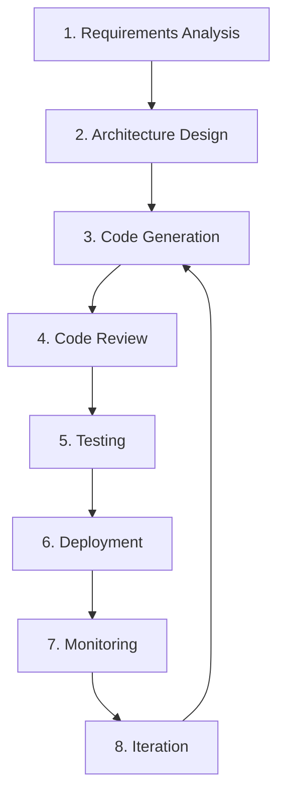

# Infrastructure as Code Design and Development Workflow

This document outlines a comprehensive workflow for designing and developing cloud infrastructure using Infrastructure as Code (IaC) tools with Claude Code CLI.

## Overview

This workflow guides you through the complete process of designing, developing, deploying, and maintaining cloud infrastructure using AWS CDK or Terraform with Claude Code CLI assistance.

## Workflow Stages



## Stage 1: Requirements Analysis

### Step 1.1: Define Business Requirements

**Objective**: Understand what infrastructure is needed

**Activities**:
1. Identify use cases and requirements
2. Define performance requirements
3. Specify security requirements
4. Identify compliance needs
5. Estimate scale and load

**Claude CLI Usage**:
```bash
# Generate requirements document
claude code generate \
  --prompt "Create infrastructure requirements document for:
  - Serverless API application
  - Expected traffic: 1000 requests/minute
  - Security: HIPAA compliance required
  - Availability: 99.9% uptime
  - Cost: Optimize for cost-effectiveness" \
  --language markdown \
  --output docs/requirements.md
```

### Step 1.2: Identify AWS Services

**Objective**: Select appropriate AWS services

**Activities**:
1. Map requirements to AWS services
2. Consider cost implications
3. Evaluate service limitations
4. Plan service integration

**Claude CLI Usage**:
```bash
# Generate service selection analysis
claude code generate \
  --prompt "Analyze requirements in docs/requirements.md and recommend:
  - AWS services needed
  - Service configurations
  - Integration patterns
  - Cost estimates
  - Alternatives to consider" \
  --language markdown \
  --output docs/service-selection.md
```

## Stage 2: Architecture Design

### Step 2.1: Create Architecture Diagram

**Objective**: Visualize infrastructure architecture

**Activities**:
1. Design component architecture
2. Define data flow
3. Identify dependencies
4. Plan for scalability

**Claude CLI Usage**:
```bash
# Generate architecture diagram
claude code generate \
  --prompt "Create Mermaid architecture diagram for:
  - Lambda functions
  - API Gateway
  - DynamoDB tables
  - S3 buckets
  - CloudWatch monitoring
  Show data flow and component interactions" \
  --language markdown \
  --output docs/architecture.md
```

### Step 2.2: Design Resource Configuration

**Objective**: Define resource specifications

**Activities**:
1. Specify Lambda configurations
2. Define DynamoDB schema
3. Plan API Gateway structure
4. Design IAM roles and policies

**Claude CLI Usage**:
```bash
# Generate resource specifications
claude code generate \
  --prompt "Create detailed resource specifications for:
  - Lambda function: memory, timeout, runtime
  - DynamoDB: partition key, sort key, GSI, billing mode
  - API Gateway: endpoints, methods, authentication
  - S3: bucket policies, lifecycle rules
  - IAM: roles, policies, permissions" \
  --language markdown \
  --output docs/resource-specs.md
```

## Stage 3: Code Generation

### Step 3.1: Generate Initial Infrastructure Code

**Objective**: Create base infrastructure code

**Activities**:
1. Generate CDK stack or Terraform configuration
2. Include all required resources
3. Add basic configuration
4. Include outputs

**Claude CLI Usage**:
```bash
# Generate CDK stack
claude code generate \
  --prompt "Create AWS CDK stack based on architecture in docs/architecture.md and specifications in docs/resource-specs.md" \
  --language python \
  --output infrastructure/cdk/initial_stack.py

# Or generate Terraform
claude code generate \
  --prompt "Create Terraform configuration based on architecture in docs/architecture.md" \
  --language hcl \
  --output infrastructure/terraform/main.tf
```

### Step 3.2: Generate Supporting Files

**Objective**: Create supporting infrastructure files

**Activities**:
1. Generate variables files
2. Create outputs
3. Add configuration files
4. Generate deployment scripts

**Claude CLI Usage**:
```bash
# Generate variables
claude code generate \
  --prompt "Create Terraform variables file with:
  - aws_region (default: us-east-1)
  - environment (default: workshop)
  - lambda_memory (default: 512)
  - lambda_timeout (default: 300)" \
  --language hcl \
  --output infrastructure/terraform/variables.tf

# Generate outputs
claude code generate \
  --prompt "Create Terraform outputs for:
  - API endpoint URL
  - Lambda function name
  - DynamoDB table name
  - S3 bucket name" \
  --language hcl \
  --output infrastructure/terraform/outputs.tf
```

## Stage 4: Code Review

### Step 4.1: Review Generated Code

**Objective**: Identify issues and improvements

**Activities**:
1. Review code quality
2. Check security best practices
3. Verify resource configurations
4. Identify optimization opportunities

**Claude CLI Usage**:
```bash
# Review CDK stack
claude code review \
  --file infrastructure/cdk/initial_stack.py \
  --checklist "security,cost,performance,best-practices" \
  --output reviews/cdk-review.md

# Review Terraform
claude code review \
  --file infrastructure/terraform/main.tf \
  --checklist "security,terraform-best-practices,resource-optimization" \
  --output reviews/terraform-review.md
```

### Step 4.2: Refine Code

**Objective**: Address review findings

**Activities**:
1. Fix identified issues
2. Implement best practices
3. Optimize configurations
4. Add missing features

**Claude CLI Usage**:
```bash
# Refine CDK stack
claude code refactor \
  --file infrastructure/cdk/initial_stack.py \
  --instructions "Address issues in reviews/cdk-review.md:
  1. Fix security vulnerabilities
  2. Implement cost optimizations
  3. Add missing best practices
  4. Improve error handling" \
  --output infrastructure/cdk/refined_stack.py
```

## Stage 5: Testing

### Step 5.1: Generate Tests

**Objective**: Create comprehensive tests

**Activities**:
1. Generate unit tests
2. Create integration tests
3. Add infrastructure tests
4. Generate test data

**Claude CLI Usage**:
```bash
# Generate CDK tests
claude code generate \
  --prompt "Create pytest unit tests for CDK stack in infrastructure/cdk/refined_stack.py that test:
  - Stack creation
  - Resource existence
  - Resource properties
  - IAM permissions
  - Outputs" \
  --language python \
  --output tests/infrastructure/test_cdk_stack.py

# Generate Terraform tests
claude code generate \
  --prompt "Create Terratest integration tests for Terraform configuration that:
  - Test resource creation
  - Verify resource properties
  - Test resource deletion
  - Validate outputs" \
  --language go \
  --output tests/infrastructure/terraform_test.go
```

### Step 5.2: Run Tests

**Objective**: Validate infrastructure code

**Activities**:
1. Run unit tests
2. Execute integration tests
3. Validate configurations
4. Check for errors

**Commands**:
```bash
# Run CDK tests
cd tests/infrastructure
pytest test_cdk_stack.py -v

# Run Terraform tests
cd tests/infrastructure
go test -v terraform_test.go
```

## Stage 6: Deployment

### Step 6.1: Generate Deployment Scripts

**Objective**: Create deployment automation

**Activities**:
1. Create deployment scripts
2. Add validation steps
3. Include rollback procedures
4. Add monitoring setup

**Claude CLI Usage**:
```bash
# Generate deployment script
claude code generate \
  --prompt "Create bash deployment script for CDK stack that:
  1. Validates prerequisites
  2. Installs dependencies
  3. Synthesizes stack
  4. Deploys stack
  5. Verifies deployment
  6. Displays outputs" \
  --language bash \
  --output scripts/deployment/deploy_cdk.sh
```

### Step 6.2: Deploy Infrastructure

**Objective**: Deploy infrastructure to AWS

**Activities**:
1. Validate environment
2. Deploy stack
3. Verify resources
4. Test functionality

**Commands**:
```bash
# Deploy CDK
cd infrastructure/cdk
cdk deploy

# Or deploy Terraform
cd infrastructure/terraform
terraform apply
```

## Stage 7: Monitoring

### Step 7.1: Generate Monitoring Configuration

**Objective**: Set up monitoring and alerting

**Activities**:
1. Create CloudWatch alarms
2. Set up SNS notifications
3. Configure dashboards
4. Add logging

**Claude CLI Usage**:
```bash
# Generate monitoring code
claude code generate \
  --prompt "Add CloudWatch monitoring to CDK stack:
  - Lambda error alarms
  - Lambda duration alarms
  - API Gateway error alarms
  - DynamoDB throttling alarms
  - SNS topic for notifications
  - CloudWatch dashboard" \
  --language python \
  --output infrastructure/cdk/monitoring.py
```

### Step 7.2: Monitor Infrastructure

**Objective**: Track infrastructure health

**Activities**:
1. Monitor CloudWatch metrics
2. Review logs
3. Check alarms
4. Analyze performance

**Commands**:
```bash
# View CloudWatch logs
aws logs tail /aws/lambda/claude-code-generator --follow

# Check metrics
aws cloudwatch get-metric-statistics \
  --namespace AWS/Lambda \
  --metric-name Invocations \
  --dimensions Name=FunctionName,Value=claude-code-generator
```

## Stage 8: Iteration

### Step 8.1: Collect Feedback

**Objective**: Gather improvement insights

**Activities**:
1. Review monitoring data
2. Collect user feedback
3. Identify performance issues
4. Note cost optimizations

### Step 8.2: Plan Improvements

**Objective**: Design enhancements

**Activities**:
1. Analyze current state
2. Identify improvements
3. Plan changes
4. Update requirements

**Claude CLI Usage**:
```bash
# Generate improvement plan
claude code generate \
  --prompt "Analyze current infrastructure and create improvement plan:
  - Performance optimizations
  - Cost reductions
  - Security enhancements
  - Scalability improvements" \
  --language markdown \
  --output docs/improvements.md
```

### Step 8.3: Implement Changes

**Objective**: Apply improvements

**Activities**:
1. Generate updated code
2. Review changes
3. Test modifications
4. Deploy updates

**Claude CLI Usage**:
```bash
# Refactor for improvements
claude code refactor \
  --file infrastructure/cdk/refined_stack.py \
  --instructions "Implement improvements from docs/improvements.md" \
  --output infrastructure/cdk/improved_stack.py
```

## Best Practices

### 1. Version Control

- Commit infrastructure code to Git
- Use meaningful commit messages
- Tag releases
- Maintain change log

### 2. Documentation

- Document architecture decisions
- Maintain deployment guides
- Update troubleshooting docs
- Keep requirements current

### 3. Security

- Review IAM permissions regularly
- Implement least privilege
- Encrypt data at rest and in transit
- Regular security audits

### 4. Cost Management

- Monitor costs continuously
- Use cost optimization tools
- Right-size resources
- Implement auto-scaling

### 5. Testing

- Test before deployment
- Use staging environments
- Implement integration tests
- Validate configurations

## Tools and Resources

### Claude CLI Commands

```bash
# Code generation
claude code generate --prompt "..." --language python

# Code refactoring
claude code refactor --file ... --instructions "..."

# Code review
claude code review --file ... --checklist "..."

# Code analysis
claude code analyze --file ... --output ...
```

### AWS CDK Commands

```bash
cdk synth          # Synthesize CloudFormation
cdk deploy         # Deploy stack
cdk destroy        # Remove stack
cdk diff          # Show differences
cdk list          # List stacks
```

### Terraform Commands

```bash
terraform init    # Initialize
terraform plan    # Plan changes
terraform apply   # Apply changes
terraform destroy # Remove resources
terraform validate # Validate configuration
```

## Next Steps

1. Follow the workflow stages
2. Practice with examples
3. Iterate and improve
4. Share learnings
5. Contribute improvements

## Additional Resources

- [AWS CDK Documentation](https://docs.aws.amazon.com/cdk/)
- [Terraform AWS Provider](https://registry.terraform.io/providers/hashicorp/aws/latest/docs)
- [Claude CLI Documentation](https://docs.anthropic.com/claude/docs/claude-cli)
- [Infrastructure as Code Best Practices](https://docs.aws.amazon.com/whitepapers/latest/iac-best-practices/)

