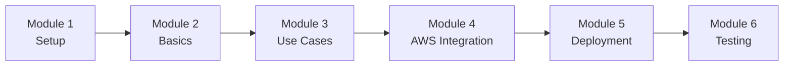

# Claude Code on AWS Workshop Modules

Welcome to the Claude Code on AWS Workshop! This workshop is designed to teach you how to leverage Claude Code's capabilities through Amazon Bedrock to build AI-powered applications and automate code generation tasks.

## Workshop Structure

This workshop consists of 6 comprehensive modules, each building upon the previous one:

1. **[Module 1: Environment Setup](./module-1-setup.md)** - Get your development environment ready
2. **[Module 2: Claude Code Basics](./module-2-claude-code-basics.md)** - Learn fundamental Claude Code concepts
3. **[Module 3: Real-World Use Cases](./module-3-use-cases.md)** - Apply Claude Code to practical scenarios
4. **[Module 4: AWS Services Integration](./module-4-aws-integration.md)** - Integrate with AWS services
5. **[Module 5: Infrastructure Deployment](./module-5-infrastructure.md)** - Deploy production-ready infrastructure
6. **[Module 6: Testing and Optimization](./module-6-testing.md)** - Test and optimize your applications

## Learning Path

## Prerequisites Checklist

Before starting, ensure you have:

- [ ] AWS Account created
- [ ] AWS CLI installed and configured
- [ ] Python 3.11+ installed
- [ ] Code editor (VS Code recommended)
- [ ] Git installed
- [ ] Access to Amazon Bedrock with Claude models

## Quick Links

- [Main Workshop README](../../README.md)
- [Code Examples](../../code/examples/)
- [Exercises](../../code/exercises/)
- [Resources](../../resources/)

## Getting Help

If you encounter any issues:

1. Check the troubleshooting section in each module
2. Review the [Common Issues](#common-issues) section below
3. Consult AWS documentation
4. Check Claude Code documentation

## Common Issues

### AWS Access Issues
- Verify your AWS credentials are configured correctly
- Ensure you have the necessary IAM permissions
- Check that Bedrock is available in your region

### Claude Model Access
- Request access to Claude models in Bedrock console
- Verify model availability in your region
- Check IAM permissions for Bedrock

### Python Environment Issues
- Ensure you're using Python 3.11 or higher
- Activate your virtual environment
- Install all required dependencies

---

**Ready to begin? Start with [Module 1: Environment Setup](./module-1-setup.md)!**

