# E-Commerce AI Platform - Solution Architecture

## Overview

This document describes the architecture of the E-Commerce AI Platform, a production-ready solution that integrates Large Language Models (LLMs) to enhance customer experience and business operations.

## Architecture Principles

### 1. **Modularity**
- Microservices-based architecture
- Independent, scalable components
- Clear separation of concerns

### 2. **Scalability**
- Horizontal scaling capabilities
- Stateless API design
- Caching strategies for performance

### 3. **Reliability**
- High availability design
- Error handling and retry mechanisms
- Graceful degradation

### 4. **Security**
- API key management
- Input validation
- Rate limiting
- Secure data handling

## High-Level Architecture

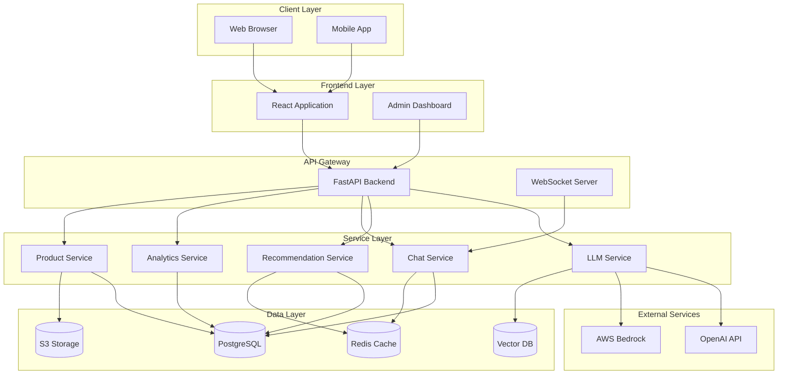

## Component Architecture

### Frontend Layer

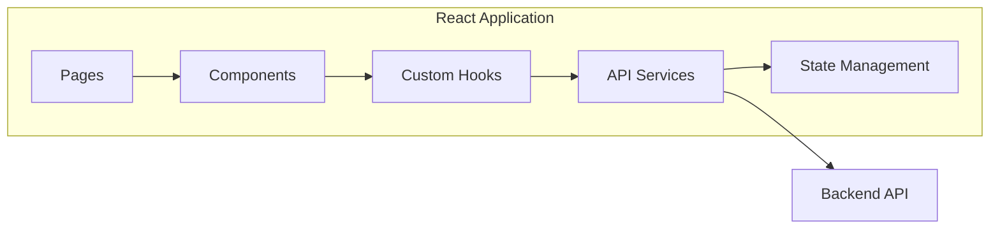

**Technologies:**
- React 18+ with TypeScript
- React Router for navigation
- Axios for API calls
- Zustand/Redux for state management
- Tailwind CSS for styling

### Backend API Layer

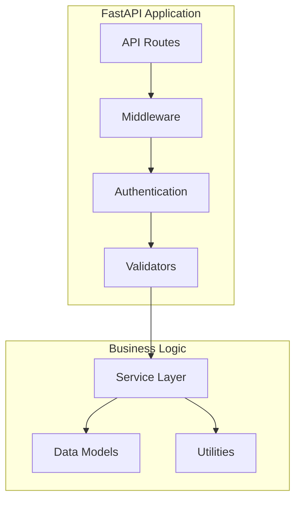

**Technologies:**
- FastAPI for REST APIs
- Pydantic for validation
- SQLAlchemy for ORM
- AsyncIO for async operations

## LLM Integration Architecture

### Multi-LLM Service Pattern

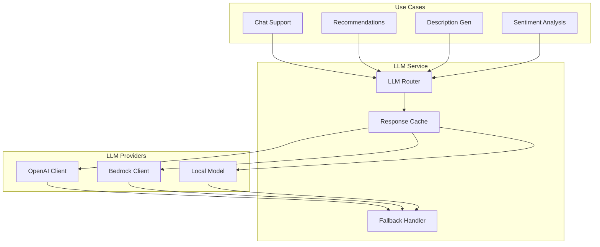

### RAG (Retrieval-Augmented Generation) Architecture

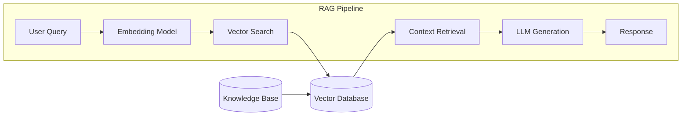

## Data Flow Diagrams

### Product Recommendation Flow

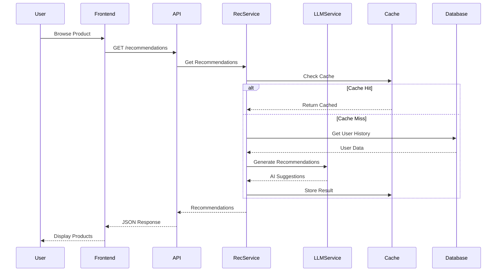

### Chat Support Flow

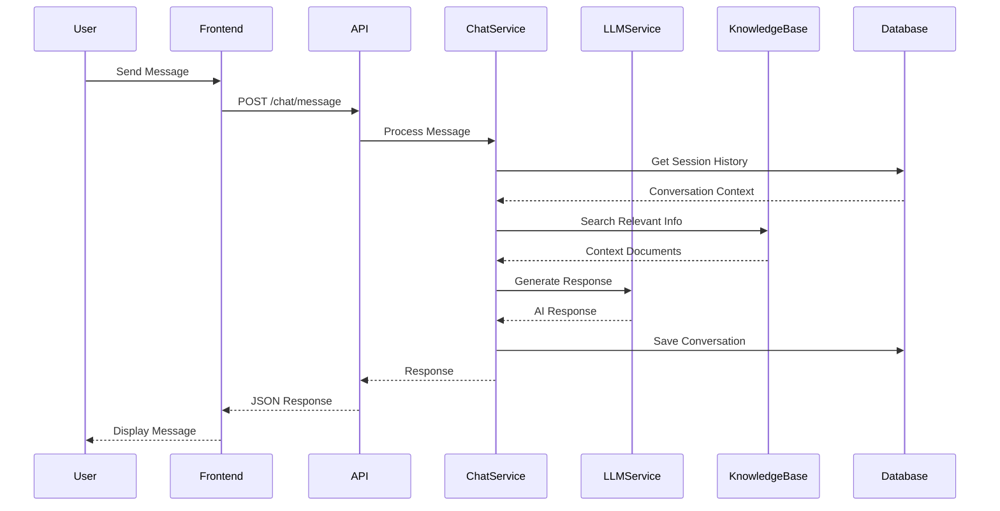

### Product Description Generation Flow

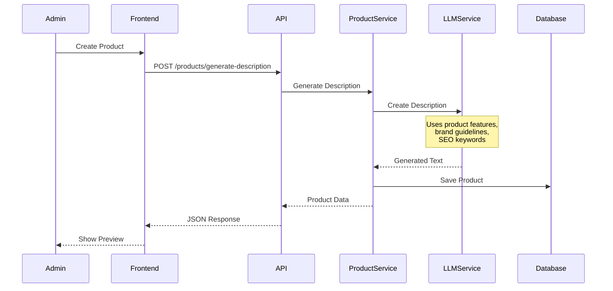

## Infrastructure Architecture

### AWS Deployment Architecture

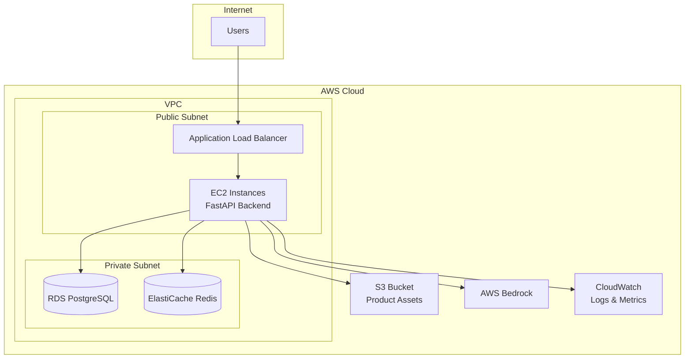

### Container Architecture

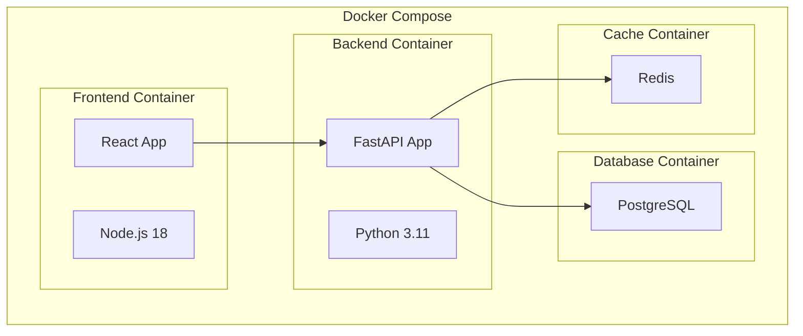

## Security Architecture

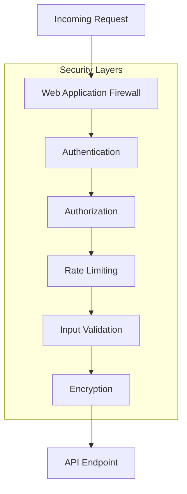

## Scalability Patterns

### Horizontal Scaling

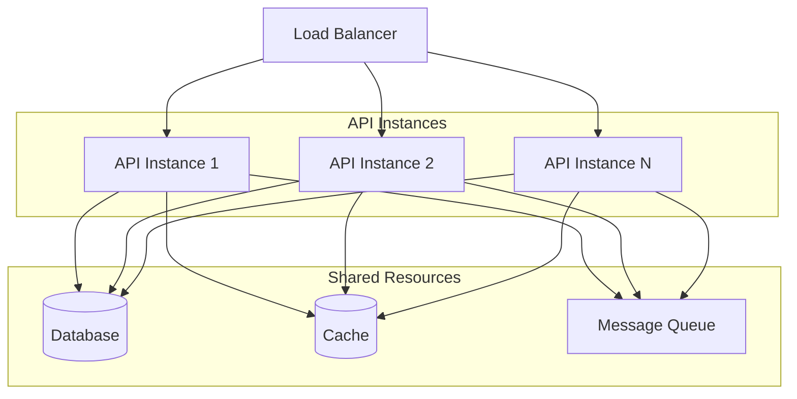

## Monitoring & Observability

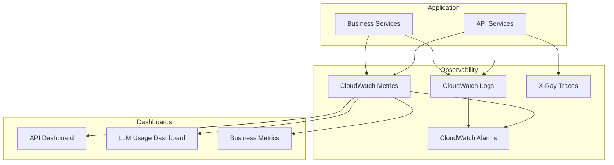

## Technology Stack

### Backend
- **Framework**: FastAPI 0.104+
- **Language**: Python 3.11+
- **Database**: PostgreSQL 15+
- **Cache**: Redis 7+
- **ORM**: SQLAlchemy 2.0+
- **Validation**: Pydantic 2.0+

### Frontend
- **Framework**: React 18+
- **Language**: TypeScript 5+
- **Styling**: Tailwind CSS 3+
- **State**: Zustand / Redux Toolkit
- **HTTP Client**: Axios

### AI/ML
- **LLM Providers**: OpenAI, AWS Bedrock
- **Embeddings**: OpenAI text-embedding-3-small
- **Vector DB**: Pinecone / Weaviate / FAISS
- **Framework**: LangChain (optional)

### Infrastructure
- **Containerization**: Docker
- **Orchestration**: Docker Compose / Kubernetes
- **IaC**: Terraform
- **Cloud**: AWS
- **CI/CD**: GitHub Actions

## Performance Considerations

### Caching Strategy

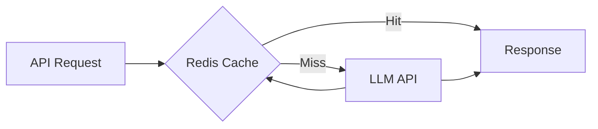

### Optimization Techniques

1. **Response Caching**: Cache LLM responses for common queries
2. **Batch Processing**: Batch multiple requests when possible
3. **Connection Pooling**: Reuse database connections
4. **Async Operations**: Non-blocking I/O operations
5. **CDN**: Serve static assets via CDN
6. **Database Indexing**: Optimize query performance

## Cost Optimization

### LLM Cost Management

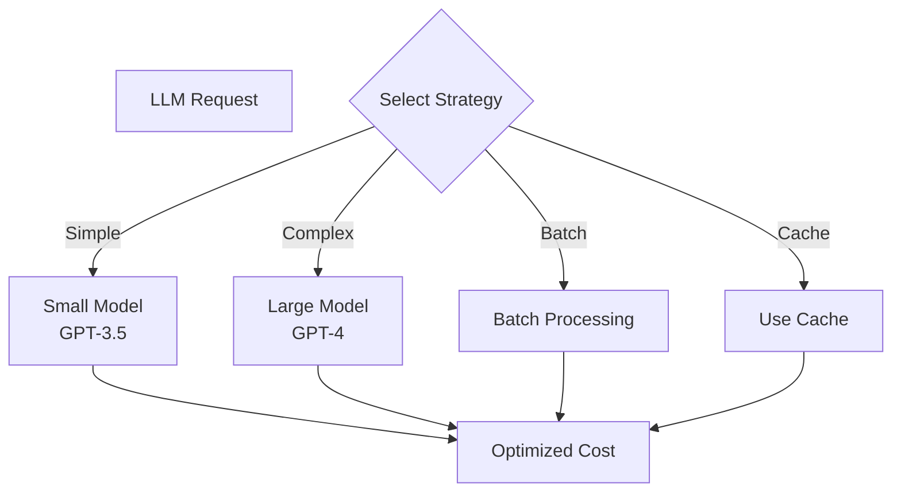

## Deployment Architecture

### Development Environment

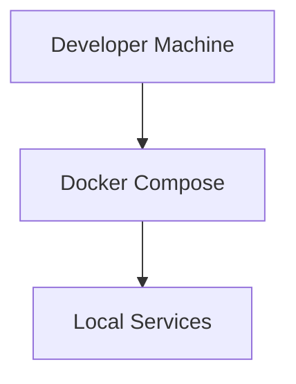

### Production Environment

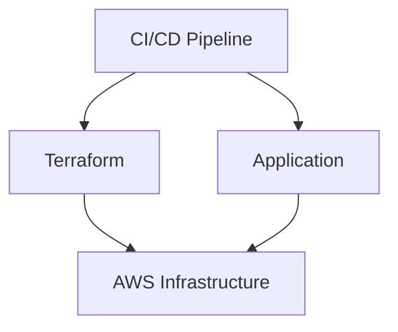

## Conclusion

This architecture provides a scalable, secure, and cost-effective solution for integrating LLMs into e-commerce applications. The modular design allows for incremental deployment and easy customization based on specific business needs.

The architecture supports:
- ✅ High availability and scalability
- ✅ Multi-LLM provider support
- ✅ Cost optimization
- ✅ Security best practices
- ✅ Monitoring and observability
- ✅ Easy deployment and maintenance

