# Healthcare Telemedicine AI - Solution Architecture

## Overview

The Healthcare Telemedicine AI Support System is a comprehensive platform that leverages AWS GenAI services to provide intelligent patient support, symptom assessment, and clinical decision assistance. The architecture is designed with HIPAA compliance, scalability, and reliability as core principles.

## Quick Reference: Build Process

| Phase | Focus | Key Services | Time Estimate |
|-------|-------|--------------|---------------|
| **Phase 1** | Foundation | DynamoDB, S3, API Gateway, Cognito | 2-3 days |
| **Phase 2** | Symptom Checker | Bedrock, Lambda, Comprehend Medical | 2-3 days |
| **Phase 3** | Virtual Triage | EventBridge, SNS, Step Functions | 2-3 days |
| **Phase 4** | Patient Chatbot | API Gateway WebSocket, Bedrock | 2-3 days |
| **Phase 5** | Document Analysis | Textract, Comprehend Medical | 2-3 days |
| **Phase 6** | Provider Dashboard | CloudFront, QuickSight | 2-3 days |

**Total Build Time**: ~2-3 weeks for complete system

**Quick Start**: Build Phases 1-2 for MVP in 4-6 days.

---

## Architecture Diagrams

### High-Level System Architecture


---

### Phase 1: Foundation Architecture

**Goal**: Set up secure infrastructure with authentication and data storage


**Components**:
1. **Amazon Cognito**: User authentication with MFA
2. **DynamoDB**: Patient records, sessions, audit logs
3. **S3**: Medical documents (encrypted)
4. **KMS**: Encryption key management
5. **WAF**: Web application firewall
6. **CloudFront**: Secure content delivery

**DynamoDB Tables**:
```
patients/           - Patient profiles and demographics
sessions/           - Active consultation sessions
assessments/        - Symptom assessment records
conversations/      - Chat history
audit_logs/         - Compliance audit trail
```

---

### Phase 2: Symptom Checker Service

**Goal**: AI-powered symptom assessment with medical NLP


**Symptom Assessment Flow**:


---

### Phase 3: Virtual Triage System

**Goal**: Automated patient prioritization with alerting


**Triage Decision Flow**:

```mermaid
flowchart TD
    A[Assessment Received] --> B{Emergency Keywords?}
    B -->|Yes| C[🔴 EMERGENCY]
    B -->|No| D{Vital Signs Critical?}
    D -->|Yes| E[🟠 URGENT]
    D -->|No| F{Symptom Severity?}
    F -->|High| G[🟡 SEMI-URGENT]
    F -->|Medium| H[🟢 NON-URGENT]
    F -->|Low| I[🔵 ROUTINE]
    
    C --> J[Immediate Alert to ER]
    E --> K[Alert On-Call Provider]
    G --> L[Schedule Same-Day]
    H --> M[Schedule Within 24h]
    I --> N[Add to Queue]

    style C fill:#ff6b6b,stroke:#333
    style E fill:#ffa94d,stroke:#333
    style G fill:#ffd43b,stroke:#333
    style H fill:#69db7c,stroke:#333
    style I fill:#74c0fc,stroke:#333
```



---

### Phase 4: Patient Chatbot Service

**Goal**: 24/7 conversational AI support with context memory


**Chat Conversation Flow**:


---

### Phase 5: Document Analysis Service

**Goal**: Extract and analyze medical documents with AI


**Document Processing Pipeline**:


---

### Phase 6: Complete System Architecture

**Goal**: Full integration with provider dashboard and analytics


---

## Data Flow Architecture

### Patient Journey Flow


---

## Security Architecture

### HIPAA Compliance Architecture


### Data Encryption Flow


---

## Scalability Architecture

### Auto-Scaling Configuration


---

## Performance Targets

| Metric | Target | Monitoring |
|--------|--------|------------|
| API Latency (p95) | < 200ms | CloudWatch |
| Symptom Assessment | < 3 seconds | Custom Metrics |
| Chat Response | < 1 second | WebSocket Metrics |
| Document Processing | < 30 seconds | Step Functions |
| Triage Decision | < 5 seconds | Custom Metrics |
| System Availability | 99.9% | CloudWatch |

---

## Cost Optimization

### Service Cost Breakdown

| Service | Usage Pattern | Optimization |
|---------|--------------|--------------|
| Bedrock | Per token | Prompt optimization, caching |
| Lambda | Per invocation | Right-sizing, reserved concurrency |
| DynamoDB | On-demand | Auto-scaling, TTL for old data |
| S3 | Storage + requests | Lifecycle policies, compression |
| ElastiCache | Instance hours | Right-sizing, reserved instances |

### Cost Estimation (Monthly)

```
Small Practice (1,000 patients/month):
- Bedrock: ~$50-100
- Lambda: ~$20-50
- DynamoDB: ~$25-50
- S3: ~$10-20
- Other: ~$50-100
Total: ~$155-320/month

Medium Clinic (10,000 patients/month):
- Bedrock: ~$300-500
- Lambda: ~$100-200
- DynamoDB: ~$100-200
- S3: ~$50-100
- Other: ~$200-400
Total: ~$750-1,400/month
```

---

## Disaster Recovery

### Backup Strategy


### Recovery Objectives

- **RTO (Recovery Time)**: 4 hours
- **RPO (Recovery Point)**: 1 hour
- **Backup Frequency**: Continuous (DynamoDB), Daily (S3)

---

## Integration Points

### External System Integration


---

## Next Steps

1. **Phase 1**: Deploy foundation infrastructure
2. **Phase 2**: Implement symptom checker
3. **Phase 3**: Add triage system
4. **Phase 4**: Deploy chatbot
5. **Phase 5**: Enable document analysis
6. **Phase 6**: Complete provider dashboard

See [DEPLOYMENT.md](./DEPLOYMENT.md) for detailed deployment instructions.
