# React Native Todo AI - Architecture Guide

## Overview

This document explains the architecture for integrating LLM/AI chat functionality into a React Native mobile application. The design prioritizes simplicity, security, and scalability.

## Architecture Options

### Option 1: Direct API Integration (Development/Prototyping)

Best for: Quick prototypes, learning, small apps

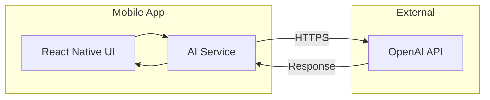

**Pros**: Simple, fast to implement
**Cons**: API key exposed in app bundle

---

### Option 2: Backend Proxy (Recommended for Production)

Best for: Production apps, secure API key management

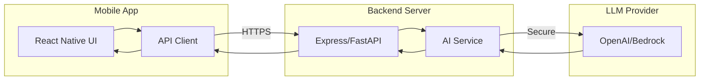

**Pros**: Secure, rate limiting, caching, analytics
**Cons**: Additional infrastructure

---

### Option 3: Serverless Backend (Best Balance)

Best for: Cost-effective production apps

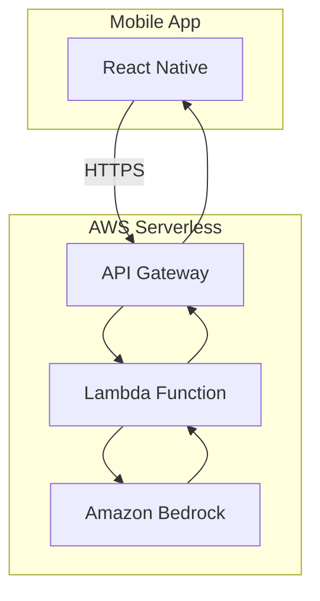

**Pros**: Pay-per-use, auto-scaling, secure
**Cons**: Cold starts, AWS dependency

---

## Recommended Architecture (Option 2 Detailed)

### Complete System Architecture

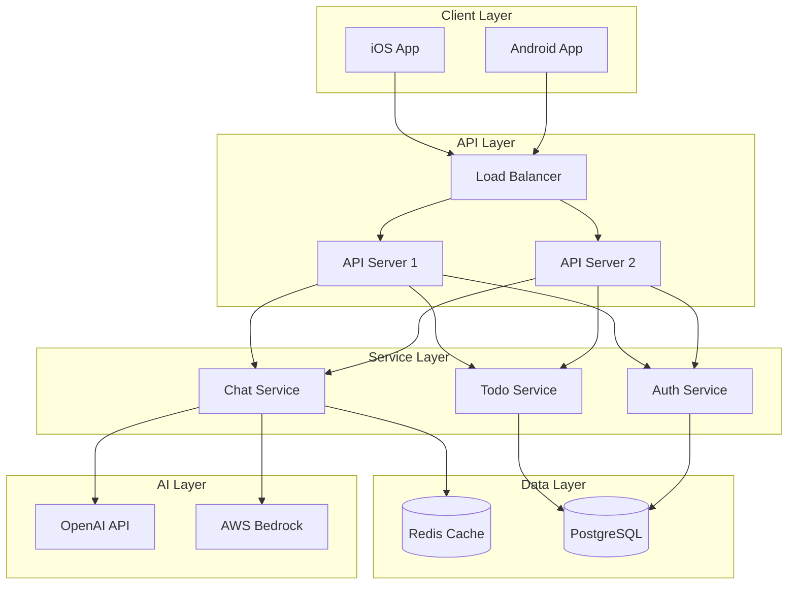

---

## Component Architecture

### React Native App Structure

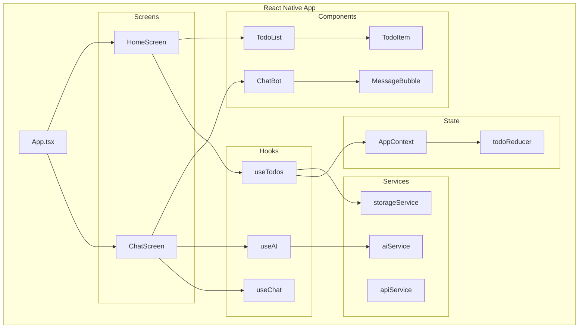

---

## Data Flow

### Chat Message Flow

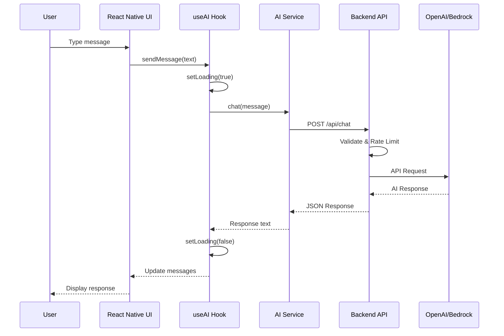

### Todo with AI Assistance Flow

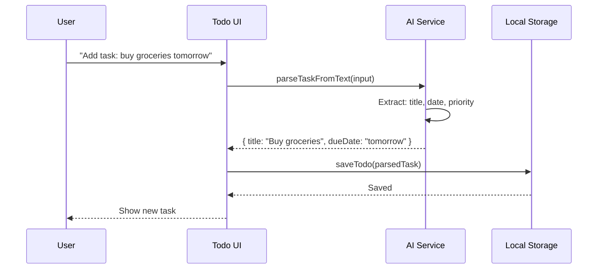

---

## State Management

### App State Structure

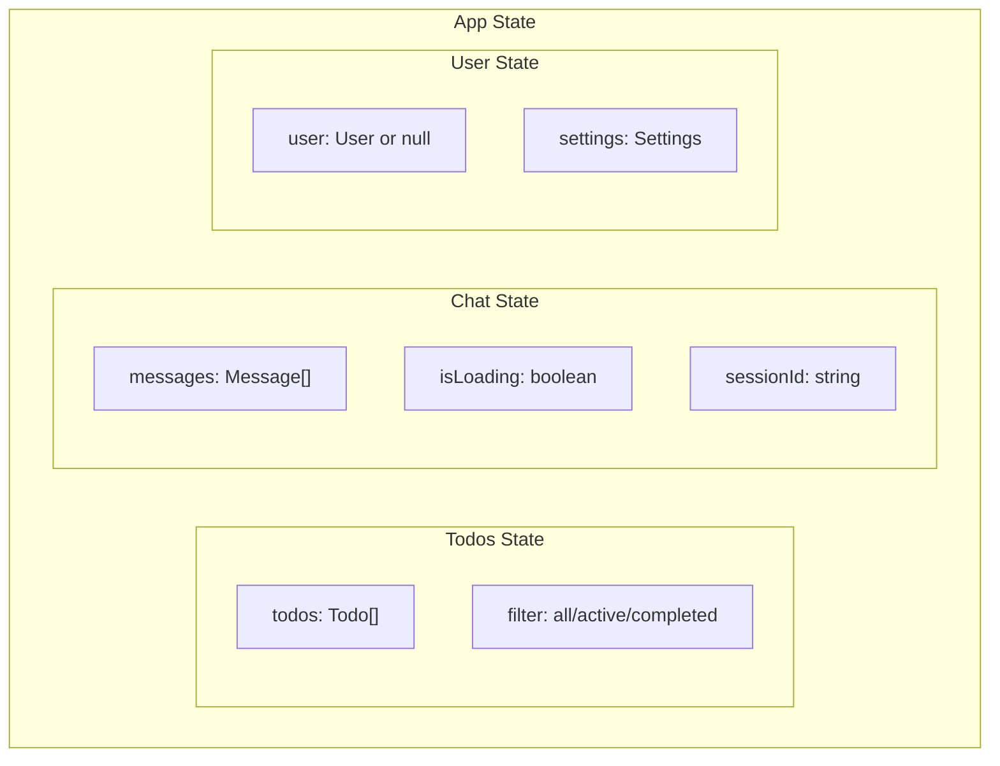

### State Flow with Context

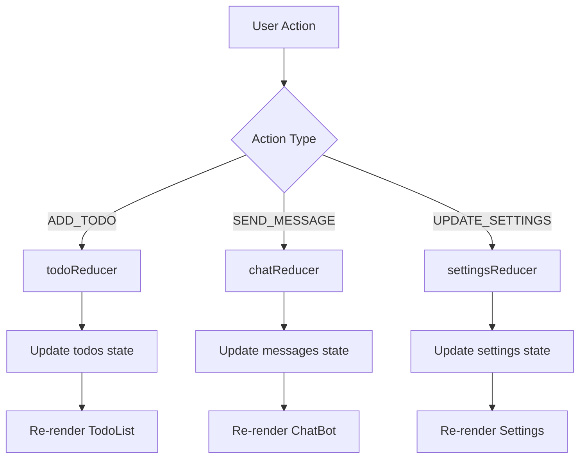

---

## API Design

### REST API Endpoints

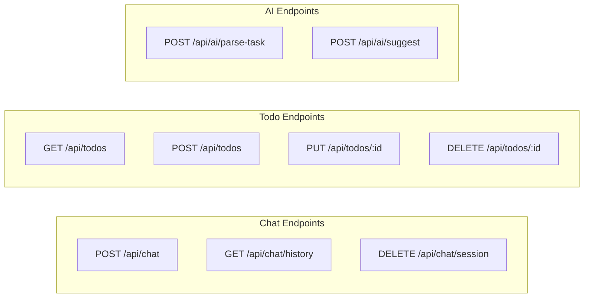

### Request/Response Flow

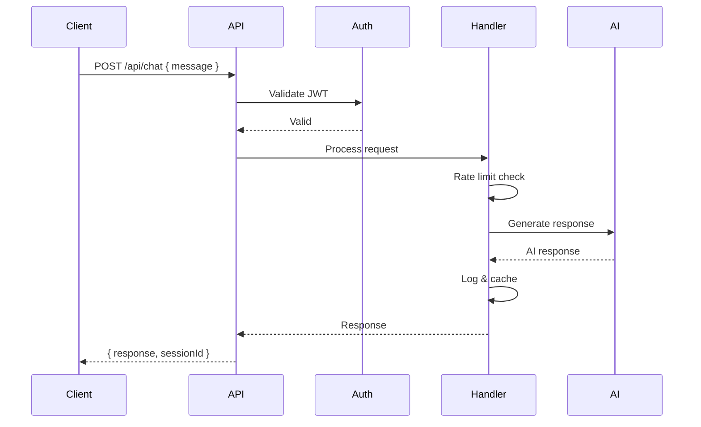

---

## Security Architecture

### Authentication Flow

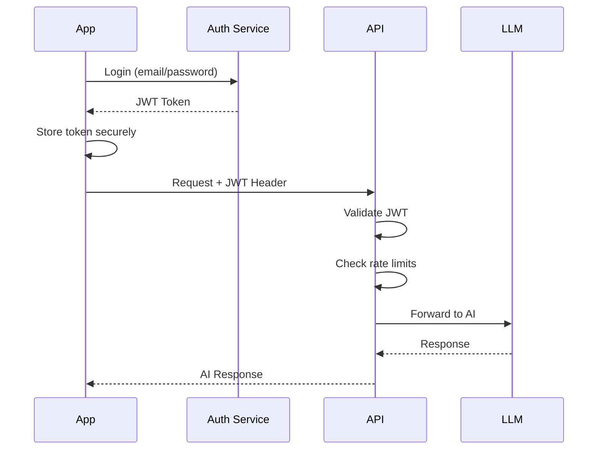

### Security Layers

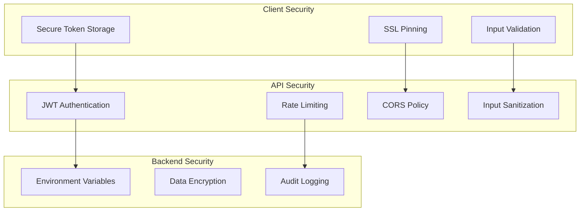

---

## Caching Strategy

### Cache Architecture

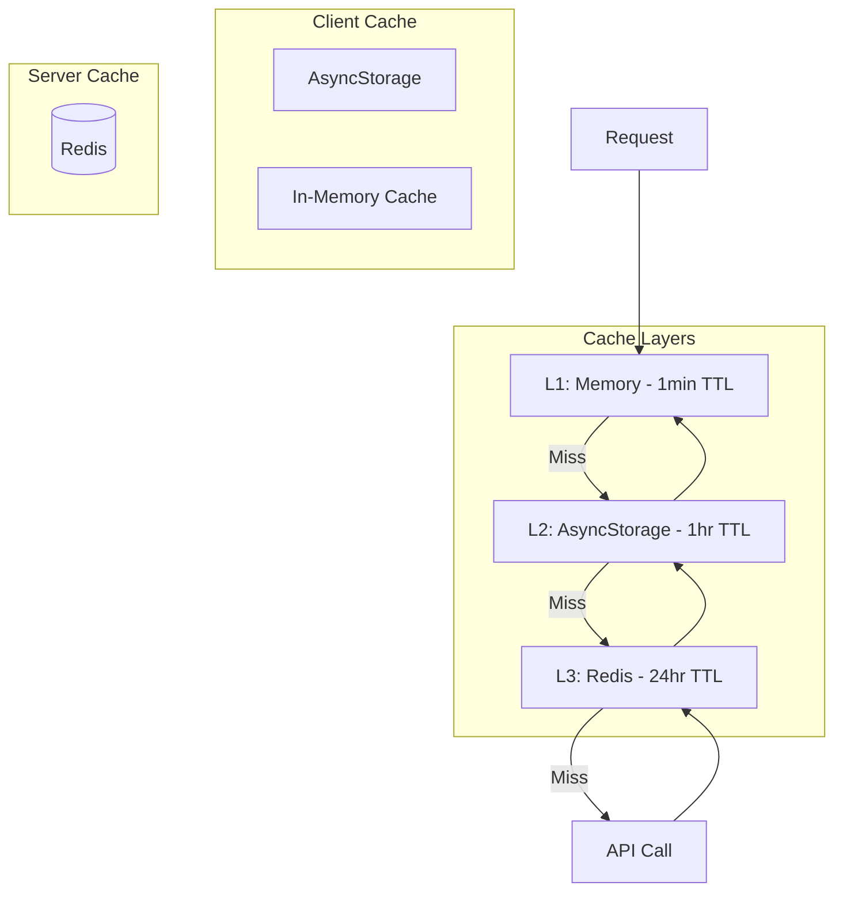

---

## Error Handling

### Error Flow

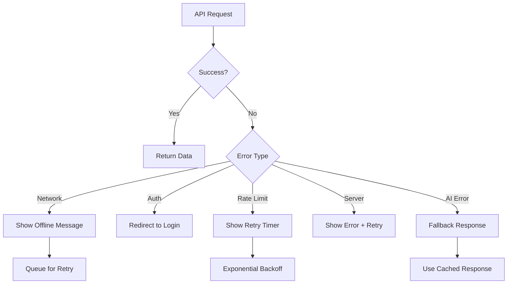

---

## Build Process

### Step-by-Step Implementation

```mermaid
graph LR
    subgraph "Phase 1: Setup"
        A1[Create Expo Project]
        A2[Install Dependencies]
        A3[Configure Environment]
    end
    
    subgraph "Phase 2: Core Features"
        B1[Build Todo CRUD]
        B2[Add Local Storage]
        B3[Create UI Components]
    end
    
    subgraph "Phase 3: AI Integration"
        C1[Create AI Service]
        C2[Build Chat UI]
        C3[Connect to LLM]
    end
    
    subgraph "Phase 4: Polish"
        D1[Error Handling]
        D2[Loading States]
        D3[Testing]
    end
    
    A1 --> A2 --> A3
    A3 --> B1 --> B2 --> B3
    B3 --> C1 --> C2 --> C3
    C3 --> D1 --> D2 --> D3
```

### Implementation Timeline

| Phase | Tasks | Time |
|-------|-------|------|
| Phase 1 | Project setup, dependencies | 1-2 hours |
| Phase 2 | Todo functionality | 2-4 hours |
| Phase 3 | AI chat integration | 2-4 hours |
| Phase 4 | Polish & testing | 2-4 hours |
| **Total** | **Complete app** | **7-14 hours** |

---

## Deployment Architecture

### Production Deployment

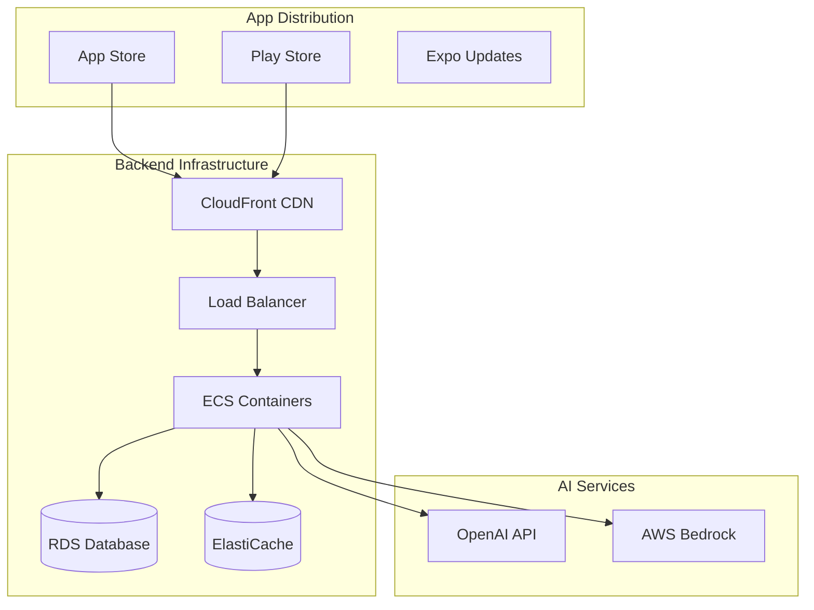

---

## Summary

### Key Decisions

1. **Use backend proxy** for API key security
2. **Implement caching** to reduce API costs
3. **Add rate limiting** to prevent abuse
4. **Use TypeScript** for type safety
5. **Follow React Native best practices**

### Next Steps

1. Clone the project
2. Install dependencies
3. Configure your API key
4. Run the app
5. Customize for your needs

See the [README.md](./README.md) for detailed setup instructions.
