# 🏭 Industry-Specific GenAI Solutions

> **Comprehensive GenAI implementations tailored for specific industries and use cases**

## 🎯 Industry Solutions Overview

This section provides industry-specific GenAI solutions that demonstrate real-world applications across various sectors. Each solution includes complete architectures, implementation code, deployment guides, and best practices tailored to industry requirements.

## 🏢 Industry Coverage

```mermaid
graph TD
    A[🏭 Industry Solutions] --> B[🏥 Healthcare]
    A --> C[💰 Financial Services]
    A --> D[🛒 Retail & E-commerce]
    A --> E[🎬 Media & Entertainment]
    A --> F[🏭 Manufacturing]
    A --> G[🎓 Education]
    A --> H[⚖️ Legal & Compliance]
    A --> I[🎧 Customer Service]
    
    B --> B1[Clinical Decision Support]
    B --> B2[Medical Document AI]
    B --> B3[Drug Discovery]
    B --> B4[Patient Care Automation]
    
    C --> C1[Fraud Detection]
    C --> C2[Investment Research]
    C --> C3[Risk Assessment]
    C --> C4[Regulatory Compliance]
    
    D --> D1[Personalization Engine]
    D --> D2[Inventory Optimization]
    D --> D3[Customer Service]
    D --> D4[Content Generation]
    
    E --> E1[Content Creation]
    E --> E2[Personalized Discovery]
    E --> E3[Metadata Generation]
    E --> E4[Copyright Protection]
    
    F --> F1[Predictive Maintenance]
    F --> F2[Quality Control]
    F --> F3[Process Optimization]
    F --> F4[Supply Chain AI]
    
    G --> G1[Adaptive Learning]
    G --> G2[AI Tutoring]
    G --> G3[Content Creation]
    G --> G4[Assessment Automation]
    
    H --> H1[Document Analysis]
    H --> H2[Compliance Monitoring]
    H --> H3[Legal Research]
    H --> H4[Risk Assessment]
    
    I --> I1[Conversational AI]
    I --> I2[Sentiment Analysis]
    I --> I3[Knowledge Management]
    I --> I4[Multilingual Support]
    
    style A fill:#e1f5fe
    style B fill:#ffebee
    style C fill:#e8f5e8
    style D fill:#fff3e0
    style E fill:#f3e5f5
    style F fill:#e0f2f1
    style G fill:#e3f2fd
    style H fill:#fce4ec
    style I fill:#f1f8e9
```



## 🏥 Healthcare AI Solutions

### 🎯 **Solution Overview**
Comprehensive AI solutions for healthcare organizations, focusing on clinical decision support, medical document processing, and patient care automation while maintaining HIPAA compliance.

### 🏗️ **Core Solutions**

#### **1. Clinical Decision Support System**
**Objective**: Provide AI-powered diagnostic assistance and treatment recommendations

**Key Features:**
- **Symptom Analysis**: AI-powered symptom assessment and triage
- **Diagnostic Support**: Evidence-based diagnostic recommendations
- **Treatment Planning**: Personalized treatment plan generation
- **Drug Interaction Checking**: Automated medication interaction analysis
- **Clinical Guidelines**: Real-time access to medical guidelines

**Architecture:**
```python
class ClinicalDecisionSupport:
    def __init__(self):
        self.bedrock = boto3.client('bedrock-runtime')
        self.comprehend_medical = boto3.client('comprehendmedical')
        self.textract = boto3.client('textract')
        
    def analyze_symptoms(self, patient_data, symptoms):
        """Analyze patient symptoms and provide diagnostic insights"""
        
        # Process patient data with medical NLP
        medical_entities = self.comprehend_medical.detect_entities_v2(
            Text=f"Patient: {patient_data}\nSymptoms: {symptoms}"
        )
        
        # Generate diagnostic insights with Bedrock
        diagnostic_prompt = f"""
        As a clinical decision support system, analyze these symptoms:
        
        Patient Data: {patient_data}
        Symptoms: {symptoms}
        Medical Entities: {medical_entities}
        
        Provide:
        1. Potential diagnoses with confidence levels
        2. Recommended diagnostic tests
        3. Urgency assessment
        4. Treatment recommendations
        5. Follow-up care suggestions
        
        Format as structured medical assessment.
        """
        
        response = self.bedrock.invoke_model(
            modelId='anthropic.claude-3-5-sonnet-20241022-v2:0',
            body=json.dumps({
                'anthropic_version': 'bedrock-2023-05-31',
                'max_tokens': 2000,
                'messages': [{'role': 'user', 'content': diagnostic_prompt}]
            })
        )
        
        return json.loads(response['body'].read())
```

#### **2. Medical Document AI**
**Objective**: Automate medical document processing and information extraction

**Key Features:**
- **Document Processing**: Extract text from medical documents
- **Entity Recognition**: Identify medical entities and relationships
- **Clinical Coding**: Automated ICD-10 and CPT coding
- **Summary Generation**: Create patient summaries from documents
- **Quality Assurance**: Validate extracted information

**Implementation:**
```python
class MedicalDocumentAI:
    def __init__(self):
        self.textract = boto3.client('textract')
        self.comprehend_medical = boto3.client('comprehendmedical')
        self.bedrock = boto3.client('bedrock-runtime')
        
    def process_medical_document(self, document_path):
        """Process medical document and extract structured information"""
        
        # Extract text from document
        text = self.extract_text_from_document(document_path)
        
        # Extract medical entities
        medical_entities = self.comprehend_medical.detect_entities_v2(Text=text)
        
        # Generate clinical summary
        summary = self.generate_clinical_summary(text, medical_entities)
        
        # Extract billing codes
        billing_codes = self.extract_billing_codes(text, medical_entities)
        
        return {
            'document_text': text,
            'medical_entities': medical_entities,
            'clinical_summary': summary,
            'billing_codes': billing_codes,
            'processing_timestamp': datetime.utcnow().isoformat()
        }
```

### 🔒 **Healthcare Compliance**

#### **HIPAA Compliance Framework**
```python
class HealthcareCompliance:
    def __init__(self):
        self.kms = boto3.client('kms')
        self.comprehend = boto3.client('comprehend')
        
    def ensure_hipaa_compliance(self, data):
        """Ensure HIPAA compliance for healthcare data"""
        
        # Detect and mask PHI
        phi_detected = self.comprehend.detect_pii_entities(Text=data)
        masked_data = self.mask_phi(data, phi_detected)
        
        # Encrypt sensitive data
        encrypted_data = self.encrypt_healthcare_data(masked_data)
        
        # Apply access controls
        access_controls = self.apply_healthcare_access_controls()
        
        # Audit logging
        self.log_healthcare_access(data, access_controls)
        
        return {
            'compliant_data': encrypted_data,
            'phi_masked': True,
            'encrypted': True,
            'access_controlled': True,
            'audit_logged': True
        }
```

## 💰 Financial Services AI Solutions

### 🎯 **Solution Overview**
Advanced AI solutions for financial institutions, focusing on fraud detection, risk assessment, investment research, and regulatory compliance.

### 🏗️ **Core Solutions**

#### **1. Real-time Fraud Detection System**
**Objective**: Detect fraudulent transactions in real-time using AI

**Key Features:**
- **Transaction Analysis**: Real-time transaction monitoring
- **Behavioral Analysis**: User behavior pattern recognition
- **Risk Scoring**: Dynamic risk assessment
- **Alert Generation**: Automated fraud alerts
- **Investigation Support**: AI-powered fraud investigation

**Architecture:**
```python
class FraudDetectionSystem:
    def __init__(self):
        self.bedrock = boto3.client('bedrock-runtime')
        self.sagemaker = boto3.client('sagemaker-runtime')
        self.kinesis = boto3.client('kinesis')
        
    def analyze_transaction(self, transaction_data):
        """Analyze transaction for fraud indicators"""
        
        # Real-time risk assessment
        risk_score = self.calculate_risk_score(transaction_data)
        
        # Behavioral analysis
        behavior_analysis = self.analyze_user_behavior(transaction_data)
        
        # Pattern recognition
        fraud_patterns = self.detect_fraud_patterns(transaction_data)
        
        # Generate fraud assessment
        fraud_assessment = self.generate_fraud_assessment(
            transaction_data, risk_score, behavior_analysis, fraud_patterns
        )
        
        # Trigger alerts if needed
        if fraud_assessment['risk_level'] == 'HIGH':
            self.trigger_fraud_alert(transaction_data, fraud_assessment)
        
        return fraud_assessment
```

#### **2. Investment Research AI**
**Objective**: Automate investment research and analysis

**Key Features:**
- **Market Analysis**: Real-time market data analysis
- **Company Research**: Automated company analysis
- **Report Generation**: AI-generated investment reports
- **Risk Assessment**: Portfolio risk analysis
- **Recommendation Engine**: Investment recommendations

**Implementation:**
```python
class InvestmentResearchAI:
    def __init__(self):
        self.bedrock = boto3.client('bedrock-runtime')
        self.comprehend = boto3.client('comprehend')
        
    def generate_investment_research(self, company_symbol, research_type):
        """Generate comprehensive investment research"""
        
        # Gather market data
        market_data = self.gather_market_data(company_symbol)
        
        # Analyze financial statements
        financial_analysis = self.analyze_financial_statements(company_symbol)
        
        # News sentiment analysis
        news_sentiment = self.analyze_news_sentiment(company_symbol)
        
        # Generate research report
        research_prompt = f"""
        Generate comprehensive investment research for {company_symbol}:
        
        Market Data: {market_data}
        Financial Analysis: {financial_analysis}
        News Sentiment: {news_sentiment}
        Research Type: {research_type}
        
        Include:
        1. Executive Summary
        2. Company Overview
        3. Financial Analysis
        4. Market Analysis
        5. Risk Assessment
        6. Investment Recommendation
        7. Price Target
        8. Key Risks
        
        Format as professional investment research report.
        """
        
        response = self.bedrock.invoke_model(
            modelId='anthropic.claude-3-5-sonnet-20241022-v2:0',
            body=json.dumps({
                'anthropic_version': 'bedrock-2023-05-31',
                'max_tokens': 4000,
                'messages': [{'role': 'user', 'content': research_prompt}]
            })
        )
        
        return json.loads(response['body'].read())
```

### 🔒 **Financial Compliance**

#### **Regulatory Compliance Framework**
```python
class FinancialCompliance:
    def __init__(self):
        self.comprehend = boto3.client('comprehend')
        self.config = boto3.client('config')
        
    def ensure_regulatory_compliance(self, transaction_data):
        """Ensure compliance with financial regulations"""
        
        # AML (Anti-Money Laundering) checks
        aml_compliance = self.check_aml_compliance(transaction_data)
        
        # KYC (Know Your Customer) validation
        kyc_compliance = self.validate_kyc_requirements(transaction_data)
        
        # Regulatory reporting
        regulatory_reports = self.generate_regulatory_reports(transaction_data)
        
        # Audit trail
        audit_trail = self.create_audit_trail(transaction_data)
        
        return {
            'aml_compliant': aml_compliance,
            'kyc_validated': kyc_compliance,
            'regulatory_reports': regulatory_reports,
            'audit_trail': audit_trail,
            'compliance_status': 'COMPLIANT' if all([aml_compliance, kyc_compliance]) else 'NON_COMPLIANT'
        }
```

## 🛒 Retail & E-commerce AI Solutions

### 🎯 **Solution Overview**
Comprehensive AI solutions for retail and e-commerce, focusing on personalization, inventory optimization, customer service, and content generation.

### 🏗️ **Core Solutions**

#### **1. Hyper-Personalization Engine**
**Objective**: Provide personalized shopping experiences using AI

**Key Features:**
- **Product Recommendations**: AI-powered product suggestions
- **Personalized Content**: Dynamic content generation
- **Behavioral Analysis**: Customer behavior insights
- **Price Optimization**: Dynamic pricing strategies
- **Cross-sell/Upsell**: Intelligent product bundling

**Architecture:**
```python
class PersonalizationEngine:
    def __init__(self):
        self.bedrock = boto3.client('bedrock-runtime')
        self.personalize = boto3.client('personalize')
        self.sagemaker = boto3.client('sagemaker-runtime')
        
    def generate_personalized_recommendations(self, user_id, context):
        """Generate personalized product recommendations"""
        
        # Analyze user behavior
        user_behavior = self.analyze_user_behavior(user_id)
        
        # Get product catalog
        product_catalog = self.get_product_catalog()
        
        # Generate recommendations
        recommendations = self.personalize.get_recommendations(
            campaignArn='your-personalize-campaign-arn',
            userId=user_id,
            numResults=20,
            context=context
        )
        
        # Enhance with AI insights
        enhanced_recommendations = self.enhance_recommendations_with_ai(
            recommendations, user_behavior, product_catalog
        )
        
        return enhanced_recommendations
```

#### **2. Intelligent Inventory Management**
**Objective**: Optimize inventory levels using AI predictions

**Key Features:**
- **Demand Forecasting**: AI-powered demand prediction
- **Inventory Optimization**: Optimal stock level calculation
- **Supply Chain Intelligence**: Supplier and logistics optimization
- **Seasonal Analysis**: Seasonal demand pattern recognition
- **Automated Reordering**: Intelligent reorder point calculation

**Implementation:**
```python
class InventoryManagementAI:
    def __init__(self):
        self.forecast = boto3.client('forecast')
        self.sagemaker = boto3.client('sagemaker-runtime')
        
    def optimize_inventory(self, product_id, historical_data):
        """Optimize inventory levels for a product"""
        
        # Generate demand forecast
        demand_forecast = self.generate_demand_forecast(product_id, historical_data)
        
        # Calculate optimal stock levels
        optimal_stock = self.calculate_optimal_stock(demand_forecast)
        
        # Analyze supply chain factors
        supply_chain_analysis = self.analyze_supply_chain(product_id)
        
        # Generate inventory recommendations
        inventory_recommendations = self.generate_inventory_recommendations(
            optimal_stock, supply_chain_analysis
        )
        
        return {
            'product_id': product_id,
            'demand_forecast': demand_forecast,
            'optimal_stock_level': optimal_stock,
            'supply_chain_analysis': supply_chain_analysis,
            'recommendations': inventory_recommendations
        }
```

## 🎬 Media & Entertainment AI Solutions

### 🎯 **Solution Overview**
AI solutions for media and entertainment companies, focusing on content creation, personalization, metadata generation, and copyright protection.

### 🏗️ **Core Solutions**

#### **1. AI Content Studio**
**Objective**: Automate content creation and production workflows

**Key Features:**
- **Content Generation**: AI-powered content creation
- **Video Editing**: Automated video processing
- **Audio Production**: AI-generated audio content
- **Script Writing**: AI-assisted script generation
- **Post-Production**: Automated editing and effects

**Architecture:**
```python
class AIContentStudio:
    def __init__(self):
        self.bedrock = boto3.client('bedrock-runtime')
        self.rekognition = boto3.client('rekognition')
        self.polly = boto3.client('polly')
        
    def create_video_content(self, script, style_preferences):
        """Create video content from script using AI"""
        
        # Generate visual storyboard
        storyboard = self.generate_storyboard(script, style_preferences)
        
        # Create video scenes
        video_scenes = self.create_video_scenes(storyboard)
        
        # Generate audio narration
        audio_narration = self.generate_audio_narration(script)
        
        # Compile final video
        final_video = self.compile_video(video_scenes, audio_narration)
        
        return {
            'storyboard': storyboard,
            'video_scenes': video_scenes,
            'audio_narration': audio_narration,
            'final_video': final_video
        }
```

#### **2. Personalized Content Discovery**
**Objective**: Provide personalized content recommendations

**Key Features:**
- **Content Recommendations**: AI-powered content suggestions
- **User Profiling**: Behavioral analysis and profiling
- **Content Analysis**: Automated content understanding
- **Trend Analysis**: Content trend identification
- **Engagement Optimization**: Maximize user engagement

## 🏭 Manufacturing AI Solutions

### 🎯 **Solution Overview**
AI solutions for manufacturing companies, focusing on predictive maintenance, quality control, process optimization, and supply chain intelligence.

### 🏗️ **Core Solutions**

#### **1. Predictive Maintenance AI**
**Objective**: Predict equipment failures and optimize maintenance schedules

**Key Features:**
- **Failure Prediction**: AI-powered failure prediction
- **Maintenance Scheduling**: Optimal maintenance planning
- **Performance Monitoring**: Real-time equipment monitoring
- **Cost Optimization**: Maintenance cost reduction
- **Downtime Minimization**: Reduce unplanned downtime

**Architecture:**
```python
class PredictiveMaintenanceAI:
    def __init__(self):
        self.sagemaker = boto3.client('sagemaker-runtime')
        self.iot = boto3.client('iot')
        
    def predict_equipment_failure(self, equipment_id, sensor_data):
        """Predict equipment failure using AI"""
        
        # Analyze sensor data
        sensor_analysis = self.analyze_sensor_data(sensor_data)
        
        # Predict failure probability
        failure_probability = self.sagemaker.invoke_endpoint(
            EndpointName='predictive-maintenance-model',
            ContentType='application/json',
            Body=json.dumps({
                'equipment_id': equipment_id,
                'sensor_data': sensor_analysis
            })
        )
        
        # Generate maintenance recommendations
        maintenance_recommendations = self.generate_maintenance_recommendations(
            equipment_id, failure_probability
        )
        
        return {
            'equipment_id': equipment_id,
            'failure_probability': failure_probability,
            'maintenance_recommendations': maintenance_recommendations,
            'prediction_confidence': self.calculate_confidence(failure_probability)
        }
```

## 🎓 Education AI Solutions

### 🎯 **Solution Overview**
AI solutions for educational institutions, focusing on adaptive learning, AI tutoring, content creation, and assessment automation.

### 🏗️ **Core Solutions**

#### **1. Adaptive Learning Platform**
**Objective**: Provide personalized learning experiences

**Key Features:**
- **Personalized Learning Paths**: AI-generated customized curriculum
- **Learning Style Adaptation**: Content delivery optimization
- **Difficulty Adjustment**: Dynamic content difficulty
- **Progress Tracking**: Comprehensive learning analytics
- **Intervention Support**: Early intervention for struggling students

## ⚖️ Legal & Compliance AI Solutions

### 🎯 **Solution Overview**
AI solutions for legal firms and compliance departments, focusing on document analysis, compliance monitoring, legal research, and risk assessment.

### 🏗️ **Core Solutions**

#### **1. Legal Document AI**
**Objective**: Automate legal document analysis and review

**Key Features:**
- **Contract Analysis**: Automated contract review
- **Legal Research**: AI-powered legal research
- **Compliance Monitoring**: Regulatory compliance tracking
- **Risk Assessment**: Legal risk evaluation
- **Due Diligence**: Automated due diligence processes

## 🎧 Customer Service AI Solutions

### 🎯 **Solution Overview**
AI solutions for customer service organizations, focusing on conversational AI, sentiment analysis, knowledge management, and multilingual support.

### 🏗️ **Core Solutions**

#### **1. Intelligent Contact Center**
**Objective**: Provide AI-powered customer service

**Key Features:**
- **Conversational AI**: Natural language customer interactions
- **Sentiment Analysis**: Real-time customer sentiment monitoring
- **Knowledge Management**: Dynamic knowledge base
- **Multilingual Support**: Global customer service
- **Escalation Management**: Intelligent issue escalation

## 📊 Industry Solution Comparison

| Industry | Primary Use Cases | Complexity | Compliance | Timeline |
|----------|------------------|------------|------------|----------|
| **Healthcare** | Clinical AI, Document Processing | High | HIPAA | 8-12 weeks |
| **Finance** | Fraud Detection, Risk Analysis | High | SOX, PCI-DSS | 6-10 weeks |
| **Retail** | Personalization, Inventory | Medium | GDPR | 4-8 weeks |
| **Media** | Content Creation, Discovery | Medium | Copyright | 6-10 weeks |
| **Manufacturing** | Predictive Maintenance | High | ISO 9001 | 8-12 weeks |
| **Education** | Adaptive Learning | Medium | FERPA | 4-8 weeks |
| **Legal** | Document Analysis | High | Attorney-Client | 6-10 weeks |
| **Customer Service** | Conversational AI | Medium | GDPR | 4-6 weeks |

## 🚀 Implementation Guide

### 📋 **Getting Started**

#### **Step 1: Choose Your Industry**
- Review industry-specific solutions
- Assess your organization's needs
- Consider compliance requirements
- Evaluate implementation complexity

#### **Step 2: Assess Readiness**
- Evaluate technical infrastructure
- Assess data availability and quality
- Review team capabilities
- Plan change management

#### **Step 3: Plan Implementation**
- Create detailed project plan
- Set realistic timelines
- Allocate resources
- Define success metrics

#### **Step 4: Deploy Solution**
- Follow industry-specific deployment guides
- Implement security and compliance measures
- Train users and administrators
- Monitor and optimize performance

### 🔒 **Industry-Specific Compliance**

#### **Healthcare (HIPAA)**
- Data encryption and access controls
- Audit logging and monitoring
- Business associate agreements
- Risk assessment and management

#### **Financial Services (SOX, PCI-DSS)**
- Financial data protection
- Transaction monitoring
- Regulatory reporting
- Risk management frameworks

#### **Retail (GDPR)**
- Customer data protection
- Consent management
- Data portability
- Right to be forgotten

## 📚 Documentation & Resources

### 📖 **Industry Guides**
- **[Healthcare Implementation Guide](./healthcare/implementation-guide.md)**
- **[Financial Services Guide](./financial-services/implementation-guide.md)**
- **[Retail Solutions Guide](./retail/implementation-guide.md)**
- **[Manufacturing Guide](./manufacturing/implementation-guide.md)**

### 🛠️ **Technical Resources**
- **[Architecture Patterns](./architecture-patterns/)**
- **[Best Practices](./best-practices/)**
- **[Security Frameworks](./security/)**
- **[Compliance Templates](./compliance/)**

### 🎯 **Case Studies**
- **[Healthcare Success Stories](./case-studies/healthcare/)**
- **[Financial Services Cases](./case-studies/financial/)**
- **[Retail Implementations](./case-studies/retail/)**
- **[Manufacturing Examples](./case-studies/manufacturing/)**

---

**🏭 Ready to transform your industry with AI? Choose your solution and start building! 🚀**

## 🔗 Quick Navigation

- **[Healthcare Solutions](./healthcare/)** - Clinical AI and medical automation
- **[Financial Services](./financial-services/)** - Fraud detection and risk management
- **[Retail & E-commerce](./retail/)** - Personalization and inventory optimization
- **[Media & Entertainment](./media/)** - Content creation and discovery
- **[Manufacturing](./manufacturing/)** - Predictive maintenance and quality control
- **[Education](./education/)** - Adaptive learning and AI tutoring
- **[Legal & Compliance](./legal/)** - Document analysis and compliance
- **[Customer Service](./customer-service/)** - Conversational AI and support

---

**Next Steps**: Select your industry focus and dive into the specific solution architecture! 💪
