# 🛤️ AWS GenAI Learning Paths - Complete Learning Journey

> **Structured learning paths from beginner to expert, designed to master AWS GenAI technologies**

## 🎯 Learning Journey Overview

Welcome to the most comprehensive AWS GenAI learning platform! This section provides structured learning paths that take you from complete beginner to expert practitioner, with hands-on projects, interactive content, and real-world applications.

## 🗺️ Learning Path Structure

```mermaid
graph TD
    A[🎯 Start Your Journey] --> B[🟢 Beginner Path]
    A --> C[🟡 Intermediate Path]
    A --> D[🔴 Expert Path]
    A --> E[🚀 Specialist Tracks]
    
    B --> B1[GenAI Fundamentals]
    B --> B2[AWS AI Services]
    B --> B3[Hands-on Labs]
    B --> B4[Interactive Content]
    B --> B5[Quizzes & Assessments]
    
    C --> C1[Advanced Architecture]
    C --> C2[Security & Compliance]
    C --> C3[Production Deployment]
    C --> C4[Cost Optimization]
    C --> C5[Testing & QA]
    
    D --> D1[Enterprise Architecture]
    D --> D2[Agentic AI Systems]
    D --> D3[Global Scale Systems]
    D --> D4[AI Research & Innovation]
    D --> D5[Leadership & Strategy]
    
    E --> E1[Healthcare AI Specialist]
    E --> E2[Financial AI Expert]
    E --> E3[Retail AI Specialist]
    E --> E4[Manufacturing AI Expert]
    
    style A fill:#e1f5fe
    style B fill:#c8e6c9
    style C fill:#fff3e0
    style D fill:#ffebee
    style E fill:#f3e5f5
```

## 🎓 Learning Paths

### 🟢 **Beginner Path: GenAI Foundations** (6 weeks)
*"From Zero to AI Practitioner"*

**Target Audience**: Complete beginners with no AI/ML background
**Prerequisites**: Basic computer skills, curiosity about AI
**Outcome**: Build your first AI applications and understand GenAI concepts

#### **Learning Objectives:**
- [ ] Understand AI, ML, and GenAI fundamentals
- [ ] Master AWS AI services basics
- [ ] Build 5 hands-on AI applications
- [ ] Learn prompt engineering techniques
- [ ] Understand AI ethics and responsible AI

#### **Curriculum Modules:**
1. **[GenAI Fundamentals](./beginner/fundamentals/)** - Core concepts and terminology
2. **[AWS GenAI Basics](./beginner/aws-genai-basics/)** - AWS AI services overview
3. **[Hands-on Labs](./beginner/hands-on-labs/)** - Build real AI applications
4. **[Interactive Content](./beginner/interactive-content/)** - Gamified learning
5. **[Quizzes & Assessments](./beginner/quizzes/)** - Test your knowledge

#### **Hands-on Projects:**
- 🎯 **AI Chatbot** - Your first conversational AI
- 🎨 **Image Generator** - Create art with AI
- 📊 **Text Analyzer** - Understand content with AI
- 🔍 **Document Processor** - Extract insights from documents
- 🎤 **Voice Assistant** - Build a voice-enabled AI

#### **Success Criteria:**
- [ ] Complete all 5 hands-on projects
- [ ] Score 80%+ on all assessments
- [ ] Build a portfolio of AI applications
- [ ] Understand AWS AI service ecosystem
- [ ] Ready for intermediate-level learning

---

### 🟡 **Intermediate Path: Production Systems** (12 weeks)
*"Building Scalable, Secure GenAI Solutions"*

**Target Audience**: Developers with basic AWS and AI knowledge
**Prerequisites**: Beginner path completion or equivalent experience
**Outcome**: Design and deploy production-ready GenAI systems

#### **Learning Objectives:**
- [ ] Design scalable GenAI architectures
- [ ] Implement security and compliance frameworks
- [ ] Build monitoring and observability systems
- [ ] Deploy production-ready applications
- [ ] Optimize costs and performance

#### **Curriculum Modules:**
1. **[Advanced Architecture](./intermediate/advanced-architecture/)** - Scalable system design
2. **[Security & Compliance](./intermediate/security-compliance/)** - Enterprise security
3. **[Monitoring & Observability](./intermediate/monitoring-observability/)** - Production monitoring
4. **[Production Deployment](./intermediate/production-deployment/)** - Deploy at scale
5. **[Cost Optimization](./intermediate/cost-optimization/)** - Maximize ROI
6. **[Testing & QA](./intermediate/testing-qa/)** - Quality assurance

#### **Capstone Project:**
- 🏆 **Enterprise GenAI Platform** - Complete multi-tenant solution

#### **Success Criteria:**
- [ ] Deploy production-ready GenAI system
- [ ] Implement comprehensive security measures
- [ ] Build monitoring and alerting systems
- [ ] Achieve 30%+ cost optimization
- [ ] Complete enterprise capstone project

---

### 🔴 **Expert Path: Enterprise Architect** (18 weeks)
*"Leading Complex AI Initiatives"*

**Target Audience**: Senior developers and architects with production experience
**Prerequisites**: Intermediate path completion + 3+ years production experience
**Outcome**: Lead enterprise AI initiatives and drive AI strategy

#### **Learning Objectives:**
- [ ] Architect enterprise-scale GenAI systems
- [ ] Design complex agentic AI workflows
- [ ] Lead multi-region, multi-tenant deployments
- [ ] Research and implement cutting-edge AI techniques
- [ ] Lead AI teams and drive innovation

#### **Curriculum Modules:**
1. **[Enterprise Architecture](./expert/enterprise-architecture/)** - Global scale design
2. **[Agentic AI Systems](./expert/agentic-ai/)** - Autonomous AI systems
3. **[Global Scale Systems](./expert/global-scale/)** - Worldwide operations
4. **[AI Research & Innovation](./expert/ai-research/)** - Cutting-edge techniques
5. **[Leadership & Strategy](./expert/leadership/)** - AI team leadership
6. **[Industry Specialization](./expert/industry-specialization/)** - Domain expertise

#### **Expert Capstone:**
- 🏆 **AI Innovation Lab** - Lead complete AI research initiative

#### **Success Criteria:**
- [ ] Design enterprise-scale AI architecture
- [ ] Lead complex AI research project
- [ ] Mentor and develop AI talent
- [ ] Contribute to AI research or open-source
- [ ] Become recognized AI thought leader

---

### 🚀 **Specialist Tracks: Industry Expertise** (Ongoing)
*"Master Industry-Specific AI Solutions"*

**Target Audience**: Experts looking to specialize in specific industries
**Prerequisites**: Expert path completion or equivalent industry experience
**Outcome**: Become industry-recognized AI specialist

#### **Available Specializations:**

##### 🏥 **Healthcare AI Specialist**
- Clinical decision support systems
- Medical document processing
- Drug discovery workflows
- HIPAA compliance and security

##### 💰 **Financial AI Expert**
- Fraud detection and prevention
- Investment research automation
- Risk assessment and management
- Regulatory compliance (SOX, PCI-DSS)

##### 🛒 **Retail AI Specialist**
- Hyper-personalization engines
- Inventory optimization systems
- Customer behavior analysis
- Supply chain intelligence

##### 🏭 **Manufacturing AI Expert**
- Predictive maintenance systems
- Quality control automation
- Process optimization
- Industrial IoT integration

## 📊 Learning Path Comparison

| Feature | Beginner | Intermediate | Expert | Specialist |
|---------|----------|--------------|--------|------------|
| **Duration** | 6 weeks | 12 weeks | 18 weeks | Ongoing |
| **Prerequisites** | None | Basic AWS + AI | Production Experience | Expert + Domain |
| **Projects** | 5 simple | 12 medium | 6 complex | Industry-specific |
| **AWS Services** | 3-5 core | 8-12 services | 15+ services | Full ecosystem |
| **Complexity** | Basic concepts | Production ready | Enterprise scale | Industry expert |
| **Certification** | AI Practitioner | ML Specialty | Solutions Architect | Industry Expert |
| **Career Level** | Entry | Mid-level | Senior/Lead | Principal/CTO |

## 🎯 Learning Methodology

### 📖 **Theory (30%)**
- Conceptual understanding through documentation
- Service capabilities and limitations
- Architecture patterns and best practices
- Industry standards and compliance

### 🛠️ **Practice (50%)**
- Hands-on labs and projects
- Real-world implementation exercises
- Code development and debugging
- Testing and validation

### 💼 **Application (20%)**
- Industry-specific use cases
- Real-world problem solving
- Solution design and architecture
- Business impact and ROI

## 🎮 Interactive Learning Features

### 🏆 **Achievement System**
- **Badges**: Earn badges for completing modules and projects
- **Certificates**: Receive certificates for path completion
- **Leaderboards**: Compete with other learners
- **Progress Tracking**: Visual progress indicators

### 🤝 **Community Learning**
- **Study Groups**: Join or create study groups
- **Peer Review**: Review and learn from others' work
- **Expert Mentorship**: Get guidance from industry experts
- **Knowledge Sharing**: Share insights and resources

### 🎯 **Personalized Learning**
- **Adaptive Content**: Content adjusts to your learning pace
- **Skill Assessment**: Regular assessments to identify gaps
- **Recommendations**: Personalized learning recommendations
- **Flexible Scheduling**: Learn at your own pace

## 📈 Progress Tracking

### 📊 **Learning Dashboard**
- **Progress Overview**: Visual progress across all paths
- **Skill Development**: Track competency growth
- **Project Portfolio**: Showcase completed projects
- **Achievement Gallery**: Your badges and certificates

### 🎯 **Milestone Celebrations**
- **Module Completions**: Celebrate each milestone
- **Project Showcases**: Share your creations
- **Skill Certifications**: Validate your competencies
- **Community Recognition**: Get recognized by peers

## 🚀 Getting Started

### **Step 1: Take the Assessment**
Complete our comprehensive assessment to determine your starting point and learning needs.

### **Step 2: Choose Your Path**
Select the learning path that matches your current level and career goals.

### **Step 3: Set Your Goals**
Define your learning objectives and set realistic timelines for achievement.

### **Step 4: Start Learning**
Begin your learning journey with structured content and hands-on projects.

### **Step 5: Track Progress**
Monitor your progress and adjust your learning plan as needed.

## 🎯 Success Metrics

### **Learning Outcomes**
- **Knowledge Acquisition**: Master GenAI concepts and AWS services
- **Skill Development**: Build practical AI development skills
- **Project Portfolio**: Create impressive AI applications
- **Certification Readiness**: Prepare for AWS certifications

### **Career Impact**
- **Job Readiness**: Be prepared for AI/ML roles
- **Skill Validation**: Demonstrate expertise through projects
- **Network Building**: Connect with AI professionals
- **Career Advancement**: Advance your career with AI skills

## 🔗 Quick Navigation

### 🟢 **Beginner Resources**
- **[Start Here](./beginner/)** - Complete beginner learning journey
- **[Fundamentals](./beginner/fundamentals/)** - GenAI concepts and terminology
- **[AWS Basics](./beginner/aws-genai-basics/)** - AWS AI services overview
- **[Hands-on Labs](./beginner/hands-on-labs/)** - Build your first AI apps
- **[Interactive Content](./beginner/interactive-content/)** - Gamified learning
- **[Quizzes](./beginner/quizzes/)** - Test your knowledge

### 🟡 **Intermediate Resources**
- **[Advanced Architecture](./intermediate/)** - Production system design
- **[Security & Compliance](./intermediate/security-compliance/)** - Enterprise security
- **[Monitoring](./intermediate/monitoring-observability/)** - Production monitoring
- **[Deployment](./intermediate/production-deployment/)** - Deploy at scale
- **[Cost Optimization](./intermediate/cost-optimization/)** - Maximize ROI
- **[Testing & QA](./intermediate/testing-qa/)** - Quality assurance

### 🔴 **Expert Resources**
- **[Enterprise Architecture](./expert/)** - Global scale design
- **[Agentic AI](./expert/agentic-ai/)** - Autonomous AI systems
- **[Global Scale](./expert/global-scale/)** - Worldwide operations
- **[AI Research](./expert/ai-research/)** - Cutting-edge techniques
- **[Leadership](./expert/leadership/)** - AI team leadership
- **[Industry Specialization](./expert/industry-specialization/)** - Domain expertise

### 🚀 **Specialist Tracks**
- **[Healthcare AI](./specialist/healthcare/)** - Medical AI solutions
- **[Financial AI](./specialist/financial/)** - FinTech AI applications
- **[Retail AI](./specialist/retail/)** - E-commerce AI systems
- **[Manufacturing AI](./specialist/manufacturing/)** - Industrial AI solutions

## 🎯 Ready to Start?

### **Choose Your Learning Adventure:**

#### 🚀 **Fast Track** (Accelerated Learning)
- Complete paths in shorter timeframes
- Intensive learning with focused practice
- Perfect for those with some background
- Includes mentorship and support

#### 🎯 **Standard Path** (Recommended)
- Balanced pace with comprehensive coverage
- Includes all interactive elements
- Perfect for most learners
- Flexible scheduling options

#### 🐌 **Gentle Journey** (Self-Paced)
- Extended timelines with extra support
- Perfect for busy schedules
- Additional resources and guidance
- Flexible deadlines and milestones

---

**Ready to master AWS GenAI? Choose your path and start your journey today! 🚀**

## 🔗 Next Steps

1. **[Take the Assessment](./assessments/)** - Discover your starting point
2. **[Choose Your Path](./path-selection/)** - Select appropriate learning path
3. **[Set Your Goals](./goal-setting/)** - Define your learning objectives
4. **[Start Learning](./getting-started/)** - Begin your GenAI journey

---

**Remember: Every expert was once a beginner. Your AI mastery journey starts here! 💪✨**