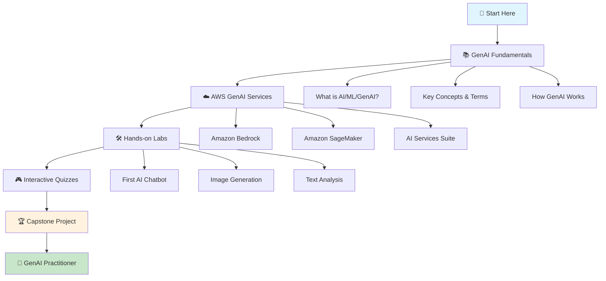

# 🚀 Beginner's Journey to AWS GenAI

> **Your complete guide to mastering Generative AI with AWS - From Zero to Hero!**

## 🎯 Welcome to Your GenAI Adventure!

Welcome to the most exciting journey in technology! You're about to embark on a comprehensive learning adventure that will transform you from a complete beginner to a confident AWS GenAI practitioner. This isn't just another tutorial - it's an interactive, engaging experience designed to make learning fun and memorable.

## 🗺️ Learning Path Overview



## 📚 Learning Modules

### 🎯 **Module 1: GenAI Fundamentals** (Week 1-2)
*"Understanding the Magic Behind AI"*

**What You'll Learn:**
- 🤖 What is Artificial Intelligence, Machine Learning, and Generative AI?
- 🧠 How do AI models actually work?
- 🔍 Key terminologies every GenAI engineer needs to know
- 🌟 Real-world applications and use cases

**Interactive Elements:**
- 🎮 **AI Concept Matching Game** - Match terms with definitions
- 📊 **Visual Learning Diagrams** - See how AI processes information
- 🧩 **Puzzle Challenges** - Solve AI-related puzzles
- 🎯 **Quick Knowledge Checks** - Test your understanding

### ☁️ **Module 2: AWS GenAI Services** (Week 3-4)
*"Exploring AWS's AI Wonderland"*

**What You'll Learn:**
- 🏗️ AWS GenAI service ecosystem
- 🎨 Amazon Bedrock - Your AI playground
- 🧪 Amazon SageMaker - Building custom AI
- 🔧 Supporting AI services (Comprehend, Rekognition, etc.)

**Interactive Elements:**
- 🗺️ **AWS Service Explorer** - Interactive service map
- 🎲 **Service Matching Game** - Match services with use cases
- 📈 **Cost Calculator** - Learn about AI pricing
- 🏆 **Service Mastery Badges** - Earn badges for each service

### 🛠️ **Module 3: Hands-on Labs** (Week 5-6)
*"Building Your First AI Applications"*

**What You'll Build:**
- 💬 **AI Chatbot** - Your first conversational AI
- 🎨 **Image Generator** - Create art with AI
- 📝 **Text Analyzer** - Understand sentiment and content
- 🔍 **Document Processor** - Extract insights from documents

**Interactive Elements:**
- 🎮 **Code Challenge Arena** - Gamified coding exercises
- 🏅 **Achievement System** - Unlock achievements as you build
- 👥 **Peer Review System** - Share and learn from others
- 📊 **Progress Tracker** - Visual progress indicators

### 🎮 **Module 4: Interactive Quizzes & Games** (Throughout)
*"Test Your Knowledge, Win Rewards!"*

**Quiz Types:**
- 🧠 **Knowledge Quizzes** - Test your understanding
- ⚡ **Speed Challenges** - Quick-fire questions
- 🎯 **Scenario Puzzles** - Solve real-world problems
- 🏆 **Championship Mode** - Compete with other learners

## 🎯 Learning Objectives

By the end of this beginner path, you will:

### 🧠 **Knowledge Goals**
- [ ] Understand the fundamental concepts of AI, ML, and GenAI
- [ ] Know the key terminologies and jargon used in GenAI
- [ ] Understand how different types of AI models work
- [ ] Be familiar with AWS GenAI service ecosystem
- [ ] Know when to use which AWS service for different tasks

### 🛠️ **Skills Goals**
- [ ] Build your first AI-powered application
- [ ] Use Amazon Bedrock for text generation
- [ ] Create and deploy simple AI models
- [ ] Process and analyze different types of data
- [ ] Debug and troubleshoot AI applications

### 🎯 **Practical Goals**
- [ ] Complete 5 hands-on projects
- [ ] Earn all beginner-level badges
- [ ] Build a portfolio of AI applications
- [ ] Understand AI ethics and responsible AI
- [ ] Be ready for intermediate-level learning

## 🎮 Gamification Features

### 🏆 **Achievement System**
- **🎯 First Steps** - Complete your first lesson
- **🧠 Knowledge Seeker** - Score 90%+ on all quizzes
- **🛠️ Builder** - Complete your first project
- **🎨 Creator** - Generate your first AI image
- **💬 Conversationalist** - Build your first chatbot
- **🏆 GenAI Master** - Complete the entire beginner path

### 🎲 **Points & Rewards**
- **📚 Learning Points** - Earn points for completing lessons
- **🎯 Accuracy Points** - Bonus points for high quiz scores
- **⚡ Speed Points** - Extra points for quick completion
- **🤝 Collaboration Points** - Points for helping others
- **💡 Innovation Points** - Points for creative solutions

### 🏅 **Badges & Certificates**
- **🥉 Bronze Badge** - Complete Module 1
- **🥈 Silver Badge** - Complete Module 2
- **🥇 Gold Badge** - Complete Module 3
- **💎 Diamond Badge** - Complete all modules with 95%+ average
- **🏆 Master Badge** - Complete capstone project

## 📅 Learning Schedule

### **Week 1: Foundation Building**
- **Days 1-2**: GenAI Fundamentals
- **Days 3-4**: Key Concepts & Terminologies
- **Days 5-7**: How GenAI Works (Interactive)

### **Week 2: Deep Dive**
- **Days 1-3**: AWS GenAI Services Overview
- **Days 4-5**: Amazon Bedrock Deep Dive
- **Days 6-7**: Hands-on Practice & Quizzes

### **Week 3: Building Skills**
- **Days 1-2**: Amazon SageMaker Basics
- **Days 3-4**: AI Services Suite
- **Days 5-7**: Integration and Best Practices

### **Week 4: Hands-on Projects**
- **Days 1-2**: Project 1 - AI Chatbot
- **Days 3-4**: Project 2 - Image Generator
- **Days 5-7**: Project 3 - Text Analyzer

### **Week 5: Advanced Practice**
- **Days 1-3**: Project 4 - Document Processor
- **Days 4-5**: Project 5 - Multi-modal Application
- **Days 6-7**: Capstone Project Planning

### **Week 6: Capstone & Assessment**
- **Days 1-4**: Capstone Project Development
- **Days 5-6**: Final Assessment & Review
- **Day 7**: Celebration & Next Steps

## 🎯 Prerequisites

### **What You Need:**
- 💻 **Basic Computer Skills** - Comfortable with using a computer
- 🌐 **Internet Connection** - For accessing AWS services and resources
- 📧 **AWS Account** - Free tier account (we'll help you set this up!)
- 🧠 **Curiosity** - The most important requirement!

### **What You DON'T Need:**
- ❌ **Programming Experience** - We'll teach you as we go
- ❌ **AI/ML Background** - This is for complete beginners
- ❌ **AWS Experience** - We'll guide you through everything
- ❌ **Expensive Software** - Everything we use is free or low-cost

## 🚀 Getting Started

### **Step 1: Set Up Your Learning Environment**
```bash
# 1. Create your AWS account (if you don't have one)
# 2. Set up your development environment
# 3. Join our learning community
# 4. Download the learning materials
```

### **Step 2: Take the Pre-Assessment**
- 📝 **Knowledge Check** - See what you already know
- 🎯 **Learning Style Quiz** - Discover your best learning approach
- 🎮 **Interest Assessment** - Find your AI passion area

### **Step 3: Start Your Journey**
- 🎯 **Begin with Module 1** - GenAI Fundamentals
- 📚 **Follow the Learning Path** - Step by step guidance
- 🎮 **Engage with Interactive Content** - Make learning fun
- 🤝 **Join the Community** - Learn with others

## 🎉 Success Stories

### **Meet Sarah - From Teacher to AI Engineer**
> *"I was a high school teacher with zero tech background. This learning path made AI accessible and fun. Now I'm building AI tools for education!"*

### **Meet Alex - Career Changer Success**
> *"I was in marketing and wanted to switch to tech. The gamified approach kept me engaged, and now I'm working as an AI consultant!"*

### **Meet Maria - Student to AI Developer**
> *"As a computer science student, this path gave me practical skills that my university courses didn't cover. I landed my dream internship!"*

## 🤝 Community & Support

### **Learning Community**
- 💬 **Discord Server** - Chat with fellow learners
- 📚 **Study Groups** - Join or create study groups
- 🎯 **Mentorship Program** - Get paired with experienced practitioners
- 🏆 **Leaderboards** - Friendly competition with other learners

### **Support Resources**
- 📖 **FAQ Section** - Answers to common questions
- 🎥 **Video Tutorials** - Step-by-step video guides
- 📝 **Written Guides** - Detailed written instructions
- 🤝 **Peer Support** - Help from other learners
- 👨‍🏫 **Expert Office Hours** - Direct access to instructors

## 📊 Progress Tracking

### **Your Learning Dashboard**
- 📈 **Progress Charts** - Visual progress tracking
- 🎯 **Goal Setting** - Set and track personal goals
- 📊 **Performance Analytics** - Detailed performance insights
- 🏆 **Achievement Gallery** - Your collection of badges and certificates

### **Milestone Celebrations**
- 🎉 **Module Completions** - Celebrate each milestone
- 🏆 **Achievement Unlocks** - Special rewards for achievements
- 🎊 **Community Recognition** - Share your success with others
- 🎁 **Exclusive Content** - Unlock special content as you progress

## 🔗 Quick Navigation

| Module | Duration | Difficulty | Prerequisites |
|--------|----------|------------|---------------|
| [**Module 1: Fundamentals**](./fundamentals/) | 2 weeks | ⭐ | None |
| [**Module 2: AWS Services**](./aws-genai-basics/) | 2 weeks | ⭐⭐ | Module 1 |
| [**Module 3: Hands-on Labs**](./hands-on-labs/) | 2 weeks | ⭐⭐⭐ | Module 2 |
| [**Module 4: Quizzes & Games**](./quizzes/) | Ongoing | ⭐⭐ | Any module |

## 🎯 Ready to Start?

### **Choose Your Adventure:**

#### 🚀 **Fast Track** (4 weeks)
- Complete all modules in 4 weeks
- Perfect for those with some tech background
- Intensive but rewarding

#### 🎯 **Standard Path** (6 weeks)
- Recommended for most learners
- Balanced pace with time for practice
- Includes all interactive elements

#### 🐌 **Gentle Journey** (8 weeks)
- Perfect for complete beginners
- Extra time for practice and reflection
- Additional support and resources

---

**Ready to become an AWS GenAI practitioner? Let's start your journey! 🚀**

## 🔗 Next Steps

1. **[Take the Pre-Assessment](./quizzes/pre-assessment.md)** - Discover your starting point
2. **[Set Up Your Environment](./fundamentals/setup-guide.md)** - Get ready to learn
3. **[Start Module 1](./fundamentals/)** - Begin with GenAI Fundamentals
4. **[Join the Community](./interactive-content/community.md)** - Connect with fellow learners

---

**Remember: Every expert was once a beginner. Your AI journey starts here! 💪✨**
