# ☁️ AWS GenAI Basics - Your Cloud AI Playground

> **Exploring Amazon's Powerful AI Services**

## 🎯 Module Overview

Welcome to the AWS GenAI universe! In this module, you'll discover Amazon's comprehensive suite of AI services that make building intelligent applications accessible to everyone. Think of AWS as your AI toolkit - with the right tools, you can build anything!

## 📚 Learning Objectives

By the end of this module, you will:
- ☁️ Understand AWS's AI service ecosystem
- 🎨 Master Amazon Bedrock for content generation
- 🧪 Explore Amazon SageMaker for custom AI
- 🔧 Use specialized AI services (Comprehend, Rekognition, etc.)
- 🛠️ Build your first AWS AI application

## 🗺️ AWS GenAI Ecosystem

```mermaid
graph TD
    A[☁️ AWS GenAI Ecosystem] --> B[🎨 Amazon Bedrock]
    A --> C[🧪 Amazon SageMaker]
    A --> D[🔧 AI Services Suite]
    A --> E[🛠️ Development Tools]
    
    B --> B1[🤖 Foundation Models]
    B --> B2[🎯 Agents & Knowledge Bases]
    B --> B3[🛡️ Guardrails]
    
    C --> C1[📊 Data Preparation]
    C --> C2[🏗️ Model Building]
    C --> C3[🚀 Model Deployment]
    
    D --> D1[📝 Amazon Comprehend]
    D --> D2[👁️ Amazon Rekognition]
    D --> D3[🎤 Amazon Transcribe]
    D --> D4[🔊 Amazon Polly]
    
    E --> E1[💻 AWS CLI]
    E --> E2[📚 SDKs & APIs]
    E --> E3[🏗️ Infrastructure as Code]
    
    style A fill:#e1f5fe
    style B fill:#fff3e0
    style C fill:#e8f5e8
    style D fill:#f3e5f5
```



## 📖 Lesson 1: AWS AI Service Overview

### 🌟 The AWS AI Advantage

Why choose AWS for your AI journey?

#### 🎯 **Comprehensive Ecosystem**
- **One Platform**: All AI services in one place
- **Seamless Integration**: Services work together perfectly
- **Scalable**: From prototype to enterprise
- **Cost-Effective**: Pay only for what you use

#### 🛡️ **Enterprise-Grade Security**
- **Data Protection**: Your data stays secure
- **Compliance**: Meets industry standards
- **Access Control**: Fine-grained permissions
- **Audit Trail**: Track all activities

#### 🚀 **Easy to Use**
- **No AI Expertise Required**: Start building immediately
- **Pre-trained Models**: Ready-to-use AI capabilities
- **Rich Documentation**: Comprehensive guides and examples
- **Community Support**: Large, active community

### 🎮 Interactive Activity: AWS AI Service Explorer

**Match the AWS service with its primary function:**

| Service | Function | Your Guess |
|---------|----------|------------|
| Amazon Bedrock | A) Text analysis and NLP | |
| Amazon SageMaker | B) Foundation models and agents | |
| Amazon Comprehend | C) Custom ML model development | |
| Amazon Rekognition | D) Computer vision and image analysis | |
| Amazon Transcribe | E) Speech-to-text conversion | |
| Amazon Polly | F) Text-to-speech synthesis | |

**Answer Key:**
- Amazon Bedrock → B) Foundation models and agents
- Amazon SageMaker → C) Custom ML model development
- Amazon Comprehend → A) Text analysis and NLP
- Amazon Rekognition → D) Computer vision and image analysis
- Amazon Transcribe → E) Speech-to-text conversion
- Amazon Polly → F) Text-to-speech synthesis

## 📖 Lesson 2: Amazon Bedrock - Your AI Playground

### 🎨 What is Amazon Bedrock?

Amazon Bedrock is like having access to the world's most powerful AI models through a simple interface. Think of it as your personal AI laboratory where you can experiment with different models to find the perfect one for your needs.

### 🧠 Foundation Models Available

```mermaid
graph TD
    A[🎨 Amazon Bedrock] --> B[🤖 Claude by Anthropic]
    A --> C[🦙 Llama by Meta]
    A --> D[🎯 Titan by Amazon]
    A --> E[🧬 Jurassic by AI21]
    A --> F[🔍 Command by Cohere]
    
    B --> B1[Claude 3.5 Sonnet]
    B --> B2[Claude 3 Haiku]
    B --> B3[Claude 3 Opus]
    
    C --> C1[Llama 3 70B]
    C --> C2[Llama 3 8B]
    C --> C3[Code Llama]
    
    D --> D1[Titan Text Express]
    D --> D2[Titan Text Premier]
    D --> D3[Titan Embeddings]
    
    style A fill:#e1f5fe
    style B fill:#fff3e0
    style C fill:#e8f5e8
    style D fill:#f3e5f5
```



### 🎯 Key Features of Bedrock

#### 🤖 **Foundation Models**
- **Multiple Providers**: Access models from leading AI companies
- **Easy Switching**: Try different models with the same API
- **Cost Optimization**: Choose the right model for your budget
- **Regular Updates**: Always access the latest model versions

#### 🎯 **Agents & Knowledge Bases**
- **AI Agents**: Build intelligent assistants that can take actions
- **Knowledge Bases**: Connect AI to your data sources
- **Function Calling**: AI can use tools and APIs
- **Memory**: Agents remember conversation context

#### 🛡️ **Safety & Control**
- **Guardrails**: Control what AI can and cannot do
- **Content Filtering**: Automatic detection of harmful content
- **Custom Policies**: Define your own safety rules
- **Audit Logging**: Track all AI interactions

### 🎮 Interactive Demo: Bedrock in Action

**Let's see Bedrock work with a simple example:**

```python
# Example: Using Bedrock to generate content
import boto3

# Initialize Bedrock client
bedrock = boto3.client('bedrock-runtime')

# Your prompt
prompt = "Write a short story about a robot learning to paint"

# Call Claude model
response = bedrock.invoke_model(
    modelId='anthropic.claude-3-5-sonnet-20241022-v2:0',
    body=json.dumps({
        'anthropic_version': 'bedrock-2023-05-31',
        'max_tokens': 1000,
        'messages': [{'role': 'user', 'content': prompt}]
    })
)

# Get the generated story
story = json.loads(response['body'].read())
print(story['content'][0]['text'])
```

**What happens:**
1. 📝 You send a prompt to Bedrock
2. 🤖 Claude model processes your request
3. ✨ AI generates a creative story
4. 📖 You receive the generated content

### 🎯 Use Cases for Bedrock

| Use Case | Description | Example |
|----------|-------------|---------|
| **Content Creation** | Generate articles, blogs, marketing copy | "Write a product description for a smartwatch" |
| **Code Generation** | Create and debug code | "Write a Python function to sort a list" |
| **Conversational AI** | Build chatbots and virtual assistants | "Create a customer service chatbot" |
| **Data Analysis** | Analyze and summarize data | "Summarize this sales report" |
| **Creative Writing** | Generate stories, poems, scripts | "Write a short story about space exploration" |

## 📖 Lesson 3: Amazon SageMaker - Your AI Laboratory

### 🧪 What is Amazon SageMaker?

Amazon SageMaker is your complete machine learning platform. It's like having a full AI research lab in the cloud, where you can build, train, and deploy custom AI models without worrying about infrastructure.

### 🏗️ SageMaker Components

```mermaid
graph TD
    A[🧪 Amazon SageMaker] --> B[📊 Data Preparation]
    A --> C[🏗️ Model Building]
    A --> D[🚀 Model Deployment]
    A --> E[📈 Monitoring]
    
    B --> B1[📁 Data Storage]
    B --> B2[🔍 Data Exploration]
    B --> B3[🧹 Data Cleaning]
    B --> B4[📊 Feature Engineering]
    
    C --> C1[🎯 Algorithm Selection]
    C --> C2[⚙️ Model Training]
    C --> C3[📊 Model Evaluation]
    C --> C4[🔄 Hyperparameter Tuning]
    
    D --> D1[🌐 Real-time Endpoints]
    D --> D2[📦 Batch Processing]
    D --> D3[🔄 A/B Testing]
    D --> D4[📊 Auto Scaling]
    
    E --> E1[📈 Performance Metrics]
    E --> E2[🚨 Alerts]
    E --> E3[📊 Dashboards]
    E --> E4[🔍 Debugging]
    
    style A fill:#e1f5fe
    style B fill:#fff3e0
    style C fill:#e8f5e8
    style D fill:#f3e5f5
    style E fill:#fce4ec
```



### 🎯 SageMaker Studio - Your AI Workspace

SageMaker Studio is like Jupyter Notebooks on steroids! It provides:

#### 💻 **Integrated Development Environment**
- **Jupyter Notebooks**: Interactive coding environment
- **Code Editor**: Full-featured code editor
- **Terminal Access**: Command-line interface
- **File Browser**: Easy file management

#### 🧠 **Built-in AI Tools**
- **Data Visualization**: Charts and graphs
- **Model Debugging**: Step-by-step model analysis
- **Experiment Tracking**: Compare different models
- **Model Registry**: Version control for models

### 🎮 Interactive Activity: SageMaker Workflow

**Put these SageMaker steps in the correct order:**

1. **Deploy Model** - Make model available for use
2. **Prepare Data** - Clean and organize your data
3. **Train Model** - Teach the model with your data
4. **Evaluate Model** - Test how well the model works
5. **Choose Algorithm** - Select the right AI approach

**Correct Order:**
1. **Prepare Data** → 2. **Choose Algorithm** → 3. **Train Model** → 4. **Evaluate Model** → 5. **Deploy Model**

### 🎯 When to Use SageMaker vs Bedrock

| Use Case | Use SageMaker | Use Bedrock |
|----------|---------------|-------------|
| **Custom AI Models** | ✅ Perfect for specialized needs | ❌ Limited customization |
| **Quick Prototyping** | ❌ Takes time to set up | ✅ Instant results |
| **Large Datasets** | ✅ Handles big data well | ❌ Limited by context |
| **Text Generation** | ❌ Requires more work | ✅ Ready to use |
| **Image Classification** | ✅ Great for custom models | ❌ Not available |
| **Real-time Predictions** | ✅ Optimized for speed | ✅ Good performance |

## 📖 Lesson 4: Specialized AI Services

### 🔧 The AI Services Suite

AWS provides specialized AI services for specific tasks. Think of these as specialized tools in your AI toolkit!

### 📝 Amazon Comprehend - Text Understanding

**What it does:** Understands and analyzes text content

```mermaid
graph LR
    A[📝 Input Text] --> B[🧠 Amazon Comprehend]
    B --> C[📊 Sentiment Analysis]
    B --> D[🏷️ Entity Recognition]
    B --> E[🔑 Key Phrase Extraction]
    B --> F[🌍 Language Detection]
    
    style B fill:#e1f5fe
    style C fill:#fff3e0
    style D fill:#e8f5e8
    style E fill:#f3e5f5
    style F fill:#fce4ec
```



**Real-world Example:**
```python
# Analyze customer feedback
text = "I love this product! The quality is amazing and delivery was fast."

# Comprehend analyzes the text
sentiment = comprehend.detect_sentiment(Text=text)
# Result: "POSITIVE" with 99% confidence

entities = comprehend.detect_entities(Text=text)
# Result: Finds "product", "quality", "delivery"
```

### 👁️ Amazon Rekognition - Computer Vision

**What it does:** Analyzes images and videos

```mermaid
graph LR
    A[🖼️ Input Image] --> B[👁️ Amazon Rekognition]
    B --> C[🏷️ Object Detection]
    B --> D[😊 Face Analysis]
    B --> E[📝 Text in Images]
    B --> F[🚫 Content Moderation]
    
    style B fill:#e1f5fe
    style C fill:#fff3e0
    style D fill:#e8f5e8
    style E fill:#f3e5f5
    style F fill:#fce4ec
```



**Real-world Example:**
```python
# Analyze a photo
image = {'S3Object': {'Bucket': 'my-bucket', 'Name': 'photo.jpg'}}

# Detect objects in the image
objects = rekognition.detect_labels(Image=image)
# Result: ["Person", "Car", "Building", "Tree"]

# Analyze faces
faces = rekognition.detect_faces(Image=image)
# Result: Age, emotions, gender, etc.
```

### 🎤 Amazon Transcribe - Speech to Text

**What it does:** Converts speech to text

**Real-world Example:**
```python
# Transcribe an audio file
transcription = transcribe.start_transcription_job(
    TranscriptionJobName='my-job',
    Media={'MediaFileUri': 's3://my-bucket/audio.mp3'},
    MediaFormat='mp3',
    LanguageCode='en-US'
)
# Result: "Hello, this is a test of speech recognition."
```

### 🔊 Amazon Polly - Text to Speech

**What it does:** Converts text to natural-sounding speech

**Real-world Example:**
```python
# Convert text to speech
response = polly.synthesize_speech(
    Text="Hello, welcome to our AI-powered application!",
    OutputFormat='mp3',
    VoiceId='Joanna'
)
# Result: Audio file with natural-sounding speech
```

### 🎮 Interactive Quiz: Service Matching

**Match the AWS service with its best use case:**

1. **Analyze customer reviews for sentiment** → Amazon Comprehend
2. **Identify objects in security camera footage** → Amazon Rekognition
3. **Convert meeting recordings to text** → Amazon Transcribe
4. **Create voice announcements for an app** → Amazon Polly
5. **Generate creative content and stories** → Amazon Bedrock
6. **Build a custom recommendation system** → Amazon SageMaker

## 📖 Lesson 5: Getting Started with AWS AI

### 🚀 Setting Up Your AWS Environment

#### Step 1: Create an AWS Account
1. Go to [aws.amazon.com](https://aws.amazon.com)
2. Click "Create an AWS Account"
3. Follow the sign-up process
4. Verify your email and phone number

#### Step 2: Set Up AWS CLI
```bash
# Install AWS CLI
pip install awscli

# Configure your credentials
aws configure
# Enter your Access Key ID
# Enter your Secret Access Key
# Enter your region (e.g., us-east-1)
# Enter output format (json)
```

#### Step 3: Enable AI Services
1. Go to AWS Console
2. Search for "Bedrock" and enable it
3. Search for "SageMaker" and enable it
4. Search for "Comprehend" and enable it

### 🎮 Interactive Setup Guide

**Follow this checklist to get started:**

- [ ] ✅ Created AWS account
- [ ] ✅ Set up AWS CLI
- [ ] ✅ Enabled Bedrock service
- [ ] ✅ Enabled SageMaker service
- [ ] ✅ Enabled Comprehend service
- [ ] ✅ Created IAM user with AI permissions
- [ ] ✅ Tested connection with AWS CLI

### 💰 Understanding AWS AI Pricing

#### 🎨 **Amazon Bedrock Pricing**
- **Pay per token**: Only pay for what you use
- **Different models**: Different pricing tiers
- **Free tier**: Limited free usage for new users

#### 🧪 **Amazon SageMaker Pricing**
- **Compute instances**: Pay for training time
- **Storage**: Pay for data storage
- **Inference**: Pay for model predictions

#### 🔧 **AI Services Pricing**
- **Per request**: Pay for each API call
- **Free tier**: Generous free usage limits
- **Volume discounts**: Lower prices for high usage

### 🎯 Cost Optimization Tips

1. **Start with Free Tier**: Use free limits to learn
2. **Choose Right Model**: Use cheaper models when possible
3. **Batch Processing**: Process multiple items together
4. **Monitor Usage**: Track your costs regularly
5. **Use Spot Instances**: For SageMaker training

## 🎮 Module Assessment

### 🧠 Knowledge Check Quiz

**Question 1: What is Amazon Bedrock primarily used for?**
- A) Storing data
- B) Foundation models and content generation
- C) Managing servers
- D) Database management

**Question 2: Which service would you use to build a custom image classification model?**
- A) Amazon Bedrock
- B) Amazon SageMaker
- C) Amazon Comprehend
- D) Amazon Rekognition

**Question 3: What does Amazon Comprehend analyze?**
- A) Images
- B) Audio
- C) Text
- D) Video

**Question 4: Which service converts speech to text?**
- A) Amazon Polly
- B) Amazon Transcribe
- C) Amazon Rekognition
- D) Amazon Bedrock

**Question 5: What is the main advantage of using AWS AI services?**
- A) They're free
- B) They're easy to use and integrate
- C) They're the fastest
- D) They're the most accurate

**Answer Key:**
1-B, 2-B, 3-C, 4-B, 5-B

### 🏆 Achievement Unlocked!

**Congratulations! You've mastered AWS GenAI Basics!**

**Your Progress:**
- ✅ **Services Learned**: 6+ AWS AI services
- ✅ **Concepts Mastered**: Foundation models, ML workflows
- ✅ **Use Cases Discovered**: 10+ real-world applications
- ✅ **Quiz Score**: [Your Score]/5

**Badges Earned:**
- 🥈 **AWS Explorer** - Completed AWS GenAI Basics
- ☁️ **Cloud Native** - Mastered AWS AI services
- 🛠️ **Tool Master** - Learned specialized AI services

## 🚀 What's Next?

You're now ready to build your first AI applications! In the next module, you'll:

- 🛠️ **Build Your First Chatbot** - Using Amazon Bedrock
- 🎨 **Create an Image Generator** - Using AI services
- 📊 **Analyze Text Data** - Using Amazon Comprehend
- 🎤 **Build a Voice App** - Using Transcribe and Polly

### 🎯 Ready for Hands-on Building?

**[Continue to Hands-on Labs →](../hands-on-labs/)**

---

**You're now equipped with the knowledge to build amazing AI applications! 🚀✨**

## 📚 Additional Resources

### 🎥 **Video Learning**
- [AWS AI Services Overview](https://www.youtube.com/watch?v=8Zx6RX-4VnA) - Complete service tour by AWS
- [Bedrock Deep Dive](https://www.youtube.com/watch?v=9T1vfs2i9UI) - Advanced Bedrock features by AWS
- [SageMaker Tutorial](https://www.youtube.com/playlist?list=PLhr1KZpdzukcOr_6j_zmSrvYnLUtlqL1A) - Step-by-step guide by AWS

### 📖 **Documentation**
- [AWS AI Services Documentation](https://docs.aws.amazon.com/ai/)
- [Bedrock User Guide](https://docs.aws.amazon.com/bedrock/)
- [SageMaker Developer Guide](https://docs.aws.amazon.com/sagemaker/)

### 🎮 **Interactive Tools**
- [AWS AI Services Playground](https://aws.amazon.com/machine-learning/ai-services/) - Try services online
- [Cost Calculator](https://calculator.aws/) - Estimate your costs with AWS Pricing Calculator
- [Service Comparison Tool](https://aws.amazon.com/machine-learning/ai-services/) - Choose the right service

---

**Keep exploring, keep building, and remember - the cloud is your AI playground! ☁️💪**
