# 🧠 GenAI Fundamentals - The Building Blocks

> **Understanding the Magic Behind Artificial Intelligence**

## 🎯 Module Overview

Welcome to the foundation of your GenAI journey! In this module, you'll discover the fascinating world of Artificial Intelligence, Machine Learning, and Generative AI. Think of this as learning the alphabet before writing poetry - we'll build your understanding from the ground up.

## 📚 Learning Objectives

By the end of this module, you will:
- 🧠 Understand what AI, ML, and GenAI really are
- 🔍 Know the key terminologies every AI engineer uses
- 🎨 See how AI models create content
- 🌟 Discover real-world applications
- 🎮 Test your knowledge with interactive games

## 🗺️ Learning Path

```mermaid
graph TD
    A[🎯 Start Here] --> B[🤖 What is AI?]
    B --> C[🧠 Machine Learning Basics]
    C --> D[✨ Generative AI Magic]
    D --> E[🔍 Key Terminologies]
    E --> F[🌟 Real-world Applications]
    F --> G[🎮 Knowledge Check]
    G --> H[🏆 Module Complete!]
    
    B --> B1[AI vs Human Intelligence]
    B --> B2[Types of AI]
    B --> B3[AI Capabilities]
    
    C --> C1[Supervised Learning]
    C --> C2[Unsupervised Learning]
    C --> C3[Reinforcement Learning]
    
    D --> D1[Text Generation]
    D --> D2[Image Creation]
    D --> D3[Code Generation]
    
    style A fill:#e1f5fe
    style H fill:#c8e6c9
    style G fill:#fff3e0
```

## 📖 Lesson 1: What is Artificial Intelligence?

### 🤖 The Big Picture

Imagine you have a super-smart robot friend who can:
- 🎨 Paint beautiful pictures
- 📝 Write stories and poems
- 🧮 Solve complex math problems
- 🗣️ Have conversations with you
- 🎵 Compose music

That's essentially what Artificial Intelligence (AI) is - computer systems that can perform tasks that typically require human intelligence!

### 🧠 AI vs Human Intelligence

```mermaid
graph LR
    subgraph "Human Intelligence"
        A1[🧠 Brain] --> A2[💭 Thinking]
        A2 --> A3[🎯 Decision Making]
        A3 --> A4[🎨 Creativity]
    end
    
    subgraph "Artificial Intelligence"
        B1[💻 Computer] --> B2[⚙️ Processing]
        B2 --> B3[🤖 Algorithms]
        B3 --> B4[🎯 Output]
    end
    
    A1 -.->|"Inspires"| B1
    A4 -.->|"Goal"| B4
```

### 🎮 Interactive Activity: AI vs Human

**Can you guess which tasks are better suited for AI vs Humans?**

| Task | AI | Human | Why? |
|------|----|----|------|
| Recognizing faces in photos | ✅ | ✅ | AI is faster, humans are more accurate |
| Writing a heartfelt letter | ❌ | ✅ | Humans have emotions and personal touch |
| Analyzing thousands of medical scans | ✅ | ❌ | AI can process vast amounts of data quickly |
| Having a deep philosophical conversation | ❌ | ✅ | Humans understand context and nuance |
| Playing chess | ✅ | ✅ | AI can calculate millions of moves, humans have intuition |

### 🎯 Key Takeaway
AI is incredibly powerful at processing information and finding patterns, but humans excel at creativity, empathy, and understanding context. The best AI systems combine both strengths!

## 📖 Lesson 2: Machine Learning - The Learning Engine

### 🧠 How Machines Learn

Think of Machine Learning (ML) like teaching a child to recognize animals:

1. **📚 Show Examples**: "This is a cat, this is a dog, this is a bird..."
2. **🔄 Practice**: The child looks at many pictures and tries to identify them
3. **✅ Feedback**: "Yes, that's correct!" or "No, that's actually a cat"
4. **🎯 Improvement**: The child gets better with more practice

Machine Learning works the same way, but with computers and data!

### 🎨 Types of Machine Learning

```mermaid
graph TD
    A[🤖 Machine Learning] --> B[👨‍🏫 Supervised Learning]
    A --> C[🔍 Unsupervised Learning]
    A --> D[🎮 Reinforcement Learning]
    
    B --> B1[📚 Has Teacher/Labels]
    B --> B2[🎯 Predicts Known Outcomes]
    B --> B3[📊 Email Spam Detection]
    
    C --> C1[🔍 No Teacher/Labels]
    C --> C2[🎯 Finds Hidden Patterns]
    C --> C3[📊 Customer Segmentation]
    
    D --> D1[🎮 Learns from Rewards]
    D --> D2[🎯 Maximizes Success]
    D --> D3[🎮 Game Playing AI]
    
    style B fill:#e8f5e8
    style C fill:#fff3e0
    style D fill:#f3e5f5
```

### 🎮 Interactive Game: ML Type Detective

**Match the scenario with the correct type of Machine Learning:**

**Scenarios:**
1. 🏥 A doctor shows an AI system 10,000 X-ray images, each labeled "healthy" or "pneumonia"
2. 🛒 An e-commerce site groups customers based on their shopping behavior
3. 🎮 An AI learns to play chess by playing millions of games against itself

**Answer Key:**
- Scenario 1: **Supervised Learning** (has labels: "healthy" or "pneumonia")
- Scenario 2: **Unsupervised Learning** (no labels, finding patterns)
- Scenario 3: **Reinforcement Learning** (learning from rewards/penalties)

## 📖 Lesson 3: Generative AI - The Creative Genius

### ✨ What Makes GenAI Special?

Generative AI is like having a creative partner who can:
- 🎨 Create new content from scratch
- 📝 Write stories, poems, and articles
- 🖼️ Generate images and artwork
- 🎵 Compose music and sound
- 💻 Write and debug code

### 🧠 How GenAI Works

```mermaid
graph TD
    A[📚 Training Data] --> B[🧠 Neural Network]
    B --> C[⚙️ Learning Patterns]
    C --> D[🎯 Model Training]
    D --> E[✨ Generative Model]
    
    F[👤 User Input] --> E
    E --> G[🎨 Generated Content]
    
    A1[📖 Millions of Books] --> A
    A2[🖼️ Billions of Images] --> A
    A3[💻 Gigabytes of Code] --> A
    
    style E fill:#e1f5fe
    style G fill:#c8e6c9
```

### 🎮 Interactive Demo: GenAI in Action

**Try this thought experiment:**

1. **Think of a topic** (e.g., "space exploration")
2. **Imagine an AI** that has read millions of articles about space
3. **The AI finds patterns** in how space articles are written
4. **You ask**: "Write a short story about a robot on Mars"
5. **The AI generates** a story by following the patterns it learned

**This is exactly how GenAI works!** 🚀

### 🎨 Types of Generative AI

| Type | What It Creates | Example |
|------|-----------------|---------|
| **Text Generation** | Stories, articles, code | ChatGPT, Claude |
| **Image Generation** | Pictures, artwork, photos | DALL-E, Midjourney |
| **Audio Generation** | Music, speech, sound effects | Jukebox, ElevenLabs |
| **Video Generation** | Movies, animations | Runway, Pika |
| **Code Generation** | Software, scripts | GitHub Copilot, CodeT5 |

## 📖 Lesson 4: Key Terminologies - The AI Dictionary

### 🎯 Essential Terms Every GenAI Engineer Should Know

#### 🧠 **Model & Training Terms**

| Term | Definition | Example |
|------|------------|---------|
| **Model** | The AI system that makes predictions | Like a recipe for making decisions |
| **Training** | Teaching the model with data | Like studying for an exam |
| **Dataset** | Collection of data used for training | Like a textbook for the AI |
| **Parameters** | Settings the model learns | Like the ingredients in a recipe |
| **Inference** | Using the model to make predictions | Like taking the actual exam |

#### 🎨 **Generation Terms**

| Term | Definition | Example |
|------|------------|---------|
| **Prompt** | Input given to the AI | "Write a story about a cat" |
| **Generation** | Output created by the AI | The story about the cat |
| **Token** | Smallest unit of text the AI understands | Like individual words or characters |
| **Temperature** | Controls randomness in generation | Low = predictable, High = creative |
| **Context** | Information the AI remembers | Like short-term memory |

#### ⚙️ **Technical Terms**

| Term | Definition | Example |
|------|------------|---------|
| **Neural Network** | Brain-like structure of the AI | Like interconnected neurons |
| **Transformer** | Architecture used in modern AI | Like the engine of a car |
| **Fine-tuning** | Customizing a pre-trained model | Like personalizing a generic recipe |
| **API** | Interface to interact with AI | Like a remote control for the AI |
| **Latency** | Time taken to get a response | Like waiting time at a restaurant |

### 🎮 Interactive Quiz: Term Matching Game

**Match the term with its best definition:**

1. **Prompt** → A) The AI's output
2. **Model** → B) Input given to the AI
3. **Token** → C) The AI system itself
4. **Temperature** → D) Smallest text unit
5. **Inference** → E) Controls creativity
6. **Training** → F) Using the model
7. **Dataset** → G) Teaching the model
8. **Context** → H) Collection of data
9. **API** → I) AI's memory
10. **Latency** → J) Interface to AI

**Answer Key:**
1-B, 2-C, 3-D, 4-E, 5-F, 6-G, 7-H, 8-I, 9-J, 10-A

## 📖 Lesson 5: Real-World Applications

### 🌟 Where You'll Find GenAI Today

#### 🏥 **Healthcare**
- **Medical Diagnosis**: AI analyzes X-rays and scans
- **Drug Discovery**: AI designs new medications
- **Patient Care**: AI chatbots provide health advice

#### 🎓 **Education**
- **Personalized Learning**: AI tutors adapt to each student
- **Content Creation**: AI generates educational materials
- **Language Learning**: AI helps with pronunciation and grammar

#### 💼 **Business**
- **Customer Service**: AI chatbots handle inquiries
- **Content Marketing**: AI writes blog posts and ads
- **Data Analysis**: AI finds insights in business data

#### 🎨 **Creative Industries**
- **Art & Design**: AI creates artwork and designs
- **Music**: AI composes songs and soundtracks
- **Writing**: AI helps with scripts and novels

### 🎮 Interactive Activity: GenAI Application Detective

**Can you identify which GenAI application is being described?**

1. **"I can write a professional email in seconds"** → Email Assistant
2. **"I can create a logo for your startup"** → Image Generator
3. **"I can help you debug your Python code"** → Code Assistant
4. **"I can translate this document to Spanish"** → Translation Tool
5. **"I can summarize this 50-page report"** → Text Summarizer

## 🎮 Module Assessment

### 🧠 Knowledge Check Quiz

**Question 1: What is the main difference between AI and traditional programming?**
- A) AI uses more memory
- B) AI can learn and adapt
- C) AI runs faster
- D) AI is cheaper

**Question 2: Which type of machine learning uses labeled data?**
- A) Unsupervised Learning
- B) Reinforcement Learning
- C) Supervised Learning
- D) Deep Learning

**Question 3: What does "generative" mean in Generative AI?**
- A) It generates electricity
- B) It creates new content
- C) It generates random numbers
- D) It generates errors

**Question 4: What is a "prompt" in GenAI?**
- A) The AI's output
- B) The user's input
- C) The model's parameters
- D) The training data

**Question 5: Which is NOT a type of content GenAI can create?**
- A) Text
- B) Images
- C) Physical objects
- D) Music

**Answer Key:**
1-B, 2-C, 3-B, 4-B, 5-C

### 🏆 Achievement Unlocked!

**Congratulations! You've completed the GenAI Fundamentals module!**

**Your Progress:**
- ✅ **Knowledge Gained**: 15+ key concepts
- ✅ **Terms Learned**: 20+ essential terminologies
- ✅ **Applications Discovered**: 10+ real-world uses
- ✅ **Quiz Score**: [Your Score]/5

**Badges Earned:**
- 🥉 **Foundation Builder** - Completed GenAI Fundamentals
- 🧠 **Terminology Master** - Learned all key terms
- 🌟 **Application Explorer** - Discovered real-world uses

## 🚀 What's Next?

You're now ready to dive into the exciting world of AWS GenAI services! In the next module, you'll learn about:

- ☁️ **Amazon Bedrock** - Your AI playground
- 🧪 **Amazon SageMaker** - Building custom AI
- 🔧 **AI Services Suite** - Ready-to-use AI tools
- 🛠️ **Hands-on Labs** - Building your first AI app

### 🎯 Ready for the Next Challenge?

**[Continue to AWS GenAI Basics →](../aws-genai-basics/)**

---

**Remember: You've just taken your first steps into the future of technology! 🚀✨**

## 📚 Additional Resources

### 🎥 **Video Learning**
- [AI Explained in 5 Minutes](https://www.youtube.com/watch?v=2ePf9rue1Ao) - Quick overview by 3Blue1Brown
- [Machine Learning Basics](https://www.youtube.com/playlist?list=PLZHQObOWTQDNU6R1_67000Dx_ZCJB-3pi) - Deep dive into ML by 3Blue1Brown
- [Generative AI Demos](https://www.youtube.com/watch?v=G5Zq3VtZcXk) - See GenAI in action with Google AI

### 📖 **Further Reading**
- [AI for Beginners Book](https://github.com/microsoft/AI-For-Beginners) - Comprehensive guide by Microsoft
- [GenAI Research Papers](https://paperswithcode.com/task/generative-adversarial-networks) - Latest developments on Papers with Code
- [AI Ethics Guide](https://www.partnershiponai.org/ai-ethics/) - Responsible AI practices by Partnership on AI

### 🎮 **Interactive Tools**
- [AI Concept Simulator](https://playground.tensorflow.org/) - Visualize AI concepts with TensorFlow Playground
- [Terminology Flashcards](https://quizlet.com/explore/artificial-intelligence) - Practice key terms on Quizlet
- [Application Explorer](https://www.ibm.com/watson/ai-use-cases) - Discover AI uses with IBM Watson

---

**Keep learning, keep exploring, and remember - every expert was once a beginner! 💪**
