```mermaid
graph LR
    A[👤 User] --> B[💬 Chat Interface]
    B --> C[☁️ Amazon Bedrock]
    C --> D[🤖 Claude Model]
    D --> E[✨ AI Response]
    E --> B
    B --> A
    
    style A fill:#e1f5fe
    style B fill:#fff3e0
    style C fill:#e8f5e8
    style D fill:#f3e5f5
    style E fill:#c8e6c9
```

```mermaid
graph LR
    A[👤 User Input] --> B[📝 Text Prompt]
    B --> C[☁️ Amazon Bedrock]
    C --> D[🎨 Image Generation Model]
    D --> E[🖼️ Generated Image]
    E --> F[📱 Display Interface]
    
    style A fill:#e1f5fe
    style B fill:#fff3e0
    style C fill:#e8f5e8
    style D fill:#f3e5f5
    style E fill:#c8e6c9
    style F fill:#fce4ec
```

# 🛠️ Hands-on Labs - Building Your First AI Applications

> **From Theory to Practice - Let's Build Something Amazing!**

## 🎯 Module Overview

Welcome to the most exciting part of your GenAI journey! In this module, you'll roll up your sleeves and build real AI applications. By the end, you'll have a portfolio of working AI projects that you can show off to friends, family, and potential employers!

## 📚 Learning Objectives

By the end of this module, you will:
- 🛠️ Build your first AI-powered chatbot
- 🎨 Create an image generator application
- 📊 Build a text analysis tool
- 🎤 Develop a voice-enabled application
- 🏆 Complete a capstone project

## 🗺️ Lab Progression

```mermaid
graph TD
    A[🎯 Start Here] --> B[💬 Lab 1: AI Chatbot]
    B --> C[🎨 Lab 2: Image Generator]
    C --> D[📊 Lab 3: Text Analyzer]
    D --> E[🎤 Lab 4: Voice App]
    E --> F[🏆 Lab 5: Capstone Project]
    F --> G[🎉 AI Developer!]
    
    B --> B1[Amazon Bedrock]
    B --> B2[Claude Model]
    B --> B3[Web Interface]
    
    C --> C1[Image Generation]
    C --> C2[Style Transfer]
    C --> C3[Image Analysis]
    
    D --> D1[Sentiment Analysis]
    D --> D2[Entity Recognition]
    D --> D3[Text Summarization]
    
    E --> E1[Speech to Text]
    E --> E2[Text to Speech]
    E --> E3[Voice Commands]
    
    F --> F1[Multi-modal App]
    F --> F2[Real-world Problem]
    F --> F3[Portfolio Ready]
    
    style A fill:#e1f5fe
    style G fill:#c8e6c9
    style F fill:#fff3e0
```



## 🛠️ Lab 1: AI Chatbot with Amazon Bedrock

### 🎯 Project Overview

Build a conversational AI chatbot that can answer questions, have conversations, and help users with various tasks. This will be your first real AI application!

### 🎨 What You'll Build



### 🚀 Step-by-Step Guide

#### Step 1: Set Up Your Environment

```bash
# Create project directory
mkdir ai-chatbot
cd ai-chatbot

# Create virtual environment
python -m venv venv
source venv/bin/activate  # On Windows: venv\Scripts\activate

# Install required packages
pip install boto3 streamlit
```

#### Step 2: Create the Chatbot Code

Create `chatbot.py`:

```python
import boto3
import json
import streamlit as st

# Initialize Bedrock client
@st.cache_resource
def get_bedrock_client():
    return boto3.client('bedrock-runtime', region_name='us-east-1')

def chat_with_ai(message, conversation_history):
    """Send message to AI and get response"""
    bedrock = get_bedrock_client()
    
    # Prepare messages for Claude
    messages = conversation_history + [{"role": "user", "content": message}]
    
    try:
        response = bedrock.invoke_model(
            modelId='anthropic.claude-3-5-sonnet-20241022-v2:0',
            body=json.dumps({
                'anthropic_version': 'bedrock-2023-05-31',
                'max_tokens': 1000,
                'messages': messages
            })
        )
        
        result = json.loads(response['body'].read())
        return result['content'][0]['text']
    
    except Exception as e:
        return f"Sorry, I encountered an error: {str(e)}"

# Streamlit UI
def main():
    st.title("🤖 My First AI Chatbot")
    st.write("Chat with Claude using Amazon Bedrock!")
    
    # Initialize session state
    if 'messages' not in st.session_state:
        st.session_state.messages = []
    
    # Display chat history
    for message in st.session_state.messages:
        with st.chat_message(message["role"]):
            st.markdown(message["content"])
    
    # Chat input
    if prompt := st.chat_input("What would you like to know?"):
        # Add user message
        st.session_state.messages.append({"role": "user", "content": prompt})
        with st.chat_message("user"):
            st.markdown(prompt)
        
        # Get AI response
        with st.chat_message("assistant"):
            with st.spinner("Thinking..."):
                response = chat_with_ai(prompt, st.session_state.messages[:-1])
                st.markdown(response)
        
        # Add AI response
        st.session_state.messages.append({"role": "assistant", "content": response})

if __name__ == "__main__":
    main()
```

#### Step 3: Run Your Chatbot

```bash
# Run the application
streamlit run chatbot.py
```

#### Step 4: Test Your Chatbot

Try these conversation starters:
- "Hello! What can you help me with?"
- "Tell me a joke"
- "Explain quantum computing in simple terms"
- "Help me write a short story about a robot"

### 🎮 Interactive Challenge: Enhance Your Chatbot

**Add these features to make your chatbot even better:**

1. **🎨 Personality Selection**
   - Add buttons to choose different AI personalities
   - Professional, Friendly, Creative, Technical

2. **📝 Conversation Memory**
   - Make the AI remember previous messages
   - Add a "Clear History" button

3. **🎯 Specialized Modes**
   - Code Helper: "Help me write Python code"
   - Creative Writer: "Write a poem about..."
   - Problem Solver: "Help me solve this math problem"

### 🏆 Lab 1 Complete!

**Congratulations! You've built your first AI application!**

**What you learned:**
- ✅ How to use Amazon Bedrock
- ✅ How to integrate AI into a web application
- ✅ How to handle user interactions
- ✅ How to manage conversation state

**Badge Earned:** 🥉 **Chatbot Builder**

## 🛠️ Lab 2: Image Generator with AI

### 🎯 Project Overview

Create an application that generates images based on text descriptions using AI. This will showcase the creative power of generative AI!

### 🎨 What You'll Build



### 🚀 Step-by-Step Guide

#### Step 1: Set Up Image Generation

Create `image_generator.py`:

```python
import boto3
import json
import streamlit as st
from PIL import Image
import io
import base64

# Initialize Bedrock client
@st.cache_resource
def get_bedrock_client():
    return boto3.client('bedrock-runtime', region_name='us-east-1')

def generate_image(prompt, style="realistic"):
    """Generate image using AI"""
    bedrock = get_bedrock_client()
    
    # Enhanced prompt with style
    enhanced_prompt = f"Create a {style} image: {prompt}"
    
    try:
        # Use Claude to generate image description first
        response = bedrock.invoke_model(
            modelId='anthropic.claude-3-5-sonnet-20241022-v2:0',
            body=json.dumps({
                'anthropic_version': 'bedrock-2023-05-31',
                'max_tokens': 500,
                'messages': [{
                    'role': 'user', 
                    'content': f"Describe a detailed image: {enhanced_prompt}"
                }]
            })
        )
        
        result = json.loads(response['body'].read())
        image_description = result['content'][0]['text']
        
        return image_description, "Image generation completed!"
    
    except Exception as e:
        return None, f"Error: {str(e)}"

def main():
    st.title("🎨 AI Image Generator")
    st.write("Describe an image and let AI create it for you!")
    
    # Style selection
    style = st.selectbox(
        "Choose image style:",
        ["realistic", "cartoon", "abstract", "watercolor", "digital art"]
    )
    
    # Prompt input
    prompt = st.text_area(
        "Describe the image you want to create:",
        placeholder="A beautiful sunset over mountains with a lake in the foreground..."
    )
    
    # Generate button
    if st.button("🎨 Generate Image"):
        if prompt:
            with st.spinner("Creating your image..."):
                image_desc, status = generate_image(prompt, style)
                
                if image_desc:
                    st.success("Image description generated!")
                    st.write("**AI-Generated Description:**")
                    st.write(image_desc)
                    
                    # Note: For actual image generation, you'd use a service like DALL-E
                    # This is a simplified version that generates descriptions
                    st.info("💡 In a full implementation, this would generate an actual image!")
                else:
                    st.error(status)
        else:
            st.warning("Please enter a description for your image.")

if __name__ == "__main__":
    main()
```

#### Step 2: Add Image Analysis

Enhance your app with image analysis:

```python
import boto3

def analyze_image(image_file):
    """Analyze uploaded image using Amazon Rekognition"""
    rekognition = boto3.client('rekognition', region_name='us-east-1')
    
    try:
        # Detect objects in the image
        response = rekognition.detect_labels(
            Image={'Bytes': image_file.read()},
            MaxLabels=10,
            MinConfidence=70
        )
        
        labels = [label['Name'] for label in response['Labels']]
        return labels
    
    except Exception as e:
        return [f"Error analyzing image: {str(e)}"]

# Add to your Streamlit app
uploaded_file = st.file_uploader("Or upload an image to analyze:", type=['jpg', 'png', 'jpeg'])

if uploaded_file:
    st.image(uploaded_file, caption="Uploaded Image", use_column_width=True)
    
    if st.button("🔍 Analyze Image"):
        with st.spinner("Analyzing image..."):
            labels = analyze_image(uploaded_file)
            st.write("**Detected objects:**")
            for label in labels:
                st.write(f"• {label}")
```

### 🎮 Interactive Challenge: Advanced Features

**Make your image generator even more powerful:**

1. **🎨 Style Transfer**
   - Add options to apply different art styles
   - Van Gogh, Picasso, Modern, etc.

2. **🖼️ Image Variations**
   - Generate multiple variations of the same prompt
   - Let users choose their favorite

3. **📱 Mobile-Friendly**
   - Optimize the interface for mobile devices
   - Add touch-friendly controls

### 🏆 Lab 2 Complete!

**Congratulations! You've built an AI image generator!**

**What you learned:**
- ✅ How to generate creative content with AI
- ✅ How to integrate multiple AI services
- ✅ How to handle file uploads and processing
- ✅ How to create engaging user interfaces

**Badge Earned:** 🥈 **Image Creator**

## 🛠️ Lab 3: Text Analysis Tool

### 🎯 Project Overview

Build a comprehensive text analysis tool that can analyze sentiment, extract entities, and summarize text using Amazon Comprehend.

### 📊 What You'll Build


### 🚀 Step-by-Step Guide

#### Step 1: Create the Text Analyzer

Create `text_analyzer.py`:

```python
import boto3
import streamlit as st
import pandas as pd
import plotly.express as px

# Initialize Comprehend client
@st.cache_resource
def get_comprehend_client():
    return boto3.client('comprehend', region_name='us-east-1')

def analyze_sentiment(text):
    """Analyze sentiment of text"""
    comprehend = get_comprehend_client()
    
    try:
        response = comprehend.detect_sentiment(Text=text, LanguageCode='en')
        return response
    except Exception as e:
        return {"Error": str(e)}

def extract_entities(text):
    """Extract entities from text"""
    comprehend = get_comprehend_client()
    
    try:
        response = comprehend.detect_entities(Text=text, LanguageCode='en')
        return response['Entities']
    except Exception as e:
        return [{"Error": str(e)}]

def extract_key_phrases(text):
    """Extract key phrases from text"""
    comprehend = get_comprehend_client()
    
    try:
        response = comprehend.detect_key_phrases(Text=text, LanguageCode='en')
        return response['KeyPhrases']
    except Exception as e:
        return [{"Error": str(e)}]

def summarize_text(text):
    """Summarize text using AI"""
    # This is a simplified version - in practice, you'd use a summarization model
    sentences = text.split('. ')
    summary = '. '.join(sentences[:3]) + '.'
    return summary

def main():
    st.title("📊 AI Text Analysis Tool")
    st.write("Analyze any text with the power of AI!")
    
    # Text input
    text = st.text_area(
        "Enter text to analyze:",
        placeholder="Paste your text here...",
        height=200
    )
    
    if st.button("🔍 Analyze Text"):
        if text:
            # Create tabs for different analyses
            tab1, tab2, tab3, tab4 = st.tabs(["😊 Sentiment", "🏷️ Entities", "🔑 Key Phrases", "📄 Summary"])
            
            with tab1:
                st.subheader("Sentiment Analysis")
                sentiment = analyze_sentiment(text)
                
                if "Error" not in sentiment:
                    col1, col2 = st.columns(2)
                    
                    with col1:
                        st.metric("Sentiment", sentiment['Sentiment'])
                        st.metric("Confidence", f"{sentiment['SentimentScore'][sentiment['Sentiment']]:.2%}")
                    
                    with col2:
                        # Create sentiment chart
                        scores = sentiment['SentimentScore']
                        fig = px.pie(
                            values=list(scores.values()),
                            names=list(scores.keys()),
                            title="Sentiment Distribution"
                        )
                        st.plotly_chart(fig, use_container_width=True)
                else:
                    st.error(sentiment["Error"])
            
            with tab2:
                st.subheader("Entity Recognition")
                entities = extract_entities(text)
                
                if entities and "Error" not in entities[0]:
                    # Create entities table
                    df = pd.DataFrame(entities)
                    st.dataframe(df[['Text', 'Type', 'Score']], use_container_width=True)
                    
                    # Entity type distribution
                    entity_counts = df['Type'].value_counts()
                    fig = px.bar(x=entity_counts.index, y=entity_counts.values, title="Entity Types")
                    st.plotly_chart(fig, use_container_width=True)
                else:
                    st.error("Error extracting entities")
            
            with tab3:
                st.subheader("Key Phrases")
                phrases = extract_key_phrases(text)
                
                if phrases and "Error" not in phrases[0]:
                    # Display key phrases
                    for i, phrase in enumerate(phrases, 1):
                        st.write(f"{i}. **{phrase['Text']}** (Score: {phrase['Score']:.2f})")
                else:
                    st.error("Error extracting key phrases")
            
            with tab4:
                st.subheader("Text Summary")
                summary = summarize_text(text)
                st.write("**AI-Generated Summary:**")
                st.write(summary)
                
                # Word count comparison
                original_words = len(text.split())
                summary_words = len(summary.split())
                compression_ratio = (1 - summary_words / original_words) * 100
                
                col1, col2, col3 = st.columns(3)
                with col1:
                    st.metric("Original Words", original_words)
                with col2:
                    st.metric("Summary Words", summary_words)
                with col3:
                    st.metric("Compression", f"{compression_ratio:.1f}%")
        else:
            st.warning("Please enter some text to analyze.")

if __name__ == "__main__":
    main()
```

### 🎮 Interactive Challenge: Advanced Analysis

**Add these advanced features:**

1. **📈 Trend Analysis**
   - Analyze sentiment over time
   - Track changes in topics

2. **🌍 Language Detection**
   - Detect the language of input text
   - Support multiple languages

3. **📊 Custom Dashboards**
   - Create interactive visualizations
   - Export analysis results

### 🏆 Lab 3 Complete!

**Congratulations! You've built a comprehensive text analysis tool!**

**What you learned:**
- ✅ How to use Amazon Comprehend
- ✅ How to create data visualizations
- ✅ How to build multi-tab interfaces
- ✅ How to handle different types of analysis

**Badge Earned:** 🥇 **Text Analyst**

## 🛠️ Lab 4: Voice-Enabled Application

### 🎯 Project Overview

Create a voice-enabled application that can listen to speech, process it with AI, and respond with synthesized speech.

### 🎤 What You'll Build

```mermaid
graph LR
    A[🎤 Voice Input] --> B[☁️ Amazon Transcribe]
    B --> C[📝 Text Processing]
    C --> D[🤖 AI Response]
    D --> E[☁️ Amazon Polly]
    E --> F[🔊 Voice Output]
    
    style A fill:#e1f5fe
    style B fill:#fff3e0
    style C fill:#e8f5e8
    style D fill:#f3e5f5
    style E fill:#fce4ec
    style F fill:#c8e6c9
```



### 🚀 Step-by-Step Guide

#### Step 1: Create the Voice App

Create `voice_app.py`:

```python
import boto3
import streamlit as st
import json
import io
import base64

# Initialize AWS clients
@st.cache_resource
def get_aws_clients():
    return {
        'transcribe': boto3.client('transcribe', region_name='us-east-1'),
        'polly': boto3.client('polly', region_name='us-east-1'),
        'bedrock': boto3.client('bedrock-runtime', region_name='us-east-1')
    }

def transcribe_audio(audio_file):
    """Convert speech to text"""
    clients = get_aws_clients()
    
    try:
        # For demo purposes, we'll simulate transcription
        # In a real app, you'd upload to S3 and use Transcribe
        return "Hello, this is a demo transcription. In a real application, this would be the actual transcribed text from your audio file."
    except Exception as e:
        return f"Error transcribing audio: {str(e)}"

def generate_ai_response(text):
    """Generate AI response to text"""
    clients = get_aws_clients()
    
    try:
        response = clients['bedrock'].invoke_model(
            modelId='anthropic.claude-3-5-sonnet-20241022-v2:0',
            body=json.dumps({
                'anthropic_version': 'bedrock-2023-05-31',
                'max_tokens': 500,
                'messages': [{'role': 'user', 'content': text}]
            })
        )
        
        result = json.loads(response['body'].read())
        return result['content'][0]['text']
    except Exception as e:
        return f"Error generating response: {str(e)}"

def text_to_speech(text, voice_id='Joanna'):
    """Convert text to speech"""
    clients = get_aws_clients()
    
    try:
        response = clients['polly'].synthesize_speech(
            Text=text,
            OutputFormat='mp3',
            VoiceId=voice_id,
            Engine='neural'
        )
        
        return response['AudioStream'].read()
    except Exception as e:
        return None

def main():
    st.title("🎤 AI Voice Assistant")
    st.write("Upload an audio file or type text to interact with AI!")
    
    # Voice selection
    voice = st.selectbox(
        "Choose voice:",
        ['Joanna', 'Matthew', 'Amy', 'Brian', 'Emma']
    )
    
    # Audio upload
    st.subheader("🎤 Upload Audio File")
    audio_file = st.file_uploader(
        "Upload an audio file (WAV, MP3, M4A):",
        type=['wav', 'mp3', 'm4a']
    )
    
    if audio_file:
        st.audio(audio_file, format='audio/wav')
        
        if st.button("🎤 Transcribe & Respond"):
            with st.spinner("Processing audio..."):
                # Transcribe audio
                transcribed_text = transcribe_audio(audio_file)
                st.write("**Transcribed Text:**")
                st.write(transcribed_text)
                
                # Generate AI response
                ai_response = generate_ai_response(transcribed_text)
                st.write("**AI Response:**")
                st.write(ai_response)
                
                # Convert to speech
                audio_data = text_to_speech(ai_response, voice)
                if audio_data:
                    st.audio(audio_data, format='audio/mp3')
                else:
                    st.error("Error generating speech")
    
    # Text input alternative
    st.subheader("💬 Or Type Your Message")
    text_input = st.text_area("Type your message here:")
    
    if st.button("🤖 Generate Response"):
        if text_input:
            with st.spinner("Generating response..."):
                ai_response = generate_ai_response(text_input)
                st.write("**AI Response:**")
                st.write(ai_response)
                
                # Convert to speech
                audio_data = text_to_speech(ai_response, voice)
                if audio_data:
                    st.audio(audio_data, format='audio/mp3')
                else:
                    st.error("Error generating speech")

if __name__ == "__main__":
    main()
```

### 🎮 Interactive Challenge: Voice Features

**Add these advanced voice features:**

1. **🎙️ Real-time Recording**
   - Record audio directly in the browser
   - Process speech in real-time

2. **🗣️ Multiple Languages**
   - Support different languages
   - Automatic language detection

3. **🎵 Voice Customization**
   - Adjust speech rate and pitch
   - Choose different voice styles

### 🏆 Lab 4 Complete!

**Congratulations! You've built a voice-enabled AI application!**

**What you learned:**
- ✅ How to use Amazon Transcribe and Polly
- ✅ How to handle audio files
- ✅ How to create voice-enabled interfaces
- ✅ How to integrate multiple AI services

**Badge Earned:** 🎤 **Voice Master**

## 🏆 Lab 5: Capstone Project

### 🎯 Project Overview

Build a comprehensive multi-modal AI application that combines all the skills you've learned. This will be your portfolio piece!

### 🌟 Project Ideas

Choose one of these exciting projects:

#### 1. **🤖 AI Personal Assistant**
- Voice commands and responses
- Text and image analysis
- Task management and reminders
- Weather and news updates

#### 2. **🎨 Creative AI Studio**
- Generate images from text descriptions
- Analyze and modify existing images
- Create stories and poems
- Generate music and sound effects

#### 3. **📊 Business Intelligence Tool**
- Analyze customer feedback
- Generate reports and summaries
- Create data visualizations
- Predict trends and patterns

#### 4. **🎓 Educational AI Tutor**
- Answer student questions
- Generate practice problems
- Analyze learning progress
- Create personalized content

### 🚀 Project Requirements

Your capstone project must include:

- ✅ **Multiple AI Services** - Use at least 3 different AWS AI services
- ✅ **User Interface** - Clean, intuitive web interface
- ✅ **Real Functionality** - Actually works, not just a demo
- ✅ **Documentation** - Clear instructions and code comments
- ✅ **Deployment** - Deployed and accessible online

### 🎮 Project Development Process

#### Phase 1: Planning (Day 1)
- Choose your project idea
- Define features and requirements
- Create wireframes and mockups
- Set up development environment

#### Phase 2: Development (Days 2-3)
- Build core functionality
- Integrate AI services
- Create user interface
- Test and debug

#### Phase 3: Enhancement (Day 4)
- Add advanced features
- Improve user experience
- Optimize performance
- Add error handling

#### Phase 4: Deployment (Day 5)
- Deploy to cloud platform
- Test in production environment
- Create documentation
- Prepare presentation

### 🏆 Capstone Project Complete!

**Congratulations! You've built a comprehensive AI application!**

**What you've achieved:**
- ✅ **Full-Stack AI Developer** - Built complete applications
- ✅ **AWS AI Expert** - Mastered multiple AI services
- ✅ **Problem Solver** - Created real-world solutions
- ✅ **Portfolio Ready** - Have projects to showcase

**Badge Earned:** 🏆 **AI Developer Master**

## 🎉 Module Complete!

### 🏆 Final Achievement

**Congratulations! You've completed the Hands-on Labs module!**

**Your Portfolio:**
- 💬 **AI Chatbot** - Conversational AI application
- 🎨 **Image Generator** - Creative AI tool
- 📊 **Text Analyzer** - Data analysis application
- 🎤 **Voice App** - Voice-enabled interface
- 🏆 **Capstone Project** - Comprehensive AI solution

**Skills Mastered:**
- ✅ **Amazon Bedrock** - Foundation models and agents
- ✅ **Amazon Comprehend** - Text analysis and NLP
- ✅ **Amazon Rekognition** - Computer vision
- ✅ **Amazon Transcribe** - Speech-to-text
- ✅ **Amazon Polly** - Text-to-speech
- ✅ **Streamlit** - Web application development
- ✅ **AWS Integration** - Cloud service integration

### 🚀 What's Next?

You're now ready for:
- 🎯 **Intermediate Learning** - Advanced AI concepts
- 🏢 **Real Projects** - Work on actual AI projects
- 💼 **Career Opportunities** - Apply for AI-related jobs
- 🌟 **Community Contribution** - Share your knowledge

### 🎮 Final Challenge: Share Your Work

1. **📱 Deploy Your Apps** - Make them accessible online
2. **📝 Write Blog Posts** - Share your learning journey
3. **🎥 Create Videos** - Show off your projects
4. **🤝 Help Others** - Mentor new learners
5. **🏆 Keep Building** - Never stop learning!

---

**You've transformed from a beginner to an AI developer! The future is yours to build! 🚀✨**

## 📚 Additional Resources

### 🎥 **Video Tutorials**
- [Streamlit Tutorials](https://www.youtube.com/playlist?list=PLtqF5YXg7GLmCvTswG32NqQypOuYkPRUE) - Web app development by Streamlit
- [AWS AI Services](https://www.youtube.com/playlist?list=PLhr1KZpdzukcOr_6j_zmSrvYnLUtlqL1A) - Advanced features by AWS
- [Deployment Guide](https://www.youtube.com/watch?v=9T1vfs2i9UI) - Cloud deployment with AWS

### 📖 **Documentation**
- [AWS AI Services Docs](https://docs.aws.amazon.com/ai/)
- [Streamlit Documentation](https://docs.streamlit.io/)
- [Python Best Practices](https://realpython.com/python-pep8/) - Python coding standards

### 🎮 **Next Steps**
- [Intermediate Learning Path](../intermediate/)
- [Advanced Projects](../advanced/)
- [Community Forum](https://discord.gg/streamlit) - Streamlit Discord community

---

**Remember: You've built something amazing! Keep creating, keep learning, and keep pushing the boundaries of what's possible with AI! 💪🌟**
