# 🛠️ Hands-on Labs - Building Your First AI Applications

> **Learn by doing! Build real AI applications step-by-step**

## 🎯 Lab Overview

Welcome to the hands-on labs! This is where theory meets practice. You'll build real AI applications using AWS services, learning through guided projects that you can actually use and showcase.

## 🎮 Lab Structure

```mermaid
graph TD
    A[🎯 Start Here] --> B[📝 Lab 1: AI Chatbot]
    B --> C[🎨 Lab 2: Image Generator]
    C --> D[📊 Lab 3: Text Analyzer]
    D --> E[🔍 Lab 4: Document Processor]
    E --> F[🎤 Lab 5: Voice Assistant]
    F --> G[🏆 Capstone Project]
    G --> H[🎉 AI Developer]
    
    B --> B1[Amazon Bedrock]
    B --> B2[API Integration]
    B --> B3[Web Interface]
    
    C --> C1[Image Generation]
    C --> C2[Image Analysis]
    C --> C3[Creative Applications]
    
    D --> D1[Sentiment Analysis]
    D --> D2[Entity Recognition]
    D --> D3[Content Moderation]
    
    E --> E1[Document Upload]
    E --> E2[Text Extraction]
    E --> E3[AI Analysis]
    
    F --> F1[Speech Recognition]
    F --> F2[AI Processing]
    F --> F3[Voice Response]
    
    style A fill:#e1f5fe
    style H fill:#c8e6c9
    style G fill:#fff3e0
```



## 📋 Lab Prerequisites

### **What You Need:**
- ✅ **AWS Account**: Free tier account (we'll help you set this up!)
- ✅ **Basic Python**: Understanding of variables, functions, and loops
- ✅ **Text Editor**: VS Code, PyCharm, or any code editor
- ✅ **Internet Connection**: For accessing AWS services
- ✅ **Curiosity**: The most important requirement!

### **What We'll Teach You:**
- 🐍 **Python for AI**: Learn Python concepts as we build
- ☁️ **AWS Services**: Master AWS AI services hands-on
- 🎨 **Web Development**: Build simple web interfaces
- 🔧 **API Integration**: Connect services together
- 🎯 **Problem Solving**: Debug and troubleshoot issues

## 🧪 Lab 1: AI Chatbot - Your First AI Friend

### 🎯 **Lab Objective**
Build a conversational AI chatbot that can answer questions, have conversations, and help users with various tasks.

### 📚 **What You'll Learn**
- How to use Amazon Bedrock for text generation
- Basic API integration with Python
- Simple web interface development
- Conversation flow management

### 🛠️ **Technologies Used**
- **Amazon Bedrock**: For AI text generation
- **Python Flask**: For web application
- **HTML/CSS**: For user interface
- **JavaScript**: For interactive features

### 📋 **Lab Steps**

#### **Step 1: Set Up Your Environment**
```bash
# Create project directory
mkdir ai-chatbot
cd ai-chatbot

# Create virtual environment
python -m venv venv
source venv/bin/activate  # On Windows: venv\Scripts\activate

# Install required packages
pip install boto3 flask python-dotenv
```

#### **Step 2: Configure AWS Credentials**
```python
# Create .env file
AWS_ACCESS_KEY_ID=your_access_key_here
AWS_SECRET_ACCESS_KEY=your_secret_key_here
AWS_DEFAULT_REGION=us-east-1
```

#### **Step 3: Build the Chatbot Backend**
```python
# chatbot.py
import boto3
import json
from flask import Flask, render_template, request, jsonify
from dotenv import load_dotenv
import os

load_dotenv()

app = Flask(__name__)

# Initialize Bedrock client
bedrock = boto3.client(
    'bedrock-runtime',
    aws_access_key_id=os.getenv('AWS_ACCESS_KEY_ID'),
    aws_secret_access_key=os.getenv('AWS_SECRET_ACCESS_KEY'),
    region_name=os.getenv('AWS_DEFAULT_REGION')
)

class AIChatbot:
    def __init__(self):
        self.conversation_history = []
    
    def generate_response(self, user_input):
        """Generate AI response using Bedrock"""
        
        # Add user input to conversation history
        self.conversation_history.append({"role": "user", "content": user_input})
        
        # Prepare the prompt with conversation context
        prompt = self.build_prompt()
        
        try:
            # Call Bedrock API
        response = bedrock.invoke_model(
            modelId='anthropic.claude-3-5-sonnet-20241022-v2:0',
            body=json.dumps({
                'anthropic_version': 'bedrock-2023-05-31',
                'max_tokens': 1000,
                    'messages': self.conversation_history
            })
        )
        
            # Parse response
        result = json.loads(response['body'].read())
            ai_response = result['content'][0]['text']
            
            # Add AI response to conversation history
            self.conversation_history.append({"role": "assistant", "content": ai_response})
            
            return ai_response
    
    except Exception as e:
        return f"Sorry, I encountered an error: {str(e)}"

    def build_prompt(self):
        """Build conversation context"""
        context = "You are a helpful AI assistant. Be friendly, informative, and engaging in your responses."
        return context

# Initialize chatbot
chatbot = AIChatbot()

@app.route('/')
def home():
    return render_template('index.html')

@app.route('/chat', methods=['POST'])
def chat():
    user_message = request.json.get('message', '')
    ai_response = chatbot.generate_response(user_message)
    
    return jsonify({
        'response': ai_response,
        'user_message': user_message
    })

if __name__ == '__main__':
    app.run(debug=True)
```

#### **Step 4: Create the Web Interface**
```html
<!-- templates/index.html -->
<!DOCTYPE html>
<html lang="en">
<head>
    <meta charset="UTF-8">
    <meta name="viewport" content="width=device-width, initial-scale=1.0">
    <title>AI Chatbot</title>
    <style>
        body {
            font-family: Arial, sans-serif;
            max-width: 800px;
            margin: 0 auto;
            padding: 20px;
            background-color: #f5f5f5;
        }
        .chat-container {
            background: white;
            border-radius: 10px;
            padding: 20px;
            box-shadow: 0 2px 10px rgba(0,0,0,0.1);
        }
        .chat-messages {
            height: 400px;
            overflow-y: auto;
            border: 1px solid #ddd;
            padding: 15px;
            margin-bottom: 20px;
            background-color: #fafafa;
        }
        .message {
            margin-bottom: 15px;
            padding: 10px;
            border-radius: 8px;
        }
        .user-message {
            background-color: #007bff;
            color: white;
            text-align: right;
        }
        .ai-message {
            background-color: #e9ecef;
            color: #333;
        }
        .input-container {
            display: flex;
            gap: 10px;
        }
        #messageInput {
            flex: 1;
            padding: 10px;
            border: 1px solid #ddd;
            border-radius: 5px;
        }
        #sendButton {
            padding: 10px 20px;
            background-color: #007bff;
            color: white;
            border: none;
            border-radius: 5px;
            cursor: pointer;
        }
        #sendButton:hover {
            background-color: #0056b3;
        }
    </style>
</head>
<body>
    <div class="chat-container">
        <h1>🤖 AI Chatbot</h1>
        <div class="chat-messages" id="chatMessages">
            <div class="message ai-message">
                Hello! I'm your AI assistant. How can I help you today?
            </div>
        </div>
        <div class="input-container">
            <input type="text" id="messageInput" placeholder="Type your message here..." />
            <button id="sendButton" onclick="sendMessage()">Send</button>
        </div>
    </div>

    <script>
        function sendMessage() {
            const input = document.getElementById('messageInput');
            const message = input.value.trim();
            
            if (message === '') return;
            
            // Add user message to chat
            addMessage(message, 'user');
            input.value = '';
            
            // Show typing indicator
            addTypingIndicator();
            
            // Send message to backend
            fetch('/chat', {
                method: 'POST',
                headers: {
                    'Content-Type': 'application/json',
                },
                body: JSON.stringify({ message: message })
            })
            .then(response => response.json())
            .then(data => {
                removeTypingIndicator();
                addMessage(data.response, 'ai');
            })
            .catch(error => {
                removeTypingIndicator();
                addMessage('Sorry, I encountered an error. Please try again.', 'ai');
            });
        }
        
        function addMessage(message, sender) {
            const chatMessages = document.getElementById('chatMessages');
            const messageDiv = document.createElement('div');
            messageDiv.className = `message ${sender}-message`;
            messageDiv.textContent = message;
            chatMessages.appendChild(messageDiv);
            chatMessages.scrollTop = chatMessages.scrollHeight;
        }
        
        function addTypingIndicator() {
            const chatMessages = document.getElementById('chatMessages');
            const typingDiv = document.createElement('div');
            typingDiv.className = 'message ai-message';
            typingDiv.id = 'typingIndicator';
            typingDiv.textContent = 'AI is typing...';
            chatMessages.appendChild(typingDiv);
            chatMessages.scrollTop = chatMessages.scrollHeight;
        }
        
        function removeTypingIndicator() {
            const typingIndicator = document.getElementById('typingIndicator');
            if (typingIndicator) {
                typingIndicator.remove();
            }
        }
        
        // Allow sending message with Enter key
        document.getElementById('messageInput').addEventListener('keypress', function(e) {
            if (e.key === 'Enter') {
                sendMessage();
            }
        });
    </script>
</body>
</html>
```

#### **Step 5: Test Your Chatbot**
```bash
# Run the application
python chatbot.py

# Open your browser and go to:
# http://localhost:5000
```

### 🎯 **Lab 1 Success Criteria**
- [ ] Chatbot responds to user messages
- [ ] Conversation history is maintained
- [ ] Web interface is user-friendly
- [ ] Error handling works properly
- [ ] You can have a meaningful conversation

### 🏆 **Lab 1 Achievement**
**🎉 Congratulations! You've built your first AI application!**

**What you've accomplished:**
- ✅ Integrated Amazon Bedrock with Python
- ✅ Built a web application with Flask
- ✅ Created an interactive user interface
- ✅ Implemented conversation management
- ✅ Added error handling and user feedback

---

## 🎨 Lab 2: AI Image Generator - Create Art with AI

### 🎯 **Lab Objective**
Build an AI-powered image generator that can create images from text descriptions using AWS AI services.

### 📚 **What You'll Learn**
- How to use AI for image generation
- File handling and image processing
- Advanced web interface development
- API integration with image services

### 🛠️ **Technologies Used**
- **Amazon Bedrock**: For AI image generation
- **Python Flask**: For web application
- **HTML/CSS/JavaScript**: For user interface
- **PIL (Pillow)**: For image processing

### 📋 **Lab Steps**

#### **Step 1: Set Up Image Generation Project**
```bash
# Create project directory
mkdir ai-image-generator
cd ai-image-generator

# Create virtual environment
python -m venv venv
source venv/bin/activate

# Install required packages
pip install boto3 flask python-dotenv pillow
```

#### **Step 2: Build the Image Generator Backend**
```python
# image_generator.py
import boto3
import json
import base64
import io
from flask import Flask, render_template, request, jsonify, send_file
from dotenv import load_dotenv
import os
from PIL import Image

load_dotenv()

app = Flask(__name__)

# Initialize Bedrock client
bedrock = boto3.client(
    'bedrock-runtime',
    aws_access_key_id=os.getenv('AWS_ACCESS_KEY_ID'),
    aws_secret_access_key=os.getenv('AWS_SECRET_ACCESS_KEY'),
    region_name=os.getenv('AWS_DEFAULT_REGION')
)

class AIImageGenerator:
    def __init__(self):
        self.generation_history = []
    
    def generate_image(self, prompt, style="realistic", size="1024x1024"):
        """Generate AI image from text prompt"""
        
        try:
            # Enhanced prompt with style
            enhanced_prompt = self.enhance_prompt(prompt, style)
            
            # Call Bedrock for image generation
        response = bedrock.invoke_model(
                modelId='amazon.titan-image-generator-v1',
            body=json.dumps({
                    'taskType': 'TEXT_IMAGE',
                    'textToImageParams': {
                        'text': enhanced_prompt,
                        'negativeText': 'blurry, low quality, distorted'
                    },
                    'imageGenerationConfig': {
                        'numberOfImages': 1,
                        'quality': 'premium',
                        'width': int(size.split('x')[0]),
                        'height': int(size.split('x')[1]),
                        'cfgScale': 8.0,
                        'seed': 42
                    }
                })
            )
            
            # Parse response
        result = json.loads(response['body'].read())
            
            # Extract base64 image
            base64_image = result['images'][0]
            image_data = base64.b64decode(base64_image)
            
            # Save generation to history
            generation_record = {
                'prompt': prompt,
                'style': style,
                'size': size,
                'timestamp': str(datetime.now())
            }
            self.generation_history.append(generation_record)
            
            return image_data
            
        except Exception as e:
            raise Exception(f"Image generation failed: {str(e)}")
    
    def enhance_prompt(self, prompt, style):
        """Enhance prompt with style instructions"""
        style_enhancements = {
            'realistic': 'photorealistic, high quality, detailed',
            'artistic': 'artistic, creative, stylized, beautiful',
            'cartoon': 'cartoon style, colorful, fun, animated',
            'abstract': 'abstract, modern, artistic, creative',
            'vintage': 'vintage style, retro, classic, nostalgic'
        }
        
        enhancement = style_enhancements.get(style, 'high quality, detailed')
        return f"{prompt}, {enhancement}"

# Initialize image generator
image_generator = AIImageGenerator()

@app.route('/')
def home():
    return render_template('image_generator.html')

@app.route('/generate', methods=['POST'])
def generate_image():
    try:
        data = request.json
        prompt = data.get('prompt', '')
        style = data.get('style', 'realistic')
        size = data.get('size', '1024x1024')
        
        if not prompt:
            return jsonify({'error': 'Prompt is required'}), 400
        
        # Generate image
        image_data = image_generator.generate_image(prompt, style, size)
        
        # Convert to base64 for web display
        base64_image = base64.b64encode(image_data).decode('utf-8')
        
        return jsonify({
            'success': True,
            'image': base64_image,
            'prompt': prompt,
            'style': style,
            'size': size
        })
    
    except Exception as e:
        return jsonify({'error': str(e)}), 500

@app.route('/history')
def get_history():
    return jsonify(image_generator.generation_history)

if __name__ == '__main__':
    app.run(debug=True)
```

#### **Step 3: Create the Image Generator Interface**
```html
<!-- templates/image_generator.html -->
<!DOCTYPE html>
<html lang="en">
<head>
    <meta charset="UTF-8">
    <meta name="viewport" content="width=device-width, initial-scale=1.0">
    <title>AI Image Generator</title>
    <style>
        body {
            font-family: Arial, sans-serif;
            max-width: 1200px;
            margin: 0 auto;
            padding: 20px;
            background: linear-gradient(135deg, #667eea 0%, #764ba2 100%);
            min-height: 100vh;
        }
        .container {
            background: white;
            border-radius: 15px;
            padding: 30px;
            box-shadow: 0 10px 30px rgba(0,0,0,0.2);
        }
        h1 {
            text-align: center;
            color: #333;
            margin-bottom: 30px;
        }
        .input-section {
            background: #f8f9fa;
            padding: 20px;
            border-radius: 10px;
            margin-bottom: 30px;
        }
        .form-group {
            margin-bottom: 20px;
        }
        label {
            display: block;
            margin-bottom: 5px;
            font-weight: bold;
            color: #555;
        }
        input[type="text"], select {
            width: 100%;
            padding: 12px;
            border: 2px solid #ddd;
            border-radius: 8px;
            font-size: 16px;
        }
        input[type="text"]:focus, select:focus {
            outline: none;
            border-color: #667eea;
        }
        .generate-btn {
            background: linear-gradient(135deg, #667eea 0%, #764ba2 100%);
            color: white;
            padding: 15px 30px;
            border: none;
            border-radius: 8px;
            font-size: 16px;
            cursor: pointer;
            width: 100%;
            transition: transform 0.2s;
        }
        .generate-btn:hover {
            transform: translateY(-2px);
        }
        .generate-btn:disabled {
            opacity: 0.6;
            cursor: not-allowed;
        }
        .result-section {
            text-align: center;
        }
        .generated-image {
            max-width: 100%;
            border-radius: 10px;
            box-shadow: 0 5px 15px rgba(0,0,0,0.2);
            margin: 20px 0;
        }
        .loading {
            display: none;
            text-align: center;
            padding: 40px;
        }
        .spinner {
            border: 4px solid #f3f3f3;
            border-top: 4px solid #667eea;
            border-radius: 50%;
            width: 40px;
            height: 40px;
            animation: spin 1s linear infinite;
            margin: 0 auto 20px;
        }
        @keyframes spin {
            0% { transform: rotate(0deg); }
            100% { transform: rotate(360deg); }
        }
        .error {
            background: #f8d7da;
            color: #721c24;
            padding: 15px;
            border-radius: 8px;
            margin: 20px 0;
        }
        .success {
            background: #d4edda;
            color: #155724;
            padding: 15px;
            border-radius: 8px;
            margin: 20px 0;
        }
    </style>
</head>
<body>
    <div class="container">
        <h1>🎨 AI Image Generator</h1>
        
        <div class="input-section">
            <div class="form-group">
                <label for="prompt">Describe the image you want to create:</label>
                <input type="text" id="prompt" placeholder="e.g., A beautiful sunset over mountains with a lake in the foreground" />
            </div>
            
            <div class="form-group">
                <label for="style">Art Style:</label>
                <select id="style">
                    <option value="realistic">Realistic</option>
                    <option value="artistic">Artistic</option>
                    <option value="cartoon">Cartoon</option>
                    <option value="abstract">Abstract</option>
                    <option value="vintage">Vintage</option>
                </select>
            </div>
            
            <div class="form-group">
                <label for="size">Image Size:</label>
                <select id="size">
                    <option value="1024x1024">1024x1024 (Square)</option>
                    <option value="1024x768">1024x768 (Landscape)</option>
                    <option value="768x1024">768x1024 (Portrait)</option>
                </select>
            </div>
            
            <button class="generate-btn" onclick="generateImage()">Generate Image</button>
        </div>
        
        <div class="loading" id="loading">
            <div class="spinner"></div>
            <p>Creating your image... This may take a few moments.</p>
        </div>
        
        <div class="result-section" id="resultSection" style="display: none;">
            <div id="message"></div>
            
            <div id="imageInfo"></div>
        </div>
    </div>

    <script>
        async function generateImage() {
            const prompt = document.getElementById('prompt').value.trim();
            const style = document.getElementById('style').value;
            const size = document.getElementById('size').value;
            
            if (!prompt) {
                showMessage('Please enter a description for your image.', 'error');
                return;
            }
            
            // Show loading
            document.getElementById('loading').style.display = 'block';
            document.getElementById('resultSection').style.display = 'none';
            document.querySelector('.generate-btn').disabled = true;
            
            try {
                const response = await fetch('/generate', {
                    method: 'POST',
                    headers: {
                        'Content-Type': 'application/json',
                    },
                    body: JSON.stringify({
                        prompt: prompt,
                        style: style,
                        size: size
                    })
                });
                
                const data = await response.json();
                
                if (data.success) {
                    // Display generated image
                    const imageElement = document.getElementById('generatedImage');
                    imageElement.src = 'data:image/png;base64,' + data.image;
                    
                    // Show image info
                    document.getElementById('imageInfo').innerHTML = `
                        <p><strong>Prompt:</strong> ${data.prompt}</p>
                        <p><strong>Style:</strong> ${data.style}</p>
                        <p><strong>Size:</strong> ${data.size}</p>
                    `;
                    
                    showMessage('Image generated successfully!', 'success');
                    document.getElementById('resultSection').style.display = 'block';
                } else {
                    showMessage(data.error || 'Failed to generate image', 'error');
                }
                
            } catch (error) {
                showMessage('Error generating image: ' + error.message, 'error');
            } finally {
                // Hide loading
                document.getElementById('loading').style.display = 'none';
                document.querySelector('.generate-btn').disabled = false;
            }
        }
        
        function showMessage(message, type) {
            const messageDiv = document.getElementById('message');
            messageDiv.className = type;
            messageDiv.textContent = message;
            messageDiv.style.display = 'block';
        }
        
        // Allow generating with Enter key
        document.getElementById('prompt').addEventListener('keypress', function(e) {
            if (e.key === 'Enter') {
                generateImage();
            }
        });
    </script>
</body>
</html>
```

### 🎯 **Lab 2 Success Criteria**
- [ ] Can generate images from text descriptions
- [ ] Different art styles work correctly
- [ ] Various image sizes are supported
- [ ] Loading states and error handling work
- [ ] Generated images are displayed properly

### 🏆 **Lab 2 Achievement**
**🎨 Congratulations! You've built an AI image generator!**

**What you've accomplished:**
- ✅ Integrated AI image generation with Bedrock
- ✅ Built an advanced web interface
- ✅ Implemented multiple art styles
- ✅ Added proper loading and error states
- ✅ Created a user-friendly image generation tool

---

## 📊 Lab 3: AI Text Analyzer - Understanding Content with AI

### 🎯 **Lab Objective**
Build an AI-powered text analyzer that can analyze sentiment, extract entities, detect language, and provide insights about any text content.

### 📚 **What You'll Learn**
- How to use Amazon Comprehend for text analysis
- Data visualization with charts
- Advanced JavaScript for interactive features
- Text processing and analysis techniques

### 🛠️ **Technologies Used**
- **Amazon Comprehend**: For text analysis
- **Python Flask**: For backend API
- **Chart.js**: For data visualization
- **HTML/CSS/JavaScript**: For interactive interface

### 📋 **Lab Steps**

#### **Step 1: Set Up Text Analysis Project**
```bash
# Create project directory
mkdir ai-text-analyzer
cd ai-text-analyzer

# Create virtual environment
python -m venv venv
source venv/bin/activate

# Install required packages
pip install boto3 flask python-dotenv
```

#### **Step 2: Build the Text Analyzer Backend**
```python
# text_analyzer.py
import boto3
import json
from flask import Flask, render_template, request, jsonify
from dotenv import load_dotenv
import os

load_dotenv()

app = Flask(__name__)

# Initialize Comprehend client
comprehend = boto3.client(
    'comprehend',
    aws_access_key_id=os.getenv('AWS_ACCESS_KEY_ID'),
    aws_secret_access_key=os.getenv('AWS_SECRET_ACCESS_KEY'),
    region_name=os.getenv('AWS_DEFAULT_REGION')
)

class AITextAnalyzer:
    def __init__(self):
        self.analysis_history = []
    
    def analyze_text(self, text):
        """Comprehensive text analysis using Amazon Comprehend"""
        
        if len(text) < 1:
            raise ValueError("Text must be at least 1 character long")
        
        if len(text) > 5000:
            raise ValueError("Text must be less than 5000 characters")
        
        try:
            # Detect language
            language_response = comprehend.detect_dominant_language(Text=text)
            dominant_language = language_response['Languages'][0]['LanguageCode']
            
            # Sentiment analysis
            sentiment_response = comprehend.detect_sentiment(
                Text=text, 
                LanguageCode=dominant_language
            )
            
            # Entity recognition
            entities_response = comprehend.detect_entities(
                Text=text, 
                LanguageCode=dominant_language
            )
            
            # Key phrases extraction
            key_phrases_response = comprehend.detect_key_phrases(
                Text=text, 
                LanguageCode=dominant_language
            )
            
            # Syntax analysis
            syntax_response = comprehend.detect_syntax(
                Text=text, 
                LanguageCode=dominant_language
            )
            
            # Compile analysis results
            analysis_result = {
                'text': text,
                'language': {
                    'code': dominant_language,
                    'confidence': language_response['Languages'][0]['Score']
                },
                'sentiment': {
                    'overall': sentiment_response['Sentiment'],
                    'scores': sentiment_response['SentimentScore']
                },
                'entities': [
                    {
                        'text': entity['Text'],
                        'type': entity['Type'],
                        'confidence': entity['Score']
                    }
                    for entity in entities_response['Entities']
                ],
                'key_phrases': [
                    {
                        'text': phrase['Text'],
                        'confidence': phrase['Score']
                    }
                    for phrase in key_phrases_response['KeyPhrases']
                ],
                'syntax': [
                    {
                        'token': token['Text'],
                        'part_of_speech': token['PartOfSpeech']['Tag'],
                        'confidence': token['PartOfSpeech']['Score']
                    }
                    for token in syntax_response['SyntaxTokens']
                ],
                'statistics': self.calculate_text_statistics(text)
            }
            
            # Save to history
            self.analysis_history.append(analysis_result)
            
            return analysis_result
            
        except Exception as e:
            raise Exception(f"Text analysis failed: {str(e)}")
    
    def calculate_text_statistics(self, text):
        """Calculate basic text statistics"""
        words = text.split()
        sentences = text.split('.')
        
    return {
            'character_count': len(text),
            'word_count': len(words),
            'sentence_count': len([s for s in sentences if s.strip()]),
            'average_word_length': sum(len(word) for word in words) / len(words) if words else 0,
            'reading_time_minutes': len(words) / 200  # Average reading speed
        }

# Initialize text analyzer
text_analyzer = AITextAnalyzer()

@app.route('/')
def home():
    return render_template('text_analyzer.html')

@app.route('/analyze', methods=['POST'])
def analyze_text():
    try:
        data = request.json
        text = data.get('text', '').strip()
        
        if not text:
            return jsonify({'error': 'Text is required'}), 400
        
        # Analyze text
        analysis_result = text_analyzer.analyze_text(text)
        
        return jsonify({
            'success': True,
            'analysis': analysis_result
        })
        
    except Exception as e:
        return jsonify({'error': str(e)}), 500

@app.route('/history')
def get_history():
    return jsonify(text_analyzer.analysis_history)

if __name__ == '__main__':
    app.run(debug=True)
```

#### **Step 3: Create the Text Analyzer Interface**
```html
<!-- templates/text_analyzer.html -->
<!DOCTYPE html>
<html lang="en">
<head>
    <meta charset="UTF-8">
    <meta name="viewport" content="width=device-width, initial-scale=1.0">
    <title>AI Text Analyzer</title>
    <script src="https://cdn.jsdelivr.net/npm/chart.js"></script>
    <style>
        body {
            font-family: Arial, sans-serif;
            max-width: 1200px;
            margin: 0 auto;
            padding: 20px;
            background: linear-gradient(135deg, #74b9ff 0%, #0984e3 100%);
            min-height: 100vh;
        }
        .container {
            background: white;
            border-radius: 15px;
            padding: 30px;
            box-shadow: 0 10px 30px rgba(0,0,0,0.2);
        }
        h1 {
            text-align: center;
            color: #333;
            margin-bottom: 30px;
        }
        .input-section {
            background: #f8f9fa;
            padding: 20px;
            border-radius: 10px;
            margin-bottom: 30px;
        }
        textarea {
            width: 100%;
            height: 150px;
            padding: 15px;
            border: 2px solid #ddd;
            border-radius: 8px;
            font-size: 16px;
            resize: vertical;
        }
        textarea:focus {
            outline: none;
            border-color: #74b9ff;
        }
        .analyze-btn {
            background: linear-gradient(135deg, #74b9ff 0%, #0984e3 100%);
            color: white;
            padding: 15px 30px;
            border: none;
            border-radius: 8px;
            font-size: 16px;
            cursor: pointer;
            width: 100%;
            margin-top: 15px;
            transition: transform 0.2s;
        }
        .analyze-btn:hover {
            transform: translateY(-2px);
        }
        .analyze-btn:disabled {
            opacity: 0.6;
            cursor: not-allowed;
        }
        .results-section {
            display: none;
        }
        .analysis-grid {
            display: grid;
            grid-template-columns: repeat(auto-fit, minmax(300px, 1fr));
            gap: 20px;
            margin-top: 30px;
        }
        .analysis-card {
            background: #f8f9fa;
            padding: 20px;
            border-radius: 10px;
            border-left: 4px solid #74b9ff;
        }
        .analysis-card h3 {
            margin-top: 0;
            color: #333;
        }
        .sentiment-chart {
            max-width: 300px;
            margin: 0 auto;
        }
        .entity-tag {
            display: inline-block;
            background: #74b9ff;
            color: white;
            padding: 4px 8px;
            border-radius: 4px;
            margin: 2px;
            font-size: 12px;
        }
        .key-phrase {
            background: #e9ecef;
            padding: 4px 8px;
            border-radius: 4px;
            margin: 2px;
            display: inline-block;
        }
        .loading {
            text-align: center;
            padding: 40px;
        }
        .spinner {
            border: 4px solid #f3f3f3;
            border-top: 4px solid #74b9ff;
            border-radius: 50%;
            width: 40px;
            height: 40px;
            animation: spin 1s linear infinite;
            margin: 0 auto 20px;
        }
        @keyframes spin {
            0% { transform: rotate(0deg); }
            100% { transform: rotate(360deg); }
        }
        .error {
            background: #f8d7da;
            color: #721c24;
            padding: 15px;
            border-radius: 8px;
            margin: 20px 0;
        }
    </style>
</head>
<body>
    <div class="container">
        <h1>📊 AI Text Analyzer</h1>
        
        <div class="input-section">
            <label for="textInput">Enter text to analyze:</label>
            <textarea id="textInput" placeholder="Paste or type any text here for AI analysis..."></textarea>
            <button class="analyze-btn" onclick="analyzeText()">Analyze Text</button>
        </div>
        
        <div class="loading" id="loading" style="display: none;">
            <div class="spinner"></div>
            <p>Analyzing your text... This may take a few moments.</p>
        </div>
        
        <div class="results-section" id="resultsSection">
            <div id="message"></div>
            <div class="analysis-grid" id="analysisGrid"></div>
        </div>
    </div>

    <script>
        async function analyzeText() {
            const text = document.getElementById('textInput').value.trim();
            
            if (!text) {
                showMessage('Please enter some text to analyze.', 'error');
                return;
            }
            
            if (text.length > 5000) {
                showMessage('Text must be less than 5000 characters.', 'error');
                return;
            }
            
            // Show loading
            document.getElementById('loading').style.display = 'block';
            document.getElementById('resultsSection').style.display = 'none';
            document.querySelector('.analyze-btn').disabled = true;
            
            try {
                const response = await fetch('/analyze', {
                    method: 'POST',
                    headers: {
                        'Content-Type': 'application/json',
                    },
                    body: JSON.stringify({ text: text })
                });
                
                const data = await response.json();
                
                if (data.success) {
                    displayAnalysis(data.analysis);
                    showMessage('Text analysis completed successfully!', 'success');
                } else {
                    showMessage(data.error || 'Failed to analyze text', 'error');
                }
                
            } catch (error) {
                showMessage('Error analyzing text: ' + error.message, 'error');
            } finally {
                // Hide loading
                document.getElementById('loading').style.display = 'none';
                document.querySelector('.analyze-btn').disabled = false;
            }
        }
        
        function displayAnalysis(analysis) {
            const grid = document.getElementById('analysisGrid');
            grid.innerHTML = '';
            
            // Language Detection
            const languageCard = createCard('Language Detection', `
                <p><strong>Detected Language:</strong> ${analysis.language.code}</p>
                <p><strong>Confidence:</strong> ${(analysis.language.confidence * 100).toFixed(1)}%</p>
            `);
            grid.appendChild(languageCard);
            
            // Sentiment Analysis
            const sentimentCard = createCard('Sentiment Analysis', `
                <p><strong>Overall Sentiment:</strong> <span style="color: ${getSentimentColor(analysis.sentiment.overall)}">${analysis.sentiment.overall}</span></p>
                <div class="sentiment-chart">
                    <canvas id="sentimentChart" width="300" height="200"></canvas>
                </div>
            `);
            grid.appendChild(sentimentCard);
            
            // Text Statistics
            const statsCard = createCard('Text Statistics', `
                <p><strong>Characters:</strong> ${analysis.statistics.character_count}</p>
                <p><strong>Words:</strong> ${analysis.statistics.word_count}</p>
                <p><strong>Sentences:</strong> ${analysis.statistics.sentence_count}</p>
                <p><strong>Average Word Length:</strong> ${analysis.statistics.average_word_length.toFixed(1)} characters</p>
                <p><strong>Reading Time:</strong> ${analysis.statistics.reading_time_minutes.toFixed(1)} minutes</p>
            `);
            grid.appendChild(statsCard);
            
            // Entities
            if (analysis.entities.length > 0) {
                const entitiesCard = createCard('Named Entities', `
                    ${analysis.entities.map(entity => 
                        `<span class="entity-tag" title="${entity.type} (${(entity.confidence * 100).toFixed(1)}%)">${entity.text}</span>`
                    ).join('')}
                `);
                grid.appendChild(entitiesCard);
            }
            
            // Key Phrases
            if (analysis.key_phrases.length > 0) {
                const phrasesCard = createCard('Key Phrases', `
                    ${analysis.key_phrases.map(phrase => 
                        `<span class="key-phrase" title="Confidence: ${(phrase.confidence * 100).toFixed(1)}%">${phrase.text}</span>`
                    ).join('')}
                `);
                grid.appendChild(phrasesCard);
            }
            
            // Show results
            document.getElementById('resultsSection').style.display = 'block';
            
            // Create sentiment chart
            createSentimentChart(analysis.sentiment.scores);
        }
        
        function createCard(title, content) {
            const card = document.createElement('div');
            card.className = 'analysis-card';
            card.innerHTML = `<h3>${title}</h3>${content}`;
            return card;
        }
        
        function getSentimentColor(sentiment) {
            switch(sentiment) {
                case 'POSITIVE': return '#28a745';
                case 'NEGATIVE': return '#dc3545';
                case 'NEUTRAL': return '#6c757d';
                case 'MIXED': return '#ffc107';
                default: return '#6c757d';
            }
        }
        
        function createSentimentChart(scores) {
            const ctx = document.getElementById('sentimentChart').getContext('2d');
            new Chart(ctx, {
                type: 'doughnut',
                data: {
                    labels: ['Positive', 'Negative', 'Neutral', 'Mixed'],
                    datasets: [{
                        data: [
                            (scores.Positive * 100).toFixed(1),
                            (scores.Negative * 100).toFixed(1),
                            (scores.Neutral * 100).toFixed(1),
                            (scores.Mixed * 100).toFixed(1)
                        ],
                        backgroundColor: ['#28a745', '#dc3545', '#6c757d', '#ffc107']
                    }]
                },
                options: {
                    responsive: true,
                    plugins: {
                        legend: {
                            position: 'bottom'
                        }
                    }
                }
            });
        }
        
        function showMessage(message, type) {
            const messageDiv = document.getElementById('message');
            messageDiv.className = type;
            messageDiv.textContent = message;
            messageDiv.style.display = 'block';
        }
    </script>
</body>
</html>
```

### 🎯 **Lab 3 Success Criteria**
- [ ] Can analyze text sentiment accurately
- [ ] Detects language correctly
- [ ] Extracts entities and key phrases
- [ ] Displays statistics and visualizations
- [ ] Handles errors gracefully

### 🏆 **Lab 3 Achievement**
**📊 Congratulations! You've built an AI text analyzer!**

**What you've accomplished:**
- ✅ Integrated Amazon Comprehend for text analysis
- ✅ Built interactive data visualizations
- ✅ Created comprehensive text insights
- ✅ Implemented real-time analysis
- ✅ Added beautiful user interface

---

## 🏆 Capstone Project: Multi-Modal AI Assistant

### 🎯 **Final Challenge: Build a Complete AI Assistant**

Combine all the skills you've learned to build a comprehensive AI assistant that can:
- 💬 Have conversations (from Lab 1)
- 🎨 Generate images (from Lab 2)
- 📊 Analyze text (from Lab 3)
- 🔍 Process documents
- 🎤 Handle voice input/output

### 📋 **Project Requirements**
- **Multi-modal Interface**: Text, voice, and image capabilities
- **Conversation Memory**: Remember context across interactions
- **Error Handling**: Robust error handling and user feedback
- **Responsive Design**: Works on desktop and mobile
- **Documentation**: Complete setup and usage instructions

### 🎯 **Success Criteria**
- [ ] All individual lab features work together
- [ ] Seamless user experience across modalities
- [ ] Professional-quality code and documentation
- [ ] Deployed and accessible online
- [ ] Demonstrates mastery of AWS AI services

### 🏆 **Capstone Achievement**
**🚀 Congratulations! You're now an AI Developer!**

**What you've accomplished:**
- ✅ Built 5 complete AI applications
- ✅ Mastered AWS AI services
- ✅ Created professional-quality projects
- ✅ Developed problem-solving skills
- ✅ Built a portfolio of AI applications

---

## 🎯 Lab Completion Checklist

### **Lab 1: AI Chatbot**
- [ ] Chatbot responds to messages
- [ ] Conversation history maintained
- [ ] Web interface functional
- [ ] Error handling implemented
- [ ] Code documented

### **Lab 2: AI Image Generator**
- [ ] Images generated from text
- [ ] Multiple styles supported
- [ ] Various sizes available
- [ ] Loading states working
- [ ] Error handling implemented

### **Lab 3: AI Text Analyzer**
- [ ] Sentiment analysis working
- [ ] Language detection accurate
- [ ] Entities extracted correctly
- [ ] Visualizations displayed
- [ ] Statistics calculated

### **Lab 4: Document Processor** (Bonus)
- [ ] Document upload functional
- [ ] Text extraction working
- [ ] AI analysis integrated
- [ ] Results displayed clearly

### **Lab 5: Voice Assistant** (Bonus)
- [ ] Speech recognition working
- [ ] AI processing integrated
- [ ] Voice response generated
- [ ] Real-time interaction

### **Capstone Project**
- [ ] All features integrated
- [ ] Professional interface
- [ ] Complete documentation
- [ ] Deployed online
- [ ] Portfolio ready

---

**🎉 You've completed the Hands-on Labs! You're now ready to build real AI applications! 🚀**

## 🔗 Next Steps

1. **[Showcase Your Projects](./showcase/)** - Share your creations
2. **[Join the Community](./community/)** - Connect with other developers
3. **[Continue Learning](./../intermediate/)** - Advance to intermediate level
4. **[Build More Projects](./projects/)** - Keep building and learning

---

**Remember: The best way to learn AI is by building AI. Keep creating, keep learning, keep innovating! 💪✨**