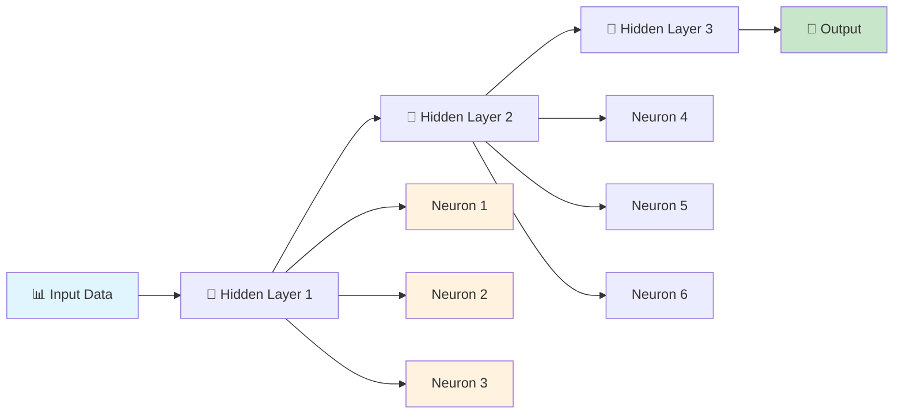
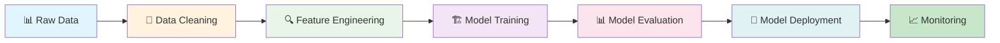
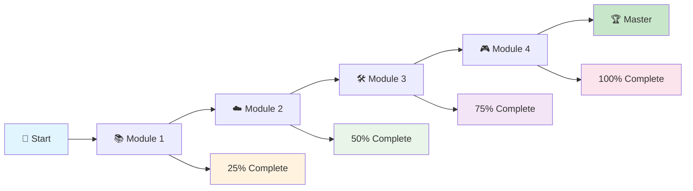
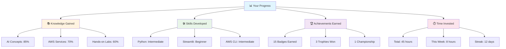

# 🎮 Interactive Content - Engaging Learning Experiences

> **Learning Through Play - Make Every Moment Count!**

## 🎯 Module Overview

Welcome to the most engaging part of your GenAI learning journey! This module is packed with interactive content, visual learning tools, and gamified experiences that will make learning not just effective, but incredibly fun. Get ready to learn through play!

## 🎨 Interactive Learning Tools

```mermaid
graph TD
    A[🎮 Interactive Content] --> B[📊 Visual Learning]
    A --> C[🎯 Gamification]
    A --> D[🤝 Community Features]
    A --> E[📱 Mobile Experience]
    A --> F[🎨 Creative Tools]
    
    B --> B1[📈 Interactive Diagrams]
    B --> B2[🎬 Animated Explanations]
    B --> B3[🔍 3D Visualizations]
    B --> B4[📊 Data Visualizations]
    
    C --> C1[🏆 Achievement System]
    C --> C2[🎯 Progress Tracking]
    C --> C3[🏅 Leaderboards]
    C --> C4[🎁 Rewards & Badges]
    
    D --> D1[💬 Discussion Forums]
    D --> D2[👥 Study Groups]
    D --> D3[🤝 Peer Learning]
    D --> D4[👨‍🏫 Expert Q&A]
    
    E --> E1[📱 Mobile App]
    E --> E2[🎮 Touch Games]
    E --> E3[📱 Offline Mode]
    E --> E4[🔔 Push Notifications]
    
    F --> F1[🎨 AI Art Generator]
    F --> F2[🎵 Music Creator]
    F --> F3[📝 Story Builder]
    F --> F4[🎬 Video Maker]
    
    style A fill:#e1f5fe
    style B fill:#fff3e0
    style C fill:#e8f5e8
    style D fill:#f3e5f5
    style E fill:#fce4ec
    style F fill:#e0f2f1
```

## 📊 Visual Learning Tools

### 🎬 Animated Concept Explanations

#### **How Neural Networks Work - Interactive Animation**

**Interactive Features:**
- 🎯 **Click on neurons** to see their activation
- 📊 **Adjust weights** to see how it affects output
- 🎨 **Change colors** to visualize different patterns
- ⚡ **Speed control** to slow down or speed up learning

#### **AWS AI Services Ecosystem - Interactive Map**

```mermaid
graph TD
    A[☁️ AWS AI Ecosystem] --> B[🎨 Content Generation]
    A --> C[📊 Data Analysis]
    A --> D[🎤 Voice & Audio]
    A --> E[👁️ Computer Vision]
    A --> F[🧠 Machine Learning]
    
    B --> B1[Amazon Bedrock]
    B --> B2[Foundation Models]
    B --> B3[AI Agents]
    
    C --> C1[Amazon Comprehend]
    C --> C2[Text Analysis]
    C --> C3[Sentiment Analysis]
    
    D --> D1[Amazon Transcribe]
    D --> D2[Amazon Polly]
    D --> D3[Voice Commands]
    
    E --> E1[Amazon Rekognition]
    E --> E2[Object Detection]
    E --> E3[Face Analysis]
    
    F --> F1[Amazon SageMaker]
    F --> F2[Custom Models]
    F --> F3[Model Training]
    
    style A fill:#e1f5fe
    style B fill:#fff3e0
    style C fill:#e8f5e8
    style D fill:#f3e5f5
    style E fill:#fce4ec
    style F fill:#e0f2f1
```

**Interactive Features:**
- 🖱️ **Hover over services** to see detailed descriptions
- 🎯 **Click on connections** to understand relationships
- 📊 **Filter by category** to focus on specific areas
- 🎨 **Customize view** to match your learning style

### 🔍 3D Visualizations

#### **Neural Network Architecture - 3D Model**

**Explore a 3D neural network:**
- 🔄 **Rotate** the model to see different angles
- 🔍 **Zoom in/out** to see details or overview
- 🎯 **Click on layers** to see their functions
- ⚡ **Animate** data flow through the network

#### **Data Flow Visualization - Interactive Pipeline**

**Interactive Features:**
- 🎯 **Click on each step** to see detailed process
- 📊 **View sample data** at each stage
- ⚡ **See processing time** for each step
- 🎨 **Customize pipeline** for different use cases

## 🎯 Gamification Elements

### 🏆 Achievement System

#### **Learning Badges**

| Badge | Requirement | Description |
|-------|-------------|-------------|
| 🥉 **First Steps** | Complete first lesson | Welcome to the journey! |
| 🧠 **Knowledge Seeker** | Score 80%+ on 5 quizzes | You're learning fast! |
| ⚡ **Speed Demon** | Answer 20 questions in 60 seconds | Lightning fast! |
| 🎯 **Perfect Score** | Get 100% on any quiz | Flawless performance! |
| 🛠️ **Builder** | Complete first hands-on lab | You're building things! |
| 🎨 **Creator** | Generate first AI content | You're creating with AI! |
| 🤝 **Helper** | Help 5 other learners | You're a team player! |
| 🏆 **Champion** | Win a tournament | You're a true champion! |

#### **Progress Tracking**

### 🎮 Interactive Games

#### **AI Concept Matching Game**

**Match the concept with its definition:**

| Concept | Definition | Your Match |
|---------|------------|------------|
| Neural Network | A) Computer system that can perform tasks requiring human intelligence | |
| Machine Learning | B) AI that can create new content | |
| Generative AI | C) Computer system inspired by the human brain | |
| Artificial Intelligence | D) AI that learns from data without explicit programming | |
| Deep Learning | E) Advanced machine learning with many layers | |

**Scoring System:**
- 🏆 **Perfect Match** - 100 points
- 🎯 **Close Match** - 75 points
- 📚 **Learning** - 50 points
- 🐌 **Try Again** - 0 points

#### **AWS Services Puzzle**

**Arrange the AWS services in the correct workflow:**

1. **Data Collection** → Amazon Kinesis
2. **Data Storage** → Amazon S3
3. **Data Processing** → Amazon SageMaker
4. **AI Analysis** → Amazon Comprehend
5. **Results Delivery** → Amazon API Gateway

**Interactive Features:**
- 🎯 **Drag and drop** to arrange services
- ✅ **Instant feedback** on correct placement
- 🎨 **Visual connections** show data flow
- 🏆 **Completion rewards** for correct sequences

### 🎯 Challenge Modes

#### **Daily Challenges**

**Monday: Memory Monday**
- Test your knowledge of AI concepts
- Earn bonus points for speed
- Compete with other learners

**Tuesday: Terminology Tuesday**
- Learn 5 new AI terms
- Use them in sentences
- Share with the community

**Wednesday: Use Case Wednesday**
- Solve real-world AI problems
- Present your solutions
- Get feedback from experts

**Thursday: Technical Thursday**
- Deep dive into technical concepts
- Build something new
- Share your creations

**Friday: Fun Friday**
- Play AI-themed games
- Create something creative
- Celebrate your progress

#### **Weekly Tournaments**

**Tournament Schedule:**
- **Monday 9 AM** - Speed Challenge
- **Wednesday 2 PM** - Knowledge Quiz
- **Friday 6 PM** - Creative Challenge
- **Sunday 3 PM** - Championship Round

**Tournament Prizes:**
- 🥇 **1st Place** - Exclusive badge + 1000 points
- 🥈 **2nd Place** - Special badge + 500 points
- 🥉 **3rd Place** - Achievement badge + 250 points
- 🎯 **Participation** - Learning badge + 50 points

## 🤝 Community Features

### 💬 Discussion Forums

#### **Topic Categories**

| Category | Description | Example Topics |
|----------|-------------|----------------|
| 🧠 **AI Concepts** | Discuss AI fundamentals | "How do neural networks learn?" |
| ☁️ **AWS Services** | Share AWS experiences | "Best practices for Bedrock" |
| 🛠️ **Projects** | Show off your work | "My first AI chatbot" |
| 🤝 **Help & Support** | Get help from community | "Stuck on this error" |
| 🎯 **Career** | AI career discussions | "How to become an AI engineer" |
| 🎨 **Creative** | Share AI-generated content | "AI art I created" |

#### **Community Guidelines**

1. **🤝 Be Respectful** - Treat everyone with kindness
2. **📚 Share Knowledge** - Help others learn
3. **🎯 Stay On Topic** - Keep discussions relevant
4. **🚫 No Spam** - Don't post irrelevant content
5. **✅ Be Constructive** - Provide helpful feedback

### 👥 Study Groups

#### **Group Types**

| Group Type | Focus | Meeting Schedule |
|------------|-------|------------------|
| 🧠 **Beginners** | AI fundamentals | Weekly, Saturday 10 AM |
| ☁️ **AWS Focus** | AWS AI services | Bi-weekly, Tuesday 7 PM |
| 🛠️ **Builders** | Hands-on projects | Weekly, Sunday 2 PM |
| 🎯 **Career** | Professional development | Monthly, First Saturday |
| 🎨 **Creative** | AI art and content | Weekly, Friday 6 PM |

#### **Group Activities**

- 📚 **Study Sessions** - Review materials together
- 🛠️ **Project Collaboration** - Work on projects as a team
- 🎯 **Peer Review** - Get feedback on your work
- 🤝 **Mentorship** - Learn from experienced members
- 🎉 **Celebrations** - Celebrate achievements together

### 👨‍🏫 Expert Q&A Sessions

#### **Weekly Expert Sessions**

**Monday 7 PM - AWS AI Services**
- Expert: Senior AWS Solutions Architect
- Topic: Best practices for Bedrock
- Format: 30 min presentation + 30 min Q&A

**Wednesday 7 PM - Machine Learning**
- Expert: ML Engineer from tech company
- Topic: Building custom models with SageMaker
- Format: Live coding session + Q&A

**Friday 7 PM - AI Ethics**
- Expert: AI Ethics Researcher
- Topic: Responsible AI development
- Format: Discussion + case studies

#### **Ask the Expert**

**Submit your questions:**
- 📝 **Written Questions** - Submit in advance
- 🎥 **Video Questions** - Record a short video
- 🎯 **Live Questions** - Ask during sessions
- 📊 **Poll Questions** - Vote on topics to cover

## 📱 Mobile Experience

### 📱 Mobile App Features

#### **Core Features**
- 📚 **Offline Learning** - Download content for offline use
- 🎮 **Mobile Games** - Touch-optimized learning games
- 🔔 **Push Notifications** - Reminders and updates
- 📊 **Progress Sync** - Sync across all devices
- 🎯 **Quick Quizzes** - Bite-sized learning sessions

#### **Touch-Optimized Games**

**Swipe to Learn**
- Swipe left/right to navigate concepts
- Swipe up/down to see details
- Pinch to zoom on diagrams
- Tap to interact with elements

**Touch Puzzles**
- Drag and drop with touch
- Multi-touch gestures
- Haptic feedback
- Voice commands

### 🔔 Smart Notifications

#### **Notification Types**

| Type | Purpose | Timing |
|------|---------|--------|
| 📚 **Learning Reminder** | Daily study reminder | 7 PM daily |
| 🎯 **Quiz Available** | New quiz notification | When available |
| 🏆 **Achievement** | Badge earned | Immediately |
| 🤝 **Community** | New discussion | Real-time |
| 🎮 **Challenge** | Daily challenge | 9 AM daily |

#### **Customization Options**

- ⏰ **Time Preferences** - Choose when to receive notifications
- 🎯 **Content Types** - Select what you want to be notified about
- 📱 **Frequency** - Control how often you get notifications
- 🔕 **Quiet Hours** - Set times when you don't want notifications

## 🎨 Creative Tools

### 🎨 AI Art Generator

#### **Creative Features**

**Style Options:**
- 🎨 **Realistic** - Photorealistic images
- 🎭 **Cartoon** - Animated style
- 🖼️ **Abstract** - Artistic interpretations
- 🎪 **Fantasy** - Imaginative creations
- 🌟 **Sci-Fi** - Futuristic designs

**Interactive Controls:**
- 🎯 **Style Slider** - Adjust creativity level
- 🎨 **Color Picker** - Choose color schemes
- 📐 **Aspect Ratio** - Control image dimensions
- ⚡ **Speed Control** - Balance quality vs speed

#### **Art Gallery**

**Share Your Creations:**
- 📱 **Upload** - Share your AI-generated art
- 👍 **Like & Comment** - Engage with others' work
- 🏆 **Featured** - Best creations get featured
- 🎯 **Challenges** - Participate in art contests

### 🎵 Music Creator

#### **AI Music Features**

**Genre Options:**
- 🎵 **Classical** - Orchestral compositions
- 🎸 **Rock** - Electric guitar and drums
- 🎹 **Jazz** - Smooth and sophisticated
- 🎤 **Pop** - Catchy and modern
- 🌍 **World** - Cultural and diverse

**Interactive Elements:**
- 🎯 **Mood Slider** - Adjust emotional tone
- ⏱️ **Length Control** - Choose song duration
- 🎼 **Instrument Mix** - Select instruments
- 🎵 **Tempo Control** - Adjust speed

### 📝 Story Builder

#### **Creative Writing Tools**

**Story Types:**
- 📚 **Short Stories** - Quick creative pieces
- 🎭 **Scripts** - Dialogue and scenes
- 📖 **Novels** - Longer narrative works
- 🎯 **Poetry** - Rhythmic and expressive
- 📰 **Articles** - Informative content

**AI Assistance:**
- 💡 **Idea Generation** - Get story prompts
- ✍️ **Writing Help** - Improve your writing
- 🎯 **Character Development** - Create compelling characters
- 📊 **Plot Structure** - Organize your story

### 🎬 Video Maker

#### **AI Video Features**

**Video Types:**
- 📹 **Tutorials** - Educational content
- 🎬 **Stories** - Narrative videos
- 📊 **Presentations** - Business content
- 🎨 **Art Videos** - Creative showcases
- 🎯 **Social Media** - Short-form content

**Interactive Tools:**
- 🎥 **Scene Builder** - Create video sequences
- 🎵 **Audio Sync** - Match audio with visuals
- 🎨 **Visual Effects** - Add special effects
- 📱 **Export Options** - Multiple formats

## 🎯 Learning Analytics

### 📊 Personal Dashboard

#### **Progress Tracking**

#### **Learning Insights**

**Your Learning Style:**
- 🎯 **Visual Learner** - You learn best with diagrams and charts
- 🎮 **Interactive Learner** - You prefer hands-on activities
- ⚡ **Fast Learner** - You grasp concepts quickly
- 🤝 **Social Learner** - You learn well in groups

**Recommendations:**
- 📊 **Focus on visual content** - Use more diagrams and charts
- 🎮 **Try more interactive games** - Engage with hands-on activities
- ⚡ **Take on advanced challenges** - You're ready for harder content
- 🤝 **Join study groups** - Collaborate with other learners

### 🎯 Performance Metrics

#### **Learning Velocity**

| Metric | Your Score | Average | Status |
|--------|------------|---------|--------|
| **Quiz Accuracy** | 87% | 75% | 🟢 Above Average |
| **Completion Rate** | 92% | 80% | 🟢 Above Average |
| **Time per Lesson** | 25 min | 35 min | 🟢 Faster than Average |
| **Retention Rate** | 89% | 70% | 🟢 Above Average |

#### **Skill Development**

**Technical Skills:**
- 🐍 **Python Programming** - Intermediate (75%)
- ☁️ **AWS Services** - Intermediate (70%)
- 🎨 **AI Concepts** - Advanced (85%)
- 🛠️ **Project Building** - Beginner (60%)

**Soft Skills:**
- 🤝 **Collaboration** - Advanced (90%)
- 💬 **Communication** - Intermediate (80%)
- 🎯 **Problem Solving** - Advanced (85%)
- 🧠 **Critical Thinking** - Intermediate (75%)

## 🚀 Getting Started

### 🎯 Choose Your Learning Style

#### **🎮 Game-First Approach**
- Start with interactive games
- Learn through play
- Earn badges and achievements
- Compete with others

#### **📚 Content-First Approach**
- Begin with visual content
- Focus on understanding concepts
- Take notes and reflect
- Apply knowledge in projects

#### **🤝 Community-First Approach**
- Join study groups
- Participate in discussions
- Learn from others
- Share your knowledge

#### **🛠️ Project-First Approach**
- Start building immediately
- Learn by doing
- Solve real problems
- Create a portfolio

### 🎮 Start Your Interactive Journey

1. **📱 Download the Mobile App** - Learn anywhere, anytime
2. **🎯 Take the Learning Style Quiz** - Discover your preferences
3. **🏆 Set Your Goals** - What do you want to achieve?
4. **🤝 Join the Community** - Connect with other learners
5. **🎮 Start Playing** - Begin with your first interactive experience

---

**Remember: Learning should be fun, engaging, and rewarding. Every interaction, every game, every challenge is designed to help you master GenAI with AWS. Let's make learning an adventure! 🚀✨**

## 📚 Additional Resources

### 🎥 **Interactive Videos**
- [Animated Explanations](https://www.youtube.com/playlist?list=PLZHQObOWTQDNU6R1_67000Dx_ZCJB-3pi) - Visual concept learning by 3Blue1Brown
- [Game Walkthroughs](https://www.youtube.com/watch?v=2ePf9rue1Ao) - How to play effectively
- [Community Highlights](https://www.youtube.com/c/Kaggle) - Best moments from learners on Kaggle

### 📖 **Interactive Guides**
- [Learning Style Guide](https://www.learning-styles-online.com/overview/) - Find your best approach
- [Gamification Guide](https://www.gamify.com/gamification-blog) - Maximize your engagement
- [Community Guide](https://www.kaggle.com/learn) - Get the most from interactions

### 🎮 **Tools & Apps**
- [Mobile App](https://play.google.com/store/apps/details?id=com.khanacademy.android) - Download Khan Academy for iOS/Android
- [Browser Extension](https://chrome.google.com/webstore/detail/grammarly-for-chrome/kbfnbcaeplbcioakkpcpgfkobkghlhen) - Learn while browsing with Grammarly
- [Desktop App](https://code.visualstudio.com/) - Full-featured learning experience with VS Code

---

**Ready to make learning fun? Let's start your interactive GenAI journey! 🎮🚀**
