# 🎮 Interactive Content - Gamified Learning Experience

> **Learn AWS GenAI through games, simulations, and interactive experiences**

## 🎯 Interactive Learning Overview

Welcome to the most engaging way to learn AWS GenAI! This section provides gamified learning experiences, interactive simulations, and hands-on activities that make learning fun and memorable.

## 🎮 Interactive Learning Features

```mermaid
graph TD
    A[🎯 Interactive Hub] --> B[🎮 Learning Games]
    A --> C[🎨 Visual Simulations]
    A --> D[🧩 Interactive Puzzles]
    A --> E[🏆 Achievement System]
    A --> F[👥 Social Learning]
    
    B --> B1[AI Service Matching]
    B --> B2[Architecture Builder]
    B --> B3[Code Challenge Arena]
    
    C --> C1[AI Model Visualization]
    C --> C2[Data Flow Simulator]
    C --> C3[Cloud Architecture Builder]
    
    D --> D1[Prompt Engineering Puzzles]
    D --> D2[Security Challenge]
    D --> D3[Cost Optimization Game]
    
    E --> E1[Badges & Certificates]
    E --> E2[Leaderboards]
    E --> E3[Progress Tracking]
    
    F --> F1[Study Groups]
    F --> F2[Peer Challenges]
    F --> F3[Expert Mentorship]
    
    style A fill:#e1f5fe
    style B fill:#fff3e0
    style C fill:#e8f5e8
    style D fill:#f3e5f5
    style E fill:#fce4ec
    style F fill:#e0f2f1
```

## 🎮 Learning Games

### 🎯 **Game 1: AI Service Matching Challenge**

**Objective**: Match AWS AI services with their correct use cases and capabilities.

#### **How to Play:**
1. **Service Cards**: You'll see cards with AWS AI service names
2. **Use Case Cards**: Match them with their primary use cases
3. **Capability Cards**: Connect services with their key features
4. **Speed Bonus**: Complete matches quickly for extra points

#### **Game Features:**
- **Multiple Difficulty Levels**: Beginner to Expert
- **Time Challenges**: Beat the clock for high scores
- **Hint System**: Get help when you're stuck
- **Progress Tracking**: Track your improvement over time

#### **Learning Outcomes:**
- Master AWS AI service capabilities
- Understand service use cases
- Learn service integration patterns
- Build confidence in service selection

### 🏗️ **Game 2: Architecture Builder Simulator**

**Objective**: Build complete GenAI architectures by connecting services and components.

#### **How to Play:**
1. **Drag & Drop**: Drag services onto the canvas
2. **Connect Components**: Link services with data flows
3. **Validate Architecture**: Check for best practices
4. **Optimize Design**: Improve performance and cost

#### **Game Features:**
- **Visual Builder**: Intuitive drag-and-drop interface
- **Real-time Validation**: Instant feedback on architecture
- **Best Practice Hints**: Learn from expert recommendations
- **Cost Calculator**: See real-time cost estimates

#### **Learning Outcomes:**
- Design scalable GenAI architectures
- Understand service relationships
- Learn best practices and patterns
- Master cost optimization techniques

### 💻 **Game 3: Code Challenge Arena**

**Objective**: Solve coding challenges related to AWS GenAI services.

#### **How to Play:**
1. **Challenge Selection**: Choose from various difficulty levels
2. **Code Implementation**: Write Python code to solve problems
3. **Test & Debug**: Run your code and fix any issues
4. **Submit Solution**: Get scored on correctness and efficiency

#### **Game Features:**
- **Progressive Difficulty**: Start simple, advance to complex
- **Multiple Languages**: Python, JavaScript, and more
- **Code Validation**: Automated testing of your solutions
- **Peer Comparison**: See how others solved the same problem

#### **Learning Outcomes:**
- Master AWS SDK integration
- Learn best coding practices
- Understand error handling
- Build problem-solving skills

## 🎨 Visual Simulations

### 🧠 **Simulation 1: AI Model Visualization**

**Interactive Experience**: See how AI models process information and generate responses.

#### **Features:**
- **Neural Network Visualization**: Watch data flow through layers
- **Token Processing**: See how text is broken into tokens
- **Attention Mechanisms**: Visualize model attention patterns
- **Response Generation**: Watch AI generate responses step-by-step

#### **Learning Outcomes:**
- Understand how AI models work internally
- Visualize complex AI processes
- Learn about tokenization and embeddings
- See attention and generation mechanisms

### 🌊 **Simulation 2: Data Flow Simulator**

**Interactive Experience**: Follow data through complete GenAI pipelines.

#### **Features:**
- **End-to-End Flows**: From input to output
- **Service Interactions**: See how services communicate
- **Error Scenarios**: Handle failures and edge cases
- **Performance Metrics**: Monitor latency and throughput

#### **Learning Outcomes:**
- Understand data flow patterns
- Learn service integration
- Master error handling
- Optimize performance

### ☁️ **Simulation 3: Cloud Architecture Builder**

**Interactive Experience**: Build and visualize cloud architectures in 3D.

#### **Features:**
- **3D Visualization**: Interactive 3D cloud architecture
- **Component Library**: Drag-and-drop cloud services
- **Network Visualization**: See data flows and connections
- **Cost Analysis**: Real-time cost calculations

#### **Learning Outcomes:**
- Visualize complex architectures
- Understand cloud networking
- Learn cost optimization
- Master scalability patterns

## 🧩 Interactive Puzzles

### 🎯 **Puzzle 1: Prompt Engineering Challenge**

**Objective**: Craft effective prompts to get desired AI responses.

#### **How to Play:**
1. **Scenario Cards**: Get a specific task or goal
2. **Prompt Builder**: Use tools to craft your prompt
3. **Test Response**: See how the AI responds
4. **Iterate & Improve**: Refine your prompt for better results

#### **Puzzle Features:**
- **Multiple Scenarios**: Various use cases and contexts
- **Prompt Templates**: Learn from expert examples
- **Response Evaluation**: Get feedback on AI responses
- **Best Practice Tips**: Learn prompt engineering techniques

#### **Learning Outcomes:**
- Master prompt engineering techniques
- Understand AI response patterns
- Learn to iterate and improve
- Build effective communication skills

### 🔒 **Puzzle 2: Security Challenge**

**Objective**: Identify and fix security vulnerabilities in GenAI systems.

#### **How to Play:**
1. **Security Scenarios**: Analyze vulnerable systems
2. **Threat Identification**: Find security issues
3. **Solution Design**: Propose security fixes
4. **Implementation**: Apply security best practices

#### **Puzzle Features:**
- **Real-world Scenarios**: Based on actual security issues
- **Multiple Attack Vectors**: Various types of threats
- **Defense Strategies**: Learn protection techniques
- **Compliance Requirements**: Understand regulatory needs

#### **Learning Outcomes:**
- Master GenAI security principles
- Learn threat identification
- Understand defense strategies
- Build security-first mindset

### 💰 **Puzzle 3: Cost Optimization Game**

**Objective**: Optimize GenAI system costs while maintaining performance.

#### **How to Play:**
1. **Cost Scenarios**: Analyze expensive systems
2. **Optimization Tools**: Use various cost-saving techniques
3. **Performance Trade-offs**: Balance cost vs. performance
4. **ROI Calculation**: Measure optimization impact

#### **Puzzle Features:**
- **Real Cost Data**: Based on actual AWS pricing
- **Multiple Optimization Strategies**: Various cost-saving approaches
- **Performance Metrics**: Monitor system performance
- **ROI Tracking**: Measure optimization success

#### **Learning Outcomes:**
- Master cost optimization techniques
- Understand performance trade-offs
- Learn ROI calculation methods
- Build cost-conscious mindset

## 🏆 Achievement System

### 🎖️ **Badge Categories**

#### **🏗️ Architecture Badges**
- **🏗️ Architect Apprentice**: Complete first architecture
- **🏗️ Design Master**: Build 10 successful architectures
- **🏗️ Enterprise Architect**: Design complex enterprise systems
- **🏗️ Cloud Guru**: Master all architecture patterns

#### **💻 Coding Badges**
- **💻 Code Novice**: Complete first coding challenge
- **💻 Python Pro**: Master Python for AI development
- **💻 API Expert**: Excel at service integration
- **💻 Code Master**: Solve advanced coding challenges

#### **🎯 Service Badges**
- **🎯 Bedrock Beginner**: Master Amazon Bedrock basics
- **🎯 SageMaker Specialist**: Excel at SageMaker
- **🎯 AI Services Expert**: Master all AI services
- **🎯 Service Integration Pro**: Connect services seamlessly

#### **🔒 Security Badges**
- **🔒 Security Aware**: Complete security challenges
- **🔒 Compliance Expert**: Master regulatory requirements
- **🔒 Threat Hunter**: Identify security vulnerabilities
- **🔒 Security Architect**: Design secure systems

#### **💰 Cost Badges**
- **💰 Cost Conscious**: Complete cost optimization challenges
- **💰 Budget Master**: Achieve significant cost savings
- **💰 ROI Champion**: Maximize return on investment
- **💰 Cost Architect**: Design cost-optimized systems

### 🏅 **Achievement Levels**

#### **🥉 Bronze Level**
- Complete basic challenges
- Show understanding of fundamentals
- Participate in community activities

#### **🥈 Silver Level**
- Solve intermediate problems
- Demonstrate practical skills
- Help other learners

#### **🥇 Gold Level**
- Master advanced concepts
- Create innovative solutions
- Mentor other learners

#### **💎 Diamond Level**
- Achieve expert-level mastery
- Contribute to community knowledge
- Lead learning initiatives

### 🏆 **Special Achievements**

#### **🌟 Innovation Badge**
Create novel solutions or approaches to problems

#### **🤝 Community Helper**
Help other learners succeed

#### **📚 Knowledge Sharer**
Share valuable insights and resources

#### **🚀 Early Adopter**
Be among the first to master new features

## 👥 Social Learning Features

### 🤝 **Study Groups**

#### **Formation:**
- **Auto-matching**: Get matched with similar learners
- **Interest-based**: Join groups by topic or skill level
- **Geographic**: Connect with local learners
- **Project-based**: Collaborate on specific projects

#### **Activities:**
- **Weekly Challenges**: Group problem-solving sessions
- **Peer Review**: Review each other's work
- **Knowledge Sharing**: Share insights and resources
- **Progress Tracking**: Monitor group achievements

### 🏆 **Peer Challenges**

#### **Challenge Types:**
- **Speed Challenges**: Complete tasks quickly
- **Accuracy Challenges**: Solve problems correctly
- **Innovation Challenges**: Create novel solutions
- **Collaboration Challenges**: Work together on projects

#### **Scoring System:**
- **Individual Scores**: Personal achievement tracking
- **Team Scores**: Collaborative success metrics
- **Leaderboards**: Friendly competition rankings
- **Recognition**: Celebrate achievements

### 👨‍🏫 **Expert Mentorship**

#### **Mentor Matching:**
- **Skill-based**: Match with relevant experts
- **Industry-focused**: Connect with industry professionals
- **Career-oriented**: Get career guidance
- **Project-specific**: Get help with specific projects

#### **Mentorship Activities:**
- **One-on-one Sessions**: Personal guidance
- **Group Workshops**: Expert-led learning sessions
- **Code Reviews**: Expert feedback on your work
- **Career Guidance**: Professional development advice

## 📊 Progress Tracking

### 📈 **Learning Analytics**

#### **Personal Dashboard:**
- **Progress Overview**: Visual progress tracking
- **Skill Development**: Competency growth charts
- **Achievement Gallery**: Your badges and certificates
- **Learning Streaks**: Consistency tracking

#### **Performance Metrics:**
- **Accuracy Rates**: How well you solve problems
- **Speed Metrics**: How quickly you complete tasks
- **Improvement Trends**: Track your learning progress
- **Weakness Identification**: Areas needing attention

### 🎯 **Goal Setting**

#### **Learning Goals:**
- **Skill-based Goals**: Master specific skills
- **Project Goals**: Complete specific projects
- **Time-based Goals**: Achieve milestones by deadlines
- **Community Goals**: Help others succeed

#### **Goal Tracking:**
- **Progress Monitoring**: Track goal completion
- **Milestone Celebrations**: Celebrate achievements
- **Adjustment Support**: Modify goals as needed
- **Success Sharing**: Share achievements with community

## 🎮 Interactive Content Access

### 🚀 **Getting Started**

#### **Step 1: Create Your Profile**
- Set your learning preferences
- Choose your skill level
- Select your interests
- Set your goals

#### **Step 2: Take the Assessment**
- Complete skill assessment
- Get personalized recommendations
- Identify learning gaps
- Create learning plan

#### **Step 3: Start Playing**
- Begin with recommended games
- Complete interactive puzzles
- Join study groups
- Track your progress

### 🎯 **Daily Activities**

#### **Morning Routine:**
- **Daily Challenge**: Start with a quick challenge
- **Progress Check**: Review your dashboard
- **Goal Review**: Check your daily goals
- **Community Check**: See what others are doing

#### **Learning Sessions:**
- **Focused Games**: Deep dive into specific topics
- **Puzzle Solving**: Work on complex problems
- **Simulation Practice**: Use visual tools
- **Peer Interaction**: Collaborate with others

#### **Evening Reflection:**
- **Progress Update**: Update your achievements
- **Learning Notes**: Record insights and discoveries
- **Community Sharing**: Share your progress
- **Tomorrow Planning**: Set goals for next day

## 🎯 Success Metrics

### 📊 **Learning Effectiveness**

#### **Engagement Metrics:**
- **Time Spent**: Active learning time
- **Session Frequency**: How often you learn
- **Completion Rates**: Task and challenge completion
- **Return Visits**: Continued engagement

#### **Learning Outcomes:**
- **Skill Development**: Measurable skill improvement
- **Knowledge Retention**: Long-term learning retention
- **Application Success**: Real-world application
- **Problem-solving**: Ability to solve new problems

### 🏆 **Achievement Tracking**

#### **Badge Progress:**
- **Badges Earned**: Total badges collected
- **Badge Categories**: Coverage across skill areas
- **Badge Levels**: Progression through levels
- **Special Achievements**: Unique accomplishments

#### **Community Impact:**
- **Help Provided**: Assistance to other learners
- **Knowledge Shared**: Contributions to community
- **Leadership Roles**: Mentoring and guidance
- **Innovation Contributions**: Novel ideas and solutions

## 🔗 Quick Access

### 🎮 **Games & Challenges**
- **[AI Service Matching](./games/service-matching/)** - Master AWS AI services
- **[Architecture Builder](./games/architecture-builder/)** - Design cloud architectures
- **[Code Challenge Arena](./games/code-challenges/)** - Solve coding problems
- **[Security Challenge](./games/security-challenge/)** - Master security concepts

### 🎨 **Simulations & Visualizations**
- **[AI Model Visualization](./simulations/ai-models/)** - See AI in action
- **[Data Flow Simulator](./simulations/data-flow/)** - Follow data through systems
- **[Cloud Architecture Builder](./simulations/architecture/)** - Build 3D architectures

### 🧩 **Interactive Puzzles**
- **[Prompt Engineering](./puzzles/prompt-engineering/)** - Master AI communication
- **[Security Puzzles](./puzzles/security/)** - Learn security best practices
- **[Cost Optimization](./puzzles/cost-optimization/)** - Optimize system costs

### 🏆 **Achievements & Progress**
- **[Achievement Gallery](./achievements/)** - View your badges and certificates
- **[Progress Dashboard](./dashboard/)** - Track your learning journey
- **[Leaderboards](./leaderboards/)** - See how you rank

---

**🎮 Ready to make learning fun? Start your interactive GenAI journey today! 🚀**

## 🔗 Next Steps

1. **[Take the Assessment](./assessments/)** - Discover your starting point
2. **[Join a Study Group](./study-groups/)** - Connect with fellow learners
3. **[Start Playing Games](./games/)** - Begin with fun learning games
4. **[Track Your Progress](./dashboard/)** - Monitor your achievements

---

**Remember: The best learning happens when you're having fun! Let's make your GenAI journey unforgettable! 💪✨**