# 🧠 Quizzes & Assessments - Test Your Knowledge

> **Comprehensive assessment system to track your learning progress and validate your skills**

## 🎯 Assessment Overview

Welcome to the comprehensive quiz and assessment system! This section provides various types of assessments to help you track your progress, identify knowledge gaps, and validate your AWS GenAI skills.

## 📊 Assessment Types

```mermaid
graph TD
    A[🧠 Assessment Hub] --> B[📝 Knowledge Quizzes]
    A --> C[🎯 Skill Assessments]
    A --> D[🏆 Certification Prep]
    A --> E[📈 Progress Tracking]
    A --> F[🎮 Gamified Tests]
    
    B --> B1[Multiple Choice]
    B --> B2[True/False]
    B --> B3[Scenario-based]
    B --> B4[Fill in the Blanks]
    
    C --> C1[Hands-on Challenges]
    C --> C2[Code Implementation]
    C --> C3[Architecture Design]
    C --> C4[Problem Solving]
    
    D --> D1[AWS AI Practitioner]
    D --> D2[ML Specialty]
    D --> D3[Solutions Architect]
    D --> D4[Custom Certifications]
    
    E --> E1[Learning Analytics]
    E --> E2[Weakness Identification]
    E --> E3[Strength Recognition]
    E --> E4[Improvement Recommendations]
    
    F --> F1[Speed Challenges]
    F --> F2[Team Competitions]
    F --> F3[Achievement Unlocks]
    F --> F4[Leaderboards]
    
    style A fill:#e1f5fe
    style B fill:#fff3e0
    style C fill:#e8f5e8
    style D fill:#f3e5f5
    style E fill:#fce4ec
    style F fill:#e0f2f1
```



## 📝 Knowledge Quizzes

### 🎯 **Quiz Categories**

#### **🧠 GenAI Fundamentals**
- **AI vs ML vs GenAI**: Understanding the differences
- **Foundation Models**: How they work and their capabilities
- **Prompt Engineering**: Best practices and techniques
- **AI Ethics**: Responsible AI principles

#### **☁️ AWS AI Services**
- **Amazon Bedrock**: Foundation models and agents
- **Amazon SageMaker**: Custom model development
- **AI Services Suite**: Comprehend, Rekognition, etc.
- **Service Integration**: How services work together

#### **🏗️ Architecture & Design**
- **System Architecture**: Designing scalable solutions
- **Security Patterns**: Implementing secure systems
- **Cost Optimization**: Managing and reducing costs
- **Performance**: Optimizing for speed and efficiency

#### **🔧 Implementation**
- **API Integration**: Working with AWS APIs
- **Error Handling**: Managing failures and edge cases
- **Testing**: Quality assurance and validation
- **Deployment**: Getting systems into production

### 📊 **Quiz Formats**

#### **Multiple Choice Questions**
```markdown
**Question**: Which AWS service would you use to generate images from text descriptions?

A) Amazon Comprehend
B) Amazon Bedrock
C) Amazon Rekognition
D) Amazon SageMaker

**Answer**: B) Amazon Bedrock
**Explanation**: Amazon Bedrock provides access to foundation models including image generation models like Titan Image Generator.
```

#### **True/False Questions**
```markdown
**Question**: Amazon Bedrock can only generate text content.

**Answer**: False
**Explanation**: Amazon Bedrock supports multiple modalities including text, image, and embedding generation through various foundation models.
```

#### **Scenario-Based Questions**
```markdown
**Scenario**: A healthcare company wants to build an AI system that can analyze medical documents, extract key information, and provide insights while maintaining HIPAA compliance.

**Question**: Which combination of AWS services would be most appropriate?

A) Amazon Comprehend + Amazon Bedrock + Amazon S3
B) Amazon Rekognition + Amazon Polly + Amazon DynamoDB
C) Amazon Textract + Amazon Bedrock + Amazon KMS
D) Amazon SageMaker + Amazon Transcribe + Amazon RDS

**Answer**: C) Amazon Textract + Amazon Bedrock + Amazon KMS
**Explanation**: Textract for document processing, Bedrock for AI analysis, and KMS for encryption to meet HIPAA requirements.
```

#### **Fill in the Blanks**
```markdown
**Question**: Complete the following code to invoke Amazon Bedrock:

```python
import boto3
import json

bedrock = boto3.client('bedrock-runtime')

response = bedrock.______(
    modelId='anthropic.claude-3-5-sonnet-20241022-v2:0',
    body=json.dumps({
        'anthropic_version': 'bedrock-2023-05-31',
        'max_tokens': 1000,
        'messages': [{'role': 'user', 'content': 'Hello!'}]
    })
)
```

**Answer**: invoke_model
```

## 🎯 Skill Assessments

### 🛠️ **Hands-on Challenges**

#### **Challenge 1: Build a Chatbot**
**Objective**: Create a functional AI chatbot using Amazon Bedrock

**Requirements:**
- [ ] Set up AWS credentials and Bedrock access
- [ ] Implement conversation management
- [ ] Handle user input and generate responses
- [ ] Add error handling and validation
- [ ] Deploy to a web interface

**Evaluation Criteria:**
- **Functionality** (40%): Does the chatbot work correctly?
- **Code Quality** (30%): Is the code well-structured and documented?
- **User Experience** (20%): Is the interface user-friendly?
- **Error Handling** (10%): Are errors handled gracefully?

#### **Challenge 2: Image Analysis System**
**Objective**: Build a system that can analyze images and provide insights

**Requirements:**
- [ ] Implement image upload functionality
- [ ] Use Amazon Rekognition for image analysis
- [ ] Generate insights using Amazon Bedrock
- [ ] Display results in a clear format
- [ ] Handle various image formats

**Evaluation Criteria:**
- **Accuracy** (35%): Are the analysis results accurate?
- **Performance** (25%): How fast does the system process images?
- **Usability** (25%): Is the interface intuitive?
- **Robustness** (15%): Does it handle edge cases well?

#### **Challenge 3: Document Processing Pipeline**
**Objective**: Create a system that processes documents and extracts insights

**Requirements:**
- [ ] Implement document upload and storage
- [ ] Use Amazon Textract for text extraction
- [ ] Apply AI analysis with Amazon Comprehend
- [ ] Generate summaries with Amazon Bedrock
- [ ] Provide search and filtering capabilities

**Evaluation Criteria:**
- **Processing Accuracy** (40%): How well does it extract information?
- **System Architecture** (30%): Is the design scalable and maintainable?
- **User Interface** (20%): Is the interface intuitive and functional?
- **Performance** (10%): How efficiently does it process documents?

### 💻 **Code Implementation Tests**

#### **Test 1: API Integration**
**Task**: Implement a function that calls Amazon Bedrock and handles responses

```python
def generate_ai_response(prompt, model_id="anthropic.claude-3-5-sonnet-20241022-v2:0"):
    """
    Generate AI response using Amazon Bedrock
    
    Args:
        prompt (str): User input prompt
        model_id (str): Bedrock model ID to use
    
    Returns:
        dict: Response containing generated text and metadata
    """
    # Your implementation here
    pass
```

**Evaluation Criteria:**
- **Correctness** (50%): Does the function work as expected?
- **Error Handling** (25%): Are exceptions handled properly?
- **Code Quality** (15%): Is the code clean and well-documented?
- **Efficiency** (10%): Is the implementation efficient?

#### **Test 2: Data Processing Pipeline**
**Task**: Create a data processing pipeline for text analysis

```python
class TextAnalysisPipeline:
    def __init__(self):
        # Initialize AWS clients
        pass
    
    def process_text(self, text):
        """
        Process text through multiple AI services
        
        Args:
            text (str): Input text to analyze
        
        Returns:
            dict: Analysis results from multiple services
        """
        # Your implementation here
        pass
```

**Evaluation Criteria:**
- **Architecture** (40%): Is the design modular and extensible?
- **Functionality** (35%): Does it process text correctly?
- **Error Handling** (15%): Are errors handled appropriately?
- **Documentation** (10%): Is the code well-documented?

### 🏗️ **Architecture Design Assessments**

#### **Assessment 1: Scalable GenAI System**
**Scenario**: Design a system that can handle 1 million requests per day

**Requirements:**
- [ ] Design for high availability and scalability
- [ ] Implement proper security measures
- [ ] Optimize for cost efficiency
- [ ] Include monitoring and logging
- [ ] Plan for disaster recovery

**Deliverables:**
- Architecture diagram
- Component descriptions
- Security considerations
- Cost estimates
- Implementation plan

**Evaluation Criteria:**
- **Scalability** (30%): Can it handle the required load?
- **Security** (25%): Are security measures appropriate?
- **Cost Efficiency** (20%): Is the design cost-optimized?
- **Maintainability** (15%): Is the system maintainable?
- **Completeness** (10%): Are all requirements addressed?

#### **Assessment 2: Multi-Tenant AI Platform**
**Scenario**: Design a platform that serves multiple organizations

**Requirements:**
- [ ] Implement tenant isolation
- [ ] Ensure data privacy and security
- [ ] Support custom configurations
- [ ] Provide usage analytics
- [ ] Enable self-service onboarding

**Deliverables:**
- System architecture
- Data model design
- Security architecture
- API specifications
- Deployment strategy

**Evaluation Criteria:**
- **Multi-tenancy** (35%): Is tenant isolation properly implemented?
- **Security** (30%): Are security measures comprehensive?
- **Usability** (20%): Is the platform user-friendly?
- **Scalability** (15%): Can it scale with growth?

## 🏆 Certification Preparation

### 🎓 **AWS AI Practitioner Preparation**

#### **Exam Domains Coverage**

**Domain 1: Fundamentals of AI and ML (20%)**
- [ ] AI, ML, and Deep Learning concepts
- [ ] Types of machine learning
- [ ] AWS AI/ML service overview
- [ ] Common use cases and applications

**Domain 2: Fundamentals of Generative AI (24%)**
- [ ] Generative AI concepts and applications
- [ ] Foundation models and large language models
- [ ] Prompt engineering techniques
- [ ] Transformer architecture basics

**Domain 3: Applications of Foundation Models (28%)**
- [ ] Amazon Bedrock service capabilities
- [ ] Model selection criteria
- [ ] Integration patterns and architectures
- [ ] RAG (Retrieval-Augmented Generation)

**Domain 4: Guidelines for Responsible AI (14%)**
- [ ] AI ethics and bias mitigation
- [ ] Fairness and transparency
- [ ] Privacy and data protection
- [ ] Responsible AI frameworks

**Domain 5: Security, Compliance, and Governance (14%)**
- [ ] Data encryption and privacy
- [ ] Access control and authentication
- [ ] Compliance frameworks (GDPR, HIPAA, SOX)
- [ ] AI governance and risk management

#### **Practice Exam Format**
- **65 Questions**: Multiple choice and multiple response
- **90 Minutes**: Time limit for completion
- **Passing Score**: 70% or higher
- **Question Types**: Scenario-based, knowledge-based, and application-based

### 🚀 **AWS ML Specialty Preparation**

#### **Exam Domains Coverage**

**Domain 1: Data Engineering (20%)**
- [ ] Data collection and preparation
- [ ] Data transformation and feature engineering
- [ ] Data storage and management
- [ ] Data quality and validation

**Domain 2: Exploratory Data Analysis (24%)**
- [ ] Statistical analysis and visualization
- [ ] Data exploration techniques
- [ ] Feature selection and engineering
- [ ] Data preprocessing

**Domain 3: Modeling (36%)**
- [ ] Model selection and training
- [ ] Hyperparameter tuning
- [ ] Model evaluation and validation
- [ ] Ensemble methods

**Domain 4: Machine Learning Implementation and Operations (20%)**
- [ ] Model deployment and serving
- [ ] Monitoring and maintenance
- [ ] A/B testing and experimentation
- [ ] MLOps practices

#### **Practice Exam Format**
- **65 Questions**: Multiple choice and multiple response
- **180 Minutes**: Extended time for complex scenarios
- **Passing Score**: 75% or higher
- **Focus Areas**: Practical application and real-world scenarios

## 📈 Progress Tracking

### 📊 **Learning Analytics Dashboard**

#### **Personal Progress Metrics**
- **Quiz Scores**: Track performance over time
- **Skill Development**: Monitor competency growth
- **Learning Velocity**: Measure learning speed
- **Retention Rates**: Track knowledge retention

#### **Weakness Identification**
- **Knowledge Gaps**: Identify areas needing attention
- **Skill Deficiencies**: Highlight missing competencies
- **Learning Patterns**: Understand learning preferences
- **Improvement Areas**: Focus on specific topics

#### **Strength Recognition**
- **Mastery Areas**: Recognize strong competencies
- **Achievement Highlights**: Celebrate successes
- **Expertise Development**: Track specialization growth
- **Leadership Potential**: Identify mentoring opportunities

### 🎯 **Adaptive Learning Recommendations**

#### **Personalized Study Plans**
- **Focus Areas**: Concentrate on weak areas
- **Learning Paths**: Customized learning sequences
- **Resource Recommendations**: Suggested materials
- **Practice Schedules**: Optimal study timing

#### **Progress Milestones**
- **Weekly Goals**: Short-term objectives
- **Monthly Targets**: Medium-term achievements
- **Quarterly Reviews**: Long-term progress assessment
- **Annual Planning**: Yearly learning strategy

## 🎮 Gamified Assessments

### ⚡ **Speed Challenges**

#### **Quick Fire Rounds**
- **30-Second Questions**: Rapid knowledge testing
- **Time Pressure**: Build quick thinking skills
- **Accuracy Focus**: Maintain quality under pressure
- **Leaderboards**: Compete with other learners

#### **Speed Coding Challenges**
- **5-Minute Solutions**: Quick implementation tasks
- **Code Golf**: Minimal code solutions
- **Debug Races**: Fast error identification
- **Algorithm Challenges**: Quick problem solving

### 🏆 **Team Competitions**

#### **Collaborative Challenges**
- **Team Quizzes**: Group knowledge testing
- **Project Competitions**: Collaborative building
- **Architecture Battles**: Design competitions
- **Innovation Contests**: Creative problem solving

#### **Peer Review Systems**
- **Code Reviews**: Evaluate peer implementations
- **Solution Discussions**: Collaborative problem solving
- **Best Practice Sharing**: Learn from others
- **Mentorship Programs**: Help fellow learners

### 🎖️ **Achievement Unlocks**

#### **Assessment Achievements**
- **Perfect Score**: 100% on any quiz
- **Speed Master**: Complete challenges quickly
- **Consistency Champion**: Regular assessment participation
- **Improvement Hero**: Significant score improvements

#### **Learning Achievements**
- **Knowledge Seeker**: Complete all quizzes in a category
- **Skill Builder**: Master specific competencies
- **Certification Ready**: Pass practice exams
- **Expert Level**: Achieve advanced scores

## 📋 Assessment Schedule

### 📅 **Recommended Assessment Timeline**

#### **Daily Assessments (5-10 minutes)**
- **Quick Knowledge Check**: 5 questions on current topic
- **Daily Challenge**: One hands-on task
- **Progress Review**: Check learning dashboard
- **Goal Check**: Review daily objectives

#### **Weekly Assessments (30-45 minutes)**
- **Comprehensive Quiz**: 20-30 questions on weekly topics
- **Skill Assessment**: Hands-on implementation
- **Peer Review**: Evaluate others' work
- **Progress Planning**: Set next week's goals

#### **Monthly Assessments (2-3 hours)**
- **Full Module Review**: Complete topic coverage
- **Project Assessment**: Build complete solution
- **Certification Practice**: Full-length practice exam
- **Learning Strategy Review**: Adjust learning approach

#### **Quarterly Assessments (4-6 hours)**
- **Comprehensive Review**: All topics covered
- **Portfolio Assessment**: Review all projects
- **Certification Readiness**: Full certification prep
- **Career Planning**: Set long-term goals

## 🎯 Assessment Best Practices

### 📚 **Preparation Strategies**

#### **Before Taking Assessments**
- [ ] Review relevant materials
- [ ] Practice with sample questions
- [ ] Set up proper environment
- [ ] Ensure stable internet connection
- [ ] Have reference materials ready

#### **During Assessments**
- [ ] Read questions carefully
- [ ] Manage time effectively
- [ ] Use process of elimination
- [ ] Review answers before submitting
- [ ] Stay calm and focused

#### **After Assessments**
- [ ] Review incorrect answers
- [ ] Understand explanations
- [ ] Identify knowledge gaps
- [ ] Plan improvement actions
- [ ] Celebrate achievements

### 🎯 **Success Strategies**

#### **Knowledge Quizzes**
- **Study Regularly**: Consistent review of materials
- **Practice Questions**: Use sample questions frequently
- **Understand Concepts**: Don't just memorize facts
- **Apply Knowledge**: Connect theory to practice

#### **Hands-on Assessments**
- **Build Projects**: Practice with real implementations
- **Code Regularly**: Maintain coding skills
- **Debug Practice**: Learn error identification
- **Document Work**: Practice clear documentation

#### **Architecture Assessments**
- **Study Patterns**: Learn common architecture patterns
- **Practice Design**: Design systems regularly
- **Review Examples**: Study real-world architectures
- **Think Holistically**: Consider all aspects of design

## 🔗 Quick Access

### 📝 **Knowledge Quizzes**
- **[GenAI Fundamentals](./knowledge/genai-fundamentals/)** - Core concepts and principles
- **[AWS AI Services](./knowledge/aws-services/)** - Service capabilities and use cases
- **[Architecture & Design](./knowledge/architecture/)** - System design and patterns
- **[Implementation](./knowledge/implementation/)** - Practical application skills

### 🎯 **Skill Assessments**
- **[Hands-on Challenges](./skills/hands-on/)** - Practical implementation tasks
- **[Code Implementation](./skills/coding/)** - Programming and integration tests
- **[Architecture Design](./skills/architecture/)** - System design assessments
- **[Problem Solving](./skills/problem-solving/)** - Analytical thinking challenges

### 🏆 **Certification Prep**
- **[AWS AI Practitioner](./certification/ai-practitioner/)** - Foundational certification
- **[ML Specialty](./certification/ml-specialty/)** - Advanced ML certification
- **[Solutions Architect](./certification/solutions-architect/)** - Architecture certification
- **[Practice Exams](./certification/practice-exams/)** - Full-length exam simulations

### 📈 **Progress Tracking**
- **[Learning Dashboard](./dashboard/)** - Personal progress overview
- **[Analytics](./analytics/)** - Detailed learning analytics
- **[Recommendations](./recommendations/)** - Personalized learning suggestions
- **[Achievements](./achievements/)** - Badges and certificates

---

**🧠 Ready to test your knowledge? Start with a quick assessment and track your progress! 🚀**

## 🔗 Next Steps

1. **[Take Pre-Assessment](./pre-assessment.md)** - Discover your starting point
2. **[Choose Your Path](./learning-paths/)** - Select appropriate difficulty level
3. **[Start Regular Assessments](./schedule/)** - Build consistent assessment habits
4. **[Track Your Progress](./dashboard/)** - Monitor your learning journey

---

**Remember: Assessments are not just tests—they're tools for learning and improvement. Use them to guide your journey to GenAI mastery! 💪✨**