# 🎮 Interactive Quizzes & Games - Test Your Knowledge!

> **Learning Made Fun - Gamify Your GenAI Journey!**

## 🎯 Module Overview

Welcome to the most fun part of your learning journey! This module is packed with interactive quizzes, games, and challenges that will test your knowledge while keeping you engaged and motivated. Learning should be fun, and that's exactly what we're going to make it!

## 🎮 Game Types

```mermaid
graph TD
    A[🎮 Interactive Learning] --> B[🧠 Knowledge Quizzes]
    A --> C[⚡ Speed Challenges]
    A --> D[🎯 Scenario Puzzles]
    A --> E[🏆 Championship Mode]
    A --> F[🎲 Daily Challenges]
    
    B --> B1[Multiple Choice]
    B --> B2[True/False]
    B --> B3[Fill in the Blanks]
    B --> B4[Matching Games]
    
    C --> C1[Quick Fire Questions]
    C --> C2[Time Pressure]
    C --> C3[Rapid Response]
    C --> C4[Speed Leaderboards]
    
    D --> D1[Real-world Problems]
    D --> D2[Case Studies]
    D --> D3[Decision Making]
    D --> D4[Problem Solving]
    
    E --> E1[Tournament Mode]
    E --> E2[Head-to-Head]
    E --> E3[Team Competitions]
    E --> E4[Global Rankings]
    
    F --> F1[Daily Questions]
    F --> F2[Weekly Themes]
    F --> F3[Monthly Challenges]
    F --> F4[Special Events]
    
    style A fill:#e1f5fe
    style B fill:#fff3e0
    style C fill:#e8f5e8
    style D fill:#f3e5f5
    style E fill:#fce4ec
    style F fill:#e0f2f1
```

## 🧠 Knowledge Quizzes

### 📚 GenAI Fundamentals Quiz

#### **Question 1: AI vs ML vs GenAI**
**What is the main difference between Machine Learning and Generative AI?**

A) Machine Learning is faster than Generative AI  
B) Machine Learning predicts outcomes, Generative AI creates new content  
C) Generative AI is older than Machine Learning  
D) There is no difference between them  

Click to reveal answer

**Answer: B) Machine Learning predicts outcomes, Generative AI creates new content**

**Explanation:** Machine Learning focuses on finding patterns in data to make predictions, while Generative AI creates new content like text, images, or music based on learned patterns.

#### **Question 2: Neural Networks**
**What is a neural network inspired by?**

A) Computer processors  
B) The human brain  
C) Mathematical equations  
D) Database systems  

Click to reveal answer

**Answer: B) The human brain**

**Explanation:** Neural networks are inspired by how neurons in the human brain work together to process information and make decisions.

#### **Question 3: Training Data**
**What is the purpose of training data in AI?**

A) To store the AI model  
B) To teach the AI how to perform tasks  
C) To make the AI faster  
D) To reduce costs  

Click to reveal answer

**Answer: B) To teach the AI how to perform tasks**

**Explanation:** Training data is used to teach AI models by showing them examples of inputs and desired outputs, allowing them to learn patterns and relationships.

### 🎯 Interactive Quiz: AWS Services Matching

**Match each AWS service with its primary function:**

| Service | Function | Your Answer |
|---------|----------|-------------|
| Amazon Bedrock | A) Text analysis and NLP | |
| Amazon SageMaker | B) Foundation models and agents | |
| Amazon Comprehend | C) Custom ML model development | |
| Amazon Rekognition | D) Computer vision and image analysis | |
| Amazon Transcribe | E) Speech-to-text conversion | |
| Amazon Polly | F) Text-to-speech synthesis | |

Click to reveal answers

**Answer Key:**
- Amazon Bedrock → B) Foundation models and agents
- Amazon SageMaker → C) Custom ML model development
- Amazon Comprehend → A) Text analysis and NLP
- Amazon Rekognition → D) Computer vision and image analysis
- Amazon Transcribe → E) Speech-to-text conversion
- Amazon Polly → F) Text-to-speech synthesis

## ⚡ Speed Challenges

### 🚀 Quick Fire Round: GenAI Concepts

**Answer as many questions as possible in 60 seconds!**

1. **What does "GPT" stand for?**
   - A) General Purpose Technology
   - B) Generative Pre-trained Transformer
   - C) Great Processing Tool
   - D) Global Processing Terminal

2. **Which is NOT a type of machine learning?**
   - A) Supervised Learning
   - B) Unsupervised Learning
   - C) Reinforcement Learning
   - D) Creative Learning

3. **What is a "prompt" in GenAI?**
   - A) The AI's output
   - B) The user's input
   - C) The model's parameters
   - D) The training data

4. **Which AWS service is best for text generation?**
   - A) Amazon Rekognition
   - B) Amazon Bedrock
   - C) Amazon Transcribe
   - D) Amazon Polly

5. **What does "API" stand for?**
   - A) Application Programming Interface
   - B) Advanced Processing Intelligence
   - C) Automated Program Integration
   - D) Artificial Processing Interface

Click to reveal answers

**Answer Key:**
1. B) Generative Pre-trained Transformer
2. D) Creative Learning
3. B) The user's input
4. B) Amazon Bedrock
5. A) Application Programming Interface

**Scoring:**
- 5/5: 🏆 Lightning Fast!
- 4/5: ⚡ Very Quick!
- 3/5: 🎯 Good Speed!
- 2/5: 📚 Keep Practicing!
- 1/5: 🐌 Take Your Time!

### 🎯 Rapid Response: True or False

**Answer True or False as quickly as possible!**

1. **AI can only work with text data.** → False
2. **Machine Learning requires human supervision.** → False (depends on type)
3. **Amazon Bedrock provides access to multiple AI models.** → True
4. **Neural networks always need thousands of examples to learn.** → False
5. **Generative AI can create original content.** → True
6. **AWS AI services are only available in the US.** → False
7. **You need programming experience to use AWS AI services.** → False
8. **AI models can understand context in conversations.** → True
9. **Amazon Comprehend can detect emotions in text.** → True
10. **All AI models work the same way.** → False

## 🎯 Scenario Puzzles

### 🏥 Healthcare AI Scenario

**You're building an AI system for a hospital to help doctors analyze medical images. Which AWS services would you use and why?**

**Scenario:** The hospital wants to:
- Analyze X-ray images for abnormalities
- Generate reports from the analysis
- Provide voice summaries for doctors
- Store and manage patient data securely

**Your Solution:**

Click to see recommended solution

**Recommended AWS Services:**

1. **Amazon Rekognition** - Analyze X-ray images for abnormalities
2. **Amazon Bedrock** - Generate detailed medical reports
3. **Amazon Polly** - Create voice summaries for doctors
4. **Amazon S3** - Store medical images securely
5. **Amazon DynamoDB** - Manage patient metadata
6. **Amazon Comprehend Medical** - Extract medical entities from text

**Why this solution works:**
- Rekognition is specifically designed for image analysis
- Bedrock can generate professional medical reports
- Polly provides natural-sounding voice output
- S3 ensures HIPAA-compliant data storage
- DynamoDB handles structured patient data efficiently

### 🛒 E-commerce AI Scenario

**An online store wants to improve customer experience with AI. What would you recommend?**

**Scenario:** The store needs to:
- Answer customer questions automatically
- Recommend products based on browsing history
- Analyze customer reviews for insights
- Generate product descriptions automatically

**Your Solution:**

Click to see recommended solution

**Recommended AWS Services:**

1. **Amazon Bedrock** - Power customer service chatbot
2. **Amazon Personalize** - Provide product recommendations
3. **Amazon Comprehend** - Analyze customer reviews and sentiment
4. **Amazon Bedrock** - Generate product descriptions
5. **Amazon Kinesis** - Process real-time customer data
6. **Amazon CloudFront** - Deliver personalized content quickly

**Why this solution works:**
- Bedrock provides conversational AI for customer service
- Personalize uses ML to create accurate recommendations
- Comprehend extracts insights from customer feedback
- Kinesis processes real-time customer behavior data
- CloudFront ensures fast content delivery

## 🏆 Championship Mode

### 🥇 Tournament Bracket

### 🎯 Championship Questions

**These are the toughest questions in our collection!**

#### **Question 1: Advanced Architecture**
**You're designing a multi-modal AI system that processes images, text, and audio. Which AWS architecture would be most efficient?**

A) Use separate services for each modality  
B) Use Amazon Bedrock for everything  
C) Use Amazon SageMaker with custom models  
D) Use a combination of specialized services  

Click to reveal answer

**Answer: D) Use a combination of specialized services**

**Explanation:** For multi-modal systems, it's best to use specialized services: Amazon Rekognition for images, Amazon Comprehend for text, Amazon Transcribe for audio, and Amazon Bedrock for integration and complex reasoning.

#### **Question 2: Cost Optimization**
**You have a text analysis workload that processes 10,000 documents daily. Which approach would be most cost-effective?**

A) Use Amazon Comprehend for all processing  
B) Use Amazon SageMaker with custom models  
C) Use Amazon Bedrock for complex analysis only  
D) Use a hybrid approach with batch processing  

Click to reveal answer

**Answer: D) Use a hybrid approach with batch processing**

**Explanation:** For high-volume, repetitive tasks, use Amazon Comprehend in batch mode for cost efficiency, and Amazon Bedrock only for complex analysis that requires advanced reasoning.

#### **Question 3: Security & Compliance**
**You're building an AI system for a financial institution. What security measures are most important?**

A) Data encryption and access controls  
B) Model accuracy and performance  
C) User interface design  
D) Cost optimization  

Click to reveal answer

**Answer: A) Data encryption and access controls**

**Explanation:** For financial institutions, security and compliance are paramount. This includes data encryption at rest and in transit, IAM access controls, audit logging, and compliance with financial regulations.

## 🎲 Daily Challenges

### 📅 Monday: Terminology Tuesday
**Learn 5 new AI terms every Tuesday!**

**Today's Terms:**
1. **Token** - The smallest unit of text that an AI model processes
2. **Embedding** - A numerical representation of text or data
3. **Fine-tuning** - Customizing a pre-trained model for specific tasks
4. **Inference** - Using a trained model to make predictions
5. **Hallucination** - When AI generates false or misleading information

### 🎯 Wednesday: Use Case Wednesday
**Discover real-world AI applications every Wednesday!**

**Today's Use Case:**
**AI-Powered Content Moderation**
- **Problem:** Social media platforms need to moderate millions of posts daily
- **Solution:** Use Amazon Rekognition and Comprehend to automatically detect inappropriate content
- **Impact:** 90% reduction in manual moderation, faster response times

### 🧠 Friday: Fun Fact Friday
**Learn something surprising about AI every Friday!**

**Today's Fun Fact:**
**AI can now generate images that are indistinguishable from photographs!** Modern image generation models like DALL-E and Midjourney can create photorealistic images that even experts have trouble distinguishing from real photos.

## 🎮 Interactive Games

### 🧩 AI Concept Puzzle

**Arrange these AI concepts in the correct order of complexity:**

1. **Machine Learning**
2. **Artificial Intelligence**
3. **Deep Learning**
4. **Neural Networks**
5. **Generative AI**

Click to reveal correct order

**Correct Order (from simplest to most complex):**
1. **Neural Networks** - Basic building blocks
2. **Machine Learning** - Uses neural networks for learning
3. **Deep Learning** - Advanced machine learning with many layers
4. **Generative AI** - Advanced deep learning for content creation
5. **Artificial Intelligence** - Broadest concept encompassing all others

### 🎯 AWS Services Memory Game

**Match the service with its icon and description:**

| Icon | Service | Description |
|------|---------|-------------|
| 🤖 | Amazon Bedrock | Foundation models and agents |
| 🧪 | Amazon SageMaker | Custom ML model development |
| 📝 | Amazon Comprehend | Text analysis and NLP |
| 👁️ | Amazon Rekognition | Computer vision |
| 🎤 | Amazon Transcribe | Speech-to-text |
| 🔊 | Amazon Polly | Text-to-speech |

### 🎲 AI Trivia Wheel

**Spin the wheel and answer the question that comes up!**

**Wheel Sections:**
- 🧠 **AI History** - Questions about AI development
- 🔧 **AWS Services** - Questions about Amazon AI services
- 🌟 **Applications** - Questions about real-world uses
- 🎯 **Technical** - Questions about how AI works
- 🏢 **Business** - Questions about AI in business
- 🎨 **Creative** - Questions about creative AI applications

## 🏅 Achievement System

### 🎯 Badges You Can Earn

#### **🧠 Knowledge Badges**
- **🥉 Bronze Brain** - Score 70%+ on any quiz
- **🥈 Silver Scholar** - Score 80%+ on 5 quizzes
- **🥇 Gold Genius** - Score 90%+ on 10 quizzes
- **💎 Diamond Master** - Score 95%+ on 20 quizzes

#### **⚡ Speed Badges**
- **🚀 Quick Draw** - Answer 10 questions in under 30 seconds
- **⚡ Lightning Fast** - Answer 20 questions in under 60 seconds
- **🏃 Speed Demon** - Answer 50 questions in under 2 minutes
- **💨 Sonic Speed** - Answer 100 questions in under 5 minutes

#### **🎯 Accuracy Badges**
- **🎯 Sharp Shooter** - 100% accuracy on any quiz
- **🏆 Perfect Score** - 100% accuracy on 5 quizzes
- **🌟 Flawless** - 100% accuracy on 10 quizzes
- **👑 Perfectionist** - 100% accuracy on 20 quizzes

#### **🏆 Special Badges**
- **🎮 Game Master** - Complete all game types
- **🧩 Puzzle Solver** - Solve all scenario puzzles
- **🏅 Champion** - Win a tournament
- **🌟 All-Star** - Earn all badges

### 📊 Leaderboards

#### **🏆 Global Rankings**
- **🥇 Top Scorer** - Highest total points
- **⚡ Speed King** - Fastest average response time
- **🎯 Accuracy Master** - Highest accuracy percentage
- **🏅 Most Active** - Most quizzes completed

#### **📅 Weekly Challenges**
- **Monday Master** - Best Monday performance
- **Wednesday Warrior** - Top Wednesday scorer
- **Friday Fighter** - Friday challenge winner
- **Weekend Warrior** - Best weekend performance

## 🎉 Celebration Zone

### 🎊 Milestone Celebrations

**When you reach these milestones, we celebrate!**

- **🎯 First Quiz** - Welcome to the learning journey!
- **🏆 First Badge** - You're officially a learner!
- **⚡ Speed Achievement** - You're getting faster!
- **🎯 Perfect Score** - Flawless performance!
- **🏅 10 Quizzes** - You're committed to learning!
- **🌟 50 Quizzes** - You're a learning machine!
- **💎 100 Quizzes** - You're a true expert!

### 🎁 Special Rewards

**Unlock these special rewards:**

- **🎨 Custom Avatar** - Personalize your learning profile
- **🎵 Unlock Music** - Access to learning playlists
- **📚 Bonus Content** - Exclusive learning materials
- **🎮 Special Games** - Advanced challenge modes
- **🏆 Trophy Case** - Display your achievements
- **👥 Community Access** - Join exclusive learning groups

## 🚀 Ready to Play?

### 🎮 Choose Your Challenge

#### **🧠 Knowledge Seeker**
- Start with basic quizzes
- Build your foundation
- Earn your first badges

#### **⚡ Speed Demon**
- Jump into speed challenges
- Test your reflexes
- Climb the leaderboards

#### **🎯 Puzzle Master**
- Tackle scenario puzzles
- Solve real-world problems
- Think like an AI engineer

#### **🏆 Champion**
- Enter tournament mode
- Compete with others
- Prove your expertise

### 🎯 Start Your Journey

1. **📝 Take a Pre-Assessment** - See where you stand
2. **🎮 Choose Your First Game** - Pick what interests you
3. **🏆 Set Your Goals** - What do you want to achieve?
4. **🤝 Join the Community** - Learn with others
5. **🎉 Have Fun!** - Learning should be enjoyable

---

**Remember: Every expert was once a beginner. Every champion started with a single question. Your AI journey begins with a single click! 🚀✨**

## 📚 Additional Resources

### 🎥 **Video Learning**
- [Quiz Walkthroughs](https://www.youtube.com/watch?v=2ePf9rue1Ao) - Step-by-step explanations by 3Blue1Brown
- [Game Strategies](https://www.youtube.com/watch?v=G5Zq3VtZcXk) - Tips for success with Google AI
- [Community Highlights](https://www.youtube.com/c/Kaggle) - Best moments from Kaggle

### 📖 **Study Materials**
- [Quick Reference Guide](https://github.com/microsoft/AI-For-Beginners) - Key concepts by Microsoft
- [Practice Questions](https://www.kaggle.com/learn) - Extra practice on Kaggle
- [Answer Explanations](https://realpython.com/python-pep8/) - Detailed solutions

### 🎮 **Community**
- [Discord Server](https://discord.gg/streamlit) - Chat with other learners on Streamlit Discord
- [Leaderboards](https://www.kaggle.com/competitions) - See how you rank on Kaggle
- [Achievement Gallery](https://www.kaggle.com/learn) - Show off your badges on Kaggle

---

**Ready to become a GenAI champion? Let's start playing! 🎮🏆**
