# 🔴 Expert Path: Enterprise GenAI Architect

> **Mastering complex, enterprise-scale GenAI solutions and advanced AI architectures**

## 🎯 Learning Journey Overview

Welcome to the expert level! You're now ready to architect and implement the most complex, enterprise-grade GenAI solutions. This path focuses on advanced AI architectures, complex system design, and leading large-scale AI initiatives.

## 📚 Learning Objectives

By completing this expert path, you will:
- 🏗️ Architect enterprise-scale GenAI systems
- 🤖 Design complex agentic AI workflows
- 🌐 Lead multi-region, multi-tenant deployments
- 🔬 Research and implement cutting-edge AI techniques
- 👥 Lead AI teams and initiatives
- 🎯 Drive AI strategy and innovation

## 🗺️ Learning Path Structure

```mermaid
graph TD
    A[🎯 Expert Start] --> B[🏗️ Enterprise Architecture]
    B --> C[🤖 Advanced Agentic AI]
    C --> D[🌐 Global Scale Systems]
    D --> E[🔬 AI Research & Innovation]
    E --> F[👥 Leadership & Strategy]
    F --> G[🎯 Industry Specialization]
    G --> H[🏆 Expert Certification]
    H --> I[🚀 AI Thought Leader]
    
    B --> B1[Multi-Region Architecture]
    B --> B2[Enterprise Integration]
    B --> B3[Legacy System Modernization]
    
    C --> C1[Autonomous Agents]
    C --> C2[Multi-Agent Orchestration]
    C --> C3[Agent Learning Systems]
    
    D --> D1[Global Data Pipeline]
    D --> D2[Cross-Region Replication]
    D --> D3[Disaster Recovery]
    
    E --> E1[Custom Model Development]
    E --> E2[Research Implementation]
    E --> E3[Innovation Labs]
    
    F --> F1[Team Leadership]
    F --> F2[AI Strategy]
    F --> F3[Stakeholder Management]
    
    style A fill:#e1f5fe
    style I fill:#c8e6c9
    style H fill:#fff3e0
```

## 📋 Curriculum Modules

### 🏗️ **Module 1: Enterprise Architecture Design** (Week 1-3)
*"Designing for Global Scale and Complexity"*

#### Week 1: Multi-Region Architecture
- **Day 1-2**: Global data architecture patterns
- **Day 3-4**: Cross-region replication strategies
- **Day 5-7**: Latency optimization and edge computing

#### Week 2: Enterprise Integration
- **Day 1-3**: Legacy system integration patterns
- **Day 4-5**: API gateway and service mesh
- **Day 6-7**: Data federation and governance

#### Week 3: Advanced Security Architecture
- **Day 1-3**: Zero-trust architecture implementation
- **Day 4-5**: Advanced threat detection and response
- **Day 6-7**: Compliance automation and governance

**Capstone Project:**
- 🎯 **Enterprise GenAI Platform**: Design and implement a global, multi-tenant GenAI platform

### 🤖 **Module 2: Advanced Agentic AI Systems** (Week 4-6)
*"Building Autonomous and Intelligent Systems"*

#### Week 4: Autonomous Agent Development
- **Day 1-2**: Self-improving agent architectures
- **Day 3-4**: Agent memory and learning systems
- **Day 5-7**: Agent communication protocols

#### Week 5: Multi-Agent Orchestration
- **Day 1-3**: Complex workflow orchestration
- **Day 4-5**: Agent coordination and conflict resolution
- **Day 6-7**: Distributed agent systems

#### Week 6: Agent Learning and Adaptation
- **Day 1-3**: Reinforcement learning for agents
- **Day 4-5**: Transfer learning between agents
- **Day 6-7**: Continuous learning systems

**Capstone Project:**
- 🎯 **Autonomous Business Process AI**: Build a self-managing business process automation system

### 🌐 **Module 3: Global Scale Systems** (Week 7-9)
*"Operating at Internet Scale"*

#### Week 7: Global Data Architecture
- **Day 1-2**: Multi-region data strategies
- **Day 3-4**: Real-time data synchronization
- **Day 5-7**: Data consistency and conflict resolution

#### Week 8: Performance at Scale
- **Day 1-3**: Sub-second global response times
- **Day 4-5**: Auto-scaling to millions of users
- **Day 6-7**: Cost optimization at scale

#### Week 9: Disaster Recovery and Business Continuity
- **Day 1-3**: Multi-region failover strategies
- **Day 4-5**: Data backup and recovery
- **Day 6-7**: Business continuity planning

**Capstone Project:**
- 🎯 **Global AI Platform**: Deploy and operate a worldwide GenAI platform

### 🔬 **Module 4: AI Research & Innovation** (Week 10-12)
*"Pushing the Boundaries of AI"*

#### Week 10: Custom Model Development
- **Day 1-2**: Fine-tuning and custom model training
- **Day 3-4**: Model optimization and compression
- **Day 5-7**: Model deployment and management

#### Week 11: Research Implementation
- **Day 1-3**: Implementing cutting-edge research
- **Day 4-5**: Experimental AI techniques
- **Day 6-7**: Research-to-production pipelines

#### Week 12: Innovation Labs
- **Day 1-3**: AI innovation methodology
- **Day 4-5**: Prototype development and testing
- **Day 6-7**: Innovation project management

**Capstone Project:**
- 🎯 **AI Research Platform**: Build a platform for AI research and experimentation

### 👥 **Module 5: Leadership & Strategy** (Week 13-15)
*"Leading AI Initiatives and Teams"*

#### Week 13: AI Team Leadership
- **Day 1-2**: Building and managing AI teams
- **Day 3-4**: AI project management
- **Day 5-7**: Cross-functional collaboration

#### Week 14: AI Strategy and Planning
- **Day 1-3**: AI strategy development
- **Day 4-5**: Technology roadmap planning
- **Day 6-7**: Stakeholder management

#### Week 15: Change Management
- **Day 1-3**: AI transformation strategies
- **Day 4-5**: Organizational change management
- **Day 6-7**: AI adoption and training

**Capstone Project:**
- 🎯 **AI Transformation Strategy**: Develop and implement an enterprise AI transformation plan

### 🎯 **Module 6: Industry Specialization** (Week 16-18)
*"Becoming a Domain Expert"*

#### Week 16: Healthcare AI Expertise
- **Day 1-2**: HIPAA and medical AI compliance
- **Day 3-4**: Clinical AI system design
- **Day 5-7**: Medical AI validation and testing

#### Week 17: Financial Services AI
- **Day 1-2**: Financial regulation compliance
- **Day 3-4**: Risk management AI systems
- **Day 5-7**: Trading and investment AI

#### Week 18: Manufacturing AI
- **Day 1-2**: Industrial AI and IoT integration
- **Day 3-4**: Predictive maintenance systems
- **Day 5-7**: Quality control automation

**Capstone Project:**
- 🎯 **Industry-Specific AI Solution**: Design and implement a specialized AI solution for your chosen industry

## 🎯 Expert Capstone: AI Innovation Lab

### 🏆 **Ultimate Challenge: Lead an AI Innovation Initiative**

Design, implement, and lead a complete AI innovation project that demonstrates mastery of all expert concepts:

#### **Project Requirements:**
- **Innovation Focus**: Implement cutting-edge AI techniques
- **Enterprise Scale**: Handle millions of users/requests
- **Global Deployment**: Multi-region, multi-cloud architecture
- **Team Leadership**: Lead a cross-functional AI team
- **Business Impact**: Demonstrate measurable business value
- **Research Contribution**: Contribute to AI research or open-source

#### **Technology Innovation:**
- **Advanced AI Models**: Custom model development
- **Novel Architectures**: Innovative system designs
- **Research Implementation**: Latest AI research
- **Performance Optimization**: Breakthrough performance improvements
- **Cost Innovation**: Revolutionary cost optimization

#### **Leadership Deliverables:**
1. **AI Strategy Document**: Complete AI transformation strategy
2. **Technical Architecture**: Innovative system design
3. **Implementation**: Full working system with team
4. **Research Paper**: Contribution to AI research
5. **Business Case**: ROI and impact analysis
6. **Team Documentation**: Leadership and management insights

## 🎮 Expert Learning Features

### 🏆 **Expert Achievement System**
- **🏗️ Enterprise Architect**: Master enterprise-scale design
- **🤖 Agentic AI Expert**: Build autonomous AI systems
- **🌐 Global Scale Master**: Operate worldwide systems
- **🔬 AI Researcher**: Contribute to AI research
- **👥 AI Leader**: Lead AI teams and initiatives
- **🎯 Industry Expert**: Become domain specialist

### 🎯 **Expert Assessments**
- **Architecture Review**: Design review with industry experts
- **Research Presentation**: Present AI research findings
- **Leadership Challenge**: Lead complex AI projects
- **Innovation Pitch**: Pitch AI innovation ideas
- **Industry Analysis**: Analyze industry AI trends

### 🤝 **Expert Community**
- **Expert Roundtables**: Monthly expert discussions
- **Research Collaborations**: Joint research projects
- **Mentorship Program**: Mentor intermediate learners
- **Industry Networking**: Connect with AI leaders
- **Conference Speaking**: Present at AI conferences

## 📊 Expert Progress Tracking

### **Expert Dashboard**
- **Innovation Portfolio**: Track research and innovations
- **Leadership Metrics**: Team and project success
- **Industry Impact**: Business and technical impact
- **Research Contributions**: Publications and patents

### **Expert Recognition**
- **Industry Certifications**: Expert-level certifications
- **Research Publications**: Contribute to AI research
- **Conference Speaking**: Present at major conferences
- **Thought Leadership**: Become AI thought leader

## 🎯 Prerequisites

### **Required Expertise:**
- ✅ **Advanced AWS Knowledge**: Expert-level AWS services
- ✅ **Production Experience**: 3+ years production AI systems
- ✅ **Leadership Experience**: Team or project leadership
- ✅ **Industry Knowledge**: Deep domain expertise

### **Recommended Background:**
- 🎯 **5+ years** AI/ML development experience
- 🎯 **3+ years** cloud architecture experience
- 🎯 **2+ years** team leadership experience
- 🎯 **Advanced degree** in relevant field (preferred)

## 🚀 Getting Started

### **Step 1: Expert Assessment**
Complete the expert readiness assessment and portfolio review.

### **Step 2: Mentorship Matching**
Get matched with industry experts and thought leaders.

### **Step 3: Innovation Project**
Define your innovation project and research focus.

### **Step 4: Expert Community**
Join the exclusive expert community and networking groups.

## 📚 Expert Resources

### **Advanced Research**
- [AI Research Papers](./research/papers/)
- [Innovation Labs](./innovation/labs/)
- [Industry Analysis](./industry/analysis/)
- [Technology Trends](./trends/technology/)

### **Leadership Resources**
- [AI Strategy Framework](./leadership/strategy/)
- [Team Management](./leadership/teams/)
- [Stakeholder Engagement](./leadership/stakeholders/)
- [Change Management](./leadership/change/)

### **Expert Community**
- [Expert Roundtables](https://experts.aws-genai.com/roundtables)
- [Research Collaborations](https://research.aws-genai.com/)
- [Industry Networking](https://network.aws-genai.com/)
- [Conference Speaking](https://speaking.aws-genai.com/)

## 🎯 Success Metrics

### **Technical Excellence**
- [ ] Architect enterprise-scale AI systems
- [ ] Lead complex AI research projects
- [ ] Implement cutting-edge AI techniques
- [ ] Optimize systems for global scale
- [ ] Contribute to AI research and innovation

### **Leadership Impact**
- [ ] Lead cross-functional AI teams
- [ ] Drive AI transformation initiatives
- [ ] Mentor and develop AI talent
- [ ] Influence AI strategy and direction
- [ ] Deliver measurable business impact

### **Industry Recognition**
- [ ] Publish AI research or papers
- [ ] Speak at major AI conferences
- [ ] Contribute to open-source projects
- [ ] Receive industry awards or recognition
- [ ] Become a recognized AI thought leader

## 🔗 Quick Navigation

| Module | Duration | Difficulty | Prerequisites |
|--------|----------|------------|---------------|
| [**Module 1: Enterprise Architecture**](./enterprise-architecture/) | 3 weeks | ⭐⭐⭐⭐⭐ | Advanced AWS + Leadership |
| [**Module 2: Agentic AI Systems**](./agentic-ai/) | 3 weeks | ⭐⭐⭐⭐⭐ | Module 1 + AI Research |
| [**Module 3: Global Scale**](./global-scale/) | 3 weeks | ⭐⭐⭐⭐⭐ | Module 2 + Production Experience |
| [**Module 4: AI Research**](./ai-research/) | 3 weeks | ⭐⭐⭐⭐⭐ | Module 3 + Research Background |
| [**Module 5: Leadership**](./leadership/) | 3 weeks | ⭐⭐⭐⭐⭐ | Module 4 + Management Experience |
| [**Module 6: Industry Specialization**](./industry-specialization/) | 3 weeks | ⭐⭐⭐⭐⭐ | Module 5 + Domain Expertise |

## 🎯 Ready to Lead?

### **Choose Your Expert Path:**

#### 🚀 **Innovation Track** (18 weeks)
- Focus on AI research and innovation
- Perfect for technical leaders
- Includes research projects and publications

#### 🎯 **Leadership Track** (18 weeks)
- Focus on AI strategy and team leadership
- Perfect for management roles
- Includes business transformation projects

#### 🔬 **Research Track** (18 weeks)
- Focus on cutting-edge AI research
- Perfect for research roles
- Includes academic collaborations

---

**Ready to become an AI thought leader? Let's shape the future of AI! 🚀**

## 🔗 Next Steps

1. **[Expert Readiness Assessment](./assessments/expert-assessment.md)** - Validate your expertise
2. **[Innovation Project Planning](./innovation/project-planning.md)** - Define your research focus
3. **[Expert Mentorship](./mentorship/expert-mentorship.md)** - Connect with industry leaders
4. **[Start Module 1](./enterprise-architecture/)** - Begin with Enterprise Architecture

---

**Remember: True experts don't just follow best practices—they create them. Your leadership journey starts here! 💪✨**
