# 🟡 Intermediate Path: Production-Ready GenAI Systems

> **Building scalable, secure, and enterprise-grade GenAI solutions**

## 🎯 Learning Journey Overview

Welcome to the intermediate level! You've mastered the basics and now it's time to build production-ready GenAI systems. This path focuses on real-world implementations, advanced architectures, and enterprise-grade solutions.

## 📚 Learning Objectives

By completing this intermediate path, you will:
- 🏗️ Design scalable GenAI architectures
- 🔒 Implement security and compliance frameworks
- 📊 Build monitoring and observability systems
- 🚀 Deploy production-ready applications
- 💰 Optimize costs and performance
- 🧪 Master testing and quality assurance

## 🗺️ Learning Path Structure

```mermaid
graph TD
    A[🎯 Start Here] --> B[🏗️ Advanced Architecture]
    B --> C[🔒 Security & Compliance]
    C --> D[📊 Monitoring & Observability]
    D --> E[🚀 Production Deployment]
    E --> F[💰 Cost Optimization]
    F --> G[🧪 Testing & QA]
    G --> H[🏆 Capstone Project]
    H --> I[🎉 Production Expert]
    
    B --> B1[Multi-Agent Systems]
    B --> B2[Event-Driven Architecture]
    B --> B3[Microservices Patterns]
    
    C --> C1[Data Protection]
    C --> C2[Access Control]
    C --> C3[Compliance Frameworks]
    
    D --> D1[Performance Monitoring]
    D --> D2[Error Tracking]
    D --> D3[Business Metrics]
    
    style A fill:#e1f5fe
    style I fill:#c8e6c9
    style H fill:#fff3e0
```

## 📋 Curriculum Modules

### 🏗️ **Module 1: Advanced Architecture Patterns** (Week 1-2)
*"Designing for Scale and Resilience"*

#### Week 1: Multi-Agent Systems
- **Day 1-2**: Agent orchestration patterns
- **Day 3-4**: Workflow automation with Step Functions
- **Day 5-7**: Building complex agent interactions

#### Week 2: Event-Driven Architecture
- **Day 1-3**: EventBridge and SQS integration
- **Day 4-5**: Asynchronous processing patterns
- **Day 6-7**: Real-time data streaming with Kinesis

**Hands-on Projects:**
- 🎯 **Project 1**: Multi-Agent Customer Service System
- 🎯 **Project 2**: Event-Driven Document Processing Pipeline

### 🔒 **Module 2: Security & Compliance** (Week 3-4)
*"Enterprise-Grade Security Implementation"*

#### Week 3: Data Protection & Privacy
- **Day 1-2**: Encryption strategies and KMS
- **Day 3-4**: PII detection and anonymization
- **Day 5-7**: Data residency and compliance

#### Week 4: Access Control & Governance
- **Day 1-3**: IAM policies and roles
- **Day 4-5**: API security and rate limiting
- **Day 6-7**: Audit logging and compliance monitoring

**Hands-on Projects:**
- 🎯 **Project 3**: HIPAA-Compliant Healthcare AI System
- 🎯 **Project 4**: GDPR-Compliant Data Processing Pipeline

### 📊 **Module 3: Monitoring & Observability** (Week 5-6)
*"Production Monitoring and Analytics"*

#### Week 5: Performance Monitoring
- **Day 1-2**: CloudWatch metrics and dashboards
- **Day 3-4**: X-Ray distributed tracing
- **Day 5-7**: Custom metrics and alerting

#### Week 6: Business Intelligence
- **Day 1-3**: Cost tracking and optimization
- **Day 4-5**: User behavior analytics
- **Day 6-7**: Performance optimization strategies

**Hands-on Projects:**
- 🎯 **Project 5**: Comprehensive Monitoring Dashboard
- 🎯 **Project 6**: Cost Optimization Analysis Tool

### 🚀 **Module 4: Production Deployment** (Week 7-8)
*"Deploying at Scale"*

#### Week 7: CI/CD and Infrastructure
- **Day 1-2**: Infrastructure as Code with CDK
- **Day 3-4**: Automated testing pipelines
- **Day 5-7**: Blue-green deployments

#### Week 8: Scaling and Performance
- **Day 1-3**: Auto-scaling configurations
- **Day 4-5**: Load testing and optimization
- **Day 6-7**: Disaster recovery planning

**Hands-on Projects:**
- 🎯 **Project 7**: Full CI/CD Pipeline Implementation
- 🎯 **Project 8**: High-Availability GenAI System

### 💰 **Module 5: Cost Optimization** (Week 9-10)
*"Maximizing ROI and Efficiency"*

#### Week 9: Cost Analysis and Optimization
- **Day 1-2**: Cost breakdown and analysis
- **Day 3-4**: Resource right-sizing
- **Day 5-7**: Reserved capacity planning

#### Week 10: Performance vs Cost Trade-offs
- **Day 1-3**: Model selection optimization
- **Day 4-5**: Caching strategies
- **Day 6-7**: Cost monitoring and alerting

**Hands-on Projects:**
- 🎯 **Project 9**: Cost Optimization Dashboard
- 🎯 **Project 10**: Performance-Cost Analysis Tool

### 🧪 **Module 6: Testing & Quality Assurance** (Week 11-12)
*"Ensuring Quality and Reliability"*

#### Week 11: Testing Strategies
- **Day 1-2**: Unit and integration testing
- **Day 3-4**: Load and stress testing
- **Day 5-7**: AI model testing frameworks

#### Week 12: Quality Assurance
- **Day 1-3**: Code quality and security scanning
- **Day 4-5**: Performance benchmarking
- **Day 6-7**: User acceptance testing

**Hands-on Projects:**
- 🎯 **Project 11**: Comprehensive Testing Suite
- 🎯 **Project 12**: Quality Assurance Automation

## 🎯 Capstone Project: Enterprise GenAI Platform

### 🏆 **Final Challenge: Build a Complete Enterprise Solution**

Design and implement a full-scale GenAI platform that demonstrates mastery of all intermediate concepts:

#### **Project Requirements:**
- **Multi-tenant Architecture**: Support multiple organizations
- **Advanced Security**: End-to-end encryption and compliance
- **Real-time Monitoring**: Comprehensive observability
- **Auto-scaling**: Handle variable workloads
- **Cost Optimization**: Efficient resource utilization
- **Quality Assurance**: Automated testing and validation

#### **Technology Stack:**
- **Frontend**: React/Next.js with TypeScript
- **Backend**: Python FastAPI with async support
- **AI Services**: Amazon Bedrock with multiple models
- **Database**: DynamoDB with global tables
- **Infrastructure**: AWS CDK with TypeScript
- **Monitoring**: CloudWatch, X-Ray, and custom dashboards

#### **Deliverables:**
1. **Architecture Documentation**: Complete system design
2. **Source Code**: Full implementation with tests
3. **Infrastructure**: CDK deployment scripts
4. **Monitoring**: Dashboards and alerting
5. **Documentation**: API docs and user guides
6. **Demo**: Live demonstration of capabilities

## 🎮 Interactive Learning Features

### 🏆 **Achievement System**
- **🏗️ Architect**: Complete advanced architecture module
- **🔒 Security Expert**: Master security and compliance
- **📊 Monitoring Pro**: Build comprehensive monitoring
- **🚀 Deployment Master**: Deploy production systems
- **💰 Cost Optimizer**: Achieve 30%+ cost savings
- **🧪 Quality Champion**: Implement full testing suite

### 🎯 **Skill Assessments**
- **Architecture Design Challenge**: Design scalable system
- **Security Audit**: Identify and fix vulnerabilities
- **Performance Optimization**: Improve system performance
- **Cost Analysis**: Optimize resource utilization
- **Code Review**: Evaluate code quality and best practices

### 🤝 **Peer Collaboration**
- **Code Review Sessions**: Review peer implementations
- **Architecture Discussions**: Design review meetings
- **Best Practice Sharing**: Knowledge exchange sessions
- **Mentorship Program**: Pair with experts and beginners

## 📊 Progress Tracking

### **Learning Dashboard**
- **Module Progress**: Visual progress indicators
- **Skill Development**: Competency tracking
- **Project Portfolio**: Showcase completed projects
- **Performance Metrics**: Learning analytics

### **Milestone Celebrations**
- **Module Completions**: Achievement badges
- **Project Showcases**: Peer recognition
- **Skill Certifications**: Competency validation
- **Community Recognition**: Leaderboard rankings

## 🎯 Prerequisites

### **Required Knowledge:**
- ✅ **AWS Fundamentals**: Basic AWS services understanding
- ✅ **GenAI Basics**: Foundation model concepts
- ✅ **Programming**: Python intermediate level
- ✅ **Cloud Architecture**: Basic distributed systems knowledge

### **Recommended Experience:**
- 🎯 **1-2 years** cloud development experience
- 🎯 **Basic understanding** of microservices
- 🎯 **Familiarity** with CI/CD concepts
- 🎯 **Experience** with monitoring tools

## 🚀 Getting Started

### **Step 1: Pre-Assessment**
Take the intermediate readiness assessment to ensure you're prepared for this level.

### **Step 2: Environment Setup**
Set up your development environment with all required tools and services.

### **Step 3: Learning Plan**
Create a personalized learning plan based on your goals and schedule.

### **Step 4: Community Join**
Join the intermediate learning community for collaboration and support.

## 📚 Learning Resources

### **Technical Documentation**
- [Advanced Architecture Patterns](../architecture-patterns/)
- [Security Best Practices](../best-practices/)
- [AWS Services Deep Dive](../aws-services/)
- [Tools and SDKs](../tools-and-sdks/)

### **Industry Solutions**
- [Healthcare AI Solutions](../../genAI-labs/healthcare/)
- [Financial Services AI](../../genAI-labs/financial-services/)
- [Education AI Platform](../../genAI-labs/education/)
- [Legal Compliance AI](../../genAI-labs/legal-compliance/)

### **Community Resources**
- [Discord Community](https://discord.gg/aws-genai)
- [GitHub Discussions](https://github.com/aws-genai-labs/discussions)
- [Expert Office Hours](https://calendly.com/aws-genai-experts)
- [Peer Study Groups](https://meetup.com/aws-genai-learners)

## 🎯 Success Metrics

### **Technical Competencies**
- [ ] Design scalable multi-agent architectures
- [ ] Implement enterprise-grade security
- [ ] Build comprehensive monitoring systems
- [ ] Deploy production-ready applications
- [ ] Optimize costs and performance
- [ ] Implement quality assurance processes

### **Project Portfolio**
- [ ] Complete 12 hands-on projects
- [ ] Build enterprise capstone project
- [ ] Contribute to open-source projects
- [ ] Create technical documentation
- [ ] Present solutions to community
- [ ] Mentor other learners

## 🔗 Quick Navigation

| Module | Duration | Difficulty | Prerequisites |
|--------|----------|------------|---------------|
| [**Module 1: Advanced Architecture**](./advanced-architecture/) | 2 weeks | ⭐⭐⭐ | AWS Fundamentals |
| [**Module 2: Security & Compliance**](./security-compliance/) | 2 weeks | ⭐⭐⭐⭐ | Module 1 |
| [**Module 3: Monitoring & Observability**](./monitoring-observability/) | 2 weeks | ⭐⭐⭐ | Module 2 |
| [**Module 4: Production Deployment**](./production-deployment/) | 2 weeks | ⭐⭐⭐⭐ | Module 3 |
| [**Module 5: Cost Optimization**](./cost-optimization/) | 2 weeks | ⭐⭐⭐ | Module 4 |
| [**Module 6: Testing & QA**](./testing-qa/) | 2 weeks | ⭐⭐⭐ | Module 5 |

## 🎯 Ready to Advance?

### **Choose Your Learning Pace:**

#### 🚀 **Intensive Track** (12 weeks)
- Complete all modules in 12 weeks
- Perfect for full-time learners
- Includes all projects and assessments

#### 🎯 **Standard Track** (16 weeks)
- Recommended for working professionals
- Balanced pace with time for practice
- Includes mentorship and peer collaboration

#### 🐌 **Flexible Track** (20 weeks)
- Self-paced learning with deadlines
- Perfect for busy schedules
- Extended support and resources

---

**Ready to build production-ready GenAI systems? Let's advance your skills! 🚀**

## 🔗 Next Steps

1. **[Take the Readiness Assessment](./assessments/readiness-assessment.md)** - Ensure you're prepared
2. **[Set Up Your Environment](./setup/environment-setup.md)** - Prepare your development workspace
3. **[Start Module 1](./advanced-architecture/)** - Begin with Advanced Architecture
4. **[Join the Community](./community/)** - Connect with fellow intermediate learners

---

**Remember: Great architects are built through practice, not just theory. Your production journey starts here! 💪✨**
