# 🚀 Project Templates - Ready-to-Use GenAI Solutions

> **Complete, production-ready project templates for rapid GenAI development**

## 🎯 Project Templates Overview

This section provides comprehensive, ready-to-use project templates that you can deploy immediately or customize for your specific needs. Each template includes complete source code, infrastructure as code, documentation, and deployment guides.

## 📋 Template Categories

```mermaid
graph TD
    A[🚀 Project Templates] --> B[🏗️ Architecture Templates]
    A --> C[🎯 Use Case Templates]
    A --> D[🏭 Industry Templates]
    A --> E[🛠️ Technology Templates]
    A --> F[📊 Complexity Templates]
    
    B --> B1[Serverless Patterns]
    B --> B2[Microservices]
    B --> B3[Event-Driven]
    B --> B4[Multi-Tenant]
    
    C --> C1[Chatbots & Assistants]
    C --> C2[Content Generation]
    C --> C3[Document Processing]
    C --> C4[Image & Video AI]
    
    D --> D1[Healthcare Solutions]
    D --> D2[Financial Services]
    D --> D3[Retail & E-commerce]
    D --> D4[Education Platforms]
    
    E --> E1[Python/Flask]
    E --> E2[Node.js/Express]
    E --> E3[React/Next.js]
    E --> E4[Full-Stack Solutions]
    
    F --> F1[Beginner Projects]
    F --> F2[Intermediate Projects]
    F --> F3[Advanced Projects]
    F --> F4[Enterprise Solutions]
    
    style A fill:#e1f5fe
    style B fill:#fff3e0
    style C fill:#e8f5e8
    style D fill:#f3e5f5
    style E fill:#fce4ec
    style F fill:#e0f2f1
```



## 🏗️ Architecture Templates

### 🚀 **Serverless GenAI Platform**
*"Complete serverless architecture for GenAI applications"*

**Template Features:**
- **API Gateway**: RESTful API with authentication
- **Lambda Functions**: Serverless compute for AI processing
- **DynamoDB**: NoSQL database for session management
- **S3**: Object storage for documents and media
- **Bedrock**: AI model integration
- **CloudWatch**: Monitoring and logging

**Use Cases:**
- Chatbots and virtual assistants
- Document processing systems
- Content generation platforms
- Image and video analysis

**Deployment Time:** 30 minutes
**Complexity:** Intermediate
**Cost:** Pay-per-use (starts at $0)

```bash
# Quick Deploy
git clone https://github.com/aws-genai-labs/serverless-genai-platform
cd serverless-genai-platform
./deploy.sh
```

### 🏢 **Microservices GenAI Architecture**
*"Scalable microservices architecture for enterprise GenAI"*

**Template Features:**
- **Container Orchestration**: ECS/EKS deployment
- **Service Mesh**: Istio for service communication
- **API Gateway**: Kong or AWS API Gateway
- **Message Queues**: SQS/SNS for async processing
- **Databases**: RDS PostgreSQL + Redis
- **Monitoring**: Prometheus + Grafana

**Use Cases:**
- Enterprise AI platforms
- Multi-tenant SaaS solutions
- High-scale AI applications
- Complex workflow automation

**Deployment Time:** 2-3 hours
**Complexity:** Advanced
**Cost:** $200-500/month

### 🔄 **Event-Driven GenAI System**
*"Event-driven architecture for real-time AI processing"*

**Template Features:**
- **EventBridge**: Event routing and processing
- **Kinesis**: Real-time data streaming
- **Lambda**: Event-driven processing
- **Step Functions**: Workflow orchestration
- **S3**: Event storage and archival
- **CloudWatch**: Event monitoring

**Use Cases:**
- Real-time fraud detection
- Live content moderation
- Streaming data analysis
- IoT data processing

**Deployment Time:** 1-2 hours
**Complexity:** Intermediate
**Cost:** $100-300/month

## 🎯 Use Case Templates

### 💬 **AI Chatbot Template**
*"Complete chatbot solution with conversation management"*

**Template Features:**
- **Conversation Memory**: Context-aware conversations
- **Multi-Modal Support**: Text, voice, and image input
- **Intent Recognition**: Natural language understanding
- **Response Generation**: AI-powered responses
- **Analytics Dashboard**: Conversation analytics
- **Admin Panel**: Bot management interface

**Technologies:**
- **Backend**: Python Flask + Bedrock
- **Frontend**: React + TypeScript
- **Database**: DynamoDB
- **Deployment**: Docker + ECS

**Quick Start:**
```bash
# Deploy chatbot template
git clone https://github.com/aws-genai-labs/ai-chatbot-template
cd ai-chatbot-template
docker-compose up -d
```

### 📝 **Document Processing Template**
*"AI-powered document analysis and processing"*

**Template Features:**
- **Document Upload**: Multi-format document support
- **Text Extraction**: OCR and text extraction
- **AI Analysis**: Content analysis and insights
- **Search Engine**: Full-text search capabilities
- **Batch Processing**: Bulk document processing
- **API Integration**: RESTful API for integration

**Technologies:**
- **Backend**: Python FastAPI + Textract
- **Frontend**: Vue.js + Element UI
- **Database**: PostgreSQL + Elasticsearch
- **Storage**: S3 + CloudFront

**Use Cases:**
- Legal document analysis
- Medical record processing
- Financial document review
- Academic paper analysis

### 🎨 **Content Generation Template**
*"AI-powered content creation platform"*

**Template Features:**
- **Text Generation**: Articles, blogs, and copy
- **Image Generation**: AI-generated images
- **Video Creation**: Automated video production
- **Content Templates**: Pre-built content templates
- **Brand Consistency**: Brand-aware content generation
- **Publishing Integration**: Direct publishing to platforms

**Technologies:**
- **Backend**: Node.js + Express + Bedrock
- **Frontend**: Next.js + Tailwind CSS
- **Database**: MongoDB
- **Storage**: S3 + CloudFront

**Content Types:**
- Blog posts and articles
- Social media content
- Marketing copy
- Product descriptions
- Email campaigns

### 🔍 **RAG (Retrieval-Augmented Generation) Template**
*"Knowledge-based AI system with document retrieval"*

**Template Features:**
- **Document Ingestion**: Multi-format document support
- **Vector Database**: Semantic search capabilities
- **Knowledge Base**: Organized document storage
- **AI Responses**: Context-aware responses
- **Source Attribution**: Transparent source references
- **Knowledge Updates**: Real-time knowledge updates

**Technologies:**
- **Backend**: Python + LangChain + Bedrock
- **Vector DB**: OpenSearch
- **Frontend**: React + Material-UI
- **Processing**: Lambda + Textract

**Use Cases:**
- Customer support systems
- Internal knowledge bases
- Research assistants
- Educational platforms

## 🏭 Industry Templates

### 🏥 **Healthcare AI Platform**
*"HIPAA-compliant healthcare AI solution"*

**Template Features:**
- **HIPAA Compliance**: Full compliance framework
- **Medical NLP**: Healthcare-specific language processing
- **Clinical Decision Support**: AI-powered medical insights
- **Patient Data Protection**: Advanced security measures
- **Medical Coding**: Automated ICD-10/CPT coding
- **Integration**: EHR system integration

**Compliance Features:**
- Data encryption at rest and in transit
- Access logging and audit trails
- Business associate agreements
- Risk assessment and management

**Deployment:**
```bash
# Deploy healthcare template
git clone https://github.com/aws-genai-labs/healthcare-ai-platform
cd healthcare-ai-platform
./deploy-healthcare.sh
```

### 💰 **Financial AI Platform**
*"SOX-compliant financial AI solution"*

**Template Features:**
- **Fraud Detection**: Real-time fraud monitoring
- **Risk Assessment**: AI-powered risk analysis
- **Compliance Monitoring**: Regulatory compliance tracking
- **Investment Research**: Automated research generation
- **Transaction Analysis**: Payment and transaction insights
- **Regulatory Reporting**: Automated compliance reports

**Compliance Features:**
- SOX compliance framework
- PCI-DSS security standards
- Audit trail and logging
- Data retention policies

### 🛒 **E-commerce AI Platform**
*"Personalized e-commerce AI solution"*

**Template Features:**
- **Product Recommendations**: AI-powered suggestions
- **Personalized Search**: Intelligent search results
- **Dynamic Pricing**: AI-driven pricing optimization
- **Inventory Management**: Demand forecasting
- **Customer Service**: AI-powered support
- **Content Generation**: Product descriptions and reviews

**Personalization Features:**
- User behavior analysis
- Purchase history tracking
- Real-time recommendations
- A/B testing framework

### 🎓 **Education AI Platform**
*"FERPA-compliant educational AI solution"*

**Template Features:**
- **Adaptive Learning**: Personalized learning paths
- **AI Tutoring**: Intelligent tutoring system
- **Content Generation**: Educational content creation
- **Assessment Automation**: Automated grading and feedback
- **Learning Analytics**: Student progress tracking
- **Accessibility**: Inclusive learning features

**Educational Features:**
- Learning style adaptation
- Difficulty adjustment
- Progress tracking
- Parent/teacher dashboards

## 🛠️ Technology Templates

### 🐍 **Python/Flask Template**
*"Python-based GenAI application template"*

**Template Structure:**
```
python-flask-genai/
├── app/
│   ├── __init__.py
│   ├── routes/
│   ├── services/
│   ├── models/
│   └── utils/
├── tests/
├── requirements.txt
├── Dockerfile
├── docker-compose.yml
└── README.md
```

**Features:**
- **FastAPI Backend**: High-performance API framework
- **SQLAlchemy**: Database ORM
- **Pydantic**: Data validation
- **Celery**: Background task processing
- **Redis**: Caching and session storage

### 🟢 **Node.js/Express Template**
*"JavaScript-based GenAI application template"*

**Template Structure:**
```
nodejs-express-genai/
├── src/
│   ├── controllers/
│   ├── services/
│   ├── models/
│   ├── middleware/
│   └── utils/
├── tests/
├── package.json
├── Dockerfile
└── README.md
```

**Features:**
- **Express.js**: Web application framework
- **TypeScript**: Type-safe JavaScript
- **Prisma**: Database ORM
- **Bull**: Job queue processing
- **Socket.io**: Real-time communication

### ⚛️ **React/Next.js Template**
*"Modern frontend for GenAI applications"*

**Template Structure:**
```
react-nextjs-genai/
├── src/
│   ├── components/
│   ├── pages/
│   ├── hooks/
│   ├── services/
│   └── utils/
├── public/
├── package.json
├── next.config.js
└── README.md
```

**Features:**
- **Next.js**: React framework with SSR
- **TypeScript**: Type-safe development
- **Tailwind CSS**: Utility-first styling
- **React Query**: Data fetching and caching
- **Zustand**: State management

### 🔄 **Full-Stack Template**
*"Complete full-stack GenAI application"*

**Template Structure:**
```
fullstack-genai/
├── backend/
│   ├── api/
│   ├── services/
│   └── models/
├── frontend/
│   ├── components/
│   ├── pages/
│   └── services/
├── infrastructure/
│   ├── terraform/
│   └── docker/
└── docs/
```

**Features:**
- **Microservices Architecture**: Scalable backend services
- **API Gateway**: Centralized API management
- **Database**: PostgreSQL + Redis
- **Frontend**: React + TypeScript
- **Deployment**: Docker + Kubernetes

## 📊 Complexity Templates

### 🟢 **Beginner Templates**
*"Simple, easy-to-understand GenAI projects"*

**Template Examples:**
- **Simple Chatbot**: Basic conversational AI
- **Text Analyzer**: Sentiment analysis tool
- **Image Generator**: AI image creation
- **Document Reader**: OCR and text extraction

**Features:**
- Minimal dependencies
- Clear documentation
- Step-by-step tutorials
- Beginner-friendly code

### 🟡 **Intermediate Templates**
*"Production-ready GenAI applications"*

**Template Examples:**
- **Multi-Modal Assistant**: Text, voice, and image AI
- **Document Processing Pipeline**: Advanced document analysis
- **Content Management System**: AI-powered CMS
- **Analytics Dashboard**: AI insights and reporting

**Features:**
- Production-ready code
- Comprehensive testing
- Monitoring and logging
- Scalable architecture

### 🔴 **Advanced Templates**
*"Enterprise-grade GenAI solutions"*

**Template Examples:**
- **Multi-Tenant AI Platform**: Enterprise AI platform
- **Real-Time Analytics**: Streaming AI analytics
- **Complex Workflow Engine**: Advanced automation
- **AI Research Platform**: Research and experimentation

**Features:**
- Enterprise security
- High availability
- Advanced monitoring
- Compliance frameworks

### 🏢 **Enterprise Templates**
*"Large-scale, mission-critical GenAI systems"*

**Template Examples:**
- **Global AI Platform**: Worldwide AI services
- **AI Governance System**: Enterprise AI management
- **Compliance Automation**: Regulatory compliance
- **AI Innovation Lab**: Research and development

**Features:**
- Global deployment
- Enterprise security
- Compliance automation
- Advanced analytics

## 🚀 Quick Start Guide

### **Step 1: Choose Your Template**
Browse templates by category, complexity, or use case to find the perfect match for your needs.

### **Step 2: Clone and Deploy**
```bash
# Clone template repository
git clone <template-repository-url>
cd <template-directory>

# Follow template-specific deployment instructions
./deploy.sh
```

### **Step 3: Customize**
Modify the template to match your specific requirements:
- Update configuration files
- Customize UI/UX
- Add your own features
- Integrate with your systems

### **Step 4: Deploy to Production**
Follow the production deployment guide to deploy your customized solution.

## 📋 Template Features

### 🛠️ **Standard Features**
All templates include:
- **Complete Source Code**: Ready-to-run applications
- **Infrastructure as Code**: Terraform/CDK templates
- **Docker Support**: Containerized deployment
- **CI/CD Pipeline**: Automated testing and deployment
- **Documentation**: Comprehensive setup and usage guides
- **Testing Suite**: Unit and integration tests
- **Monitoring**: CloudWatch integration
- **Security**: Best practices implementation

### 🔧 **Customization Options**
- **Configuration**: Environment-specific settings
- **Theming**: Custom UI/UX themes
- **Features**: Add/remove functionality
- **Integrations**: Connect to external systems
- **Scaling**: Adjust for your scale requirements

### 📚 **Documentation**
Each template includes:
- **README**: Quick start and overview
- **API Documentation**: Complete API reference
- **Deployment Guide**: Step-by-step deployment
- **Architecture Guide**: System design and components
- **Troubleshooting**: Common issues and solutions
- **Contributing Guide**: How to contribute improvements

## 🎯 Template Selection Guide

### **By Use Case:**
- **Chatbot/Assistant** → AI Chatbot Template
- **Document Processing** → Document Processing Template
- **Content Generation** → Content Generation Template
- **Knowledge Base** → RAG Template

### **By Industry:**
- **Healthcare** → Healthcare AI Platform
- **Finance** → Financial AI Platform
- **E-commerce** → E-commerce AI Platform
- **Education** → Education AI Platform

### **By Technology:**
- **Python** → Python/Flask Template
- **Node.js** → Node.js/Express Template
- **React** → React/Next.js Template
- **Full-Stack** → Full-Stack Template

### **By Complexity:**
- **Beginner** → Simple Chatbot Template
- **Intermediate** → Multi-Modal Assistant Template
- **Advanced** → Multi-Tenant AI Platform Template
- **Enterprise** → Global AI Platform Template

## 📊 Template Comparison

| Template | Complexity | Deploy Time | Monthly Cost | Use Cases |
|----------|------------|-------------|--------------|-----------|
| **Simple Chatbot** | Beginner | 15 min | $0-10 | Basic AI interactions |
| **Document Processor** | Intermediate | 1 hour | $50-100 | Document analysis |
| **Multi-Tenant Platform** | Advanced | 4 hours | $200-500 | Enterprise AI |
| **Global AI Platform** | Enterprise | 1 day | $1000+ | Worldwide AI services |

## 🔗 Quick Access

### 🏗️ **Architecture Templates**
- **[Serverless Platform](./architecture/serverless/)** - Complete serverless solution
- **[Microservices](./architecture/microservices/)** - Scalable microservices
- **[Event-Driven](./architecture/event-driven/)** - Real-time processing
- **[Multi-Tenant](./architecture/multi-tenant/)** - Enterprise multi-tenancy

### 🎯 **Use Case Templates**
- **[AI Chatbot](./use-cases/chatbot/)** - Conversational AI
- **[Document Processing](./use-cases/document-processing/)** - AI document analysis
- **[Content Generation](./use-cases/content-generation/)** - AI content creation
- **[RAG System](./use-cases/rag/)** - Knowledge-based AI

### 🏭 **Industry Templates**
- **[Healthcare](./industry/healthcare/)** - Medical AI solutions
- **[Financial](./industry/financial/)** - FinTech AI applications
- **[E-commerce](./industry/ecommerce/)** - Retail AI systems
- **[Education](./industry/education/)** - Educational AI platforms

### 🛠️ **Technology Templates**
- **[Python/Flask](./technology/python/)** - Python-based solutions
- **[Node.js/Express](./technology/nodejs/)** - JavaScript solutions
- **[React/Next.js](./technology/react/)** - Modern frontend
- **[Full-Stack](./technology/fullstack/)** - Complete applications

---

**🚀 Ready to build with AI? Choose your template and deploy in minutes! 🚀**

## 🔗 Next Steps

1. **[Browse Templates](./browse/)** - Explore all available templates
2. **[Choose Template](./selection-guide/)** - Find the perfect template
3. **[Deploy Template](./deployment/)** - Deploy your chosen template
4. **[Customize Solution](./customization/)** - Adapt to your needs

---

**Remember: Great AI applications start with great templates. Build faster, deploy sooner! 💪✨**
